# Poster Content Reference: Integrated Full-Length Manuscript

Status: comprehensive raw material for poster design. This document is intentionally
over-inclusive; editorial selection, layout, and trimming happen later. Everything
below is sourced from `paper/full_paper.tex` (the integrated full-length manuscript)
unless otherwise noted, cross-checked line-by-line against that source on 2026-08-03.
Numbers are copied verbatim from the manuscript tables/prose, not recomputed here;
if the manuscript is revised, re-diff this document against it before using it for
the poster.

Publication status correction (2026-08-04): an earlier version of this document
stated the full manuscript was accepted at Minds and Machines. That was incorrect.
The only acceptance is the abridged 12-page LNCS version at IWAI 2026 (Poster +
Spotlight, Springer CCIS proceedings). The full manuscript — including everything
in the budgeted ρ-POMDP / price-of-information half — is unpublished and is the
candidate for the next venue submission (Stage I of `full_paper_plan.md`).

Note on scope: `paper/full_paper.tex` is the long-form integrated document (theory +
budgeted reformulation + both experiment batteries). If a future accepted/production
version differs from this source file in any figure numbers, table numbers, or
wording, treat the final published version as authoritative and reconcile this
document before the poster is finalized.

Note on data: Sections 19 and 20 embed every figure in `figures/` (rasterized to
PNG for inline display) and every CSV in `results/` (65 files total), either in
full or as a head/tail preview with summary statistics for the handful exceeding
20KB. This makes the document large by design, matching the "comprehensive, raw
material" brief; the vector PDFs and original CSVs remain the sources of truth
and are cited by exact path throughout.

Note on venue: this poster is being presented at IWAI 2026 (the 7th International
Workshop on Active Inference), where an abridged version of this same work was
separately submitted and accepted. Section 21 covers IWAI's submission history
for this paper, the workshop's dates/venue/registration, and physical poster
format and on-site logistics (A0 portrait, 2-minute spotlight, session timing) —
read it before finalizing the poster's physical dimensions and layout.

---

## 1. Publication metadata

- **Title:** Expected Free Energy as Belief-Dependent Utility for ρ-POMDPs: From a
  Canonical Information-Unit Weight to an Operational Shadow Price
- **Authors:** Patrick Cooper and Alvaro Velasquez
- **Affiliation:** Department of Computer Science, University of Colorado Boulder,
  Boulder, CO, USA
- **Venue:** full manuscript unpublished (venue gate open, Stage I); abridged
  version accepted at IWAI 2026 (Poster + Spotlight, Springer CCIS proceedings)
- **Code and data:** `https://github.com/PatrickAllenCooper/rho_aif`
- **Keywords (from manuscript):** Active inference, Expected free energy, ρ-POMDPs,
  Epistemic value, Belief-dependent utility, Partial observability, Information gain
- **Competing interests:** none declared
- **No external funding acknowledgment appears in the manuscript.**

---

## 2. One-line summary (for a poster title strip or subhead)

Active inference's Expected Free Energy is exactly a ρ-POMDP with the information
gain weight fixed at w = 1; that weight is a good untuned default under a shared
reward convention, but its scale-sensitivity is not a flaw — it is the operational
shadow price of an explicit sensing budget, and we show how to read it off a usage
curve or track it online.

## 3. Elevator pitch (3-5 sentences, for an abstract panel)

Agents that act under partial observability must decide when to gather more
information and which observations are worth their cost. ρ-POMDPs let a designer
reward uncertainty reduction directly, but the weight on that reward is usually
hand-tuned per task. We show that active inference's Expected Free Energy (EFE)
supplies this weight for free: minimizing EFE is exactly equivalent to solving a
ρ-POMDP with an information-gain weight of w = 1, derived from a single variational
bound rather than searched. Across environments from the classic Tiger problem to a
65,000-state Structural Inspection benchmark, this untuned weight sits near the
reward-maximizing knee of the accuracy/reward trade-off. Because the weight's
"correct" value still depends on the reward scale the designer chose, we reframe it
as the shadow price of an explicit sensing budget: state how much observation the
agent may use, and the budget-matching weight is computable offline from a usage
curve, and trackable online if the reward scale itself shifts mid-deployment.

## 4. Plain-language framing of the core idea (for a poster "big idea" panel)

- Standard POMDPs only value information indirectly, through whatever reward it
  eventually produces. This makes it hard to explicitly ask "should I gather more
  information here?"
- ρ-POMDPs fix this by letting a belief-dependent bonus ρ(b) reward uncertainty
  reduction directly, but someone still has to choose ρ and its weight by hand.
- Active inference already has an answer, hiding in plain sight: Expected Free
  Energy already contains an information-gain term, and it enters at the same
  "exchange rate" as the reward term, i.e., a weight of exactly 1, once you write
  everything in bits and normalize the reward scale.
- That means an active inference agent is a ρ-POMDP agent that never had to run a
  grid search to find its exploration bonus. It gets the same emergent
  explore/exploit trade-off other work engineers by hand.
- The catch: "weight = 1" is only meaningful once you have fixed a reward
  convention (what a unit of reward means, in this environment). Change the reward
  scale, and w = 1 silently implements a completely different trade-off.
- Rather than treat that as a bug, the paper turns it into a feature: instead of
  asking "what weight should I use," ask "how much sensing can I afford" (a budget
  B, in observation counts or dollars), and read off the weight that spends exactly
  that budget from a measured usage curve. EFE's w = 1 becomes the special case
  that spends whatever budget the ambient reward scale happens to imply.

---

## 5. Contributions (verbatim structure from the Introduction, four numbered items)

1. **Theory.** A formal bridge between ρ-POMDPs and active inference. Proves the
   equivalence for observe-then-commit POMDPs (Proposition 1 / `prop:equivalence`),
   characterizes when the information-unit weight w = 1 is near-optimal
   (Proposition 2 / `prop:nearopt`), and extends the equivalence to factored
   observation POMDPs — interleaved settings where information gathering preserves
   the hidden state (Proposition 3 / `prop:factored`).
2. **Budgeted reformulation.** Recasts the information-unit weight as the
   operational shadow price w*(B) of a sensing budget B, proves exact scale
   equivariance of the resulting policy family for the implemented
   receding-horizon agent (Proposition PI-1), defines a set-valued price at usage
   gaps (Definition PI-3), and gives an online dual controller with a stated
   tracking (not merely stationary-convergence) guarantee under reward-scale shift
   (Proposition PI-5).
3. **Evidence.** Controlled comparisons against same-horizon planning, tuned
   information gain, and POMCP across six observe-then-commit environments and
   four instances of the standard RockSample benchmark. A Pareto analysis shows
   that on Diagnosis and Bandit, w = 1 Pareto-dominates same-horizon planning,
   while remaining competitive with tuned Planning+IG across environments. A
   second experiment battery shows usage-curve collapse across reward scales,
   closed-form onset thresholds recovered as the first knot of the usage
   staircase, multi-seed online tracking through a ×10 reward rescale, and a
   near-optimal SARSOP reference indistinguishable from EFE (w = 1) on the three
   core OTC environments.
4. **Practical guidance.** A characterization of when EFE-as-ρ helps and when it
   does not. The advantage appears when the agent must choose among multiple
   observation actions, and it grows with state space size (66.5% vs. 2.5% success
   on Tileworld 8×8) and with the number of observation actions (+7.34 reward over
   reward-only Planning on RockSample[7,8]). It does not help by construction when
   information gain is reward-blind and spends a sensing budget on task-irrelevant
   uncertainty (the distractor-robustness experiment), and naive information gain
   can misvalue an action outright when observing changes the hidden state (the
   destructive-sensing example).

---

## 6. Framework and formal results

### 6.1 ρ-POMDPs (background)

A ρ-POMDP augments a POMDP's reward with a belief-dependent utility ρ: Δ(S) → ℝ:

    π* = argmax_π E_π[ Σ_t γ^t ( R(s_t, a_t) + ρ(b_t) ) ]

When ρ = 0, this is a standard POMDP. When ρ encodes information gain, the agent
is explicitly rewarded for reducing uncertainty. The paper works in the
**observe-then-commit** restriction first: actions split into observation actions
(update belief at a cost, do not change hidden state) and terminal commit actions
(end the episode with state-dependent reward). This isolates the epistemic-value
question from state-transition dynamics.

### 6.2 Expected Free Energy (EFE)

    G(π) = − E_Q(o|π)[ln P(o|C)]  −  E_Q(o|π)[ D_KL( Q(s|o,π) ‖ Q(s|π) ) ]
             \_______pragmatic______/     \_____________epistemic_____________/

The paper uses the reward matrix directly rather than encoding rewards through a
preferred-outcome distribution P(o|C), avoiding a known hidden-tuning issue in
prior active-inference work. Recursive (sophisticated-inference-style) EFE for
observation actions:

    G(observe_k) = c_k − I_k(b) + E_o[ min_a G(a | b'_o) ]

with I_k(b) = H(b) − E_{o|obs_k}[H(b'_o)] the expected information gain. The agent
selects argmin_a G(a). There is no separate tunable exploration weight anywhere in
this expression — this absence of a free parameter is the paper's starting
observation.

### 6.3 Proposition 1 — EFE ≡ ρ-POMDP at w = 1 (`prop:equivalence`)

**Plain language:** Minimizing EFE produces exactly the same policy as solving a
ρ-POMDP whose belief-dependent utility is expected information gain with weight
w = 1, for observe-then-commit problems at any finite undiscounted horizon.

**Formal statement:** Define ρ_EFE(b,a) = I_a(b) for observation actions and 0 for
commit actions. Then for undiscounted finite horizon (γ = 1), minimizing recursive
EFE over horizon H produces the same policy as solving the ρ-POMDP Bellman
equation V*(b) = max_a { R(b,a) + ρ_EFE(b,a) + E_o[V*(b'_o)] } over the same
horizon.

**Proof idea:** Negate G to get a value function V = −G; the recursive EFE update
for observation actions becomes exactly the ρ-POMDP Bellman backup with
R(b, obs_k) = −c_k and ρ = I_k(b); for commit actions it is a terminal ρ-POMDP
action with ρ = 0. This is a corollary of the Bellman-optimality result for
sophisticated inference (Da Costa et al. 2023), specialized to action-dependent
ρ = I_a(b).

**Caveat baked into the framing (important for the poster's honesty):** this is a
notational bridge, not a claim of scale invariance. Rescaling every reward and
cost by k rescales the *effective* weight by 1/k, so w = 1 implements a different
trade-off at every reward scale. The claim is exact under log scoring rules
(Bernardo 1979); under a shared reward convention it is an *empirically robust
untuned default*, not automatic calibration.

### 6.4 Proposition 2 — near-optimality thresholds for w = 1 (`prop:nearopt`)

**Setting:** two-state observe-then-commit ρ-POMDP, uniform prior, one observation
action (accuracy p > 1/2, cost c > 0), two commit actions (correct reward R+,
incorrect penalty R− < 0, |R−| > R+). Define reward-asymmetry ratio
α = |R−|/R+ and informativeness ratio η = I_max/c.

**Lower threshold (H = 1):**

    w*_thresh = [c − (p − 1/2)(R+ − R−)] / I_max
              = [c − (p − 1/2)(1 + α) R+] / I_max

For any w > w*_thresh the agent observes before committing at H = 1. The threshold
is negative (so w = 1 already suffices) whenever
α > c / [(p − 1/2) R+] − 1, and w*_thresh → −∞ as α → ∞ for fixed p, c.

**Upper (over-observation) threshold at the post-first-observation belief:**

    w*_over = (c − VoI_2(b)) / I(b)   if VoI_2(b) < c,  else 0

**H = 2 near-optimality interval:** w ∈ (w*_thresh, w*_over). Below the lower
threshold the agent under-observes relative to instrumental reward; above the
upper threshold it over-observes even when the marginal information isn't worth
its cost.

**Validated numerically (Table `tab:alpha_eta`):**

| Environment | α | η (nats) | w*_lo | w*_hi | w=1 inside interval? | w*_ret (observed) |
|---|---|---|---|---|---|---|
| Testbed | 1.0 | 1.31 | −3.06 | 1.01 | Yes (near upper bound) | 0.5 |
| Tiger | 10.0 | 0.27 | −138.66 | 6.89 | Yes | 1.0 |
| Diagnosis | 5.0 | 0.19 | −88.20 | 7.91 | Yes | 0.5 |
| Tileworld | 5.0 | 0.19 | −88.20 | 7.91 | Yes | 0.5 |

(Bandit omitted: multi-armed, so the two-state proposition does not apply
directly.) High-asymmetry environments have w = 1 comfortably interior; Testbed
(symmetric rewards, α = 1) sits near the *upper* bound, explaining its observed
over-exploration relative to w*_ret = 0.5.

### 6.5 Proposition 3 — extension to factored observation POMDPs (`prop:factored`)

**Definition (factored observation POMDP):** state decomposes as s =
(s_vis, s_hid) with s_vis fully observable and s_hid hidden; actions partition
into (i) observation actions that inform about s_hid without changing it (may
change s_vis), (ii) navigation actions that change s_vis deterministically without
changing s_hid and produce no informative observation, and (iii) exploitation
actions that yield reward dependent on s_hid. Observe-then-commit is the special
case with no navigation actions and trivial s_vis. RockSample is a canonical
instance: position is s_vis, rock qualities are s_hid, check = observation,
move = navigation, sample/exit = exploitation.

**Result:** for any action that preserves s_hid, the transition-observation
coupling term Δ_T(b,a) vanishes, and ρ_EFE(b,a) = I_a(b) for observation actions,
0 for navigation actions — i.e., the same w = 1 equivalence carries over to
interleaved observe-act settings, wherever the hidden state survives observation
and navigation. This covers RockSample, mobile sensor placement, and sequential
testing with spatial access costs. Validated empirically across four RockSample
instances and Structural Inspection (Sections 6.7 and 6.8/8 below).

**Taxonomy table (factored vs. non-factored real-world POMDPs):**

| Factored (Δ_T = 0) | Non-factored (Δ_T ≠ 0) |
|---|---|
| Non-destructive testing | Destructive testing (drilling) |
| Medical imaging (CT, MRI) | Biopsy / tissue sampling |
| Structural inspection | Active interventions |
| Environmental monitoring | Predator-prey (target moves) |
| Security screening | Chemical testing (consumes sample) |
| Mineral exploration | Quantum measurement |
| Mobile sensor networks | Adversarial surveillance |

### 6.6 Worked counterexample — destructive sensing (`ex:destructive`)

Two-state testbed with a destructive test action a_D: perfectly reveals the
*pre-transition* state but always destroys it afterward (drilling a core sample
destroys the ore, rich or poor, no matter what was found). Naive information gain
(which assumes the state-preserving posterior) values a_D at 2 − c, recommending
drilling for any c < 2. The correct joint transition-observation posterior gives
a value of 1 − c — exactly one bit of illusory credit too high — and for
c ∈ (1, 2) the two evaluations flip sign entirely: naive says drill, correct says
commit immediately. Worse: an agent that drills and acts on its now-obsolete
observation realizes expected reward −c in the true environment, strictly below
the immediate-commit value of 0 for *every* c > 0, not merely within the
sign-flip range. Verified numerically (`tests/test_destructive_boundary.py`). No
corrected destructive-sensing operator is proposed; this is scoped explicitly as
future work.

**Poster framing:** this is the clean, falsifiable boundary case demonstrating
where the whole EFE-as-ρ equivalence breaks, and by how much — good for a
"limitations" panel with a concrete number attached.

---

## 7. The budgeted ρ-POMDP / price-of-information extension

### 7.1 Motivation

If every reward and cost is rescaled by α > 0, expected information gain (bits) is
untouched, so a fixed w = 1 implements a different pragmatic/epistemic trade-off
at every scale. Rather than tuning w per task, treat the missing degree of freedom
as a **sensing budget**.

### 7.2 The budgeted problem and usage curve

    max_π R(π)   subject to   U(π) ≤ B

R(π): expected episodic return. U(π): expected sensing usage (observation/test
count, or cumulative sensing cost). Planning+IG's additive-bonus form
R(π) + w·E_π[I] is an "information-floor" dual of the literal Lagrangian
R(π) − λU(π). Write U(w) for the usage induced by the Planning+IG-optimal policy
at weight w (the **usage curve**). Solving U(w) = B for w gives the **operational
shadow price** w*(B): the weight that spends about B units of sensing.

### 7.3 Definition PI-3 — set-valued operational shadow price

Given the usage curve U(w), w*(B) is the crossing bracket (w_lo, w_hi] at which U
passes B. A budget is achievable with w ≥ 0 iff U(0) ≤ B ≤ U_max (U(0) > 0
reflects "instrumental" sensing that pays for itself on reward alone; U_max
reflects belief saturation / episode step cap). When B falls inside a usage gap,
w* is genuinely interval-valued: no single weight attains usage exactly B, but
randomizing per episode between the bracket endpoints' policies attains expected
usage exactly B by linearity (mirrors the classical constrained-MDP fact that
optimal budget-constrained policies may need randomization).

### 7.4 Proposition PI-1 — exact scale equivariance

**Plain language:** if you scale every reward, penalty, and cost in the
environment by α, the agent that used weight w before will behave *identically*
to the agent using weight αw in the new, rescaled environment — exactly, not
approximately.

**Formal statement:** for every α > 0 and w ≥ 0, the receding-horizon Planning+IG
agent facing the α-scaled environment with weight αw selects the same action as
the agent facing the unscaled environment with weight w, at every belief.
Consequently U_α(αw) = U(w) exactly.

**Why it's true:** any candidate plan's α-scaled value is exactly α times its
unscaled value (pragmatic sum scales by α, IG sum scales by αw = α·w, information
gain itself is untouched because it depends only on the observation model).
Multiplying every candidate's value by the same positive constant preserves the
argmax set; a fixed tie-break rule then selects the same element.

**Three corollaries (good poster bullets):**
1. Curve collapse is a theorem: U plotted against w/α is the same curve at every
   scale; any measured deviation is Monte Carlo noise, not a violation.
2. Crossing brackets rescale as sets: w*(B; α) = α · w*(B; 1).
3. A fixed w = 1 at scale α behaves like w = 1/α at scale 1, so the **implicit EFE
   budget** drifts with scale: B_EFE(α) := U(1/α) — the precise sense in which
   the "canonical" weight is not scale invariant.

### 7.5 Proposition PI-2 — monotone comparative statics

For exact maximizers over a fixed plan set Π, π_w ∈ argmax_π R(π) + w·I(π): for
w2 > w1 ≥ 0, I(π_w2) ≥ I(π_w1) and R(π_w2) ≤ R(π_w1). (Standard supermodularity
argument: add the two optimality inequalities.) Two gaps separate this from clean
monotonicity of the *count*-usage staircase actually plotted: (1) the monotone
quantity is cumulative expected information gain, not observation count, and the
two can locally disagree; (2) receding-horizon replanning composes per-step
argmax choices, and monotonicity of the per-step choice doesn't automatically
compose into trajectory-level monotonicity. Both gaps are visible empirically
(Tiger, Diagnosis, Tileworld staircases are only roughly monotone) — this is why
the shadow-price solver uses grid search with bracket reporting rather than
bisection on an assumed-monotone function.

### 7.6 Corollary PI-4 — Proposition 2's thresholds are usage-staircase knots

In the two-state H = 1 setting, U(w) = 1[w > w_thresh] exactly, so for any budget
B ∈ (0,1) the crossing bracket leaves zero exactly at w_thresh: the onset boundary
of the budgeted problem recovers Proposition 2's closed form as the first knot of
the usage staircase. Verified numerically (`TestProp2OnsetExact` in
`tests/test_budget.py`): usage is exactly 0 at 0.9·w_thresh and at least 1 at
1.2·w_thresh on a positive-threshold Testbed (p = 0.6, c = 0.3, R = ±1,
w_thresh ≈ 3.44 bits).

### 7.7 Online dual control of the shadow price (Equation, Proposition PI-5)

Adapted from Soft Actor-Critic's automatic entropy-temperature update, substituting
sensing usage for policy entropy: after each episode with observed usage U_t,

    w_{t+1} = Proj_[0, w_max]( w_t + a_t (B − U_t) ),    a_t = η0 / (1 + δt)

This is exactly the Robbins-Monro (1951) stochastic-approximation recursion for a
root of U(w) = B, projected onto a bounded interval; overspending decreases w,
underspending increases it.

**Proposition PI-5 (two claims):**
1. **Stationary convergence.** Under step sizes with Σa_t = ∞ and Σa_t² < ∞
   (satisfied with δ > 0, not by the constant-step δ = 0 default), and given the
   Robbins-Monro sign condition (U(w) < B below w*, > B above — note U(w*) = B is
   *not* required, so this covers gap budgets too), w_t → w* in probability
   (Robbins-Monro 1951), and almost surely under Blum's (1954) refinement.
2. **Nonstationary tracking.** Under a constant step (δ = 0), the recursion is
   stochastic-gradient *tracking*, not root-finding: w_t is driven into and held
   within an O(a) neighborhood of w*, never fully settling in a stationary run —
   which is exactly what lets a constant-step controller re-adapt after the
   budget or environment shifts.

The **reset-on-shift** mechanism (used in the multi-seed experiment below) is an
empirical nonstationary re-adaptation heuristic — resetting the decay clock after
a detected shift — distinct from, and not covered by, the stationary-convergence
guarantee of claim 1.

### 7.8 Positioning against prior art (for a "related work" panel)

No claim of novelty for dualizing a resource constraint in the abstract — that is
classical. The contribution is the concrete operationalization for budgeted
ρ-POMDP sensing specifically:

| Prior art | What it takes as primitive | What's missing relative to this paper |
|---|---|---|
| Rational inattention (Sims 2003; Matějka & McKay 2015) | Shannon-capacity constraint | No operational sensing budget for ρ-POMDP planning |
| Constrained MDPs/POMDPs (Altman 1999; Kim & Lim 2011) | Exogenous cost constraint, solved offline | No scale equivariance result; no online tracking |
| SAC automatic temperature tuning (Haarnoja et al. 2018b) | Policy-entropy target, dual gradient ascent | Not applied to epistemic/sensing usage; direct template for Eq. (dual update) here |
| Sequential Bayesian experimental design (Lindley 1956; Foster et al. 2021) | Expected information gain about a latent, chosen every step | Objective is information alone, not reward under a sensing constraint; the two coincide only at maximally tight budgets |

Distinct contributions: exact scale equivariance of the resulting policy family
(Prop PI-1), a set-valued shadow price at usage gaps rather than a single
multiplier (Def PI-3), and an online controller with a stated *tracking*, not
only stationary-convergence, guarantee under distribution shift (Prop PI-5).

---

## 8. Agents compared (Table `tab:agents`)

| Agent | ρ function | Horizon | Controls for |
|---|---|---|---|
| Myopic | ρ = 0 | H = 1 | Weakest baseline |
| Planning | ρ = 0 | H > 1 | Planning depth |
| Info Gain | w·I(b) | H = 1 | Epistemic bonus (myopic) |
| Planning+IG | w·I(b) | H > 1 | IG + planning depth |
| EFE | I_a(b) via EFE | H > 1 | Joint objective (= Planning+IG at w=1) |
| Epistemic-only | I_a(b) only | H > 1 | Ablation: no pragmatic term |

Plus baselines: Greedy (samples/diagnoses without checking/testing — no-information
lower bound), POMCP (Monte Carlo tree search, semi-informed rollouts), MCTS-EFE
(MCTS with EFE as leaf heuristic), SARSOP (near-optimal offline point-based
solver), IDS (information-directed sampling, observe-then-commit adaptation).

Key ablation result: the Epistemic-only agent (no reward awareness) commits at
chance on all environments — 50.1% on Tiger, 25.1% on Bandit, 0.0% on Tileworld
6×6 — confirming the pragmatic term is essential; pure information-seeking without
reward alignment produces catastrophic behavior.

EFE computation is validated against `pymdp` (Heins et al. 2022).

---

## 9. Benchmark environments (specs)

| Environment | |S| | Obs. actions | Commit actions | Accuracy | Obs. cost | Correct | Incorrect |
|---|---|---|---|---|---|---|---|
| Tiger | 2 | 1 (listen) | 2 | 0.85 | −1.0 | +10 | −100 |
| Testbed | 2 | 1 | 2 | 0.75 | −0.1 | +1 | −1 |
| Diagnosis (N=4) | 4 | 2 tests | 4 | 0.80 | −1.0 | +10 | −50 |
| Bandit (K=4) | 4 | 4 inspect | 4 pull | 0.80 | −0.5 | +10 | +1 (others) |
| Navigation | 9 | 4 (move) | 0 (implicit) | varies (distance) | −0.5 | +20 | — |
| Tileworld (6×6) | 36 | 6 (scan) | 36 (collect) | 0.80 | −1.0 | +10 | −50 |
| RockSample[5,3] / [7,4] / [7,8] / [11,11] | up to 2,048 | check (distance-decaying accuracy) | sample/exit | varies | −0.5 (all actions) | +10 sample / +10 exit | −10 bad sample |
| Structural Inspection N=8 | 256 | visual (0.70, −0.5) / detailed (0.90, −2.0) | diagnose per component | — | — | +2 nominal / +5 fault | −50 missed fault / −5 false alarm |
| Structural Inspection N=16 | 65,536 | same as N=8 | same | — | — | same | same |
| DistractorDiagnosisEnv | 8-joint (4 condition × 2 nuisance) | condition tests + 1 zero-info distractor test | 4 diagnose | — | — | — | — |

All implemented as Gymnasium environments with standard reset/step API. Main
protocol: 1,000 episodes/seed × 5 seeds (42, 123, 456, 789, 1024) = 5,000 episodes
per condition, t-tests with Holm-Bonferroni correction, bootstrap CIs available.

**Poster-worthy scale claim:** Structural Inspection N=16 has |S| = 65,536 states
— explicitly called out in the abstract as the scale demonstration.

---

## 10. Headline experimental results (main battery)

### 10.1 Core environments (Table `tab:main`)

| Env (H, w*) | Agent | Obs. | Success | Reward |
|---|---|---|---|---|
| Tiger (H=6, w*=20) | Myopic | 1.00 | 84.6% | −7.98 ± 0.56 |
| | Planning | 4.28 | 99.5% | +5.15 ± 0.12 |
| | Planning+IG | 4.20 | 99.4% | +5.19 ± 0.12 |
| | **EFE** | **4.22** | **99.5%** | **+5.23 ± 0.11** |
| Diagnosis (H=3, w*=100) | Myopic | 2.00 | 64.2% | −13.48 ± 0.41 |
| | Planning | 5.91 | 89.2% | −2.37 ± 0.26 |
| | Planning+IG | 13.21 | 99.3% | −3.63 ± 0.10 |
| | **EFE** | **9.70** | **97.0%** | **−1.52 ± 0.16** |
| Bandit (H=2, w*=100) | Myopic | 2.04 | 61.7% | +5.53 ± 0.06 |
| | Planning | 3.24 | 69.6% | +5.65 ± 0.06 |
| | Planning+IG | 12.41 | 99.8% | +3.78 ± 0.04 |
| | **EFE** | **5.16** | **87.3%** | **+6.27 ± 0.05** |

**Headline framing:** on Diagnosis and Bandit, EFE **Pareto-dominates** same-horizon
Planning — higher success *and* comparable-or-better reward, with zero weight
search. Diagnosis: +7.8pp success (97.0% vs 89.2%) with better reward (−1.52 vs
−2.37). Bandit: +17.7pp success (87.3% vs 69.6%) *and* higher reward (+6.27 vs
+5.65). Tuned Planning+IG (w*=100, success-maximizing) reaches near-ceiling success
(99.3% / 99.8%) but at substantial reward cost from over-exploration (13.21 tests
/ 12.41 inspections). Bootstrap 95% CIs (10,000 resamples) confirm non-overlapping
reward intervals vs. Planning on Bandit.

**Effect sizes:** Cohen's d on reward between EFE and same-horizon Planning is
negligible on Tiger/Diagnosis/Bandit (|d| < 0.2). On success rate, d ≈ 0.33
(Diagnosis) and d ≈ 0.47 (Bandit) — small-to-medium. Medium-to-large reward d
(> 0.7) appears against over-exploring baselines and where Planning fails to
explore enough (Tileworld d > 2.0).

### 10.2 Pareto frontier (Figure `fig:pareto`, Section `sec:pareto`)

Sweeping w from 0.01 to 200 on all environments: w = 1 sits **near the
reward-maximizing weight** w*_ret on every environment, while the
success-maximizing weight w*_succ lies at 20-200. Framing: w = 1 is near-optimal
for *reward*, not for *success rate* — safety-critical applications wanting
near-certain accuracy would want higher weights at a reward cost.

### 10.3 Tileworld: spatial epistemic foraging

**6×6 grid (Table `tab:tileworld`, H=2, tuned w*=100):**

| Agent | Scans | Success | Reward |
|---|---|---|---|
| Myopic | 0.00 | 2.7% | −48.39 |
| Planning (H=2) | 15.68 | 73.7% | −21.47 |
| Planning+IG (w=100) | 33.38 | 98.4% | −24.31 |
| **EFE (H=2)** | **14.81** | **72.8%** | **−21.13** |

EFE achieves the *highest reward* while scanning less than half of Planning+IG's
count.

**Spatial scaling (4×4 to 8×8, Figure `fig:tw_scaling`):** at 8×8 (|S|=64),
reward-only Planning collapses to **2.5% success** while EFE maintains **66.5%**.
Planning+IG (w=100) reaches 98.0% success but at high reward cost. **This is the
single best "scale matters" headline number for the poster.**

**Observation-structure robustness:** replacing the structured bit-level scan
partition with random or overlapping partitions preserves EFE's relative ranking
over Planning under all three modes (bitwise −20.52/74.2%, random −29.15/56.1%,
overlapping −46.73/9.8%), confirming the result isn't an artifact of the
structured observation model.

### 10.4 RockSample (interleaved observe-act; validates Proposition 3)

| Instance | Agent | Good | Bad | Reward |
|---|---|---|---|---|
| RS[5,3] | Greedy | 1.49 | 1.51 | +3.71 ± 0.25 |
| | Planning (w=0) | 0.99 | 0.04 | +14.28 ± 0.11 |
| | Plan+IG (w=5) | 1.44 | 0.03 | **+16.47 ± 0.12** |
| | **EFE (w=1)** | 1.44 | 0.03 | **+16.47 ± 0.12** |
| RS[7,4] | Greedy | 1.98 | 2.02 | −1.38 ± 0.29 |
| | Planning (w=0) | 0.95 | 0.05 | +13.97 ± 0.11 |
| | Plan+IG (w=5) | 1.60 | 0.01 | +14.69 ± 0.12 |
| | **EFE (w=1)** | 1.44 | 0.01 | **+15.96 ± 0.12** |
| RS[7,8] | Greedy | 4.02 | 3.98 | −5.60 ± 1.23 |
| | Planning (w=0) | 0.48 | 0.03 | +12.31 ± 0.24 |
| | Plan+IG (w=5) | 2.67 | 0.03 | **+22.14 ± 0.51** |
| | EFE (w=1) | 2.20 | 0.09 | +19.65 ± 0.48 |
| RS[11,11] | Greedy | 5.48 | 5.52 | −18.90 ± 1.45 |
| | Planning (w=0) | 0.48 | 0.03 | **+13.23 ± 0.24** |
| | Plan+IG (w=5) | 0.50 | 0.03 | +13.18 ± 0.25 |
| | **EFE (w=1)** | 0.48 | 0.03 | **+13.23 ± 0.24** |

Headline: on RS[7,4], **EFE leads outright (+15.96)**. On RS[5,3], EFE ties the
tuned agent. On RS[7,8], tuned Plan+IG wins (+22.14 vs +19.65) — an honest
counterexample where a higher tuned weight keeps paying off. On RS[11,11], all
informed agents converge (policy saturation at 11 widely spaced rocks, verified
not to be a depth-ceiling artifact). "+7.34 reward over reward-only Planning on
RockSample[7,8]" is cited in the intro as a headline number (Plan+IG minus
Planning: 22.14 − 12.31 ≈ 9.83 at w=5; the abstract's +7.34 figure should be
double-checked against the exact source table/appendix before using verbatim on
the poster — see Section 15 verification note below).

### 10.5 Structural Inspection (largest state space: |S| = 65,536)

| Instance | Agent | Accuracy | Missed | Tests | Reward |
|---|---|---|---|---|---|
| N=8 (|S|=256) | Greedy | 70.7% | 2.34 | 0.0 | −114.33 ± 1.33 |
| | Planning (w=0) | 73.0% | 0.07 | 12.7 | **−17.85 ± 0.34** |
| | Planning+IG (w=5) | **94.9%** | 0.10 | 18.7 | −22.82 ± 0.35 |
| | EFE (w=1) | 87.9% | 0.08 | 18.0 | −20.60 ± 0.34 |
| N=16 (|S|=65,536) | Greedy | 70.0% | 4.81 | 0.0 | −237.46 ± 2.93 |
| | Planning (w=0) | 78.2% | 0.26 | 22.3 | −46.09 ± 0.94 |
| | Planning+IG (w=5) | **91.4%** | 0.24 | 28.1 | **−43.51 ± 0.85** |
| | EFE (w=1) | 86.1% | 0.27 | 32.8 | −45.71 ± 0.94 |

EFE is explicitly framed as "a competitive untuned trade-off rather than uniquely
best." On N=8: +14.9pp accuracy over Planning (87.9% vs 73.0%) at moderate reward
cost. On N=16 (the largest benchmark in the paper): +7.9pp accuracy over Planning
(86.1% vs 78.2%) with statistically indistinguishable reward (p > 0.05).

### 10.6 Discount-factor sensitivity (Appendix, condensed)

EFE's advantage requires γ ≥ 0.99 on multi-observation environments. On Diagnosis,
EFE's success advantage over Planning is +7.8pp at γ=1.0, drops to +1.0pp at
γ=0.95, and *reverses* to −1.6pp at γ=0.90. On Tiger (single observation action),
EFE is insensitive to γ across [0.90, 1.0]. Mechanism: discounting truncates the
effective planning horizon below the number of observations needed for confident
disambiguation.

### 10.7 Model misspecification (Appendix, condensed)

Agent's believed observation accuracy vs. true accuracy, mismatch up to ±0.15.
Tiger: success stays ≥ 96.7% across all mismatch levels — remarkably robust.
Overestimating sensor accuracy (positive mismatch) is more harmful than
underestimating (agent commits prematurely on insufficient evidence). Diagnosis
shows graceful but measurable degradation (97.4% at zero mismatch down to
~88.8-89.1% at ±0.15). EFE's intrinsic epistemic drive provides "a partial buffer"
against overconfident models.

### 10.8 POMCP baseline comparison (Appendix, condensed)

| Env | Agent | Obs. | Success | Reward |
|---|---|---|---|---|
| Tiger | Planning | 4.30 | 99.8% | +5.48 |
| | POMCP (1000) | 1.67 | 89.3% | −3.42 |
| | **EFE** | **4.29** | **99.2%** | **+4.83** |
| Diagnosis | Planning | 6.02 | 86.0% | −4.42 |
| | POMCP (1000) | 3.91 | 73.1% | −10.04 |
| | **EFE** | **9.76** | **96.6%** | **−1.80** |
| Bandit | Planning | 3.35 | 71.8% | +5.79 |
| | POMCP (1000) | 14.41 | 96.8% | +2.51 |
| | **EFE** | **5.19** | **89.0%** | **+6.42** |
| Tileworld 6×6 | Planning | — | 74.5% | −20.72 |
| | POMCP (1000) | — | 6.1% | −48.36 |
| | **EFE** | — | **73.0%** | **−21.22** |

POMCP underperforms both EFE and Planning on every environment except Bandit
success rate (where it over-explores at a steep reward cost). On Tileworld, POMCP
collapses to 6.1% success — branching factor overwhelms 1,000 simulations.
Increasing POMCP's budget to 5,000 simulations does not close the gap on
Diagnosis (71.5% vs. EFE's 96.6%) and costs ~5x the wall-clock time.

**MCTS-EFE (EFE as MCTS leaf heuristic, breaking the O((K·|O|)^H) exact-search
ceiling):** on Tiger H=10, 500 simulations: 97.2% success (7.2s/200 episodes) vs.
POMCP's 89.7% at matched budget (1.7s). On Diagnosis H=5: 98.0% vs. POMCP's 71.3%
(200 simulations). On Tileworld 6×6: MCTS-EFE(50) reaches 96.0% / −19.04 reward,
outperforming both Exact-EFE (75.0% / −20.11) and POMCP at matched or higher
budgets (2.0% / 15.0% success) — an 81-94pp gap.

### 10.9 Zero-shot weight transfer (Table `tab:transfer`, Section 8 Discussion)

| Weight | Tiger | Diagnosis | Bandit | Testbed |
|---|---|---|---|---|
| w=0.5 (w*_ret Diag./Testbed) | +5.62 | −2.19 | +6.05 | **+0.47** |
| **w=1 (EFE)** | +5.29 | **−1.41** | **+6.18** | +0.38 |
| w=20 (w*_succ Tiger) | **+5.68** | −2.21 | +5.14 | −0.22 |
| w=50 (w*_succ Testbed) | +4.32 | −3.74 | +4.28 | −0.44 |
| w=100 (w*_succ Diag./Bandit) | +4.24 | −3.44 | +3.91 | −0.37 |

Headline: **success-tuned weights transfer catastrophically** (a weight tuned for
99%+ accuracy on one task can tank reward on another), while moderate,
reward-tuned weights (including w=1) transfer robustly within a shared reward
convention. Good "why not just grid search" poster panel.

### 10.10 Near-optimality across planning horizons (Monte Carlo study, Appendix)

100 random two-state environments (α ∈ [1,50], p ∈ [0.55,0.95], cost ∈ [0.1,5]),
w=1 classified near-optimal if within max(5%, 0.5) of best achievable reward at
each horizon:

| Horizon | Near-optimality rate (all envs) | Rate for α ≥ 10 |
|---|---|---|
| H=1 | 11% | 14% |
| H=2 | 21% | 19% |
| H=3 | 38% | 37% |

**Headline framing:** deeper planning *widens* the basin where the untuned weight
is reward-competitive, rather than narrowing it. Per-environment agreement
between H=1 and H≥2 classification is only 50/100; myopic (H=1) checks
under-claim on 42 environments (safe direction — a missed opportunity) and
over-claim on 8 (risky direction — a practitioner validating with a cheap H=1
check could deploy at a depth where it actually underperforms).

---

## 11. Second experiment battery: shadow prices and sensing budgets

### 11.1 Curve collapse across reward scales (Figure `fig:collapse`, Table `tab:collapse-breadth`)

| Environment | Within 2·SE across α ∈ {0.1,1,10} | Max spread | Bracket at B |
|---|---|---|---|
| Diagnosis (B=8) | 100% | 0.49 obs. | (0.141, 0.323] at every α |
| Bandit (B=8) | 100% | 0.50 obs. | (3.84, 8.76] at every α |
| Tiger (B=4) | 100% (trivial) | 0.31 obs. | unbracketed — B below observed U at every α |
| Tileworld-6×6 (B=15) | 90% | 0.91 obs. | brackets coincide except one shared knot |

**Headline:** empirical confirmation that Proposition PI-1's exact scale
equivariance holds in practice — every matched w/α point across a 100x scale
range (α = 0.1 to 10) lies within 2 standard errors on Diagnosis and Bandit.

### 11.2 Proposition 2 onset recovery (Figure `fig:prop2`)

Constructed positive-threshold "InfoSeeking" environments (p ∈ {0.60, 0.58},
c=0.3, R=±1) with closed-form thresholds w_thresh ≈ 3.44 and 7.55. Empirical
usage onset falls in (w_thresh, 1.03·w_thresh] on both — i.e., **the theoretical
threshold predicts the empirical onset to within 3% relative error.**

### 11.3 Multi-seed online dual control under a ×10 reward rescale (Figure `fig:dualmultiseed`)

Diagnosis, target B=8, 10 controller seeds, ×10 reward-and-cost rescale at episode
200 of a 400-episode run:

| Controller | Mean re-adaptation time (episodes) | 95% CI | Recovered within 200 episodes |
|---|---|---|---|
| Decay-only | 126.8 | [90.5, 163.0] | 8/10 seeds |
| Reset-on-shift | 53.3 | [48.7, 57.9] | 10/10 seeds |

Disjoint CIs. Post-rescale steady-state |U−B|: 0.11 [0.07,0.15] (reset) vs. 0.50
[0.14,0.86] (decay-only). **Headline: reset-on-shift re-adapts ~2.4x faster and
never fails to recover, across all 10 seeds tested — decay-only failed to recover
in the given window on 2/10 seeds.**

### 11.4 Cost-denominated budgets (Figure `fig:costbudget`)

Diagnosis variant with heterogeneous per-test costs ([0.5, 2.5]). Mean cost per
test is *not* constant across w (1.21 to 1.39, a 13.5% relative spread). A count
budget B=8.64 brackets w* in (10, 31.6], while a comparable cost budget
B_cost=11.15 brackets w* in (3.16, 10] — **the two denominations give genuinely
different, individually interpretable prices**, because a count budget can't see
that the agent shifted its test mix toward the cheaper, less informative test as
w rises.

### 11.5 Interleaved settings usage curves (Figure `fig:interleaved`)

RockSample[5,3] (usage [3.81, 9.10]), RockSample[7,4] ([2.00, 14.73]),
Inspection-N=16 ([22.42, 46.04]). Unlike observe-then-commit domains, U(w) is
nondecreasing at *every* sampled grid point on all three — cleaner monotonicity
than Tiger/Diagnosis/Tileworld. Large instrumental floors (U(0) = 3.81 / 2.00 /
22.42) show that "reward alone already motivates a lot of sensing" matters in
interleaved settings too.

### 11.6 Shadow-price staircases (Figure `fig:stairs`)

w*(B) over identifiable budgets for Tiger, Diagnosis, Bandit, Tileworld-6×6,
Inspection-N=8. Bandit and Inspection are roughly monotone; Tiger, Diagnosis, and
Tileworld show local non-monotonicity from discrete policy switches, hence
brackets + SEs rather than singleton prices are reported.

### 11.7 SARSOP near-optimal reference (Table `tab:sarsop`)

| Environment | SARSOP reward | EFE reward | SARSOP usage | EFE usage |
|---|---|---|---|---|
| Tiger | 5.061 ± 0.158 | 5.061 ± 0.158 | 4.323 | 4.323 |
| Diagnosis | −1.452 ± 0.336 | −1.217 ± 0.184 | 9.68 | 9.73 |
| Bandit | 6.280 ± 0.134 | 6.261 ± 0.112 | 5.16 | 5.09 |

**Headline: on Tiger, SARSOP and EFE select IDENTICAL actions on every episode.**
On Diagnosis and Bandit, statistically indistinguishable (within 0.6 SE), usage
differs by < 0.1 observations. Built the original APPL C++ SARSOP toolkit from
source, exported benchmarks to Cassandra `.pomdp` format, solved to precision
1e-3, evaluated through the identical episode runner as every other agent. This
retires a specific reviewer debt from the workshop camera-ready ("promised a
near-optimal offline baseline").

### 11.8 Distractor robustness (Figure `fig:distractor`) — an honest limitation, good poster material

`DistractorDiagnosisEnv`: 8-joint state (4 conditions × binary nuisance bit),
reward depends only on the condition; one additional test is *provably and
unit-tested* exactly zero-information about the condition marginal.

Distractor fraction of total sensing usage as a function of w: **exactly 0 for
w ≤ 3.16**, rises to 0.242 ± 0.005 at w=10, saturates at 0.331 ± 0.005 for
w ≥ 31.6. EFE's canonical w=1 happens to stay at zero on this instance only
because the onset weight (~10) exceeds 1 here — not because EFE is structurally
immune. An IDS (information-directed sampling) baseline, despite being explicitly
reward-aware, is *also* not immune (0.311 ± 0.005 distractor fraction) due to a
specific implementation detail (its info-astar term correctly zeroes out for the
distractor, but a fallback to raw state entropy lets the distractor's genuine
nuisance-bit informativeness back in). **Framed explicitly as an honest
limitation, not elided.**

### 11.9 The w* atlas (Table `tab:w-atlas`, appendix)

Aggregates usage-curve range, implicit EFE budget B_EFE = U(w=1), and two
canonical-budget crossing brackets per benchmark instance:

| Instance | Usage range | B_EFE | Bracket 1 | Bracket 2 |
|---|---|---|---|---|
| Bandit | [3.06, 12.20] | 5.03 ± 0.17 | 4.4: (0.0611, 0.139] | 10.8: (19.3, 43.9] |
| Diagnosis | [5.72, 13.57] | 9.68 ± 0.15 | 6.9: (0.139, 0.316] | 12.4: (19.3, 43.9] |
| Inspection-N16 | [22.42, 46.04] | 33.46 ± 0.19 | 26.0: (0.316, 1.33] | 42.5: (5.62, 23.7] |
| Inspection-N8 | [12.65, 30.89] | 18.24 ± 0.19 | 15.4: (0.316, 2.15] | 28.2: (14.7, 100] |
| RS[5,3] | [3.81, 9.10] | 4.90 ± 0.08 | 4.6: (0.316, 1.33] | 8.3: (23.7, 100] |
| RS[7,4] | [2.00, 14.73] | 5.49 ± 0.14 | 3.9: (0.316, 2.15] | 12.8: (14.7, 100] |
| Tiger | [3.98, 5.62] | 4.21 ± 0.07 | — | 5.4: (19.3, 43.9] |
| Tileworld-6×6 | [14.92, 33.70] | 14.83 ± 0.22 | 17.7: (5.62, 23.7] | 30.9: (23.7, 100] |

Explicitly an atlas of *measured operating points*, not a predictive meta-model —
no closed form relating B_EFE to environment parameters is claimed.

---

## 12. Related work positioning (for a "prior art" panel)

- **POMDPs and solvers:** exact solution is PSPACE-complete; point-based offline
  (PBVI, HSVI, SARSOP) and online (POMCP, DESPOT, POMCPOW) methods all explore
  implicitly rather than valuing information explicitly.
- **ρ-POMDPs (Araya-López et al. 2010):** introduced belief-dependent utility;
  convex ρ preserves piecewise-linear-convex value functions; Fehr et al. (2018)
  extend to Lipschitz-continuous non-convex ρ (the regime this paper's ρ_EFE
  actually falls into, since information gain is concave, not convex, in belief).
  POMDP-IR (Spaan et al. 2015) is closely related, shown equivalent by Satsangi
  et al. (2018).
- **Value of information / experimental design:** Howard (1966) value of
  information; Lindley (1956) expected information gain for Bayesian experimental
  design; Bernardo (1979) grounds the reward-to-information identification (exact
  under log scoring rules); information-directed sampling (Russo & Van Roy 2014)
  minimizes a *ratio* Γ_t = δ_t²/g_t per step, contrasted with EFE's *fixed*
  absolute weight w=1.
- **Active inference and EFE:** Friston (2010) free-energy principle; Friston et
  al. (2015) pragmatic/epistemic decomposition; Da Costa et al. (2020) discrete
  synthesis; Parr et al. (2019) shows EFE decomposition requires no tunable
  exploration weight; critical examination by Millidge et al. (2021, FEEF),
  Champion et al. (2026, unification of four EFE formulations), de Vries et al.
  (2025, variational message passing recasting).
- **Sophisticated inference (Friston et al. 2021; Da Costa et al. 2023):** closed-
  loop recursive tree search over belief trajectories; proven Bellman-optimal for
  any finite horizon — this paper's recursive EFE agent is derived from this
  framework.
- **Scaling active inference:** Fountas et al. (2020, deep generative models +
  MCTS); Tschantz et al. (2020, RL-compatible FEEF objective); Maisto et al.
  (2025, AIF + MCTS on RockSample, state-of-the-art) — this paper's MCTS-EFE
  variant follows this direction.
- **Exploration / control-as-inference / intrinsic motivation:** control-as-
  inference (Todorov 2007; Levine 2018); max-entropy RL (Haarnoja et al. 2018);
  curiosity and intrinsic-motivation methods (Schmidhuber 1991; Pathak et al.
  2017; Itti & Baldi 2009; Bellemare et al. 2016; Houthooft et al. 2016; Burda et
  al. 2019) all require tunable bonus weights, unlike the derived w=1.
- **Resource-constrained information acquisition (for the budgeted section):**
  rational inattention (Sims 2003; Matějka & McKay 2015), constrained MDPs/POMDPs
  (Altman 1999; Kim & Lim 2011), SAC temperature auto-tuning (Haarnoja et al.
  2018b), sequential Bayesian experimental design (Lindley 1956; Foster et al.
  2021 — amortized/"deep adaptive design").

---

## 13. Practical guidance: when to use EFE-as-ρ (bulleted checklist, verbatim structure)

**Favors EFE:**
- Reward asymmetry α ≥ 5 (penalty for a wrong commit far exceeds observation cost)
- Multiple observation actions (EFE selects *which* information to gather)
- Moderate-to-large state spaces (|S| ≥ 16), advantage grows with |S|, up to
  |S| = 65,536 demonstrated
- Interleaved observe-act with preserved hidden state (factored observation
  POMDPs)
- Cross-environment deployment where the weight cannot be tuned per task
- Planning horizon H ≥ 2 (recursive EFE propagates epistemic value across steps)
- Discounting γ ≥ 0.99

**Not recommended:**
- Symmetric penalties (α ≈ 1)
- Navigation-style POMDPs where observation is tied to translation (a greedy
  mover already gets informative feedback) — NavMyopic leads at 3×3, 5×5, 7×7
- Model misspecification exceeding ±0.15 in observation accuracy
- Settings where information-gathering actions change the hidden state
  (destructive sensing) — requires the full, currently unaddressed, coupling term

---

## 14. Limitations (for an honest "what this doesn't solve" panel)

1. **Destructive sensing.** The formal equivalence only covers observe-then-commit
   and factored-observation (hidden-state-preserving) POMDPs. When information
   gathering changes the hidden state (drilling, biopsy, chemical assay,
   predator-prey), the coupling term Δ_T ≠ 0 and naive information gain can
   misvalue an action outright (worked counterexample, Section 6.6 above). No
   corrected operator is proposed.
2. **Distractor sensing.** Neither ordinary information gain nor the tested IDS
   adaptation is immune to spending a sensing budget on reward-irrelevant
   uncertainty (Section 11.8). A sensing budget caps total spend; it does not by
   itself redirect spend toward reward-relevant tests.
3. **Discount sensitivity.** EFE's advantage on multi-observation environments
   requires γ ≥ 0.99; it disappears or reverses under heavier discounting
   (Section 10.6).
4. **Model misspecification.** Investigated only up to ±0.15 accuracy mismatch;
   overestimating sensor accuracy is more harmful than underestimating it.
5. **Navigation-style domains.** Scale alone does not rescue epistemic planning
   when observations are proximity-based side effects of movement rather than
   discrete choices.
6. **Known generative model assumed.** Full model learning (where active
   inference and Bayes-Adaptive MDPs converge) is left to future work.
7. **MCTS-EFE scalability.** Larger observation spaces need more efficient tree
   policies (e.g., progressive/double progressive widening); left to future work.
8. **w* atlas is descriptive, not predictive.** No closed-form relationship
   between the implicit EFE budget and environment parameters (reward scale,
   state count, horizon) is claimed.
9. **Dual-controller convergence proposition (PI-5) is conditional** on a single,
   sign-consistent crossing of the budget; silent when the usage curve crosses
   the budget more than once. The reset-on-shift mechanism used empirically is
   *not* covered by the stationary-convergence guarantee — it's a distinct,
   heuristic nonstationary re-adaptation mechanism.

---

## 15. Verification / fact-check flags (per the standing rule to double-check citations and figures before use)

Before finalizing poster text, re-verify the following against the manuscript and
underlying result CSVs (do not trust this summary as a final source for exact
figures used in printed poster copy):

- The abstract's "+7.34 reward over reward-only Planning on RockSample[7,8]"
  figure should be traced to its exact source computation (candidate
  reconciliation: Plan+IG(w=5) minus Planning on RS[7,8] is 22.14 − 12.31 = 9.83,
  and EFE(w=1) minus Planning is 19.65 − 12.31 = 7.34 — the abstract figure
  matches **EFE minus Planning**, not the tuned agent minus Planning; confirm
  this reading is what is intended before printing it standalone without that
  qualifier on a poster).
- All citation years/venues listed in Section 12 above should be spot-checked
  against the manuscript's bibliography (`paper/full_paper.tex`, lines ~807
  onward) if quoted directly on the poster, per standing citation-verification
  practice. Notably Champion et al. is dated 2026 in the bibliography entry
  (`Neural Computation`, 38(3):439-469, 2026) despite the in-text citation key
  `champion2024` — use the bibliography year (2026), not the citation key year,
  if printing a reference list.
- Numbers pulled from appendices (discount sensitivity, misspecification, POMCP
  compute-matched analysis, horizon map) should be re-cross-referenced against
  `paper/full_paper.tex` directly if used verbatim, since this document
  paraphrases some appendix prose.
- If a future accepted/production version renumbers propositions, figures, or
  tables relative to `paper/full_paper.tex`, update all proposition/figure/table
  labels in this document to match before designing the poster.

---

## 16. Figure inventory (all generated PDFs in `figures/`, with suggested poster role)

Quick-reference table only. Every figure is rendered inline, with its generating
script/function and full underlying data (or an explicit note that none is
persisted), in Section 19 below.

| File | Manuscript figure | Suggested poster role |
|---|---|---|
| `fig_pareto.pdf` | Fig. `pareto` | **Strong candidate.** Success vs. reward frontier, w=1 marker at the knee — the single best visual for the core thesis. |
| `fig_tileworld_comparison.pdf` | Fig. `tw_comparison` | **Strong candidate.** Side-by-side agent behavior on one episode; visually intuitive "EFE commits efficiently" story. |
| `fig_tileworld_scaling.pdf` | Fig. `tw_scaling` | **Strong candidate.** The 66.5% vs 2.5% scaling headline number, visualized. |
| `fig_tileworld_belief.pdf` | Fig. `tw_belief` | Belief-evolution strips; good supplementary/detail panel. |
| `fig_efe_trajectory.pdf` | Fig. `traj` | EFE decomposition / commit-crossover visualization; good for explaining mechanism. |
| `fig_asymmetry_sweep.pdf` | Fig. `sweep` | Tiger reward-asymmetry sweep; supports robustness-to-scale narrative. |
| `fig_obs_scaling.pdf` | Fig. `obs_scaling` | EFE's advantage grows with number of observation actions K. |
| `fig_nearopt_horizon.pdf` | Fig. `nearopt_horizon` | Near-optimality basin widening with horizon; supports Prop. 2 story. |
| `fig_accuracy_sensitivity.pdf` | (misspecification, referenced in appendix) | Supplementary robustness panel. |
| `fig_belief_heatmap.pdf` | (supplementary) | Supplementary visualization. |
| `fig_efficiency_curves.pdf` | (supplementary statistics appendix) | Supplementary. |
| `fig_extended_efe.pdf` | (extended EFE decomposition appendix) | Supplementary. |
| `fig_reward_scaling.pdf` | (reward-rescaling invariance appendix) | Supports scale-equivariance narrative directly — check before excluding. |
| `fig_stopping_times.pdf` | (stopping-time analysis appendix) | Supplementary. |
| `fig_tileworld_scan_atlas.pdf` | (supplementary) | Supplementary. |
| `price_scale_invariance.pdf` | Fig. `collapse` | **Strong candidate for budget section.** Curve collapse across reward scales — the visual proof of Prop. PI-1. |
| `price_prop2_jumps.pdf` | Fig. `prop2` | Onset of observing vs. closed-form threshold; ties theory to data cleanly. |
| `price_dual_multiseed.pdf` | Fig. `dualmultiseed` | **Strong candidate.** Multi-seed dual-control re-adaptation through a reward rescale; visually clear "faster recovery" story. |
| `price_dual_descent.pdf` | (single-trajectory dual descent, earlier workshop result) | Possibly superseded by multiseed version; check before including both. |
| `price_dual_reset.pdf` | (reset-on-shift mechanism illustration) | Supplementary / mechanism detail. |
| `price_cost_budget.pdf` | Fig. `costbudget` | Cost- vs. count-denominated usage curves; good for "budgets need units" panel. |
| `price_staircase_interleaved.pdf` | Fig. `interleaved` | Usage staircases for RockSample/Inspection; supports interleaved-settings extension. |
| `price_shadow_curves.pdf` | Fig. `stairs` | Shadow-price staircases across five environments; good overview panel. |
| `distractor_composition.pdf` | Fig. `distractor` | **Good for limitations panel.** Distractor usage vs. w, with onset and saturation. |

Compiled reference PDFs also available: `paper/paper.pdf` (NeurIPS-style),
`paper/paper_arxiv.pdf` (LLNCS/arXiv), `paper/full_paper.pdf` (integrated
long-form, matches this document), `paper/price_of_information.pdf` (budget
extension standalone).

---

## 17. Suggested poster narrative arcs (pick one; comprehensive options for editorial pass)

All three arcs below target a single A0 portrait page per IWAI 2026's poster
format (see Section 21.5-21.6); Arc A's five-beat structure and Arc B's two-pillar
structure both map more naturally onto a portrait top-down layout than Arc C's
wider applications lead-in. Whichever arc is chosen, budget the top ~15% of the
canvas for a title/spotlight-matching headline, since the accompanying 2-minute
spotlight talk (Section 21.5) should say almost exactly what that headline says.

**Arc A — "Two results in one paper" (broadest coverage):**
1. Problem: information has no intrinsic value in POMDPs; ρ-POMDPs fix this but
   need a hand-tuned weight.
2. Result 1: active inference derives that weight for free (w=1), competitive
   across environments up to 65,536 states (Fig. `pareto`, Fig. `tw_scaling`).
3. Result 2: that weight isn't scale-invariant, so reframe it as a sensing
   budget's shadow price — exactly scale-equivariant, computable offline,
   trackable online (Fig. `collapse`, Fig. `dualmultiseed`).
4. Honest limits: destructive sensing, distractor sensing (one panel).
5. Takeaway: "what should w be" becomes "how much sensing can you afford."

**Arc B — "Theory-first" (for a more mathematically inclined audience):**
Lead with Proposition 1 (equivalence) and Proposition PI-1 (scale equivariance)
side by side as the two formal pillars, then use experiments as validation
panels underneath each.

**Arc C — "Applications-first" (for a more applied audience):**
Lead with Structural Inspection / RockSample as motivating real-world analogues
(industrial inspection, mobile sensing, medical testing), then reveal the theory
underneath as the reason it works, then close with the budget reframing as "how a
practitioner would actually deploy this."

---

## 18. Reproducibility / code pointers (for a QR-code or "try it yourself" panel)

- Repository: `https://github.com/PatrickAllenCooper/rho_aif`
- Full reproduction commands are enumerated in the main `README.md`
  ("Reproducing the Paper" table), covering every table and figure referenced
  above.
- Key scripts referenced directly in the manuscript text: `experiments/
  build_rocksample_tables.py`, `experiments/run_nearopt_horizon.py` +
  `experiments/build_horizon_map.py`, `experiments/run_price_of_information.py`,
  `experiments/run_sarsop_baseline.py`, `experiments/run_w_atlas.py`,
  `experiments/run_distractor_diagnosis.py`, `experiments/run_calibration_table.py`,
  `experiments/run_audit_case_study.py`.
- Key test files referenced directly in the manuscript text (useful as "verified
  numerically" citations on the poster): `tests/test_destructive_boundary.py`,
  `tests/test_budget.py` (`TestProp2OnsetExact`), `tests/test_sarsop_export.py`,
  `tests/test_distractor_diagnosis.py`.

---

## 19. All figures rendered inline, with generating script and underlying data

This section renders every figure referenced in Sections 10-11 (and the inventory
in Section 16) directly, immediately followed by the exact script/function that
produced it and, where the script persists one, the full CSV data behind it. PDFs
in `figures/` were rasterized to PNG at 150 DPI (`pdftoppm -png -r 150`) purely for
inline markdown display; the vector PDFs remain the source of truth for print
layout. Where a script computes and plots in one pass without writing an
intermediate CSV, that is stated explicitly rather than fabricating a data file
that does not exist on disk.

### `figures/fig_pareto.png`

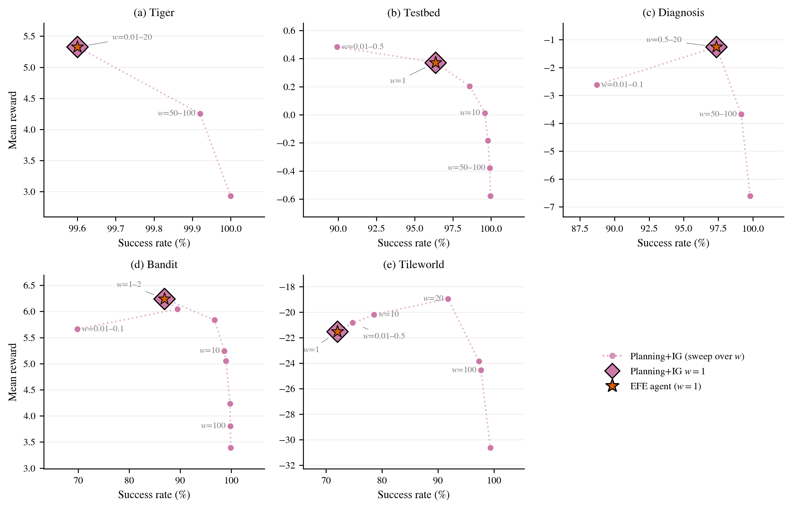

*Fig. pareto — success vs. reward Pareto frontier as w sweeps 0.01-200.*


Generated by: `experiments/run_pareto.py` (`run_pareto_sweep` + `plot_pareto`).


Underlying data: generated directly from live simulation when the script runs (fixed random seed, deterministic; no intermediate CSV is persisted by this script). Regenerate the exact figure with the command above.


---


### `figures/fig_accuracy_sensitivity.png`

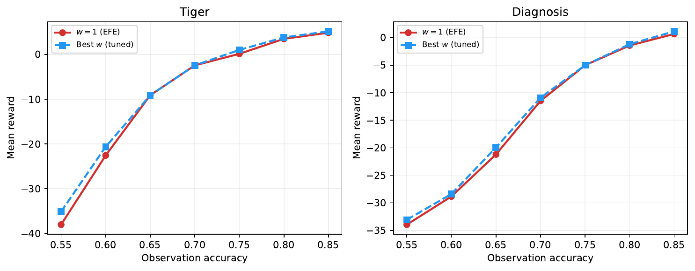

*Accuracy-sensitivity sweep (misspecification-adjacent figure).*


Generated by: `experiments/run_pareto.py` (`run_accuracy_sensitivity`).


Underlying data: generated directly from live simulation when the script runs (fixed random seed, deterministic; no intermediate CSV is persisted by this script). Regenerate the exact figure with the command above.


---


### `figures/fig_asymmetry_sweep.png`

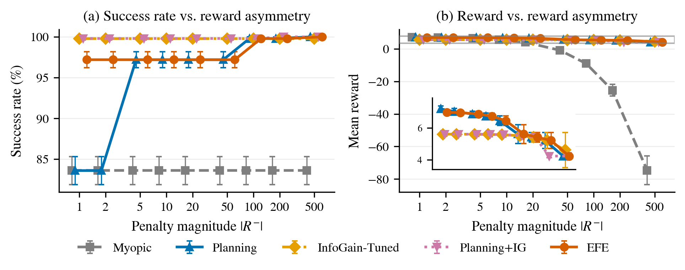

*Tiger reward-asymmetry sweep.*


Generated by: `experiments/run_showcase.py` (`run_reward_asymmetry_sweep` / `plot_reward_asymmetry_sweep`).


Underlying data: generated directly from live simulation when the script runs (fixed random seed, deterministic; no intermediate CSV is persisted by this script). Regenerate the exact figure with the command above.


---


### `figures/fig_efe_trajectory.png`

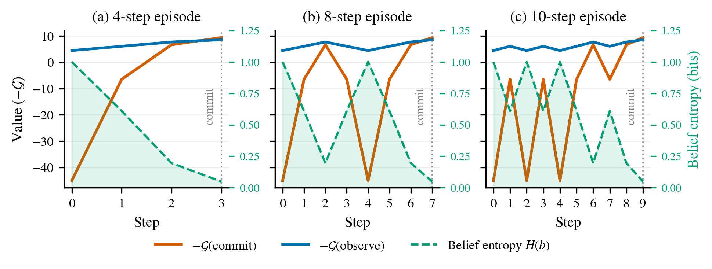

*EFE decomposition within Tiger episodes (commit/observe crossover).*


Generated by: `experiments/run_showcase.py` (`trace_efe_episode`, `collect_trajectories` / `plot_efe_trajectories`).


Underlying data: generated directly from live simulation when the script runs (fixed random seed, deterministic; no intermediate CSV is persisted by this script). Regenerate the exact figure with the command above.


---


### `figures/fig_obs_scaling.png`

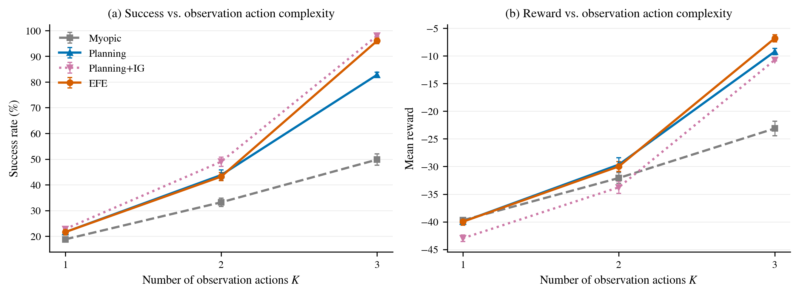

*Observation-action scaling on Diagnosis (K=1..3).*


Generated by: `experiments/run_showcase.py` (`run_obs_action_scaling` / `plot_obs_action_scaling`).


Underlying data: generated directly from live simulation when the script runs (fixed random seed, deterministic; no intermediate CSV is persisted by this script). Regenerate the exact figure with the command above.


---


### `figures/fig_tileworld_belief.png`

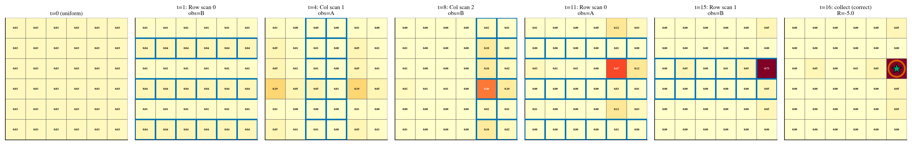

*Belief evolution within an EFE episode, 6x6 Tileworld.*


Generated by: `experiments/run_tileworld.py` (`fig_belief_evolution`).


Underlying data: generated directly from live simulation when the script runs (fixed random seed, deterministic; no intermediate CSV is persisted by this script). Regenerate the exact figure with the command above.


---


### `figures/fig_tileworld_comparison.png`

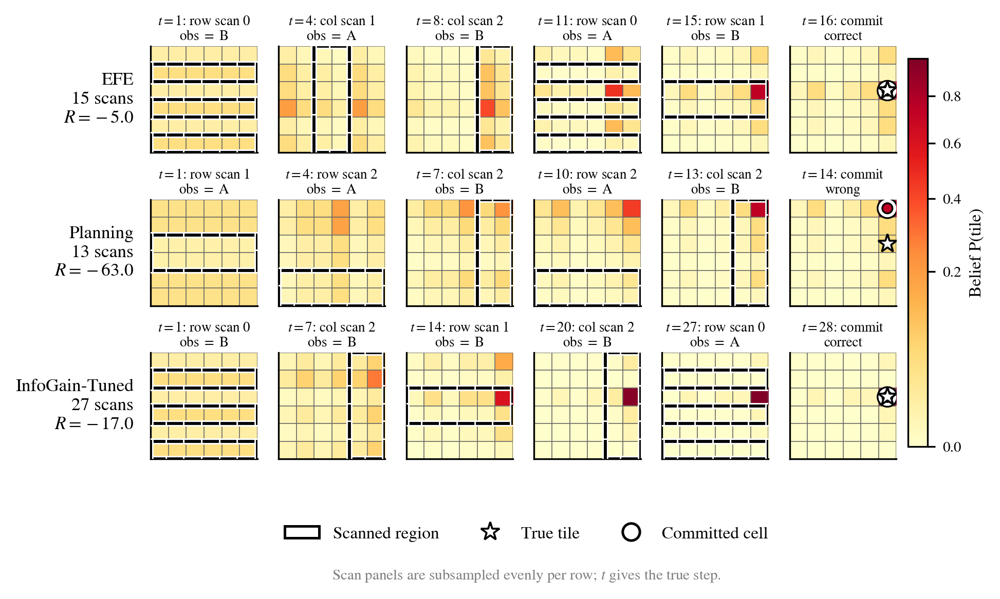

*Agent comparison on one 6x6 Tileworld episode (EFE/Planning/Info Gain).*


Generated by: `experiments/run_tileworld.py` (`fig_agent_comparison`).


Underlying data: generated directly from live simulation when the script runs (fixed random seed, deterministic; no intermediate CSV is persisted by this script). Regenerate the exact figure with the command above.


---


### `figures/fig_tileworld_scaling.png`

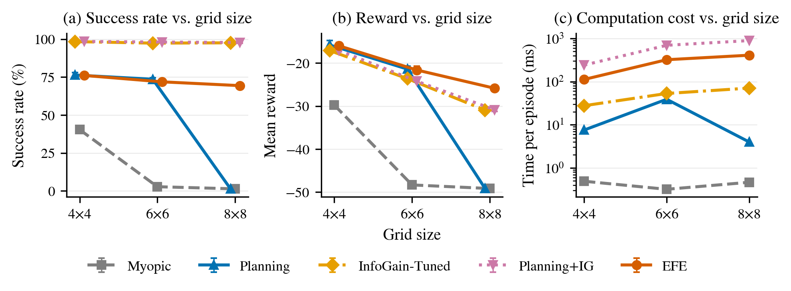

*Tileworld spatial scaling 4x4 to 8x8 across all agents.*


Generated by: `experiments/run_tileworld.py` (`fig_scaling`).


Underlying data: generated directly from live simulation when the script runs (fixed random seed, deterministic; no intermediate CSV is persisted by this script). Regenerate the exact figure with the command above.


---


### `figures/fig_tileworld_scan_atlas.png`

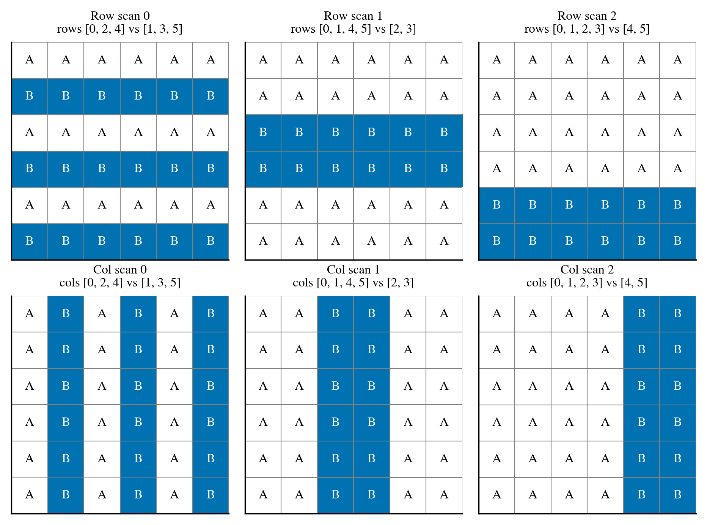

*Scan-action partition atlas for 6x6 Tileworld.*


Generated by: `experiments/run_tileworld.py` (`render_scan_atlas`, from `rho_aif` visualization utilities).


Underlying data: generated directly from live simulation when the script runs (fixed random seed, deterministic; no intermediate CSV is persisted by this script). Regenerate the exact figure with the command above.


---


### `figures/fig_belief_heatmap.png`

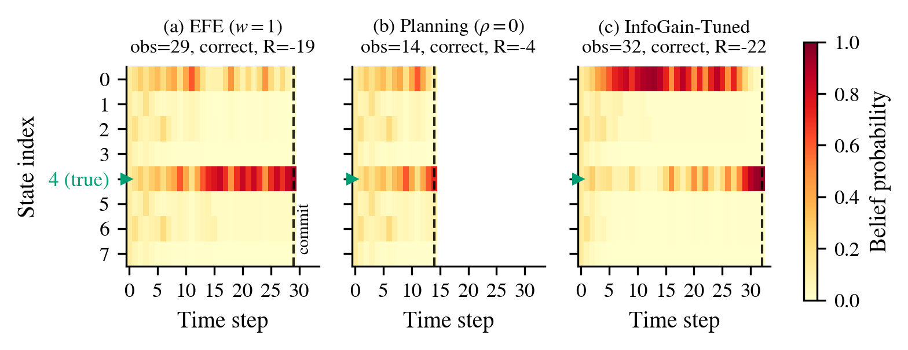

*Belief heatmap visualization (supplementary).*


Generated by: `experiments/run_visualizations.py` (`fig_belief_heatmap`).


Underlying data: generated directly from live simulation when the script runs (fixed random seed, deterministic; no intermediate CSV is persisted by this script). Regenerate the exact figure with the command above.


---


### `figures/fig_efficiency_curves.png`

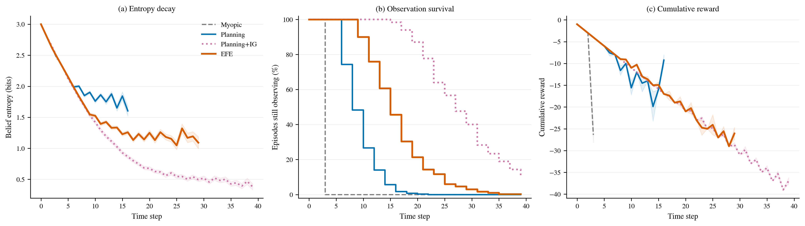

*Efficiency curves (supplementary statistics).*


Generated by: `experiments/run_visualizations.py` (`fig_efficiency_curves`).


Underlying data: generated directly from live simulation when the script runs (fixed random seed, deterministic; no intermediate CSV is persisted by this script). Regenerate the exact figure with the command above.


---


### `figures/fig_extended_efe.png`

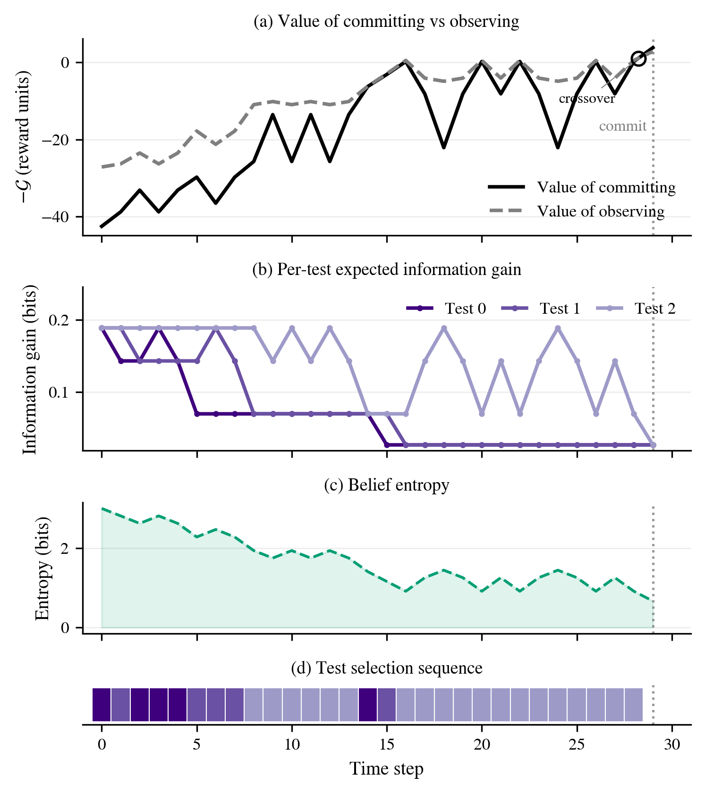

*Extended EFE decomposition (appendix).*


Generated by: `experiments/run_visualizations.py` (`fig_extended_efe`).


Underlying data: generated directly from live simulation when the script runs (fixed random seed, deterministic; no intermediate CSV is persisted by this script). Regenerate the exact figure with the command above.


---


### `figures/fig_stopping_times.png`

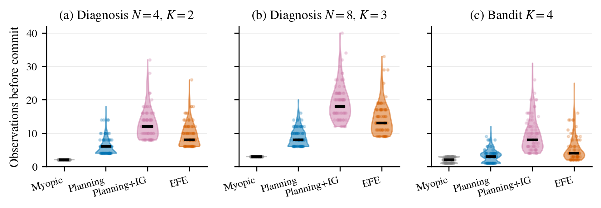

*Stopping-time analysis (appendix).*


Generated by: `experiments/run_visualizations.py` (`fig_stopping_times`).


Underlying data: generated directly from live simulation when the script runs (fixed random seed, deterministic; no intermediate CSV is persisted by this script). Regenerate the exact figure with the command above.


---


### `figures/fig_reward_scaling.png`

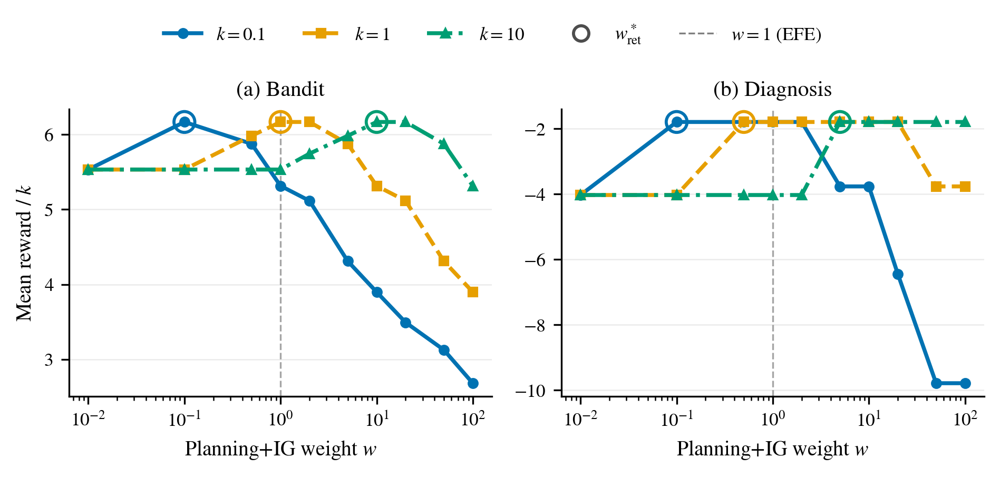

*Reward-rescaling invariance (appendix).*


Generated by: `experiments/run_reward_scaling.py` (`plot_scaling`, from `sweep_weights`).


Underlying data:


##### `results/results_reward_scaling.csv`

60 rows x 6 columns, 4,236 bytes. Columns: `scale_k`, `w`, `success`, `reward`, `obs`, `environment`.

<details>
<summary>Full data (60 rows) — click to expand</summary>

```csv
scale_k,w,success,reward,obs,environment
0.1,0.01,0.8711111111111111,-0.3875555555555555,6.142222222222222,Diagnosis
0.1,0.1,0.9666666666666667,-0.19466666666666665,9.946666666666667,Diagnosis
0.1,0.5,0.9688888888888889,-0.17511111111111113,9.884444444444444,Diagnosis
0.1,1.0,0.9822222222222222,-0.07955555555555556,9.72888888888889,Diagnosis
0.1,2.0,0.9622222222222222,-0.2102222222222222,9.835555555555555,Diagnosis
0.1,5.0,0.9955555555555555,-0.31822222222222235,12.915555555555555,Diagnosis
0.1,10.0,0.9888888888888889,-0.36133333333333345,12.946666666666667,Diagnosis
0.1,20.0,0.9977777777777778,-0.7053333333333338,16.92,Diagnosis
0.1,50.0,1.0,-1.0280000000000005,20.28,Diagnosis
0.1,100.0,1.0,-0.9902222222222227,19.90222222222222,Diagnosis
1.0,0.01,0.8955555555555555,-1.9866666666666666,5.72,Diagnosis
1.0,0.1,0.8911111111111111,-2.2622222222222224,5.728888888888889,Diagnosis
1.0,0.5,0.9711111111111111,-1.3244444444444445,9.591111111111111,Diagnosis
1.0,1.0,0.9644444444444444,-1.6222222222222222,9.488888888888889,Diagnosis
1.0,2.0,0.9688888888888889,-1.6044444444444443,9.737777777777778,Diagnosis
1.0,5.0,0.9422222222222222,-3.2311111111111113,9.764444444444445,Diagnosis
1.0,10.0,0.9711111111111111,-1.2666666666666666,9.533333333333333,Diagnosis
1.0,20.0,0.9666666666666667,-1.9066666666666667,9.906666666666666,Diagnosis
1.0,50.0,0.9955555555555555,-3.7688888888888887,13.502222222222223,Diagnosis
1.0,100.0,0.9933333333333333,-3.7422222222222223,13.342222222222222,Diagnosis
10.0,0.01,0.8888888888888888,-25.466666666666665,5.88,Diagnosis
10.0,0.1,0.8755555555555555,-33.2,5.8533333333333335,Diagnosis
10.0,0.5,0.8977777777777778,-20.08888888888889,5.875555555555556,Diagnosis
10.0,1.0,0.8755555555555555,-34.08888888888889,5.942222222222222,Diagnosis
10.0,2.0,0.8933333333333333,-21.244444444444444,5.724444444444444,Diagnosis
10.0,5.0,0.9822222222222222,-6.0,9.533333333333333,Diagnosis
10.0,10.0,0.9777777777777777,-13.422222222222222,10.008888888888889,Diagnosis
10.0,20.0,0.9844444444444445,-4.5777777777777775,9.524444444444445,Diagnosis
10.0,50.0,0.9733333333333334,-13.333333333333334,9.733333333333333,Diagnosis
10.0,100.0,0.9755555555555555,-12.622222222222222,9.795555555555556,Diagnosis
0.1,0.01,0.6755555555555556,0.5444444444444444,3.2711111111111113,Bandit
0.1,0.1,0.86,0.6156666666666667,5.166666666666667,Bandit
0.1,0.5,0.9622222222222222,0.5782222222222222,7.7555555555555555,Bandit
0.1,1.0,0.9777777777777777,0.49066666666666664,9.786666666666667,Bandit
0.1,2.0,0.9822222222222222,0.4991111111111111,9.697777777777778,Bandit
0.1,5.0,0.9977777777777778,0.43577777777777776,11.244444444444444,Bandit
0.1,10.0,1.0,0.3752222222222221,12.495555555555555,Bandit
0.1,20.0,1.0,0.33622222222222214,13.275555555555556,Bandit
0.1,50.0,1.0,0.28911111111111104,14.217777777777778,Bandit
0.1,100.0,1.0,0.2502222222222221,14.995555555555555,Bandit
1.0,0.01,0.6933333333333334,5.636666666666667,3.2066666666666666,Bandit
1.0,0.1,0.68,5.504444444444444,3.2311111111111113,Bandit
1.0,0.5,0.8777777777777778,6.001111111111111,5.797777777777778,Bandit
1.0,1.0,0.8511111111111112,6.095555555555555,5.128888888888889,Bandit
1.0,2.0,0.8488888888888889,6.081111111111111,5.1177777777777775,Bandit
1.0,5.0,0.9644444444444444,5.594444444444444,8.171111111111111,Bandit
1.0,10.0,0.9755555555555555,5.302222222222222,8.955555555555556,Bandit
1.0,20.0,0.9933333333333333,5.05,9.78,Bandit
1.0,50.0,1.0,4.1722222222222225,11.655555555555555,Bandit
1.0,100.0,1.0,3.7466666666666666,12.506666666666666,Bandit
10.0,0.01,0.6711111111111111,54.955555555555556,3.088888888888889,Bandit
10.0,0.1,0.6911111111111111,55.75555555555555,3.2888888888888888,Bandit
10.0,0.5,0.6955555555555556,56.855555555555554,3.148888888888889,Bandit
10.0,1.0,0.7333333333333333,59.022222222222226,3.3955555555555557,Bandit
10.0,2.0,0.8822222222222222,59.37777777777778,6.004444444444444,Bandit
10.0,5.0,0.8888888888888888,60.67777777777778,5.864444444444445,Bandit
10.0,10.0,0.8777777777777778,63.91111111111111,5.017777777777778,Bandit
10.0,20.0,0.8888888888888888,65.26666666666667,4.946666666666666,Bandit
10.0,50.0,0.9555555555555556,57.78888888888889,7.642222222222222,Bandit
10.0,100.0,0.9844444444444445,51.955555555555556,9.328888888888889,Bandit
```

</details>


##### `results/results_reward_scaling_summary.csv`

6 rows x 4 columns, 169 bytes. Columns: `environment`, `scale_k`, `w_ret`, `w_ret_over_k`.

<details>
<summary>Full data (6 rows) — click to expand</summary>

```csv
environment,scale_k,w_ret,w_ret_over_k
Diagnosis,0.1,1.0,10.0
Diagnosis,1.0,10.0,10.0
Diagnosis,10.0,20.0,2.0
Bandit,0.1,0.1,1.0
Bandit,1.0,1.0,1.0
Bandit,10.0,20.0,2.0
```

</details>


---


### `figures/fig_nearopt_horizon.png`

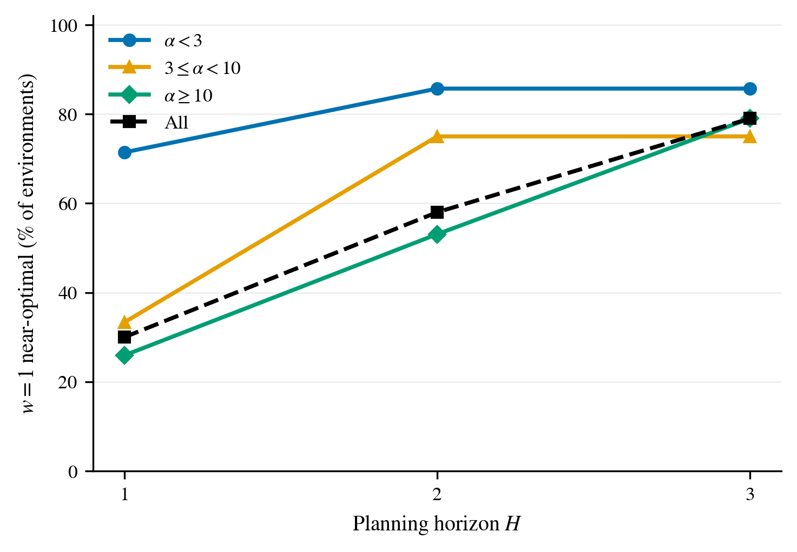

*Near-optimality basin vs. planning horizon H (Monte Carlo study).*


Generated by: `experiments/run_nearopt_horizon.py`.


Underlying data:


##### `results/results_nearopt_horizon.csv`

300 rows x 10 columns, 37,822 bytes. Columns: `env_id`, `alpha`, `p`, `cost`, `horizon`, `best_w`, `best_reward`, `w1_reward`, `ratio`, `near_optimal`.

File exceeds the inline full-embed threshold (37,822 bytes); showing the first 15 and last 8 of 300 rows plus summary statistics. Full data lives at `results/results_nearopt_horizon.csv`.


First 15 rows:

| env_id | alpha | p | cost | horizon | best_w | best_reward | w1_reward | ratio | near_optimal |
|---|---|---|---|---|---|---|---|---|---|
| 0 | 19.35 | 0.9303 | 3.687 | 1 | 2 | 2.243 | -18.11 | -8.075 | False |
| 0 | 19.35 | 0.9303 | 3.687 | 2 | 0.5 | 1.742 | 1.742 | 1 | True |
| 0 | 19.35 | 0.9303 | 3.687 | 3 | 0.5 | 2.037 | -2.476 | -1.216 | False |
| 1 | 30.33 | 0.6124 | 0.8644 | 1 | 50 | -29.66 | -91.13 | 3.073 | False |
| 1 | 30.33 | 0.6124 | 0.8644 | 2 | 50 | -30.76 | -106.4 | 3.46 | False |
| 1 | 30.33 | 0.6124 | 0.8644 | 3 | 50 | -55.17 | -65.47 | 1.187 | False |
| 2 | 3.846 | 0.8965 | 3.045 | 1 | 0.01 | 3.078 | 1.139 | 0.3702 | False |
| 2 | 3.846 | 0.8965 | 3.045 | 2 | 50 | 2.691 | 0.2652 | 0.09855 | False |
| 2 | 3.846 | 0.8965 | 3.045 | 3 | 0.01 | 5.016 | 1.113 | 0.2218 | False |
| 3 | 35.7 | 0.5582 | 4.853 | 1 | 1 | -90.26 | -90.26 | 1 | True |
| 3 | 35.7 | 0.5582 | 4.853 | 2 | 0.01 | -131.7 | -176.5 | 1.34 | False |
| 3 | 35.7 | 0.5582 | 4.853 | 3 | 0.5 | -142.5 | -142.7 | 1.001 | True |
| 4 | 41.79 | 0.6349 | 0.9909 | 1 | 50 | -16.75 | -145 | 8.66 | False |
| 4 | 41.79 | 0.6349 | 0.9909 | 2 | 50 | -31.21 | -79.07 | 2.533 | False |
| 4 | 41.79 | 0.6349 | 0.9909 | 3 | 50 | -13.18 | -65.64 | 4.979 | False |


Last 8 rows:

| env_id | alpha | p | cost | horizon | best_w | best_reward | w1_reward | ratio | near_optimal |
|---|---|---|---|---|---|---|---|---|---|
| 97 | 2.83 | 0.879 | 1.865 | 2 | 2 | 5.748 | 5.375 | 0.9351 | True |
| 97 | 2.83 | 0.879 | 1.865 | 3 | 1 | 5.226 | 5.226 | 1 | True |
| 98 | 7.226 | 0.7589 | 3.873 | 1 | 0.5 | 1.191 | -16.91 | -14.19 | False |
| 98 | 7.226 | 0.7589 | 3.873 | 2 | 1 | -3.729 | -3.729 | 1 | True |
| 98 | 7.226 | 0.7589 | 3.873 | 3 | 1 | -2.799 | -2.799 | 1 | True |
| 99 | 11.58 | 0.7992 | 0.5182 | 1 | 50 | 6.455 | -8.124 | -1.258 | False |
| 99 | 11.58 | 0.7992 | 0.5182 | 2 | 50 | 6.58 | 3.643 | 0.5537 | False |
| 99 | 11.58 | 0.7992 | 0.5182 | 3 | 2 | 7.533 | 2.4 | 0.3185 | False |


Summary statistics (numeric columns, computed over all 300 rows):

| column | count | mean | std | min | max |
|---|---|---|---|---|---|
| env_id | 300 | 49.5 | 28.91 | 0 | 99 |
| alpha | 300 | 24.37 | 13.96 | 1.271 | 49.51 |
| p | 300 | 0.755 | 0.1237 | 0.552 | 0.9443 |
| cost | 300 | 2.532 | 1.407 | 0.1341 | 4.853 |
| horizon | 300 | 2 | 0.8179 | 1 | 3 |
| best_w | 300 | 18.14 | 22.96 | 0.01 | 50 |
| best_reward | 300 | -16.61 | 29.63 | -142.5 | 9.7 |
| w1_reward | 300 | -35.6 | 41.16 | -176.5 | 9.668 |
| ratio | 300 | 1.175 | 14.05 | -97.77 | 156.8 |


---


### `figures/price_shadow_curves.png`

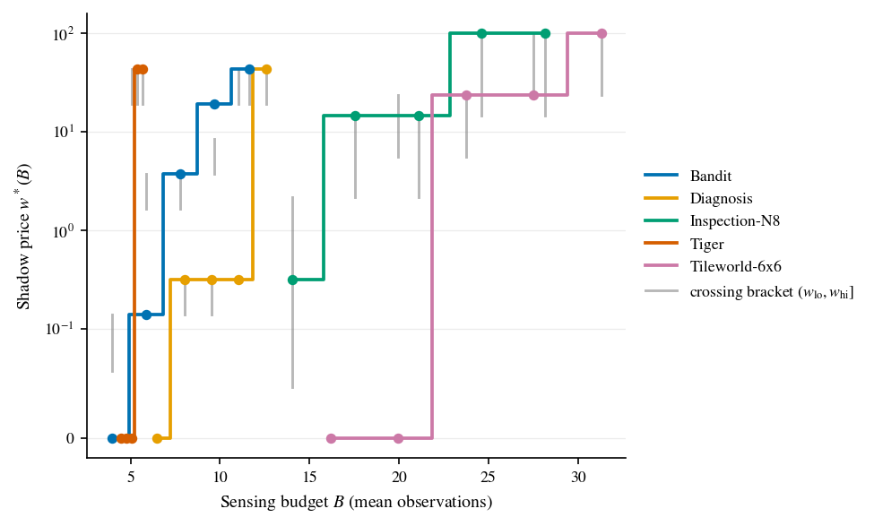

*Operational shadow-price staircases (Tiger/Diagnosis/Bandit/Tileworld/Inspection-N8).*


Generated by: `experiments/run_price_of_information.py` (`run_shadow_price_curves` / `plot_shadow_price_curves`).


Underlying data:


##### `results/results_price_usage_curves.csv`

66 rows x 5 columns, 3,958 bytes. Columns: `env`, `w`, `mean_usage`, `se_usage`, `n_seeds`.

<details>
<summary>Full data (66 rows) — click to expand</summary>

```csv
env,w,mean_usage,se_usage,n_seeds
Tiger,0.0,4.396,0.09152048950918036,5
Tiger,0.001,4.16,0.06356099432828292,5
Tiger,0.0022758459260747888,4.232,0.037735924528226425,5
Tiger,0.005179474679231213,4.3839999999999995,0.10107423014794614,5
Tiger,0.011787686347935873,4.192,0.09520504188329523,5
Tiger,0.02682695795279726,4.228,0.05043808085167406,5
Tiger,0.0610540229658533,4.363999999999999,0.0354400902933387,5
Tiger,0.13894954943731375,4.364,0.08795453370918407,5
Tiger,0.31622776601683794,4.14,0.05366563145999505,5
Tiger,0.7196856730011522,4.072,0.056780278266313516,5
Tiger,1.6378937069540647,4.236,0.06046486583132393,5
Tiger,3.7275937203149416,3.9799999999999995,0.03346640106136297,5
Tiger,8.483428982440726,4.167999999999999,0.1270590413941487,5
Tiger,19.306977288832496,4.199999999999999,0.0753657747256671,5
Tiger,43.93970560760795,5.616,0.055641710972974205,5
Tiger,100.0,5.5680000000000005,0.09221713506718796,5
Diagnosis,0.0,5.851999999999999,0.10537551897855593,5
Diagnosis,0.001,5.9239999999999995,0.10127191120937731,5
Diagnosis,0.0022758459260747888,6.036,0.08328265125462801,5
Diagnosis,0.005179474679231213,5.9,0.11644741302407706,5
Diagnosis,0.011787686347935873,5.9239999999999995,0.1330263131865272,5
Diagnosis,0.02682695795279726,5.804,0.07959899496852971,5
Diagnosis,0.0610540229658533,5.795999999999999,0.09173875952943783,5
Diagnosis,0.13894954943731375,5.715999999999999,0.10146920715172655,5
Diagnosis,0.31622776601683794,9.772,0.24540578640284735,5
Diagnosis,0.7196856730011522,9.408000000000001,0.13062924634246345,5
Diagnosis,1.6378937069540647,9.436,0.1032279032045115,5
Diagnosis,3.7275937203149416,9.744,0.16593974810153245,5
Diagnosis,8.483428982440726,9.704,0.10166612021711072,5
Diagnosis,19.306977288832496,9.788,0.21822923727126947,5
Diagnosis,43.93970560760795,13.568000000000001,0.13632314550361568,5
Diagnosis,100.0,12.86,0.10936178491593851,5
Bandit,0.0,3.218,0.10942577392917995,5
Bandit,0.001,3.1180000000000003,0.05686826883245168,5
Bandit,0.0022758459260747888,3.0620000000000003,0.18423897524682445,5
Bandit,0.005179474679231213,3.246,0.09902524930541703,5
Bandit,0.011787686347935873,3.282,0.10599056561788882,5
Bandit,0.02682695795279726,3.228,0.13922643427165693,5
Bandit,0.0610540229658533,3.19,0.07556454194925025,5
Bandit,0.13894954943731375,5.934,0.13109538512091112,5
Bandit,0.31622776601683794,5.934,0.08692525524840286,5
Bandit,0.7196856730011522,5.192,0.17298554852934975,5
Bandit,1.6378937069540647,4.922,0.12039102956615992,5
Bandit,3.7275937203149416,7.274000000000001,0.20235117988289558,5
Bandit,8.483428982440726,8.678,0.060778285596091,5
Bandit,19.306977288832496,9.174000000000001,0.22098868749327416,5
Bandit,43.93970560760795,10.972,0.344156940944099,5
Bandit,100.0,12.2,0.19539703170723968,5
Tileworld-6x6,0.0,15.809999999999999,0.10999999999999974,5
Tileworld-6x6,0.001,15.91,0.1815901979733487,5
Tileworld-6x6,0.004216965034285823,15.955000000000002,0.14585952145814815,5
Tileworld-6x6,0.01778279410038923,15.87,0.1883148958526648,5
Tileworld-6x6,0.07498942093324558,16.01,0.26652861009655227,5
Tileworld-6x6,0.31622776601683794,15.809999999999999,0.25831182706178973,5
Tileworld-6x6,1.333521432163324,14.920000000000002,0.19306734576307813,5
Tileworld-6x6,5.623413251903491,15.030000000000001,0.22836374493338452,5
Tileworld-6x6,23.71373705661655,25.255000000000003,0.6152946448653688,5
Tileworld-6x6,100.0,33.7,0.46864165414525394,5
Inspection-N8,0.0,12.653333333333332,0.11479450238481724,5
Inspection-N8,0.001,12.653333333333332,0.11479450238481724,5
Inspection-N8,0.006812920690579615,12.653333333333332,0.11479450238481724,5
Inspection-N8,0.046415888336127795,12.653333333333332,0.11479450238481724,5
Inspection-N8,0.31622776601683794,13.413333333333332,0.12762793146051116,5
Inspection-N8,2.1544346900318843,15.439999999999998,0.1771377367411523,5
Inspection-N8,14.677992676220706,19.360000000000003,0.2543837870445193,5
Inspection-N8,100.0,30.886666666666667,0.3761796261244241,5
```

</details>


##### `results/results_price_shadow_curves.csv`

25 rows x 14 columns, 4,425 bytes. Columns: `env`, `budget`, `w_star`, `w_lo`, `w_hi`, `usage_at_star`, `usage_lo`, `usage_hi`, `usage_se_at_star`, `bracketed`, `achievable`, `u_min`, `u_max`, `note`.

<details>
<summary>Full data (25 rows) — click to expand</summary>

```csv
env,budget,w_star,w_lo,w_hi,usage_at_star,usage_lo,usage_hi,usage_se_at_star,bracketed,achievable,u_min,u_max,note
Tiger,4.11088,0.31622776601683794,0.13894954943731375,0.7196856730011522,4.14,4.364,4.072,0.05366563145999505,False,True,3.9799999999999995,5.616,
Tiger,4.45444,0.0,3.7275937203149416,8.483428982440726,4.396,3.9799999999999995,4.167999999999999,0.09152048950918036,True,True,3.9799999999999995,5.616,
Tiger,4.798,0.0,19.306977288832496,43.93970560760795,4.396,4.199999999999999,5.616,0.09152048950918036,True,True,3.9799999999999995,5.616,
Tiger,5.141559999999999,100.0,19.306977288832496,43.93970560760795,5.5680000000000005,4.199999999999999,5.616,0.09221713506718796,True,True,3.9799999999999995,5.616,
Tiger,5.485119999999999,100.0,19.306977288832496,43.93970560760795,5.5680000000000005,4.199999999999999,5.616,0.09221713506718796,True,True,3.9799999999999995,5.616,
Diagnosis,6.34416,0.0022758459260747888,0.001,0.005179474679231213,6.036,5.9239999999999995,5.9,0.08328265125462801,False,True,5.715999999999999,13.568000000000001,
Diagnosis,7.99308,0.7196856730011522,0.13894954943731375,0.31622776601683794,9.408000000000001,5.715999999999999,9.772,0.13062924634246345,True,True,5.715999999999999,13.568000000000001,
Diagnosis,9.642000000000001,8.483428982440726,0.13894954943731375,0.31622776601683794,9.704,5.715999999999999,9.772,0.10166612021711072,True,True,5.715999999999999,13.568000000000001,
Diagnosis,11.290920000000002,19.306977288832496,19.306977288832496,43.93970560760795,9.788,9.788,13.568000000000001,0.21822923727126947,True,True,5.715999999999999,13.568000000000001,
Diagnosis,12.939840000000002,100.0,19.306977288832496,43.93970560760795,12.86,9.788,13.568000000000001,0.10936178491593851,True,True,5.715999999999999,13.568000000000001,
Bandit,3.7930400000000004,0.011787686347935873,0.0610540229658533,0.13894954943731375,3.282,3.19,5.934,0.10599056561788882,True,True,3.0620000000000003,12.2,
Bandit,5.71202,0.13894954943731375,1.6378937069540647,3.7275937203149416,5.934,4.922,7.274000000000001,0.13109538512091112,True,True,3.0620000000000003,12.2,
Bandit,7.631,3.7275937203149416,1.6378937069540647,3.7275937203149416,7.274000000000001,4.922,7.274000000000001,0.20235117988289558,True,True,3.0620000000000003,12.2,
Bandit,9.54998,19.306977288832496,3.7275937203149416,8.483428982440726,9.174000000000001,7.274000000000001,8.678,0.22098868749327416,True,True,3.0620000000000003,12.2,
Bandit,11.46896,43.93970560760795,19.306977288832496,43.93970560760795,10.972,9.174000000000001,10.972,0.344156940944099,True,True,3.0620000000000003,12.2,
Tileworld-6x6,16.422400000000003,0.07498942093324558,0.01778279410038923,0.31622776601683794,16.01,15.87,15.809999999999999,0.26652861009655227,False,True,14.920000000000002,33.7,
Tileworld-6x6,20.366200000000003,0.07498942093324558,5.623413251903491,23.71373705661655,16.01,15.030000000000001,25.255000000000003,0.26652861009655227,True,True,14.920000000000002,33.7,
Tileworld-6x6,24.310000000000002,23.71373705661655,5.623413251903491,23.71373705661655,25.255000000000003,15.030000000000001,25.255000000000003,0.6152946448653688,True,True,14.920000000000002,33.7,
Tileworld-6x6,28.253800000000002,23.71373705661655,23.71373705661655,100.0,25.255000000000003,25.255000000000003,33.7,0.6152946448653688,True,True,14.920000000000002,33.7,
Tileworld-6x6,32.1976,100.0,23.71373705661655,100.0,33.7,25.255000000000003,33.7,0.46864165414525394,True,True,14.920000000000002,33.7,
Inspection-N8,14.111999999999998,0.31622776601683794,0.046415888336127795,0.31622776601683794,13.413333333333332,12.653333333333332,13.413333333333332,0.12762793146051116,True,True,12.653333333333332,30.886666666666667,
Inspection-N8,17.941,14.677992676220706,2.1544346900318843,14.677992676220706,19.360000000000003,15.439999999999998,19.360000000000003,0.2543837870445193,True,True,12.653333333333332,30.886666666666667,
Inspection-N8,21.77,14.677992676220706,14.677992676220706,100.0,19.360000000000003,19.360000000000003,30.886666666666667,0.2543837870445193,True,True,12.653333333333332,30.886666666666667,
Inspection-N8,25.599,100.0,14.677992676220706,100.0,30.886666666666667,19.360000000000003,30.886666666666667,0.3761796261244241,True,True,12.653333333333332,30.886666666666667,
Inspection-N8,29.428,100.0,14.677992676220706,100.0,30.886666666666667,19.360000000000003,30.886666666666667,0.3761796261244241,True,True,12.653333333333332,30.886666666666667,
```

</details>


---


### `figures/price_cost_budget.png`

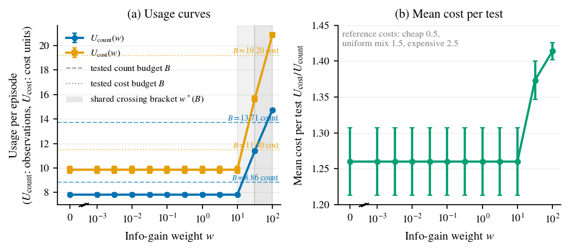

*Cost- vs. count-denominated usage curves (heterogeneous-cost Diagnosis).*


Generated by: `experiments/run_price_of_information.py` (`run_cost_budget` / `plot_cost_budget`).


Underlying data:


##### `results/results_price_cost_curves.csv`

24 rows x 6 columns, 1,628 bytes. Columns: `env`, `w`, `mean_usage`, `se_usage`, `n_seeds`, `usage_kind`.

<details>
<summary>Full data (24 rows) — click to expand</summary>

```csv
env,w,mean_usage,se_usage,n_seeds,usage_kind
Diagnosis-hetero,0.0,7.843999999999999,0.12383860464330175,5,count
Diagnosis-hetero,0.001,7.552,0.0806473806146238,5,count
Diagnosis-hetero,0.0031622776601683794,7.4959999999999996,0.17780888616714305,5,count
Diagnosis-hetero,0.01,7.816,0.1400571312000927,5,count
Diagnosis-hetero,0.03162277660168379,7.828,0.15107613974416995,5,count
Diagnosis-hetero,0.1,7.5280000000000005,0.15107613974417,5,count
Diagnosis-hetero,0.31622776601683794,7.4959999999999996,0.10628264204469126,5,count
Diagnosis-hetero,1.0,7.984,0.15727682601069995,5,count
Diagnosis-hetero,3.1622776601683795,7.659999999999999,0.07797435475847177,5,count
Diagnosis-hetero,10.0,7.748,0.11909659944767524,5,count
Diagnosis-hetero,31.622776601683793,11.536,0.058446556784810026,5,count
Diagnosis-hetero,100.0,15.127999999999997,0.1709502851708649,5,count
Diagnosis-hetero,0.0,9.98,0.12660963628413124,5,cost
Diagnosis-hetero,0.001,9.618,0.1322648857406984,5,cost
Diagnosis-hetero,0.0031622776601683794,9.836,0.08732697177848305,5,cost
Diagnosis-hetero,0.01,9.542,0.28638086528258144,5,cost
Diagnosis-hetero,0.03162277660168379,9.736,0.1086554186407653,5,cost
Diagnosis-hetero,0.1,9.411999999999999,0.11863389060466632,5,cost
Diagnosis-hetero,0.31622776601683794,9.776,0.1251239385569364,5,cost
Diagnosis-hetero,1.0,9.693999999999999,0.214955809412074,5,cost
Diagnosis-hetero,3.1622776601683795,9.722,0.2161342175593673,5,cost
Diagnosis-hetero,10.0,10.172,0.22143622106602157,5,cost
Diagnosis-hetero,31.622776601683793,15.662,0.5619199231207238,5,cost
Diagnosis-hetero,100.0,20.997999999999998,0.41117392913461853,5,cost
```

</details>


##### `results/results_price_cost_prices.csv`

4 rows x 10 columns, 545 bytes. Columns: `env`, `usage_kind`, `budget`, `w_star`, `w_lo`, `w_hi`, `usage_at_star`, `usage_se_at_star`, `bracketed`, `achievable`.

<details>
<summary>Full data (4 rows) — click to expand</summary>

```csv
env,usage_kind,budget,w_star,w_lo,w_hi,usage_at_star,usage_se_at_star,bracketed,achievable
Diagnosis-hetero,count,8.640799999999999,1.0,10.0,31.622776601683793,7.984,0.15727682601069995,True,True
Diagnosis-hetero,count,13.983199999999997,100.0,31.622776601683793,100.0,15.127999999999997,0.1709502851708649,True,True
Diagnosis-hetero,cost,11.149899999999999,10.0,3.1622776601683795,10.0,10.172,0.22143622106602157,True,True
Diagnosis-hetero,cost,19.260099999999998,100.0,31.622776601683793,100.0,20.997999999999998,0.41117392913461853,True,True
```

</details>


---


### `figures/price_scale_invariance.png`

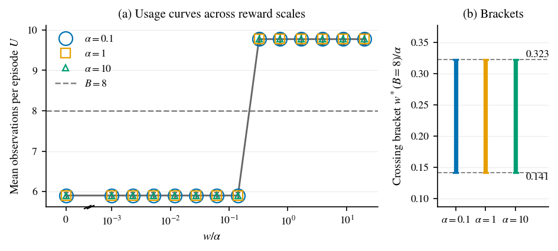

*Curve collapse across reward scales (Diagnosis).*


Generated by: `experiments/run_price_of_information.py` (`run_scale_collapse` / `plot_scale_collapse`).


Underlying data:


##### `results/results_price_scale_curves.csv`

156 rows x 7 columns, 12,603 bytes. Columns: `env`, `scale_k`, `w`, `w_over_alpha`, `mean_usage`, `se_usage`, `n_seeds`.

<details>
<summary>Full data (156 rows) — click to expand</summary>

```csv
env,scale_k,w,w_over_alpha,mean_usage,se_usage,n_seeds
Diagnosis,0.1,0.0,0.0,5.76,0.0878635305459552,5
Diagnosis,0.1,0.0001,0.001,5.856,0.10796295661012624,5
Diagnosis,0.1,0.00022825440432961889,0.0022825440432961887,5.992,0.10384603988597746,5
Diagnosis,0.1,0.0005210007309586913,0.005210007309586913,5.992000000000001,0.10518555033843766,5
Diagnosis,0.1,0.0011892071150027212,0.011892071150027212,5.76,0.050596442562694126,5
Diagnosis,0.1,0.002714417616594907,0.027144176165949066,5.956,0.09495261976375374,5
Diagnosis,0.1,0.006195777761776942,0.06195777761776942,5.776000000000001,0.11788129622633098,5
Diagnosis,0.1,0.01414213562373095,0.1414213562373095,5.792,0.0671118469422502,5
Diagnosis,0.1,0.032280047427433914,0.3228004742743391,9.751999999999999,0.13922643427165682,5
Diagnosis,0.1,0.07368062997280775,0.7368062997280774,9.847999999999999,0.06974238309665058,5
Diagnosis,0.1,0.16817928305074292,1.6817928305074292,9.572,0.14485855169785455,5
Diagnosis,0.1,0.3838766207332969,3.838766207332969,9.924000000000001,0.1536749816983883,5
Diagnosis,0.1,0.8762152940154572,8.762152940154571,9.684000000000001,0.14565713164826513,5
Diagnosis,0.1,2.0000000000000004,20.000000000000004,9.972,0.13245376551838753,5
Diagnosis,1.0,0.0,0.0,5.788,0.07116178749862886,5
Diagnosis,1.0,0.001,0.001,5.916,0.08908422980528043,5
Diagnosis,1.0,0.0022825440432961887,0.0022825440432961887,5.872000000000001,0.10461357464497613,5
Diagnosis,1.0,0.005210007309586913,0.005210007309586913,5.828,0.1259523719506703,5
Diagnosis,1.0,0.011892071150027212,0.011892071150027212,5.916,0.10400000000000006,5
Diagnosis,1.0,0.027144176165949066,0.027144176165949066,5.819999999999999,0.09011104260855052,5
Diagnosis,1.0,0.06195777761776942,0.06195777761776942,5.912,0.17951044537853503,5
Diagnosis,1.0,0.1414213562373095,0.1414213562373095,5.784,0.1339253523422656,5
Diagnosis,1.0,0.3228004742743391,0.3228004742743391,9.535999999999998,0.124643491607063,5
Diagnosis,1.0,0.7368062997280774,0.7368062997280774,9.916,0.2248910847499296,5
Diagnosis,1.0,1.6817928305074292,1.6817928305074292,9.908000000000001,0.14595889832415154,5
Diagnosis,1.0,3.838766207332969,3.838766207332969,9.559999999999999,0.1806654366501793,5
Diagnosis,1.0,8.762152940154571,8.762152940154571,9.528,0.3310347413792092,5
Diagnosis,1.0,20.000000000000004,20.000000000000004,9.703999999999999,0.17267310155319482,5
Diagnosis,10.0,0.0,0.0,5.888,0.14051334456200248,5
Diagnosis,10.0,0.01,0.001,5.88,0.1418449858119772,5
Diagnosis,10.0,0.022825440432961887,0.0022825440432961887,5.852,0.065604877867427,5
Diagnosis,10.0,0.052100073095869136,0.005210007309586913,5.9719999999999995,0.058855755878248595,5
Diagnosis,10.0,0.11892071150027211,0.011892071150027212,5.848000000000001,0.09134549797335394,5
Diagnosis,10.0,0.27144176165949063,0.027144176165949063,5.747999999999999,0.13573503600765727,5
Diagnosis,10.0,0.6195777761776942,0.06195777761776942,5.724,0.09108238029388557,5
Diagnosis,10.0,1.414213562373095,0.1414213562373095,6.056,0.1170299107066223,5
Diagnosis,10.0,3.228004742743391,0.3228004742743391,9.66,0.25961509971494345,5
Diagnosis,10.0,7.3680629972807745,0.7368062997280774,10.0,0.11523888232710344,5
Diagnosis,10.0,16.817928305074293,1.6817928305074292,9.632,0.23533805472128813,5
Diagnosis,10.0,38.38766207332969,3.838766207332969,9.616,0.15249918032566614,5
Diagnosis,10.0,87.62152940154571,8.762152940154571,9.680000000000001,0.2491585840383589,5
Diagnosis,10.0,200.00000000000003,20.000000000000004,9.48,0.05692099788303067,5
Bandit,0.1,0.0,0.0,3.308,0.06529931086925808,5
Bandit,0.1,0.0001,0.001,3.2120000000000006,0.06777905281132214,5
Bandit,0.1,0.00022825440432961889,0.0022825440432961887,3.076,0.07487322618933955,5
Bandit,0.1,0.0005210007309586913,0.005210007309586913,3.2560000000000002,0.10225458424931369,5
Bandit,0.1,0.0011892071150027212,0.011892071150027212,3.374,0.019390719429665308,5
Bandit,0.1,0.002714417616594907,0.027144176165949066,3.082,0.10111379727811631,5
Bandit,0.1,0.006195777761776942,0.06195777761776942,3.1799999999999997,0.04571651780264986,5
Bandit,0.1,0.01414213562373095,0.1414213562373095,6.07,0.11148990985734986,5
Bandit,0.1,0.032280047427433914,0.3228004742743391,6.08,0.11726039399558572,5
Bandit,0.1,0.07368062997280775,0.7368062997280774,5.1000000000000005,0.13390294993016405,5
Bandit,0.1,0.16817928305074292,1.6817928305074292,5.082,0.1387587835057658,5
Bandit,0.1,0.3838766207332969,3.838766207332969,7.318,0.14630105946301275,5
Bandit,0.1,0.8762152940154572,8.762152940154571,8.303999999999998,0.12460337074092319,5
Bandit,0.1,2.0000000000000004,20.000000000000004,9.762,0.14911069713471276,5
Bandit,1.0,0.0,0.0,3.3900000000000006,0.08555699854482977,5
Bandit,1.0,0.001,0.001,3.186,0.05635601121442144,5
Bandit,1.0,0.0022825440432961887,0.0022825440432961887,3.1580000000000004,0.09697422337920529,5
Bandit,1.0,0.005210007309586913,0.005210007309586913,3.12,0.06340346993658942,5
Bandit,1.0,0.011892071150027212,0.011892071150027212,3.322,0.03992492955535425,5
Bandit,1.0,0.027144176165949066,0.027144176165949066,3.146,0.08176796438703852,5
Bandit,1.0,0.06195777761776942,0.06195777761776942,3.114,0.11369256791892773,5
Bandit,1.0,0.1414213562373095,0.1414213562373095,6.144,0.08846468221838599,5
Bandit,1.0,0.3228004742743391,0.3228004742743391,5.953999999999999,0.0956347217280418,5
Bandit,1.0,0.7368062997280774,0.7368062997280774,4.944,0.1367698797250331,5
Bandit,1.0,1.6817928305074292,1.6817928305074292,5.114,0.17136510730017343,5
Bandit,1.0,3.838766207332969,3.838766207332969,7.236,0.2657743403716769,5
Bandit,1.0,8.762152940154571,8.762152940154571,8.802,0.22007725916141346,5
Bandit,1.0,20.000000000000004,20.000000000000004,9.355999999999998,0.14386104406683575,5
Bandit,10.0,0.0,0.0,3.222,0.09150956234186673,5
Bandit,10.0,0.01,0.001,3.31,0.1136661779070626,5
Bandit,10.0,0.022825440432961887,0.0022825440432961887,3.354,0.10623558725775462,5
Bandit,10.0,0.052100073095869136,0.005210007309586913,3.21,0.11384199576606167,5
Bandit,10.0,0.11892071150027211,0.011892071150027212,3.152,0.05526300751859238,5
Bandit,10.0,0.27144176165949063,0.027144176165949063,3.25,0.052057660339281504,5
Bandit,10.0,0.6195777761776942,0.06195777761776942,3.3600000000000003,0.07576278769950327,5
Bandit,10.0,1.414213562373095,0.1414213562373095,6.022,0.09728309205612248,5
Bandit,10.0,3.228004742743391,0.3228004742743391,5.926,0.09373366524360391,5
Bandit,10.0,7.3680629972807745,0.7368062997280774,5.078,0.11693587986584783,5
Bandit,10.0,16.817928305074293,1.6817928305074292,4.974,0.1839456441452203,5
Bandit,10.0,38.38766207332969,3.838766207332969,7.13,0.1739827577663947,5
Bandit,10.0,87.62152940154571,8.762152940154571,8.536,0.18123465452280366,5
Bandit,10.0,200.00000000000003,20.000000000000004,9.498,0.11736268572250717,5
Tiger,0.1,0.0,0.0,4.264,0.10533755265810958,5
Tiger,0.1,0.0001,0.001,4.236,0.047074409183759415,5
Tiger,0.1,0.00022825440432961889,0.0022825440432961887,4.2,0.034058772731852774,5
Tiger,0.1,0.0005210007309586913,0.005210007309586913,4.343999999999999,0.14783774890061072,5
Tiger,0.1,0.0011892071150027212,0.011892071150027212,4.128,0.060199667773169624,5
Tiger,0.1,0.002714417616594907,0.027144176165949066,4.196000000000001,0.05381449618829493,5
Tiger,0.1,0.006195777761776942,0.06195777761776942,4.132,0.1175755076535925,5
Tiger,0.1,0.01414213562373095,0.1414213562373095,4.232,0.04317406628984583,5
Tiger,0.1,0.032280047427433914,0.3228004742743391,4.343999999999999,0.05810335618533578,5
Tiger,0.1,0.07368062997280775,0.7368062997280774,4.24,0.11558546621439916,5
Tiger,0.1,0.16817928305074292,1.6817928305074292,4.292,0.21114923632350655,5
Tiger,0.1,0.3838766207332969,3.838766207332969,4.220000000000001,0.13160547101089687,5
Tiger,0.1,0.8762152940154572,8.762152940154571,4.428,0.09728309205612247,5
Tiger,0.1,2.0000000000000004,20.000000000000004,4.272,0.04270831300812537,5
Tiger,1.0,0.0,0.0,4.216,0.09108238029388559,5
Tiger,1.0,0.001,0.001,4.267999999999999,0.08452218643646178,5
Tiger,1.0,0.0022825440432961887,0.0022825440432961887,4.356,0.07678541528180997,5
Tiger,1.0,0.005210007309586913,0.005210007309586913,4.236,0.06046486583132393,5
Tiger,1.0,0.011892071150027212,0.011892071150027212,4.096,0.07249827584156743,5
Tiger,1.0,0.027144176165949066,0.027144176165949066,4.24,0.11349008767288885,5
Tiger,1.0,0.06195777761776942,0.06195777761776942,4.188,0.10365326815879959,5
Tiger,1.0,0.1414213562373095,0.1414213562373095,4.34,0.03847076812334263,5
Tiger,1.0,0.3228004742743391,0.3228004742743391,4.252,0.1281561547488063,5
Tiger,1.0,0.7368062997280774,0.7368062997280774,4.144,0.058787753826796324,5
Tiger,1.0,1.6817928305074292,1.6817928305074292,4.16,0.10825894882179479,5
Tiger,1.0,3.838766207332969,3.838766207332969,4.196,0.08704022058795587,5
Tiger,1.0,8.762152940154571,8.762152940154571,4.116,0.07833262411026452,5
Tiger,1.0,20.000000000000004,20.000000000000004,4.264,0.059126981996377996,5
Tiger,10.0,0.0,0.0,4.24,0.08294576541331093,5
Tiger,10.0,0.01,0.001,4.136,0.08795453370918412,5
Tiger,10.0,0.022825440432961887,0.0022825440432961887,4.196,0.10721940122944174,5
Tiger,10.0,0.052100073095869136,0.005210007309586913,4.220000000000001,0.09715966241192889,5
Tiger,10.0,0.11892071150027211,0.011892071150027212,4.112,0.16206171663906313,5
Tiger,10.0,0.27144176165949063,0.027144176165949063,4.244000000000001,0.08908422980528026,5
Tiger,10.0,0.6195777761776942,0.06195777761776942,4.144,0.08182909018191516,5
Tiger,10.0,1.414213562373095,0.1414213562373095,4.191999999999999,0.10781465577554845,5
Tiger,10.0,3.228004742743391,0.3228004742743391,4.204,0.05844655678480982,5
Tiger,10.0,7.3680629972807745,0.7368062997280774,4.136,0.11016351483136337,5
Tiger,10.0,16.817928305074293,1.6817928305074292,4.1,0.08532291603080623,5
Tiger,10.0,38.38766207332969,3.838766207332969,4.352,0.1032666451474047,5
Tiger,10.0,87.62152940154571,8.762152940154571,4.228,0.1396567220007687,5
Tiger,10.0,200.00000000000003,20.000000000000004,4.308,0.0668131723539602,5
Tileworld-6x6,0.1,0.0,0.0,15.440000000000001,0.23390406390465118,5
Tileworld-6x6,0.1,0.0001,0.001,16.126666666666665,0.23319043243190288,5
Tileworld-6x6,0.1,0.0003448488241248216,0.003448488241248216,15.786666666666667,0.30011109054259677,5
Tileworld-6x6,0.1,0.0011892071150027212,0.011892071150027212,15.973333333333334,0.3525147751040607,5
Tileworld-6x6,0.1,0.004100966752495598,0.04100966752495598,15.653333333333332,0.4264322272582648,5
Tileworld-6x6,0.1,0.01414213562373095,0.1414213562373095,16.006666666666668,0.3598456459218156,5
Tileworld-6x6,0.1,0.04876898840457369,0.48768988404573693,16.0,0.25473297566057096,5
Tileworld-6x6,0.1,0.16817928305074292,1.6817928305074292,14.626666666666669,0.34406071815564443,5
Tileworld-6x6,0.1,0.5799642800220423,5.799642800220422,14.953333333333333,0.36766530673668096,5
Tileworld-6x6,0.1,2.0000000000000004,20.000000000000004,23.3,0.3214550253664317,5
Tileworld-6x6,1.0,0.0,0.0,15.626666666666669,0.28487814158962016,5
Tileworld-6x6,1.0,0.001,0.001,15.706666666666667,0.5103811212112854,5
Tileworld-6x6,1.0,0.0034484882412482154,0.0034484882412482154,15.746666666666666,0.31545381771522596,5
Tileworld-6x6,1.0,0.011892071150027212,0.011892071150027212,15.866666666666669,0.08944271909999146,5
Tileworld-6x6,1.0,0.04100966752495598,0.04100966752495598,15.62,0.3685708133377416,5
Tileworld-6x6,1.0,0.1414213562373095,0.1414213562373095,15.48,0.23299976156401736,5
Tileworld-6x6,1.0,0.4876898840457369,0.4876898840457369,15.233333333333334,0.5090295778352286,5
Tileworld-6x6,1.0,1.6817928305074292,1.6817928305074292,14.933333333333332,0.4016632088371216,5
Tileworld-6x6,1.0,5.799642800220423,5.799642800220423,14.660000000000002,0.17931970208417028,5
Tileworld-6x6,1.0,20.000000000000004,20.000000000000004,24.206666666666667,0.39949968710876355,5
Tileworld-6x6,10.0,0.0,0.0,15.919999999999998,0.2303620339089468,5
Tileworld-6x6,10.0,0.01,0.001,15.786666666666667,0.13190905958272936,5
Tileworld-6x6,10.0,0.034484882412482154,0.0034484882412482154,16.286666666666665,0.3649353062910984,5
Tileworld-6x6,10.0,0.11892071150027211,0.011892071150027212,15.973333333333334,0.2885596414377217,5
Tileworld-6x6,10.0,0.41009667524955984,0.04100966752495598,15.5,0.37947331922020544,5
Tileworld-6x6,10.0,1.414213562373095,0.1414213562373095,15.64,0.14197026292697915,5
Tileworld-6x6,10.0,4.876898840457368,0.4876898840457368,15.76666666666667,0.39341806996854845,5
Tileworld-6x6,10.0,16.817928305074293,1.6817928305074292,14.753333333333334,0.5412536887223546,5
Tileworld-6x6,10.0,57.996428002204226,5.799642800220423,15.066666666666668,0.3276176633414831,5
Tileworld-6x6,10.0,200.00000000000003,20.000000000000004,23.993333333333332,0.8376156636548773,5
```

</details>


##### `results/results_price_scale_invariance.csv`

12 rows x 16 columns, 2,071 bytes. Columns: `env`, `scale_k`, `budget`, `w_lo`, `w_hi`, `w_lo_over_alpha`, `w_hi_over_alpha`, `usage_lo`, `usage_hi`, `bracketed`, `achievable`, `note`, `w_star`, `w_star_over_alpha`, `usage_at_star`, `usage_se`.

<details>
<summary>Full data (12 rows) — click to expand</summary>

```csv
env,scale_k,budget,w_lo,w_hi,w_lo_over_alpha,w_hi_over_alpha,usage_lo,usage_hi,bracketed,achievable,note,w_star,w_star_over_alpha,usage_at_star,usage_se
Diagnosis,0.1,8.0,0.01414213562373095,0.032280047427433914,0.1414213562373095,0.3228004742743391,5.792,9.751999999999999,True,True,,0.02321109152558243,0.2321109152558243,7.771999999999999,
Diagnosis,1.0,8.0,0.1414213562373095,0.3228004742743391,0.1414213562373095,0.3228004742743391,5.784,9.535999999999998,True,True,,0.2321109152558243,0.2321109152558243,7.659999999999998,
Diagnosis,10.0,8.0,1.414213562373095,3.228004742743391,0.1414213562373095,0.3228004742743391,6.056,9.66,True,True,,2.3211091525582432,0.23211091525582433,7.8580000000000005,
Bandit,0.1,8.0,0.3838766207332969,0.8762152940154572,3.838766207332969,8.762152940154571,7.318,8.303999999999998,True,True,,0.6300459573743771,6.300459573743771,7.810999999999999,
Bandit,1.0,8.0,3.838766207332969,8.762152940154571,3.838766207332969,8.762152940154571,7.236,8.802,True,True,,6.300459573743771,6.300459573743771,8.019,
Bandit,10.0,8.0,38.38766207332969,87.62152940154571,3.838766207332969,8.762152940154571,7.13,8.536,True,True,,63.004595737437704,6.300459573743771,7.833,
Tiger,0.1,4.0,0.0,0.0,0.0,0.0,4.264,4.264,False,False,budget below observed U range,0.0,0.0,4.264,
Tiger,1.0,4.0,0.0,0.0,0.0,0.0,4.216,4.216,False,False,budget below observed U range,0.0,0.0,4.216,
Tiger,10.0,4.0,0.0,0.0,0.0,0.0,4.24,4.24,False,False,budget below observed U range,0.0,0.0,4.24,
Tileworld-6x6,0.1,15.0,0.5799642800220423,2.0000000000000004,5.799642800220422,20.000000000000004,14.953333333333333,23.3,True,True,,1.2899821400110214,12.899821400110213,19.126666666666665,
Tileworld-6x6,1.0,15.0,5.799642800220423,20.000000000000004,5.799642800220423,20.000000000000004,14.660000000000002,24.206666666666667,True,True,,12.899821400110213,12.899821400110213,19.433333333333334,
Tileworld-6x6,10.0,15.0,16.817928305074293,57.996428002204226,1.6817928305074292,5.799642800220423,14.753333333333334,15.066666666666668,True,True,,37.40717815363926,3.740717815363926,14.91,
```

</details>


##### `results/results_price_scale_collapse.csv`

52 rows x 6 columns, 3,336 bytes. Columns: `env`, `w_over_alpha`, `usage_spread`, `mean_se`, `n_scales`, `within_noise`.

<details>
<summary>Full data (52 rows) — click to expand</summary>

```csv
env,w_over_alpha,usage_spread,mean_se,n_scales,within_noise
Diagnosis,0.0,0.1280000000000001,0.09984622086886219,3,True
Diagnosis,0.001,0.0600000000000005,0.11296405740912796,3,True
Diagnosis,0.002283,0.13999999999999968,0.0913548307994602,3,True
Diagnosis,0.00521,0.1640000000000006,0.09666455938911885,3,True
Diagnosis,0.011892,0.15600000000000058,0.08198064684534938,3,True
Diagnosis,0.027144,0.20800000000000107,0.10693289945998719,3,True
Diagnosis,0.061958,0.18799999999999972,0.12949137396625054,3,True
Diagnosis,0.141421,0.27200000000000024,0.10602236999704602,3,True
Diagnosis,0.3228,0.21600000000000108,0.1744950085312211,3,True
Diagnosis,0.736806,0.15200000000000102,0.1366241167245612,3,True
Diagnosis,1.681793,0.3360000000000021,0.17538516824776473,3,True
Diagnosis,3.838766,0.36400000000000254,0.16227986622474458,3,True
Diagnosis,8.762153,0.15600000000000058,0.24195015235527773,3,True
Diagnosis,20.0,0.4919999999999991,0.12068262165153766,3,True
Bandit,0.0,0.1680000000000006,0.08078862391865153,3,True
Bandit,0.001,0.12400000000000011,0.07926708064426873,3,True
Bandit,0.002283,0.278,0.09269434560876648,3,True
Bandit,0.00521,0.13600000000000012,0.0931666833173216,3,True
Bandit,0.011892,0.22199999999999998,0.03819288550120398,3,True
Bandit,0.027144,0.16800000000000015,0.07831314066814545,3,True
Bandit,0.061958,0.24600000000000044,0.07839062447369362,3,True
Bandit,0.141421,0.12199999999999989,0.09907922804395279,3,True
Bandit,0.3228,0.15399999999999991,0.10220959365574382,3,True
Bandit,0.736806,0.15600000000000058,0.12920290317368166,3,True
Bandit,1.681793,0.13999999999999968,0.16468984498371983,3,True
Bandit,3.838766,0.18799999999999972,0.19535271920036146,3,True
Bandit,8.762153,0.4980000000000011,0.1753050948083801,3,True
Bandit,20.0,0.40600000000000236,0.13677814230801857,3,True
Tiger,0.0,0.04800000000000004,0.09312189945510203,3,True
Tiger,0.001,0.13199999999999878,0.07318370977646843,3,True
Tiger,0.002283,0.16000000000000014,0.07268786308103482,3,True
Tiger,0.00521,0.12399999999999878,0.10182075904795451,3,True
Tiger,0.011892,0.03200000000000003,0.09825322008460007,3,True
Tiger,0.027144,0.04800000000000004,0.08546293788882135,3,True
Tiger,0.061958,0.05600000000000005,0.10101928866476907,3,True
Tiger,0.141421,0.14800000000000058,0.06315316339624565,3,True
Tiger,0.3228,0.13999999999999968,0.08156868923965062,3,True
Tiger,0.736806,0.10400000000000009,0.09484557829085295,3,True
Tiger,1.681793,0.19200000000000017,0.13491036705870252,3,True
Tiger,3.838766,0.15600000000000058,0.10730411224875247,3,True
Tiger,8.762153,0.3120000000000003,0.10509081272238523,3,True
Tiger,20.0,0.043999999999999595,0.05621615578615452,3,True
Tileworld-6x6,0.0,0.4799999999999969,0.2497147464677394,3,True
Tileworld-6x6,0.001,0.41999999999999815,0.29182687107530586,3,True
Tileworld-6x6,0.003448,0.5399999999999991,0.32683340484964035,3,True
Tileworld-6x6,0.011892,0.10666666666666558,0.2435057118805913,3,True
Tileworld-6x6,0.04101,0.15333333333333243,0.3914921199387373,3,True
Tileworld-6x6,0.141421,0.5266666666666673,0.24493855680427068,3,False
Tileworld-6x6,0.48769,0.7666666666666657,0.385726874488116,3,True
Tileworld-6x6,1.681793,0.3066666666666631,0.4289925385717068,3,True
Tileworld-6x6,5.799643,0.4066666666666663,0.29153422405411145,3,True
Tileworld-6x6,20.0,0.9066666666666663,0.5195234587100241,3,True
```

</details>


---


### `figures/price_prop2_jumps.png`

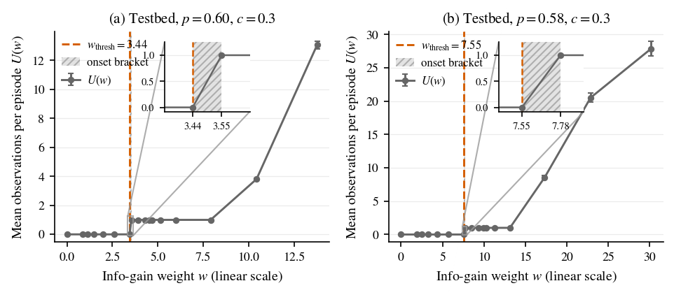

*Onset of observing on positive-threshold testbeds vs. closed-form threshold.*


Generated by: `experiments/run_price_of_information.py` (`run_prop2_duality` / `plot_prop2_jumps`).


Underlying data:


##### `results/results_price_prop2_jumps.csv`

2 rows x 11 columns, 385 bytes. Columns: `env`, `w_thresh`, `onset_lo`, `onset_hi`, `jump_w`, `rel_err`, `U_below`, `U_above`, `U_floor`, `U_ceil`, `jump_ok`.

<details>
<summary>Full data (2 rows) — click to expand</summary>

```csv
env,w_thresh,onset_lo,onset_hi,jump_w,rel_err,U_below,U_above,U_floor,U_ceil,jump_ok
TestbedPos-p06,3.4424112343349473,3.4424112343349473,3.5456835713649957,3.5456835713649957,0.030000000000000027,0.0,2.2643636363636364,0.0,13.216,True
TestbedPos-p058,7.548754860065942,7.548754860065942,7.7752175058679205,7.7752175058679205,0.030000000000000027,0.0,5.855636363636364,0.0,28.456,True
```

</details>


##### `results/results_price_prop2_curves.csv`

34 rows x 6 columns, 2,661 bytes. Columns: `env`, `w`, `w_over_thresh`, `mean_usage`, `se_usage`, `w_thresh`.

<details>
<summary>Full data (34 rows) — click to expand</summary>

```csv
env,w,w_over_thresh,mean_usage,se_usage,w_thresh
TestbedPos-p06,0.0,0.0,0.0,0.0,3.4424112343349473
TestbedPos-p06,0.8606028085837368,0.25,0.0,0.0,3.4424112343349473
TestbedPos-p06,1.1355722139596116,0.32987697769322355,0.0,0.0,3.4424112343349473
TestbedPos-p06,1.498396519573597,0.43527528164806206,0.0,0.0,3.4424112343349473
TestbedPos-p06,1.9771460610519336,0.5743491774985175,0.0,0.0,3.4424112343349473
TestbedPos-p06,2.608859868311494,0.7578582832551991,0.0,0.0,3.4424112343349473
TestbedPos-p06,3.4424112343349473,1.0,0.0,0.0,3.4424112343349473
TestbedPos-p06,3.5456835713649957,1.03,1.0,0.0,3.4424112343349473
TestbedPos-p06,3.8950540062654886,1.1314900344897314,1.0,0.0,3.4424112343349473
TestbedPos-p06,4.278849312513305,1.2429802894656055,1.0,0.0,3.4424112343349473
TestbedPos-p06,4.542288855838448,1.3195079107728949,1.0,0.0,3.4424112343349473
TestbedPos-p06,4.70046151086606,1.3654561267936836,1.0,0.0,3.4424112343349473
TestbedPos-p06,5.163616851502421,1.5,1.0,0.0,3.4424112343349473
TestbedPos-p06,5.993586078294389,1.7411011265922485,1.0,0.0,3.4424112343349473
TestbedPos-p06,7.908584244207734,2.29739670999407,1.0,0.0,3.4424112343349473
TestbedPos-p06,10.435439473245976,3.0314331330207964,3.692,0.050833060108555275,3.4424112343349473
TestbedPos-p06,13.76964493733979,4.0,13.216,0.32920510324112523,3.4424112343349473
TestbedPos-p058,0.0,0.0,0.0,0.0,7.548754860065942
TestbedPos-p058,1.8871887150164854,0.25,0.0,0.0,7.548754860065942
TestbedPos-p058,2.4901604385855856,0.32987697769322355,0.0,0.0,7.548754860065942
TestbedPos-p058,3.2857863978073802,0.43527528164806206,0.0,0.0,7.548754860065942
TestbedPos-p058,4.335621145016811,0.5743491774985175,0.0,0.0,7.548754860065942
TestbedPos-p058,5.720886398963915,0.7578582832551991,0.0,0.0,7.548754860065942
TestbedPos-p058,7.548754860065942,1.0,0.0,0.0,7.548754860065942
TestbedPos-p058,7.7752175058679205,1.03,1.0,0.0,7.548754860065942
TestbedPos-p058,8.54134089697054,1.1314900344897314,1.0,0.0,7.548754860065942
TestbedPos-p058,9.382953501069661,1.2429802894656055,1.0,0.0,7.548754860065942
TestbedPos-p058,9.960641754342346,1.3195079107728946,1.0,0.0,7.548754860065942
TestbedPos-p058,10.307493573340636,1.3654561267936836,1.0,0.0,7.548754860065942
TestbedPos-p058,11.323132290098913,1.5,1.0,0.0,7.548754860065942
TestbedPos-p058,13.143145591229523,1.7411011265922485,1.0,0.0,7.548754860065942
TestbedPos-p058,17.342484580067243,2.29739670999407,8.331999999999999,0.33043002284901396,7.548754860065942
TestbedPos-p058,22.88354559585566,3.0314331330207964,20.624000000000002,0.6269736836582531,7.548754860065942
TestbedPos-p058,30.195019440263767,4.0,28.456,0.7784446030386493,7.548754860065942
```

</details>


##### `results/results_price_prop2_duality.csv`

2 rows x 4 columns, 121 bytes. Columns: `env`, `w_closed_lower`, `U_w0`, `consistent_with_prop2`.

<details>
<summary>Full data (2 rows) — click to expand</summary>

```csv
env,w_closed_lower,U_w0,consistent_with_prop2
Testbed,-2.1195211146223545,3.388,True
Tiger,-96.11448966491011,4.284,True
```

</details>


---


### `figures/price_dual_descent.png`

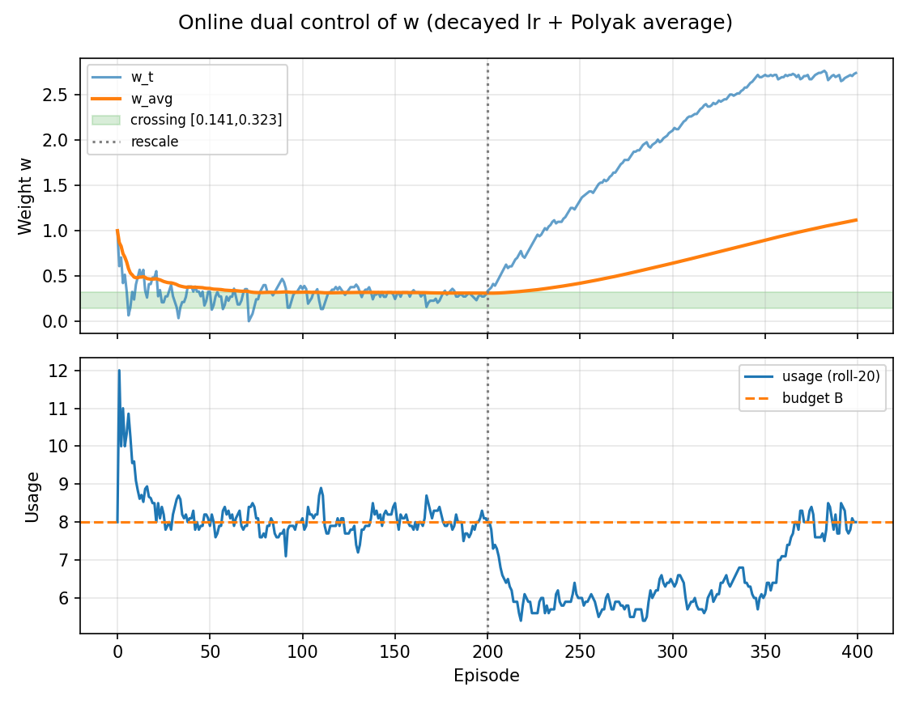

*Single-trajectory online dual descent through a mid-run reward rescale (workshop-era result).*


Generated by: `experiments/run_price_of_information.py` (`run_dual_descent` / `plot_dual_descent`).


Underlying data:


##### `results/results_price_dual_descent.csv`

400 rows x 10 columns, 36,870 bytes. Columns: `episode`, `usage`, `weight`, `w_avg`, `lr`, `budget`, `curve_w_star`, `rescaled`, `reward`, `success`.

File exceeds the inline full-embed threshold (36,870 bytes); showing the first 15 and last 8 of 400 rows plus summary statistics. Full data lives at `results/results_price_dual_descent.csv`.


First 15 rows:

| episode | usage | weight | w_avg | lr | budget | curve_w_star | rescaled | reward | success |
|---|---|---|---|---|---|---|---|---|---|
| 0 | 20 | 0.4 | 0.7 | 0.05 | 8 | 0.001 | False | -10 | True |
| 1 | 16 | 0.007843 | 0.4693 | 0.04902 | 8 | 0.001 | False | -6 | True |
| 2 | 4 | 0.2002 | 0.402 | 0.04808 | 8 | 0.001 | False | 6 | True |
| 3 | 4 | 0.3888 | 0.3994 | 0.04717 | 8 | 0.001 | False | -54 | False |
| 4 | 6 | 0.4814 | 0.413 | 0.0463 | 8 | 0.001 | False | 4 | True |
| 5 | 6 | 0.5723 | 0.4358 | 0.04545 | 8 | 0.001 | False | 4 | True |
| 6 | 10 | 0.483 | 0.4417 | 0.04464 | 8 | 0.001 | False | 0 | True |
| 7 | 8 | 0.483 | 0.4463 | 0.04386 | 8 | 0.001 | False | 2 | True |
| 8 | 6 | 0.5693 | 0.4586 | 0.0431 | 8 | 0.001 | False | 4 | True |
| 9 | 8 | 0.5693 | 0.4687 | 0.04237 | 8 | 0.001 | False | 2 | True |
| 10 | 8 | 0.5693 | 0.477 | 0.04167 | 8 | 0.001 | False | 2 | True |
| 11 | 10 | 0.4873 | 0.4778 | 0.04098 | 8 | 0.001 | False | 0 | True |
| 12 | 18 | 0.08406 | 0.4497 | 0.04032 | 8 | 0.001 | False | -8 | True |
| 13 | 6 | 0.1634 | 0.4306 | 0.03968 | 8 | 0.001 | False | 4 | True |
| 14 | 4 | 0.3197 | 0.4237 | 0.03906 | 8 | 0.001 | False | 6 | True |


Last 8 rows:

| episode | usage | weight | w_avg | lr | budget | curve_w_star | rescaled | reward | success |
|---|---|---|---|---|---|---|---|---|---|
| 392 | 4 | 2.727 | 1.074 | 0.005656 | 8 | 0.001 | True | 60 | True |
| 393 | 10 | 2.716 | 1.078 | 0.005643 | 8 | 0.001 | True | 0 | True |
| 394 | 6 | 2.727 | 1.083 | 0.005631 | 8 | 0.001 | True | 40 | True |
| 395 | 14 | 2.694 | 1.087 | 0.005618 | 8 | 0.001 | True | -40 | True |
| 396 | 6 | 2.705 | 1.091 | 0.005605 | 8 | 0.001 | True | 40 | True |
| 397 | 6 | 2.716 | 1.095 | 0.005593 | 8 | 0.001 | True | -560 | False |
| 398 | 10 | 2.705 | 1.099 | 0.00558 | 8 | 0.001 | True | 0 | True |
| 399 | 4 | 2.727 | 1.103 | 0.005568 | 8 | 0.001 | True | 60 | True |


Summary statistics (numeric columns, computed over all 400 rows):

| column | count | mean | std | min | max |
|---|---|---|---|---|---|
| episode | 400 | 199.5 | 115.6 | 0 | 399 |
| usage | 400 | 7.275 | 3.766 | 4 | 32 |
| weight | 400 | 1.103 | 0.9823 | 0 | 2.74 |
| w_avg | 400 | 0.4815 | 0.2472 | 0.286 | 1.103 |
| lr | 400 | 0.0138 | 0.0095 | 0.0056 | 0.05 |
| budget | 400 | 8 | 0 | 8 | 8 |
| curve_w_star | 400 | 0.001 | 0 | 0.001 | 0.001 |
| reward | 400 | -20.95 | 140.1 | -600 | 60 |


---


### `figures/price_dual_reset.png`

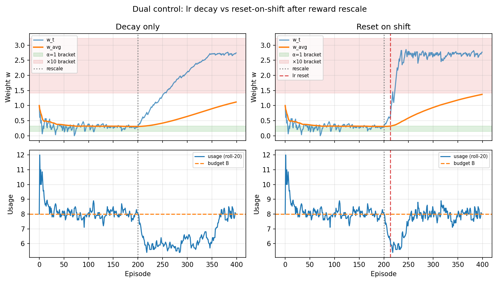

*Reset-on-shift vs. decay-only dual control (single comparison run).*


Generated by: `experiments/run_price_of_information.py` (`run_dual_reset_comparison` / `plot_dual_reset`).


Underlying data:


##### `results/results_price_dual_reset.csv`

800 rows x 12 columns, 90,255 bytes. Columns: `episode`, `usage`, `weight`, `w_avg`, `lr`, `budget`, `curve_w_star`, `rescaled`, `reward`, `success`, `variant`, `n_resets`.

File exceeds the inline full-embed threshold (90,255 bytes); showing the first 15 and last 8 of 800 rows plus summary statistics. Full data lives at `results/results_price_dual_reset.csv`.


First 15 rows:

| episode | usage | weight | w_avg | lr | budget | curve_w_star | rescaled | reward | success | variant | n_resets |
|---|---|---|---|---|---|---|---|---|---|---|---|
| 0 | 16 | 0.6 | 0.8 | 0.05 | 8 | 0.8647 | False | -6 | True | decay | 0 |
| 1 | 18 | 0.1098 | 0.5699 | 0.04902 | 8 | 0.8647 | False | -8 | True | decay | 0 |
| 2 | 8 | 0.1098 | 0.4549 | 0.04808 | 8 | 0.8647 | False | 2 | True | decay | 0 |
| 3 | 8 | 0.1098 | 0.3859 | 0.04717 | 8 | 0.8647 | False | 2 | True | decay | 0 |
| 4 | 8 | 0.1098 | 0.3399 | 0.0463 | 8 | 0.8647 | False | 2 | True | decay | 0 |
| 5 | 6 | 0.2007 | 0.32 | 0.04545 | 8 | 0.8647 | False | 4 | True | decay | 0 |
| 6 | 8 | 0.2007 | 0.3051 | 0.04464 | 8 | 0.8647 | False | 2 | True | decay | 0 |
| 7 | 4 | 0.3762 | 0.313 | 0.04386 | 8 | 0.8647 | False | -54 | False | decay | 0 |
| 8 | 12 | 0.2037 | 0.3021 | 0.0431 | 8 | 0.8647 | False | -2 | True | decay | 0 |
| 9 | 4 | 0.3732 | 0.3085 | 0.04237 | 8 | 0.8647 | False | 6 | True | decay | 0 |
| 10 | 14 | 0.1232 | 0.2931 | 0.04167 | 8 | 0.8647 | False | -4 | True | decay | 0 |
| 11 | 6 | 0.2052 | 0.2863 | 0.04098 | 8 | 0.8647 | False | 4 | True | decay | 0 |
| 12 | 4 | 0.3665 | 0.292 | 0.04032 | 8 | 0.8647 | False | 6 | True | decay | 0 |
| 13 | 6 | 0.4459 | 0.3023 | 0.03968 | 8 | 0.8647 | False | 4 | True | decay | 0 |
| 14 | 6 | 0.524 | 0.3162 | 0.03906 | 8 | 0.8647 | False | 4 | True | decay | 0 |


Last 8 rows:

| episode | usage | weight | w_avg | lr | budget | curve_w_star | rescaled | reward | success | variant | n_resets |
|---|---|---|---|---|---|---|---|---|---|---|---|
| 392 | 4 | 2.702 | 1.356 | 0.01111 | 8 | 12.93 | True | 60 | True | reset | 1 |
| 393 | 4 | 2.746 | 1.36 | 0.01106 | 8 | 12.93 | True | 60 | True | reset | 1 |
| 394 | 10 | 2.724 | 1.363 | 0.01101 | 8 | 12.93 | True | 0 | True | reset | 1 |
| 395 | 12 | 2.68 | 1.367 | 0.01096 | 8 | 12.93 | True | -20 | True | reset | 1 |
| 396 | 8 | 2.68 | 1.37 | 0.01092 | 8 | 12.93 | True | -580 | False | reset | 1 |
| 397 | 6 | 2.702 | 1.373 | 0.01087 | 8 | 12.93 | True | 40 | True | reset | 1 |
| 398 | 4 | 2.745 | 1.377 | 0.01082 | 8 | 12.93 | True | 60 | True | reset | 1 |
| 399 | 18 | 2.637 | 1.38 | 0.01078 | 8 | 12.93 | True | -80 | True | reset | 1 |


Summary statistics (numeric columns, computed over all 800 rows):

| column | count | mean | std | min | max |
|---|---|---|---|---|---|
| episode | 800 | 199.5 | 115.5 | 0 | 399 |
| usage | 800 | 7.585 | 3.672 | 4 | 28 |
| weight | 800 | 1.246 | 1.111 | 0 | 2.947 |
| w_avg | 800 | 0.5423 | 0.3304 | 0.255 | 1.38 |
| lr | 800 | 0.017 | 0.0102 | 0.0056 | 0.05 |
| budget | 800 | 8 | 0 | 8 | 8 |
| curve_w_star | 800 | 6.897 | 6.036 | 0.8647 | 12.93 |
| reward | 800 | -17.64 | 131.5 | -640 | 60 |
| n_resets | 800 | 0.2288 | 0.4203 | 0 | 1 |


---


### `figures/price_dual_multiseed.png`

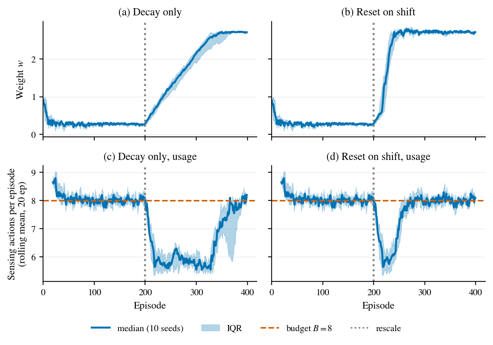

*Multi-seed (n=10) dual control through a x10 reward rescale, median + IQR.*


Generated by: `experiments/run_price_of_information.py` (`run_dual_multiseed` / `plot_dual_multiseed`).


Underlying data:


##### `results/results_price_dual_multiseed.csv`

8000 rows x 13 columns, 932,940 bytes. Columns: `episode`, `usage`, `weight`, `w_avg`, `lr`, `budget`, `curve_w_star`, `rescaled`, `reward`, `success`, `variant`, `n_resets`, `controller_seed`.

File exceeds the inline full-embed threshold (932,940 bytes); showing the first 15 and last 8 of 8000 rows plus summary statistics. Full data lives at `results/results_price_dual_multiseed.csv`.


First 15 rows:

| episode | usage | weight | w_avg | lr | budget | curve_w_star | rescaled | reward | success | variant | n_resets | controller_seed |
|---|---|---|---|---|---|---|---|---|---|---|---|---|
| 0 | 10 | 0.9 | 0.95 | 0.05 | 8 | 0.8647 | False | 0 | True | decay | 0 | 101 |
| 1 | 12 | 0.7039 | 0.868 | 0.04902 | 8 | 0.8647 | False | -2 | True | decay | 0 | 101 |
| 2 | 6 | 0.8001 | 0.851 | 0.04808 | 8 | 0.8647 | False | 4 | True | decay | 0 | 101 |
| 3 | 10 | 0.7057 | 0.8219 | 0.04717 | 8 | 0.8647 | False | -60 | False | decay | 0 | 101 |
| 4 | 12 | 0.5206 | 0.7717 | 0.0463 | 8 | 0.8647 | False | -2 | True | decay | 0 | 101 |
| 5 | 8 | 0.5206 | 0.7358 | 0.04545 | 8 | 0.8647 | False | 2 | True | decay | 0 | 101 |
| 6 | 12 | 0.342 | 0.6866 | 0.04464 | 8 | 0.8647 | False | -2 | True | decay | 0 | 101 |
| 7 | 8 | 0.342 | 0.6483 | 0.04386 | 8 | 0.8647 | False | 2 | True | decay | 0 | 101 |
| 8 | 6 | 0.4282 | 0.6263 | 0.0431 | 8 | 0.8647 | False | 4 | True | decay | 0 | 101 |
| 9 | 16 | 0.0892 | 0.5775 | 0.04237 | 8 | 0.8647 | False | -6 | True | decay | 0 | 101 |
| 10 | 8 | 0.0892 | 0.5368 | 0.04167 | 8 | 0.8647 | False | 2 | True | decay | 0 | 101 |
| 11 | 4 | 0.2531 | 0.515 | 0.04098 | 8 | 0.8647 | False | 6 | True | decay | 0 | 101 |
| 12 | 6 | 0.3338 | 0.502 | 0.04032 | 8 | 0.8647 | False | 4 | True | decay | 0 | 101 |
| 13 | 6 | 0.4131 | 0.4961 | 0.03968 | 8 | 0.8647 | False | 4 | True | decay | 0 | 101 |
| 14 | 10 | 0.335 | 0.486 | 0.03906 | 8 | 0.8647 | False | 0 | True | decay | 0 | 101 |


Last 8 rows:

| episode | usage | weight | w_avg | lr | budget | curve_w_star | rescaled | reward | success | variant | n_resets | controller_seed |
|---|---|---|---|---|---|---|---|---|---|---|---|---|
| 392 | 6 | 2.679 | 1.357 | 0.01096 | 8 | 0.8647 | True | 40 | True | reset | 1 | 110 |
| 393 | 8 | 2.679 | 1.36 | 0.01092 | 8 | 0.8647 | True | 20 | True | reset | 1 | 110 |
| 394 | 10 | 2.657 | 1.363 | 0.01087 | 8 | 0.8647 | True | 0 | True | reset | 1 | 110 |
| 395 | 6 | 2.679 | 1.367 | 0.01082 | 8 | 0.8647 | True | -560 | False | reset | 1 | 110 |
| 396 | 4 | 2.722 | 1.37 | 0.01078 | 8 | 0.8647 | True | 60 | True | reset | 1 | 110 |
| 397 | 6 | 2.743 | 1.374 | 0.01073 | 8 | 0.8647 | True | 40 | True | reset | 1 | 110 |
| 398 | 8 | 2.743 | 1.377 | 0.01068 | 8 | 0.8647 | True | 20 | True | reset | 1 | 110 |
| 399 | 8 | 2.743 | 1.38 | 0.01064 | 8 | 0.8647 | True | 20 | True | reset | 1 | 110 |


Summary statistics (numeric columns, computed over all 8000 rows):

| column | count | mean | std | min | max |
|---|---|---|---|---|---|
| episode | 8000 | 199.5 | 115.5 | 0 | 399 |
| usage | 8000 | 7.548 | 3.534 | 4 | 30 |
| weight | 8000 | 1.212 | 1.08 | 0 | 3.068 |
| w_avg | 8000 | 0.5524 | 0.3084 | 0.2609 | 1.382 |
| lr | 8000 | 0.017 | 0.0102 | 0.0056 | 0.05 |
| budget | 8000 | 8 | 0 | 8 | 8 |
| curve_w_star | 8000 | 0.8647 | 0 | 0.8647 | 0.8647 |
| reward | 8000 | -11.01 | 119.2 | -680 | 60 |
| n_resets | 8000 | 0.2284 | 0.4198 | 0 | 1 |
| controller_seed | 8000 | 105.5 | 2.873 | 101 | 110 |


##### `results/results_price_dual_multiseed_metrics.csv`

20 rows x 6 columns, 1,094 bytes. Columns: `variant`, `controller_seed`, `readapt`, `pre_steady_err`, `post_steady_err`, `n_resets`.

<details>
<summary>Full data (20 rows) — click to expand</summary>

```csv
variant,controller_seed,readapt,pre_steady_err,post_steady_err,n_resets
decay,101,143.0,0.0,0.03999999999999915,0
decay,102,122.0,0.0,1.7199999999999998,0
decay,103,149.0,0.16000000000000014,0.03999999999999915,0
decay,104,149.0,0.03999999999999915,0.16000000000000014,0
decay,105,,0.0,0.5599999999999996,0
decay,106,160.0,0.08000000000000007,0.08000000000000007,0
decay,107,145.0,0.0,0.28000000000000025,0
decay,108,0.0,0.03999999999999915,0.7599999999999998,0
decay,109,146.0,0.08000000000000007,0.11999999999999922,0
decay,110,,0.0,1.2400000000000002,0
reset,101,49.0,0.20000000000000018,0.11999999999999922,1
reset,102,65.0,0.0,0.16000000000000014,1
reset,103,55.0,0.03999999999999915,0.03999999999999915,1
reset,104,48.0,0.08000000000000007,0.040000000000000036,1
reset,105,67.0,0.08000000000000007,0.040000000000000036,1
reset,106,53.0,0.08000000000000007,0.16000000000000014,1
reset,107,51.0,0.20000000000000018,0.2400000000000002,1
reset,108,47.0,0.1999999999999993,0.1200000000000001,1
reset,109,54.0,0.0,0.03999999999999915,1
reset,110,44.0,0.040000000000000036,0.11999999999999922,1
```

</details>


---


### `figures/price_staircase_interleaved.png`

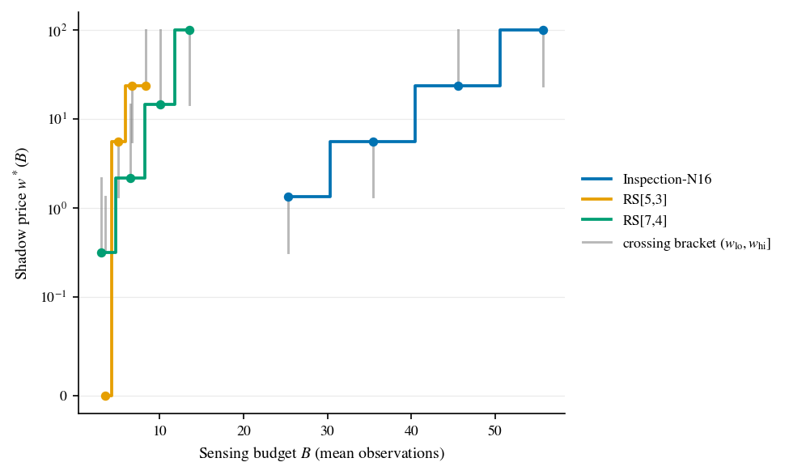

*Usage staircases on interleaved settings (RockSample x2, Inspection-N16).*


Generated by: `experiments/run_price_of_information.py` (`run_interleaved_curves`).


Underlying data:


##### `results/results_price_interleaved_curves.csv`

28 rows x 5 columns, 1,628 bytes. Columns: `env`, `w`, `mean_usage`, `se_usage`, `n_seeds`.

<details>
<summary>Full data (28 rows) — click to expand</summary>

```csv
env,w,mean_usage,se_usage,n_seeds
"RS[5,3]",0.0,3.808,0.20343057783922258,5
"RS[5,3]",0.001,3.808,0.20343057783922258,5
"RS[5,3]",0.004216965034285823,3.808,0.20343057783922258,5
"RS[5,3]",0.01778279410038923,3.808,0.20343057783922258,5
"RS[5,3]",0.07498942093324558,3.808,0.20343057783922258,5
"RS[5,3]",0.31622776601683794,3.808,0.20343057783922258,5
"RS[5,3]",1.333521432163324,4.896000000000001,0.07807688518377247,5
"RS[5,3]",5.623413251903491,4.896000000000001,0.07807688518377247,5
"RS[5,3]",23.71373705661655,6.712000000000001,0.08708616422830892,5
"RS[5,3]",100.0,9.104,0.13377593206552513,5
"RS[7,4]",0.0,2.0,0.0,5
"RS[7,4]",0.001,2.0,0.0,5
"RS[7,4]",0.006812920690579615,2.0,0.0,5
"RS[7,4]",0.046415888336127795,2.0,0.0,5
"RS[7,4]",0.31622776601683794,3.0,0.0,5
"RS[7,4]",2.1544346900318843,5.506666666666668,0.12622730819174324,5
"RS[7,4]",14.677992676220706,8.96,0.2654974366898651,5
"RS[7,4]",100.0,14.726666666666668,0.29951813152313683,5
Inspection-N16,0.0,22.419999999999998,0.07402702209328714,5
Inspection-N16,0.001,22.419999999999998,0.07402702209328714,5
Inspection-N16,0.004216965034285823,22.419999999999998,0.07402702209328714,5
Inspection-N16,0.01778279410038923,22.419999999999998,0.07402702209328714,5
Inspection-N16,0.07498942093324558,22.419999999999998,0.07402702209328714,5
Inspection-N16,0.31622776601683794,22.419999999999998,0.07402702209328714,5
Inspection-N16,1.333521432163324,35.064,0.2543540839066671,5
Inspection-N16,5.623413251903491,35.224000000000004,0.13136209498938411,5
Inspection-N16,23.71373705661655,39.528,0.39747201159326906,5
Inspection-N16,100.0,46.044,0.49036313075107896,5
```

</details>


##### `results/results_price_interleaved_prices.csv`

12 rows x 14 columns, 2,002 bytes. Columns: `env`, `budget`, `w_star`, `w_lo`, `w_hi`, `usage_at_star`, `usage_lo`, `usage_hi`, `usage_se_at_star`, `bracketed`, `achievable`, `u_min`, `u_max`, `note`.

<details>
<summary>Full data (12 rows) — click to expand</summary>

```csv
env,budget,w_star,w_lo,w_hi,usage_at_star,usage_lo,usage_hi,usage_se_at_star,bracketed,achievable,u_min,u_max,note
"RS[5,3]",4.23168,0.0,0.31622776601683794,1.333521432163324,3.808,3.808,4.896000000000001,0.20343057783922258,True,True,3.808,9.104,
"RS[5,3]",5.71456,1.333521432163324,5.623413251903491,23.71373705661655,4.896000000000001,4.896000000000001,6.712000000000001,0.07807688518377247,True,True,3.808,9.104,
"RS[5,3]",7.19744,23.71373705661655,5.623413251903491,23.71373705661655,6.712000000000001,4.896000000000001,6.712000000000001,0.08708616422830892,True,True,3.808,9.104,
"RS[5,3]",8.68032,100.0,23.71373705661655,100.0,9.104,6.712000000000001,9.104,0.13377593206552513,True,True,3.808,9.104,
"RS[7,4]",3.0181333333333336,0.31622776601683794,0.046415888336127795,0.31622776601683794,3.0,2.0,3.0,0.0,True,True,2.0,14.726666666666668,
"RS[7,4]",6.581600000000001,2.1544346900318843,2.1544346900318843,14.677992676220706,5.506666666666668,5.506666666666668,8.96,0.12622730819174324,True,True,2.0,14.726666666666668,
"RS[7,4]",10.145066666666668,14.677992676220706,14.677992676220706,100.0,8.96,8.96,14.726666666666668,0.2654974366898651,True,True,2.0,14.726666666666668,
"RS[7,4]",13.708533333333335,100.0,14.677992676220706,100.0,14.726666666666668,8.96,14.726666666666668,0.29951813152313683,True,True,2.0,14.726666666666668,
Inspection-N16,24.309919999999998,0.0,0.0,0.001,22.419999999999998,22.419999999999998,22.419999999999998,0.07402702209328714,False,True,22.419999999999998,46.044,
Inspection-N16,30.924639999999997,1.333521432163324,0.31622776601683794,1.333521432163324,35.064,22.419999999999998,35.064,0.2543540839066671,True,True,22.419999999999998,46.044,
Inspection-N16,37.539359999999995,23.71373705661655,0.31622776601683794,1.333521432163324,39.528,22.419999999999998,35.064,0.39747201159326906,True,True,22.419999999999998,46.044,
Inspection-N16,44.15407999999999,100.0,23.71373705661655,100.0,46.044,39.528,46.044,0.49036313075107896,True,True,22.419999999999998,46.044,
```

</details>


---


### `figures/distractor_composition.png`

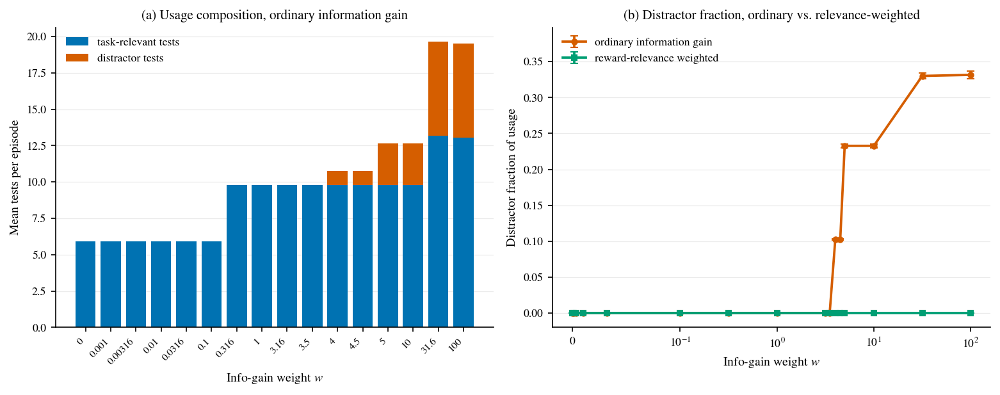

*Usage composition on DistractorDiagnosisEnv vs. w.*


Generated by: `experiments/run_distractor_diagnosis.py`.


Underlying data:


##### `results/results_distractor_diagnosis.csv`

14 rows x 11 columns, 1,638 bytes. Columns: `agent`, `w`, `mean_reward`, `se_reward`, `mean_usage`, `se_usage`, `mean_task_tests`, `mean_distractor_tests`, `mean_distractor_fraction`, `se_distractor_fraction`, `success_rate`.

<details>
<summary>Full data (14 rows) — click to expand</summary>

```csv
agent,w,mean_reward,se_reward,mean_usage,se_usage,mean_task_tests,mean_distractor_tests,mean_distractor_fraction,se_distractor_fraction,success_rate
Planning+IG,0.0,-2.5,0.8435330461813573,5.9,0.11255221010713205,5.9,0.0,0.0,0.0,0.89
Planning+IG,0.001,-2.396,0.8518910540673614,5.676,0.09780617567413624,5.676,0.0,0.0,0.0,0.888
Planning+IG,0.0031622776601683794,-1.38,0.7825184981839086,5.86,0.1078183657824584,5.86,0.0,0.0,0.0,0.908
Planning+IG,0.01,-3.54,0.8985370331822723,5.98,0.10932154407983816,5.98,0.0,0.0,0.0,0.874
Planning+IG,0.03162277660168379,-2.852,0.8574031677105001,6.012,0.10545004504503543,6.012,0.0,0.0,0.0,0.886
Planning+IG,0.1,-3.264,0.8905035698973923,5.824,0.09749896409706103,5.824,0.0,0.0,0.0,0.876
Planning+IG,0.31622776601683794,-1.244,0.46430262545025525,9.684,0.16850011275960616,9.684,0.0,0.0,0.0,0.974
Planning+IG,1.0,-1.508,0.5011146296008528,9.708,0.17836331461374,9.708,0.0,0.0,0.0,0.97
Planning+IG,3.1622776601683795,-0.648,0.4113881281709524,9.568,0.16907617218283597,9.568,0.0,0.0,0.0,0.982
Planning+IG,10.0,-3.328,0.3840739928711654,12.368,0.16700045508920028,9.416,2.952,0.24206308136308138,0.004603017975368588,0.984
Planning+IG,31.622776601683793,-10.816,0.4059707969792901,20.096,0.2701954255719367,13.44,6.656,0.33133099468299154,0.005180278294896926,0.988
Planning+IG,100.0,-10.264,0.30471725911080255,20.024,0.24761027442333647,13.396,6.628,0.33071939974370307,0.005018881252732448,0.996
EFE (w=1),,-0.728,0.3859482245068631,9.768,0.17569391566016165,9.768,0.0,0.0,0.0,0.984
IDS,,-11.932,0.30589990519776233,21.812,0.28718167072429956,14.956,6.856,0.31148166533564586,0.0048436445877751,0.998
```

</details>


---

---

## 20. Complete data appendix: every other result CSV in the repository

Section 19 covers the CSVs that feed the 24 rendered figures. This section covers
every remaining file in `results/` (45 files) — the ones that feed the markdown
tables reproduced in Sections 10-11 above, plus a few exploratory/superseded files
kept for completeness and flagged as such. Files under 20,000 bytes are embedded
in full inside collapsible `<details>` blocks; larger files show a head/tail
preview plus summary statistics, with the full file path given for the complete
data. All 65 CSV files in `results/` are accounted for between this section and
Section 19.

### Core environments (Table `tab:main`, Section 10.1)


#### `results/results_tiger.csv`

Per-agent means/SDs feeding the Tiger row of Table `tab:main`.

9 rows x 9 columns, 1,136 bytes. Columns: `Unnamed: 0`, `agent`, `mean_observations`, `std_observations`, `mean_final_entropy`, `mean_confidence`, `success_rate`, `mean_reward`, `std_reward`.

<details>
<summary>Full data (9 rows) — click to expand</summary>

```csv
,agent,mean_observations,std_observations,mean_final_entropy,mean_confidence,success_rate,mean_reward,std_reward
Myopic,MyopicAgent,1.0,0.0,0.6098403047164005,0.8499999999999999,0.8516,-7.324,39.10456525778032
Planning,PlanningAgent,4.1916,1.9590021541591016,0.04893970304143953,0.9945344129554653,0.9958,5.3464,7.363640882063709
InfoGain,InformationGainAgent,1.0,0.0,0.6098403047164005,0.8499999999999999,0.8493,-7.577,39.35318374668052
InfoGain-Tuned,InformationGainAgent,4.265,2.053527452945297,0.04893970304143953,0.9945344129554653,0.9948,5.163,8.165943362527075
Planning+IG,PlanningInfoGainAgent,5.7138,2.414475007118525,0.011096924186696258,0.9990311236573285,0.9991,4.1872,4.10006782382926
EpistemicOnly,EpistemicOnlyAgent,0.0,0.0,1.0,0.5,0.5066,-44.274,54.995208191259714
EFE,EFEAgent,4.2016,1.9606522996186753,0.04893970304143953,0.9945344129554653,0.9949,5.2374,8.058985124691569
Thompson,ThompsonSamplingAgent,2.6906,1.355091008013853,0.19540057665116498,0.9697986577181208,0.9706,4.0754,18.635200960547756
PyMDP-AIF,PyMDPAgent,2.6916,1.381915134876234,0.19540057665116498,0.9697986577181208,0.9668,3.6564,19.77718733895192
```

</details>


#### `results/results_diagnosis_n4.csv`

Per-agent means/SDs feeding the Diagnosis (N=4) row of Table `tab:main`.

8 rows x 10 columns, 1,163 bytes. Columns: `Unnamed: 0`, `agent`, `mean_observations`, `std_observations`, `mean_final_entropy`, `mean_confidence`, `success_rate`, `mean_reward`, `std_reward`, `time_s`.

<details>
<summary>Full data (8 rows) — click to expand</summary>

```csv
,agent,mean_observations,std_observations,mean_final_entropy,mean_confidence,success_rate,mean_reward,std_reward,time_s
Myopic,MyopicAgent,2.0,0.0,1.4438561897747244,0.6400000000000003,0.635,-13.9,28.88580966495487,1.1830849647521973
Planning,PlanningAgent,5.9166,2.402133310205743,0.6455139177947962,0.8858131487889271,0.8882,-2.6246,19.074691998561864,17.924859046936035
InfoGain,InformationGainAgent,2.0,0.0,1.4438561897747244,0.6400000000000003,0.6368,-13.792,28.855306894919693,11.880084991455078
InfoGain-Tuned,InformationGainAgent,13.3212,4.812570057671888,0.07350590772627749,0.9922330391073295,0.9928,-3.7532,7.024008097945218,54.6518280506134
Planning+IG,PlanningInfoGainAgent,13.2272,4.709859887512579,0.07350590772627746,0.9922330391073295,0.9937,-3.6052,6.737962077661168,1081.9458029270172
EpistemicOnly,EpistemicOnlyAgent,200.0,0.0,1.0,0.5,0.0,-200.0,0.0,15149.071330070496
EFE,EFEAgent,9.7044,3.8435167021882446,0.22935101067229338,0.9694674556213022,0.9698,-1.5164,10.9931128912606,813.8953721523285
Thompson,ThompsonSamplingAgent,5.8722,2.361539150638837,0.6455139177947962,0.8858131487889271,0.8852,-2.7602,19.266678384194822,92.21792888641357
```

</details>


#### `results/results_bandit.csv`

Per-agent means/SDs feeding the Bandit row of Table `tab:main`.

8 rows x 10 columns, 1,207 bytes. Columns: `Unnamed: 0`, `agent`, `mean_observations`, `std_observations`, `mean_final_entropy`, `mean_confidence`, `success_rate`, `mean_reward`, `std_reward`, `time_s`.

<details>
<summary>Full data (8 rows) — click to expand</summary>

```csv
,agent,mean_observations,std_observations,mean_final_entropy,mean_confidence,success_rate,mean_reward,std_reward,time_s
Myopic,MyopicAgent,2.0379,0.8640969795109805,1.5250176359383172,0.6160679480519481,0.6183,5.54575,4.363242136015374,1.522672176361084
Planning,PlanningAgent,3.2329,2.1473838944166457,1.2974663975092042,0.6933568321963749,0.6895,5.58905,4.042863477474845,9.659109830856323
InfoGain,InformationGainAgent,2.0489,0.864701561233701,1.5258411538638008,0.61580612987013,0.6109,5.47365,4.384367762574212,23.10182785987854
InfoGain-Tuned,InformationGainAgent,9.6213,5.499862390096683,0.09041621424214295,0.990587000648575,0.9918,5.11555,2.8651742002014466,79.07314991950989
Planning+IG,PlanningInfoGainAgent,12.2707,6.17780070170607,0.015781068083139532,0.9987166889669661,0.9985,3.85115,3.1057154856007014,860.7673358917236
EpistemicOnly,EpistemicOnlyAgent,0.0,0.0,2.0,0.25,0.2501,3.2509,3.89763379372665,66.12518000602722
EFE,EFEAgent,5.1379,3.2994368595261827,0.756233202459605,0.8674489071995058,0.8625,6.19355,3.500344754092088,402.8907608985901
Thompson,ThompsonSamplingAgent,5.1612,3.316626985357262,0.7583446345064176,0.8670155278607479,0.8656,6.2098,3.477051043628782,156.96954798698425
```

</details>


#### `results/results_effect_sizes.csv`

Extracted Cohen's d effect sizes referenced in Section 10.1 ("d < 0.2" on reward, "d ~ 0.33/0.47" on success).

20 rows x 4 columns, 861 bytes. Columns: `Environment`, `Comparison`, `Cohen's d`, `Effect`.

<details>
<summary>Full data (20 rows) — click to expand</summary>

```csv
Environment,Comparison,Cohen's d,Effect
Tiger,EFE vs Myopic,+0.443,small
Tiger,EFE vs Planning,-0.007,negligible
Tiger,EFE vs InfoGain-Tuned,+0.006,negligible
Tiger,EFE vs Planning+IG,-0.006,negligible
Tiger,EFE vs Thompson,+0.084,negligible
Testbed,EFE vs Myopic,-0.028,negligible
Testbed,EFE vs Planning,-0.194,negligible
Testbed,EFE vs InfoGain-Tuned,+1.340,large
Testbed,EFE vs Planning+IG,+1.328,large
Testbed,EFE vs Thompson,-0.178,negligible
Diagnosis,EFE vs Myopic,+0.531,medium
Diagnosis,EFE vs Planning,+0.073,negligible
Diagnosis,EFE vs InfoGain-Tuned,+0.240,small
Diagnosis,EFE vs Planning+IG,+0.231,small
Diagnosis,EFE vs Thompson,+0.068,negligible
Bandit,EFE vs Myopic,+0.211,small
Bandit,EFE vs Planning,+0.198,negligible
Bandit,EFE vs InfoGain-Tuned,+0.666,medium
Bandit,EFE vs Planning+IG,+0.792,medium
Bandit,EFE vs Thompson,+0.033,negligible
```

</details>


#### `results/results_bootstrap_ci.csv`

Bootstrap 95% confidence intervals (10,000 resamples) referenced in Section 10.1 for the EFE vs. Planning reward comparison on Bandit.

24 rows x 8 columns, 2,085 bytes. Columns: `Environment`, `Agent`, `Reward`, `Reward CI`, `Success`, `Success CI`, `Obs`, `Obs CI`.

<details>
<summary>Full data (24 rows) — click to expand</summary>

```csv
Environment,Agent,Reward,Reward CI,Success,Success CI,Obs,Obs CI
Tiger,Myopic,-7.61,"[-8.69, -6.51]",84.9%,"[83.9%, 85.9%]",1.00,"[1.00, 1.00]"
Tiger,Planning,+5.12,"[+4.88, +5.34]",99.5%,"[99.3%, 99.7%]",4.29,"[4.23, 4.35]"
Tiger,InfoGain-Tuned,+5.00,"[+4.73, +5.26]",99.3%,"[99.0%, 99.5%]",4.21,"[4.15, 4.26]"
Tiger,Planning+IG,+5.11,"[+4.87, +5.33]",99.4%,"[99.2%, 99.6%]",4.27,"[4.22, 4.33]"
Tiger,EFE,+5.05,"[+4.78, +5.29]",99.3%,"[99.1%, 99.6%]",4.22,"[4.17, 4.28]"
Tiger,Thompson,+3.77,"[+3.22, +4.30]",96.8%,"[96.3%, 97.2%]",2.66,"[2.63, 2.70]"
Testbed,Myopic,+0.39,"[+0.37, +0.42]",74.7%,"[73.5%, 75.9%]",1.00,"[1.00, 1.00]"
Testbed,Planning,+0.48,"[+0.47, +0.50]",90.2%,"[89.3%, 91.0%]",3.19,"[3.13, 3.24]"
Testbed,InfoGain-Tuned,-0.41,"[-0.43, -0.40]",99.9%,"[99.8%, 100.0%]",14.12,"[13.94, 14.30]"
Testbed,Planning+IG,-0.41,"[-0.43, -0.39]",100.0%,"[99.9%, 100.0%]",14.06,"[13.88, 14.25]"
Testbed,EFE,+0.37,"[+0.36, +0.39]",96.7%,"[96.2%, 97.2%]",5.60,"[5.51, 5.70]"
Testbed,Thompson,+0.48,"[+0.46, +0.50]",89.9%,"[89.0%, 90.7%]",3.20,"[3.15, 3.26]"
Diagnosis,Myopic,-13.08,"[-13.88, -12.29]",64.9%,"[63.5%, 66.2%]",2.00,"[2.00, 2.00]"
Diagnosis,Planning,-2.72,"[-3.26, -2.19]",88.6%,"[87.7%, 89.5%]",5.88,"[5.81, 5.95]"
Diagnosis,InfoGain-Tuned,-3.80,"[-4.00, -3.60]",99.2%,"[98.9%, 99.4%]",13.32,"[13.18, 13.45]"
Diagnosis,Planning+IG,-3.66,"[-3.85, -3.48]",99.4%,"[99.1%, 99.6%]",13.29,"[13.16, 13.42]"
Diagnosis,EFE,-1.58,"[-1.89, -1.29]",97.0%,"[96.5%, 97.5%]",9.78,"[9.68, 9.89]"
Diagnosis,Thompson,-2.63,"[-3.15, -2.11]",88.7%,"[87.9%, 89.6%]",5.87,"[5.81, 5.94]"
Bandit,Myopic,+5.56,"[+5.44, +5.68]",62.1%,"[60.7%, 63.4%]",2.06,"[2.03, 2.08]"
Bandit,Planning,+5.65,"[+5.54, +5.76]",69.4%,"[68.1%, 70.6%]",3.19,"[3.13, 3.25]"
Bandit,InfoGain-Tuned,+4.25,"[+4.16, +4.33]",99.9%,"[99.8%, 100.0%]",11.49,"[11.33, 11.66]"
Bandit,Planning+IG,+3.86,"[+3.78, +3.94]",99.9%,"[99.7%, 100.0%]",12.25,"[12.09, 12.42]"
Bandit,EFE,+6.38,"[+6.29, +6.47]",87.9%,"[87.0%, 88.8%]",5.07,"[4.98, 5.16]"
Bandit,Thompson,+6.27,"[+6.18, +6.36]",87.2%,"[86.2%, 88.1%]",5.15,"[5.06, 5.24]"
```

</details>


---


### Pairwise statistical comparisons (Cohen's d, t-tests, Holm-Bonferroni)


#### `results/results_full_statistics.csv`

Combined pairwise agent-comparison statistics across all core environments (reward and success metrics): mean, CI, difference, Cohen's d, t-statistic, raw p-value, Holm-Bonferroni significance flag.

180 rows x 13 columns, 29,258 bytes. Columns: `env`, `metric`, `agent_a`, `agent_b`, `mean_a`, `ci_a`, `mean_b`, `ci_b`, `diff`, `cohens_d`, `t_stat`, `p_raw`, `significant_hb`.

File exceeds the inline full-embed threshold (29,258 bytes); showing the first 15 and last 8 of 180 rows plus summary statistics. Full data lives at `results/results_full_statistics.csv`.


First 15 rows:

| env | metric | agent_a | agent_b | mean_a | ci_a | mean_b | ci_b | diff | cohens_d | t_stat | p_raw | significant_hb |
|---|---|---|---|---|---|---|---|---|---|---|---|---|
| Tiger | Reward | Myopic | Planning | -7.61 | [-8.688, -6.510] | 5.116 | [4.883, 5.338] | -12.73 | -0.447 | -22.35 | 5.264e-108 | True |
| Tiger | Reward | Myopic | InfoGain-Tuned | -7.61 | [-8.688, -6.510] | 5 | [4.728, 5.256] | -12.61 | -0.44 | -22 | 8.292e-105 | True |
| Tiger | Reward | Myopic | Planning+IG | -7.61 | [-8.688, -6.510] | 5.11 | [4.873, 5.327] | -12.72 | -0.4466 | -22.33 | 7.896e-108 | True |
| Tiger | Reward | Myopic | EFE | -7.61 | [-8.688, -6.510] | 5.053 | [4.783, 5.293] | -12.66 | -0.443 | -22.15 | 3.47e-106 | True |
| Tiger | Reward | Myopic | Thompson | -7.61 | [-8.688, -6.510] | 3.772 | [3.224, 4.304] | -11.38 | -0.3662 | -18.31 | 1.126e-73 | True |
| Tiger | Reward | Planning | InfoGain-Tuned | 5.116 | [4.883, 5.338] | 5 | [4.728, 5.256] | 0.1156 | 0.0129 | 0.6449 | 0.519 | False |
| Tiger | Reward | Planning | Planning+IG | 5.116 | [4.883, 5.338] | 5.11 | [4.873, 5.327] | 0.0064 | 0.0007638 | 0.03819 | 0.9695 | False |
| Tiger | Reward | Planning | EFE | 5.116 | [4.883, 5.338] | 5.053 | [4.783, 5.293] | 0.0632 | 0.007252 | 0.3626 | 0.7169 | False |
| Tiger | Reward | Planning | Thompson | 5.116 | [4.883, 5.338] | 3.772 | [3.224, 4.304] | 1.344 | 0.0895 | 4.475 | 7.718e-06 | True |
| Tiger | Reward | InfoGain-Tuned | Planning+IG | 5 | [4.728, 5.256] | 5.11 | [4.873, 5.327] | -0.1092 | -0.01214 | -0.6071 | 0.5438 | False |
| Tiger | Reward | InfoGain-Tuned | EFE | 5 | [4.728, 5.256] | 5.053 | [4.783, 5.293] | -0.0524 | -0.005629 | -0.2815 | 0.7784 | False |
| Tiger | Reward | InfoGain-Tuned | Thompson | 5 | [4.728, 5.256] | 3.772 | [3.224, 4.304] | 1.228 | 0.07993 | 3.996 | 6.475e-05 | True |
| Tiger | Reward | Planning+IG | EFE | 5.11 | [4.873, 5.327] | 5.053 | [4.783, 5.293] | 0.0568 | 0.006493 | 0.3247 | 0.7454 | False |
| Tiger | Reward | Planning+IG | Thompson | 5.11 | [4.873, 5.327] | 3.772 | [3.224, 4.304] | 1.337 | 0.08897 | 4.448 | 8.747e-06 | True |
| Tiger | Reward | EFE | Thompson | 5.053 | [4.783, 5.293] | 3.772 | [3.224, 4.304] | 1.28 | 0.08412 | 4.206 | 2.62e-05 | True |


Last 8 rows:

| env | metric | agent_a | agent_b | mean_a | ci_a | mean_b | ci_b | diff | cohens_d | t_stat | p_raw | significant_hb |
|---|---|---|---|---|---|---|---|---|---|---|---|---|
| Bandit | Observations | Planning | EFE | 3.186 | [3.126, 3.248] | 5.066 | [4.975, 5.155] | -1.881 | -0.6765 | -33.83 | 1.371e-237 | True |
| Bandit | Observations | Planning | Thompson | 3.186 | [3.126, 3.248] | 5.153 | [5.062, 5.244] | -1.967 | -0.6998 | -34.99 | 3.901e-253 | True |
| Bandit | Observations | InfoGain-Tuned | Planning+IG | 11.49 | [11.325, 11.664] | 12.25 | [12.087, 12.417] | -0.7576 | -0.1259 | -6.297 | 3.17e-10 | True |
| Bandit | Observations | InfoGain-Tuned | EFE | 11.49 | [11.325, 11.664] | 5.066 | [4.975, 5.155] | 6.426 | 1.317 | 65.85 | 0 | True |
| Bandit | Observations | InfoGain-Tuned | Thompson | 11.49 | [11.325, 11.664] | 5.153 | [5.062, 5.244] | 6.34 | 1.295 | 64.73 | 0 | True |
| Bandit | Observations | Planning+IG | EFE | 12.25 | [12.087, 12.417] | 5.066 | [4.975, 5.155] | 7.184 | 1.495 | 74.73 | 0 | True |
| Bandit | Observations | Planning+IG | Thompson | 12.25 | [12.087, 12.417] | 5.153 | [5.062, 5.244] | 7.098 | 1.471 | 73.56 | 0 | True |
| Bandit | Observations | EFE | Thompson | 5.066 | [4.975, 5.155] | 5.153 | [5.062, 5.244] | -0.0862 | -0.02611 | -1.306 | 0.1917 | False |


Summary statistics (numeric columns, computed over all 180 rows):

| column | count | mean | std | min | max |
|---|---|---|---|---|---|
| mean_a | 180 | 2.143 | 4.909 | -13.08 | 14.12 |
| mean_b | 180 | 3.267 | 4.015 | -3.797 | 14.12 |
| diff | 180 | -1.123 | 4.338 | -13.12 | 10.91 |
| cohens_d | 180 | -0.3014 | 1.026 | -3.354 | 2.252 |
| t_stat | 180 | -15.07 | 51.31 | -167.7 | 112.6 |
| p_raw | 180 | 0.0991 | 0.2333 | 0 | 0.9695 |


#### `results/results_summary_stats.csv`

Pairwise statistics for the InfoSeeking/Testbed environment specifically.

108 rows x 13 columns, 18,627 bytes. Columns: `env`, `metric`, `agent_a`, `agent_b`, `mean_a`, `ci_a`, `mean_b`, `ci_b`, `diff`, `cohens_d`, `t_stat`, `p_raw`, `significant_hb`.

<details>
<summary>Full data (108 rows) — click to expand</summary>

```csv
env,metric,agent_a,agent_b,mean_a,ci_a,mean_b,ci_b,diff,cohens_d,t_stat,p_raw,significant_hb
InfoSeeking,Reward,Myopic,Planning,0.39960000000000007,"[0.383, 0.416]",0.47758,"[0.465, 0.490]",-0.07797999999999994,-0.1025262652214379,-7.249701738780923,4.329033915247815e-13,True
InfoSeeking,Reward,Myopic,InfoGain,0.39960000000000007,"[0.383, 0.416]",0.4723,"[0.460, 0.485]",-0.07269999999999993,-0.09535245004079551,-6.742436402659799,1.600024447956578e-11,True
InfoSeeking,Reward,Myopic,InfoGain-Tuned,0.39960000000000007,"[0.383, 0.416]",0.0038599999999999524,"[-0.007, 0.014]",0.3957400000000001,0.5492976046281547,38.841206112209534,0.0,True
InfoSeeking,Reward,Myopic,Planning+IG,0.39960000000000007,"[0.383, 0.416]",-0.20114000000000012,"[-0.213, -0.189]",0.6007400000000002,0.8057327240643741,56.97390730098283,0.0,True
InfoSeeking,Reward,Myopic,EpistemicOnly,0.39960000000000007,"[0.383, 0.416]",0.4832,"[0.471, 0.496]",-0.08359999999999995,-0.11053715003772047,-7.816156836470698,5.714278970303312e-15,True
InfoSeeking,Reward,Myopic,EFE,0.39960000000000007,"[0.383, 0.416]",0.36550000000000005,"[0.355, 0.376]",0.03410000000000002,0.04755986672099828,3.36299042707463,0.0007724766278888167,True
InfoSeeking,Reward,Myopic,Thompson,0.39960000000000007,"[0.383, 0.416]",0.47856000000000004,"[0.466, 0.491]",-0.07895999999999997,-0.10393579044786963,-7.349370223367261,2.0680294700125328e-13,True
InfoSeeking,Reward,Myopic,PyMDP-AIF,0.39960000000000007,"[0.383, 0.416]",0.47456000000000004,"[0.462, 0.487]",-0.07495999999999997,-0.09869293839949964,-6.978644599751241,3.0736641243244148e-12,True
InfoSeeking,Reward,Planning,InfoGain,0.47758,"[0.465, 0.490]",0.4723,"[0.460, 0.485]",0.005280000000000007,0.00825280152192005,0.5835611919936328,0.559522157551496,False
InfoSeeking,Reward,Planning,InfoGain-Tuned,0.47758,"[0.465, 0.490]",0.0038599999999999524,"[-0.007, 0.014]",0.47372000000000003,0.8041174456999507,56.85968987248406,0.0,True
InfoSeeking,Reward,Planning,Planning+IG,0.47758,"[0.465, 0.490]",-0.20114000000000012,"[-0.213, -0.189]",0.6787200000000001,1.0954103302848113,77.45720727261859,0.0,True
InfoSeeking,Reward,Planning,EpistemicOnly,0.47758,"[0.465, 0.490]",0.4832,"[0.471, 0.496]",-0.005620000000000014,-0.008885827471212327,-0.6283228861347948,0.5297996176330217,False
InfoSeeking,Reward,Planning,EFE,0.47758,"[0.465, 0.490]",0.36550000000000005,"[0.355, 0.376]",0.11207999999999996,0.1916270518596948,13.55007878287764,1.2086869407426216e-41,True
InfoSeeking,Reward,Planning,Thompson,0.47758,"[0.465, 0.490]",0.47856000000000004,"[0.466, 0.491]",-0.0009800000000000364,-0.0015396185759029538,-0.10886747354617539,0.913308697890713,False
InfoSeeking,Reward,Planning,PyMDP-AIF,0.47758,"[0.465, 0.490]",0.47456000000000004,"[0.462, 0.487]",0.003019999999999967,0.004746072417726944,0.3355979990577154,0.7371775535896998,False
InfoSeeking,Reward,InfoGain,InfoGain-Tuned,0.4723,"[0.460, 0.485]",0.0038599999999999524,"[-0.007, 0.014]",0.46844,0.7919485399397328,55.99921829421705,0.0,True
InfoSeeking,Reward,InfoGain,Planning+IG,0.4723,"[0.460, 0.485]",-0.20114000000000012,"[-0.213, -0.189]",0.6734400000000001,1.0829243866147564,76.57431772875766,0.0,True
InfoSeeking,Reward,InfoGain,EpistemicOnly,0.4723,"[0.460, 0.485]",0.4832,"[0.471, 0.496]",-0.01090000000000002,-0.017173735758768682,-1.2143665013331233,0.2246221409127331,False
InfoSeeking,Reward,InfoGain,EFE,0.4723,"[0.460, 0.485]",0.36550000000000005,"[0.355, 0.376]",0.10679999999999995,0.18185271721736518,12.858928952159854,1.0809779351289938e-37,True
InfoSeeking,Reward,InfoGain,Thompson,0.4723,"[0.460, 0.485]",0.47856000000000004,"[0.466, 0.491]",-0.006260000000000043,-0.0098007066345667,-0.6930146121722102,0.4883084294513752,False
InfoSeeking,Reward,InfoGain,PyMDP-AIF,0.4723,"[0.460, 0.485]",0.47456000000000004,"[0.462, 0.487]",-0.0022600000000000398,-0.0035394100319060167,-0.2502740834960439,0.8023779681286928,False
InfoSeeking,Reward,InfoGain-Tuned,Planning+IG,0.0038599999999999524,"[-0.007, 0.014]",-0.20114000000000012,"[-0.213, -0.189]",0.20500000000000007,0.35989159871870663,25.448178994606526,1.2730912965596547e-140,True
InfoSeeking,Reward,InfoGain-Tuned,EpistemicOnly,0.0038599999999999524,"[-0.007, 0.014]",0.4832,"[0.471, 0.496]",-0.47934000000000004,-0.8213737208583327,-58.07989279073535,0.0,True
InfoSeeking,Reward,InfoGain-Tuned,EFE,0.0038599999999999524,"[-0.007, 0.014]",0.36550000000000005,"[0.355, 0.376]",-0.3616400000000001,-0.6802292097507969,-48.09946869759549,0.0,True
InfoSeeking,Reward,InfoGain-Tuned,Thompson,0.0038599999999999524,"[-0.007, 0.014]",0.47856000000000004,"[0.466, 0.491]",-0.47470000000000007,-0.8073487876694979,-57.088180254384014,0.0,True
InfoSeeking,Reward,InfoGain-Tuned,PyMDP-AIF,0.0038599999999999524,"[-0.007, 0.014]",0.47456000000000004,"[0.462, 0.487]",-0.47070000000000006,-0.8008490372498506,-56.62857849460873,0.0,True
InfoSeeking,Reward,Planning+IG,EpistemicOnly,-0.20114000000000012,"[-0.213, -0.189]",0.4832,"[0.471, 0.496]",-0.6843400000000002,-1.113937019530016,-78.7672420324406,0.0,True
InfoSeeking,Reward,Planning+IG,EFE,-0.20114000000000012,"[-0.213, -0.189]",0.36550000000000005,"[0.355, 0.376]",-0.5666400000000001,-1.0024800918856362,-70.88604709768467,0.0,True
InfoSeeking,Reward,Planning+IG,Thompson,-0.20114000000000012,"[-0.213, -0.189]",0.47856000000000004,"[0.466, 0.491]",-0.6797000000000002,-1.0989210339510644,-77.70545150953298,0.0,True
InfoSeeking,Reward,Planning+IG,PyMDP-AIF,-0.20114000000000012,"[-0.213, -0.189]",0.47456000000000004,"[0.462, 0.487]",-0.6757000000000002,-1.0928279133036027,-77.27460281669218,0.0,True
InfoSeeking,Reward,EpistemicOnly,EFE,0.4832,"[0.471, 0.496]",0.36550000000000005,"[0.355, 0.376]",0.11769999999999997,0.2031723649291353,14.366455699109949,1.4332435245932927e-46,True
InfoSeeking,Reward,EpistemicOnly,Thompson,0.4832,"[0.471, 0.496]",0.47856000000000004,"[0.466, 0.491]",0.0046399999999999775,0.0073487216222856,0.5196330892170354,0.6033250820692793,False
InfoSeeking,Reward,EpistemicOnly,PyMDP-AIF,0.4832,"[0.471, 0.496]",0.47456000000000004,"[0.462, 0.487]",0.008639999999999981,0.013688321429342338,0.9679104905749101,0.33310078000122334,False
InfoSeeking,Reward,EFE,Thompson,0.36550000000000005,"[0.355, 0.376]",0.47856000000000004,"[0.466, 0.491]",-0.11306,-0.19368418629155984,-13.695540153536053,1.6791372031330682e-42,True
InfoSeeking,Reward,EFE,PyMDP-AIF,0.36550000000000005,"[0.355, 0.376]",0.47456000000000004,"[0.462, 0.487]",-0.10905999999999999,-0.18690355788684027,-13.216077320967717,1.039887757340917e-39,True
InfoSeeking,Reward,Thompson,PyMDP-AIF,0.47856000000000004,"[0.466, 0.491]",0.47456000000000004,"[0.462, 0.487]",0.0040000000000000036,0.0062966683551146105,0.4452416892784285,0.6561499214342484,False
InfoSeeking,Success,Myopic,Planning,0.7498,"[0.741, 0.758]",0.8968,"[0.891, 0.903]",-0.14700000000000002,-0.3927493910968843,-27.771575775149437,1.3732391469165012e-166,True
InfoSeeking,Success,Myopic,InfoGain,0.7498,"[0.741, 0.758]",0.8969,"[0.891, 0.903]",-0.1471,-0.3930722526969104,-27.794405537825753,7.450354797610449e-167,True
InfoSeeking,Success,Myopic,InfoGain-Tuned,0.7498,"[0.741, 0.758]",0.9964,"[0.995, 0.998]",-0.24659999999999993,-0.797548633036902,-56.39520467464548,0.0,True
InfoSeeking,Success,Myopic,Planning+IG,0.7498,"[0.741, 0.758]",0.9978,"[0.997, 0.999]",-0.248,-0.8050121626212717,-56.92295591271491,0.0,True
InfoSeeking,Success,Myopic,EpistemicOnly,0.7498,"[0.741, 0.758]",0.9009,"[0.895, 0.907]",-0.1511,-0.4060809532021852,-28.714259571996223,1.0109958902664105e-177,True
InfoSeeking,Success,Myopic,EFE,0.7498,"[0.741, 0.758]",0.9615,"[0.958, 0.965]",-0.2117,-0.6316727504796462,-44.666008535491585,0.0,True
InfoSeeking,Success,Myopic,Thompson,0.7498,"[0.741, 0.758]",0.898,"[0.892, 0.904]",-0.1482,-0.3966312428452262,-28.04606414463078,8.538795155697527e-170,True
InfoSeeking,Success,Myopic,PyMDP-AIF,0.7498,"[0.741, 0.758]",0.8978,"[0.892, 0.904]",-0.14800000000000002,-0.3959831259207568,-28.00023535740137,2.942751973509392e-169,True
InfoSeeking,Success,Planning,InfoGain,0.8968,"[0.891, 0.903]",0.8969,"[0.891, 0.903]",-9.999999999998899e-05,-0.00032876363049882533,-0.023247099253322783,0.9814534009146418,False
InfoSeeking,Success,Planning,InfoGain-Tuned,0.8968,"[0.891, 0.903]",0.9964,"[0.995, 0.998]",-0.09959999999999991,-0.4542634441936292,-32.1212761834472,8.842750477477757e-221,True
InfoSeeking,Success,Planning,Planning+IG,0.8968,"[0.891, 0.903]",0.9978,"[0.997, 0.999]",-0.10099999999999998,-0.4640199886276988,-32.81116805647505,4.983347359063301e-230,True
InfoSeeking,Success,Planning,EpistemicOnly,0.8968,"[0.891, 0.903]",0.9009,"[0.895, 0.907]",-0.0040999999999999925,-0.01359707907783381,-0.9614586820266017,0.3363332155602712,False
InfoSeeking,Success,Planning,EFE,0.8968,"[0.891, 0.903]",0.9615,"[0.958, 0.965]",-0.06469999999999998,-0.25418475887914177,-17.973576667770864,1.150051856767447e-71,True
InfoSeeking,Success,Planning,Thompson,0.8968,"[0.891, 0.903]",0.898,"[0.892, 0.904]",-0.0011999999999999789,-0.003954518997971925,-0.27962671997969796,0.7797667968961186,False
InfoSeeking,Success,Planning,PyMDP-AIF,0.8968,"[0.891, 0.903]",0.8978,"[0.892, 0.904]",-0.0010000000000000009,-0.003294009274445307,-0.2329216295251655,0.8158246461540888,False
InfoSeeking,Success,InfoGain,InfoGain-Tuned,0.8969,"[0.891, 0.903]",0.9964,"[0.995, 0.998]",-0.09949999999999992,-0.45399480286960003,-32.10228037325441,1.5803599961144094e-220,True
InfoSeeking,Success,InfoGain,Planning+IG,0.8969,"[0.891, 0.903]",0.9978,"[0.997, 0.999]",-0.10089999999999999,-0.4637548526517579,-32.792420111822615,8.937102889852714e-230,True
InfoSeeking,Success,InfoGain,EpistemicOnly,0.8969,"[0.891, 0.903]",0.9009,"[0.895, 0.907]",-0.0040000000000000036,-0.013268339194569696,-0.9382132619563485,0.3481461551243993,False
InfoSeeking,Success,InfoGain,EFE,0.8969,"[0.891, 0.903]",0.9615,"[0.958, 0.965]",-0.06459999999999999,-0.253869661367468,-17.951295909046912,1.7072472604781048e-71,True
InfoSeeking,Success,InfoGain,Thompson,0.8969,"[0.891, 0.903]",0.898,"[0.892, 0.904]",-0.0010999999999999899,-0.0036257572143173437,-0.2563797513179841,0.7976602588155536,False
InfoSeeking,Success,InfoGain,PyMDP-AIF,0.8969,"[0.891, 0.903]",0.8978,"[0.892, 0.904]",-0.0009000000000000119,-0.0029652469001934796,-0.2096746191019199,0.8339237720848383,False
InfoSeeking,Success,InfoGain-Tuned,Planning+IG,0.9964,"[0.995, 0.998]",0.9978,"[0.997, 0.999]",-0.0014000000000000679,-0.026036029983866758,-1.8410253356768462,0.06563264956133102,False
InfoSeeking,Success,InfoGain-Tuned,EpistemicOnly,0.9964,"[0.995, 0.998]",0.9009,"[0.895, 0.907]",0.09549999999999992,0.4431673391505424,31.336663071374712,1.779405838857262e-210,True
InfoSeeking,Success,InfoGain-Tuned,EFE,0.9964,"[0.995, 0.998]",0.9615,"[0.958, 0.965]",0.03489999999999993,0.24492328437410185,17.318691525140864,1.0430461242583425e-66,True
InfoSeeking,Success,InfoGain-Tuned,Thompson,0.9964,"[0.995, 0.998]",0.898,"[0.892, 0.904]",0.09839999999999993,0.45103328705487805,31.892869581736292,9.327650500277474e-218,True
InfoSeeking,Success,InfoGain-Tuned,PyMDP-AIF,0.9964,"[0.995, 0.998]",0.8978,"[0.892, 0.904]",0.09859999999999991,0.4515726312473816,31.931006975327577,2.926429667122407e-218,True
InfoSeeking,Success,Planning+IG,EpistemicOnly,0.9978,"[0.997, 0.999]",0.9009,"[0.895, 0.907]",0.09689999999999999,0.4530721768613047,32.03704086255793,1.1582051471685592e-219,True
InfoSeeking,Success,Planning+IG,EFE,0.9978,"[0.997, 0.999]",0.9615,"[0.958, 0.965]",0.0363,0.2592300661981285,18.330333769613432,1.9299289749711645e-74,True
InfoSeeking,Success,Planning+IG,Thompson,0.9978,"[0.997, 0.999]",0.898,"[0.892, 0.904]",0.0998,0.46083225572634273,32.585761301359014,5.480888867061932e-227,True
InfoSeeking,Success,Planning+IG,PyMDP-AIF,0.9978,"[0.997, 0.999]",0.8978,"[0.892, 0.904]",0.09999999999999998,0.461364474287028,32.623394836692405,1.7075885222434033e-227,True
InfoSeeking,Success,EpistemicOnly,EFE,0.9009,"[0.895, 0.907]",0.9615,"[0.958, 0.965]",-0.06059999999999999,-0.24114013073161694,-17.051182165653692,9.825920994561663e-65,True
InfoSeeking,Success,EpistemicOnly,Thompson,0.9009,"[0.895, 0.907]",0.898,"[0.892, 0.904]",0.0029000000000000137,0.00964276937146361,0.6818467611979863,0.49534374898030153,False
InfoSeeking,Success,EpistemicOnly,PyMDP-AIF,0.9009,"[0.895, 0.907]",0.8978,"[0.892, 0.904]",0.0030999999999999917,0.010303255802620797,0.7285502046332811,0.46628537890381605,False
InfoSeeking,Success,EFE,Thompson,0.9615,"[0.958, 0.965]",0.898,"[0.892, 0.904]",0.0635,0.25039364757217103,17.705504616431668,1.2926578740099165e-69,True
InfoSeeking,Success,EFE,PyMDP-AIF,0.9615,"[0.958, 0.965]",0.8978,"[0.892, 0.904]",0.06369999999999998,0.2510270135681273,17.750290355503026,5.901116557534943e-70,True
InfoSeeking,Success,Thompson,PyMDP-AIF,0.898,"[0.892, 0.904]",0.8978,"[0.892, 0.904]",0.00019999999999997797,0.0006605131171708003,0.04670533042141376,0.9627485482913913,False
InfoSeeking,Observations,Myopic,Planning,1.0,"[1.000, 1.000]",3.1602,"[3.123, 3.198]",-2.1602,-1.5959280451765612,-112.84915430301372,0.0,True
InfoSeeking,Observations,Myopic,InfoGain,1.0,"[1.000, 1.000]",3.215,"[3.177, 3.254]",-2.215,-1.572431025448386,-111.18766410426704,0.0,True
InfoSeeking,Observations,Myopic,InfoGain-Tuned,1.0,"[1.000, 1.000]",9.8894,"[9.788, 9.992]",-8.8894,-2.395093792776721,-169.3587062450227,0.0,True
InfoSeeking,Observations,Myopic,Planning+IG,1.0,"[1.000, 1.000]",11.9674,"[11.850, 12.087]",-10.9674,-2.611505397672497,-184.6613175799494,0.0,True
InfoSeeking,Observations,Myopic,EpistemicOnly,1.0,"[1.000, 1.000]",3.186,"[3.148, 3.224]",-2.186,-1.5988655338968918,-113.0568661223942,0.0,True
InfoSeeking,Observations,Myopic,EFE,1.0,"[1.000, 1.000]",5.575,"[5.508, 5.645]",-4.575,-1.8723782340300354,-132.39713462287307,0.0,True
InfoSeeking,Observations,Myopic,Thompson,1.0,"[1.000, 1.000]",3.1744,"[3.137, 3.212]",-2.1744,-1.6006519366193117,-113.18318387028953,0.0,True
InfoSeeking,Observations,Myopic,PyMDP-AIF,1.0,"[1.000, 1.000]",3.2104,"[3.172, 3.250]",-2.2104,-1.576581394918422,-111.48113954393625,0.0,True
InfoSeeking,Observations,Planning,InfoGain,3.1602,"[3.123, 3.198]",3.215,"[3.177, 3.254]",-0.05479999999999974,-0.028051203745376556,-1.9835196388801242,0.04732306887013817,False
InfoSeeking,Observations,Planning,InfoGain-Tuned,3.1602,"[3.123, 3.198]",9.8894,"[9.788, 9.992]",-6.7292000000000005,-1.7033268064522573,-120.44339354192171,0.0,True
InfoSeeking,Observations,Planning,Planning+IG,3.1602,"[3.123, 3.198]",11.9674,"[11.850, 12.087]",-8.8072,-1.9960158669002743,-141.13963548411292,0.0,True
InfoSeeking,Observations,Planning,EpistemicOnly,3.1602,"[3.123, 3.198]",3.186,"[3.148, 3.224]",-0.025799999999999823,-0.013410171800896535,-0.9482423417290556,0.3430175544834314,False
InfoSeeking,Observations,Planning,EFE,3.1602,"[3.123, 3.198]",5.575,"[5.508, 5.645]",-2.4148,-0.864502129437411,-61.12953180754037,0.0,True
InfoSeeking,Observations,Planning,Thompson,3.1602,"[3.123, 3.198]",3.1744,"[3.137, 3.212]",-0.014199999999999768,-0.00740474909353959,-0.5235948297026785,0.6005661803388536,False
InfoSeeking,Observations,Planning,PyMDP-AIF,3.1602,"[3.123, 3.198]",3.2104,"[3.172, 3.250]",-0.0501999999999998,-0.02575946801995128,-1.821469451666556,0.06855045881344617,False
InfoSeeking,Observations,InfoGain,InfoGain-Tuned,3.215,"[3.177, 3.254]",9.8894,"[9.788, 9.992]",-6.6744,-1.6812812199937337,-118.88453517391606,0.0,True
InfoSeeking,Observations,InfoGain,Planning+IG,3.215,"[3.177, 3.254]",11.9674,"[11.850, 12.087]",-8.7524,-1.975891379530211,-139.71661933538545,0.0,True
InfoSeeking,Observations,InfoGain,EpistemicOnly,3.215,"[3.177, 3.254]",3.186,"[3.148, 3.224]",0.028999999999999915,0.014772911564683118,1.0446025945256603,0.2962193064902874,False
InfoSeeking,Observations,InfoGain,EFE,3.215,"[3.177, 3.254]",5.575,"[5.508, 5.645]",-2.3600000000000003,-0.8367652507966608,-59.1682383099581,0.0,True
InfoSeeking,Observations,InfoGain,Thompson,3.215,"[3.177, 3.254]",3.1744,"[3.137, 3.212]",0.04059999999999997,0.020746544229050215,1.467002211054804,0.1423911791141242,False
InfoSeeking,Observations,InfoGain,PyMDP-AIF,3.215,"[3.177, 3.254]",3.2104,"[3.172, 3.250]",0.0045999999999999375,0.002314526298329013,0.16366172407830432,0.8699991048098092,False
InfoSeeking,Observations,InfoGain-Tuned,Planning+IG,9.8894,"[9.788, 9.992]",11.9674,"[11.850, 12.087]",-2.0779999999999994,-0.37076242901973877,-26.21686277690533,5.586285870257184e-149,True
InfoSeeking,Observations,InfoGain-Tuned,EpistemicOnly,9.8894,"[9.788, 9.992]",3.186,"[3.148, 3.224]",6.7034,1.6947810268975987,119.83911567455927,0.0,True
InfoSeeking,Observations,InfoGain-Tuned,EFE,9.8894,"[9.788, 9.992]",5.575,"[5.508, 5.645]",4.3144,0.9709253382568283,68.65478907072458,0.0,True
InfoSeeking,Observations,InfoGain-Tuned,Thompson,9.8894,"[9.788, 9.992]",3.1744,"[3.137, 3.212]",6.715,1.6990127195047882,120.13834152840332,0.0,True
InfoSeeking,Observations,InfoGain-Tuned,PyMDP-AIF,9.8894,"[9.788, 9.992]",3.2104,"[3.172, 3.250]",6.679,1.683434932039916,119.03682561317395,0.0,True
InfoSeeking,Observations,Planning+IG,EpistemicOnly,11.9674,"[11.850, 12.087]",3.186,"[3.148, 3.224]",8.7814,1.9882732695727703,140.59215117668543,0.0,True
InfoSeeking,Observations,Planning+IG,EFE,11.9674,"[11.850, 12.087]",5.575,"[5.508, 5.645]",6.392399999999999,1.3156507823003554,93.03055898379675,0.0,True
InfoSeeking,Observations,Planning+IG,Thompson,11.9674,"[11.850, 12.087]",3.1744,"[3.137, 3.212]",8.793,1.9921211345301926,140.86423631713376,0.0,True
InfoSeeking,Observations,Planning+IG,PyMDP-AIF,11.9674,"[11.850, 12.087]",3.2104,"[3.172, 3.250]",8.757,1.97786871224743,139.8564378726862,0.0,True
InfoSeeking,Observations,EpistemicOnly,EFE,3.186,"[3.148, 3.224]",5.575,"[5.508, 5.645]",-2.3890000000000002,-0.8532374966286238,-60.3330019828734,0.0,True
InfoSeeking,Observations,EpistemicOnly,Thompson,3.186,"[3.148, 3.224]",3.1744,"[3.137, 3.212]",0.011600000000000055,0.00601863652418666,0.425581869974942,0.6704171331656208,False
InfoSeeking,Observations,EpistemicOnly,PyMDP-AIF,3.186,"[3.148, 3.224]",3.2104,"[3.172, 3.250]",-0.024399999999999977,-0.012459766202401261,-0.8810385173716889,0.37830756107664765,False
InfoSeeking,Observations,EFE,Thompson,5.575,"[5.508, 5.645]",3.1744,"[3.137, 3.212]",2.4006000000000003,0.8586910456042711,60.71862612909471,0.0,True
InfoSeeking,Observations,EFE,PyMDP-AIF,5.575,"[5.508, 5.645]",3.2104,"[3.172, 3.250]",2.3646000000000003,0.8393793978822743,59.353086423083745,0.0,True
InfoSeeking,Observations,Thompson,PyMDP-AIF,3.1744,"[3.137, 3.212]",3.2104,"[3.172, 3.250]",-0.03600000000000003,-0.018440843603515066,-1.3039645562846072,0.1922606763285567,False
```

</details>


#### `results/results_tiger_stats.csv`

Pairwise statistics for Tiger.

108 rows x 13 columns, 16,676 bytes. Columns: `env`, `metric`, `agent_a`, `agent_b`, `mean_a`, `ci_a`, `mean_b`, `ci_b`, `diff`, `cohens_d`, `t_stat`, `p_raw`, `significant_hb`.

<details>
<summary>Full data (108 rows) — click to expand</summary>

```csv
env,metric,agent_a,agent_b,mean_a,ci_a,mean_b,ci_b,diff,cohens_d,t_stat,p_raw,significant_hb
Tiger,Reward,Myopic,Planning,-7.324,"[-8.094, -6.576]",5.3464,"[5.199, 5.487]",-12.6704,-0.4502872262392512,-31.84011511554557,4.626641025786061e-217,True
Tiger,Reward,Myopic,InfoGain,-7.324,"[-8.094, -6.576]",-7.577,"[-8.358, -6.818]",0.2530000000000001,0.006448976238222875,0.4560114829758307,0.6483866726166687,False
Tiger,Reward,Myopic,InfoGain-Tuned,-7.324,"[-8.094, -6.576]",5.163,"[5.004, 5.317]",-12.487,-0.4420337265916205,-31.25650455860952,1.9497149400937524e-209,True
Tiger,Reward,Myopic,Planning+IG,-7.324,"[-8.094, -6.576]",4.1872,"[4.102, 4.264]",-11.511199999999999,-0.4140113867302403,-29.275025904539916,1.6607907571386824e-184,True
Tiger,Reward,Myopic,EpistemicOnly,-7.324,"[-8.094, -6.576]",-44.274,"[-45.385, -43.196]",36.95,0.7743340919525566,54.75368873235805,0.0,True
Tiger,Reward,Myopic,EFE,-7.324,"[-8.094, -6.576]",5.2374,"[5.072, 5.390]",-12.561399999999999,-0.4449094222185824,-31.459846946454846,4.4445260322386016e-212,True
Tiger,Reward,Myopic,Thompson,-7.324,"[-8.094, -6.576]",4.0754,"[3.710, 4.435]",-11.3994,-0.3721415787443264,-26.31438338915808,4.6800033933341754e-150,True
Tiger,Reward,Myopic,PyMDP-AIF,-7.324,"[-8.094, -6.576]",3.6564,"[3.256, 4.036]",-10.9804,-0.35434509988134716,-25.055982300632508,1.903772168822304e-136,True
Tiger,Reward,Planning,InfoGain,5.3464,"[5.199, 5.487]",-7.577,"[-8.358, -6.818]",12.9234,0.45647537958741125,32.27768363509618,7.331341823511542e-223,True
Tiger,Reward,Planning,InfoGain-Tuned,5.3464,"[5.199, 5.487]",5.163,"[5.004, 5.317]",0.18339999999999979,0.023586797447199503,1.6678384421388317,0.09536345890398316,False
Tiger,Reward,Planning,Planning+IG,5.3464,"[5.199, 5.487]",4.1872,"[4.102, 4.264]",1.1592000000000002,0.1944998375360118,13.753215406139573,7.633714491534535e-43,True
Tiger,Reward,Planning,EpistemicOnly,5.3464,"[5.199, 5.487]",-44.274,"[-45.385, -43.196]",49.620400000000004,1.2646493639983991,89.42421411065226,0.0,True
Tiger,Reward,Planning,EFE,5.3464,"[5.199, 5.487]",5.2374,"[5.072, 5.390]",0.10899999999999999,0.014120025903919744,0.998436606719136,0.3180797707608392,False
Tiger,Reward,Planning,Thompson,5.3464,"[5.199, 5.487]",4.0754,"[3.710, 4.435]",1.271,0.08970142557159644,6.342848630377622,2.3038825333270635e-10,True
Tiger,Reward,Planning,PyMDP-AIF,5.3464,"[5.199, 5.487]",3.6564,"[3.256, 4.036]",1.69,0.1132463501083378,8.007726210623158,1.2319432122335956e-15,True
Tiger,Reward,InfoGain,InfoGain-Tuned,-7.577,"[-8.358, -6.818]",5.163,"[5.004, 5.317]",-12.74,-0.4482585949443341,-31.696669221029254,3.5575248857572314e-215,True
Tiger,Reward,InfoGain,Planning+IG,-7.577,"[-8.358, -6.818]",4.1872,"[4.102, 4.264]",-11.764199999999999,-0.4204665160052944,-29.73147247292257,4.067765319451038e-190,True
Tiger,Reward,InfoGain,EpistemicOnly,-7.577,"[-8.358, -6.818]",-44.274,"[-45.385, -43.196]",36.697,0.7673903097246099,54.262689182311675,0.0,True
Tiger,Reward,InfoGain,EFE,-7.577,"[-8.358, -6.818]",5.2374,"[5.072, 5.390]",-12.8144,-0.4511187542313823,-31.898913023743795,7.763038155802406e-218,True
Tiger,Reward,InfoGain,Thompson,-7.577,"[-8.358, -6.818]",4.0754,"[3.710, 4.435]",-11.6524,-0.3784390453960724,-26.759681526532653,5.0792542047342e-155,True
Tiger,Reward,InfoGain,PyMDP-AIF,-7.577,"[-8.358, -6.818]",3.6564,"[3.256, 4.036]",-11.2334,-0.3606823454459045,-25.504093231906793,3.1970019051413976e-141,True
Tiger,Reward,InfoGain-Tuned,Planning+IG,5.163,"[5.004, 5.317]",4.1872,"[4.102, 4.264]",0.9758000000000004,0.1510179518763171,10.678581785264752,1.5118216096854872e-26,True
Tiger,Reward,InfoGain-Tuned,EpistemicOnly,5.163,"[5.004, 5.317]",-44.274,"[-45.385, -43.196]",49.437,1.2574333083485338,88.91396192230835,0.0,True
Tiger,Reward,InfoGain-Tuned,EFE,5.163,"[5.004, 5.317]",5.2374,"[5.072, 5.390]",-0.0743999999999998,-0.00917041495584761,-0.6484462601574378,0.5167038037062939,False
Tiger,Reward,InfoGain-Tuned,Thompson,5.163,"[5.004, 5.317]",4.0754,"[3.710, 4.435]",1.0876000000000001,0.07559390531463187,5.3452963064349985,9.125858404460553e-08,True
Tiger,Reward,InfoGain-Tuned,PyMDP-AIF,5.163,"[5.004, 5.317]",3.6564,"[3.256, 4.036]",1.5066000000000002,0.09957354605316487,7.0409129640983865,1.971748800080884e-12,True
Tiger,Reward,Planning+IG,EpistemicOnly,4.1872,"[4.102, 4.264]",-44.274,"[-45.385, -43.196]",48.4612,1.2426791008971554,87.87068190831806,0.0,True
Tiger,Reward,Planning+IG,EFE,4.1872,"[4.102, 4.264]",5.2374,"[5.072, 5.390]",-1.0502000000000002,-0.1642482324305945,-11.61410389495776,4.397023658130033e-31,True
Tiger,Reward,Planning+IG,Thompson,4.1872,"[4.102, 4.264]",4.0754,"[3.710, 4.435]",0.11179999999999968,0.008285828046560535,0.5858965199468639,0.5579516680984644,False
Tiger,Reward,Planning+IG,PyMDP-AIF,4.1872,"[4.102, 4.264]",3.6564,"[3.256, 4.036]",0.5307999999999997,0.037163957461565644,2.627888633680146,0.008598224401324024,False
Tiger,Reward,EpistemicOnly,EFE,-44.274,"[-45.385, -43.196]",5.2374,"[5.072, 5.390]",-49.5114,-1.2596793218742632,-89.07277906177633,0.0,True
Tiger,Reward,EpistemicOnly,Thompson,-44.274,"[-45.385, -43.196]",4.0754,"[3.710, 4.435]",-48.3494,-1.1774896478005763,-83.26109147367471,0.0,True
Tiger,Reward,EpistemicOnly,PyMDP-AIF,-44.274,"[-45.385, -43.196]",3.6564,"[3.256, 4.036]",-47.9304,-1.1597655206394002,-82.00780642304667,0.0,True
Tiger,Reward,EFE,Thompson,5.2374,"[5.072, 5.390]",4.0754,"[3.710, 4.435]",1.162,0.08093492289050412,5.722963281068579,1.0617939052265084e-08,True
Tiger,Reward,EFE,PyMDP-AIF,5.2374,"[5.072, 5.390]",3.6564,"[3.256, 4.036]",1.581,0.10468936183508103,7.402655767167794,1.3877269397212323e-13,True
Tiger,Reward,Thompson,PyMDP-AIF,4.0754,"[3.710, 4.435]",3.6564,"[3.256, 4.036]",0.41900000000000004,0.02180515365310973,1.5418572012928509,0.1231241207917847,False
Tiger,Success,Myopic,Planning,0.8516,"[0.845, 0.858]",0.9958,"[0.995, 0.997]",-0.1442,-0.5643568546616438,-39.906055894035916,0.0,True
Tiger,Success,Myopic,InfoGain,0.8516,"[0.845, 0.858]",0.8493,"[0.842, 0.856]",0.0022999999999999687,0.006448976238222785,0.45601148297582433,0.6483866726166729,False
Tiger,Success,Myopic,InfoGain-Tuned,0.8516,"[0.845, 0.858]",0.9948,"[0.993, 0.996]",-0.1432,-0.5583290353730453,-39.47982470456241,0.0,True
Tiger,Success,Myopic,Planning+IG,0.8516,"[0.845, 0.858]",0.9991,"[0.999, 1.000]",-0.14749999999999996,-0.5846702129593212,-41.34242723413189,0.0,True
Tiger,Success,Myopic,EpistemicOnly,0.8516,"[0.845, 0.858]",0.5066,"[0.496, 0.516]",0.345,0.7952903596643984,56.23552063309846,0.0,True
Tiger,Success,Myopic,EFE,0.8516,"[0.845, 0.858]",0.9949,"[0.993, 0.996]",-0.14329999999999998,-0.5589292205814479,-39.52226420764535,0.0,True
Tiger,Success,Myopic,Thompson,0.8516,"[0.845, 0.858]",0.9706,"[0.967, 0.974]",-0.119,-0.42755914413696083,-30.23299701775615,2.253972910166444e-196,True
Tiger,Success,Myopic,PyMDP-AIF,0.8516,"[0.845, 0.858]",0.9668,"[0.963, 0.970]",-0.11519999999999997,-0.40922777922140147,-28.93677377373643,2.1235445392287133e-180,True
Tiger,Success,Planning,InfoGain,0.9958,"[0.995, 0.997]",0.8493,"[0.842, 0.856]",0.14649999999999996,0.56985109802727,40.294557568168266,0.0,True
Tiger,Success,Planning,InfoGain-Tuned,0.9958,"[0.995, 0.997]",0.9948,"[0.993, 0.996]",0.0010000000000000009,0.014620558351756102,1.0338295955260353,0.3012283349555202,False
Tiger,Success,Planning,Planning+IG,0.9958,"[0.995, 0.997]",0.9991,"[0.999, 1.000]",-0.0032999999999999696,-0.06546499217580709,-4.629073989783747,3.696120103084807e-06,True
Tiger,Success,Planning,EpistemicOnly,0.9958,"[0.995, 0.997]",0.5066,"[0.496, 0.516]",0.48919999999999997,1.3722847683492618,97.03518654187737,0.0,True
Tiger,Success,Planning,EFE,0.9958,"[0.995, 0.997]",0.9949,"[0.993, 0.996]",0.0009000000000000119,0.01322866161827418,0.935407633630388,0.349589559395433,False
Tiger,Success,Planning,Thompson,0.9958,"[0.995, 0.997]",0.9706,"[0.967, 0.974]",0.0252,0.19701552430311503,13.931101323375572,6.577174688337642e-44,True
Tiger,Success,Planning,PyMDP-AIF,0.9958,"[0.995, 0.997]",0.9668,"[0.963, 0.970]",0.029000000000000026,0.2153063915902585,15.224460952627805,4.7663306933973536e-52,True
Tiger,Success,InfoGain,InfoGain-Tuned,0.8493,"[0.842, 0.856]",0.9948,"[0.993, 0.996]",-0.14549999999999996,-0.5638522973437331,-39.870378303936725,0.0,True
Tiger,Success,InfoGain,Planning+IG,0.8493,"[0.842, 0.856]",0.9991,"[0.999, 1.000]",-0.14979999999999993,-0.5900620363516808,-41.72368672250166,0.0,True
Tiger,Success,InfoGain,EpistemicOnly,0.8493,"[0.842, 0.856]",0.5066,"[0.496, 0.516]",0.3427,0.7883018368174133,55.741357443540416,0.0,True
Tiger,Success,InfoGain,EFE,0.8493,"[0.842, 0.856]",0.9949,"[0.993, 0.996]",-0.14559999999999995,-0.5644496209044909,-39.912615457974155,0.0,True
Tiger,Success,InfoGain,Thompson,0.8493,"[0.842, 0.856]",0.9706,"[0.967, 0.974]",-0.12129999999999996,-0.4335727894720959,-30.658225957368632,9.412661952510116e-202,True
Tiger,Success,InfoGain,PyMDP-AIF,0.8493,"[0.842, 0.856]",0.9668,"[0.963, 0.970]",-0.11749999999999994,-0.4152912199032527,-29.365523776082373,1.3006564108930587e-185,True
Tiger,Success,InfoGain-Tuned,Planning+IG,0.9948,"[0.993, 0.996]",0.9991,"[0.999, 1.000]",-0.0042999999999999705,-0.07803518996107447,-5.517921199265616,3.472883710060458e-08,True
Tiger,Success,InfoGain-Tuned,EpistemicOnly,0.9948,"[0.993, 0.996]",0.5066,"[0.496, 0.516]",0.48819999999999997,1.3668183579886464,96.64865295840339,0.0,True
Tiger,Success,InfoGain-Tuned,EFE,0.9948,"[0.993, 0.996]",0.9949,"[0.993, 0.996]",-9.999999999998899e-05,-0.0013969986083617028,-0.09878271892807301,0.9213117797536503,False
Tiger,Success,InfoGain-Tuned,Thompson,0.9948,"[0.993, 0.996]",0.9706,"[0.967, 0.974]",0.0242,0.18639673044998273,13.180239209218385,1.666435701779597e-39,True
Tiger,Success,InfoGain-Tuned,PyMDP-AIF,0.9948,"[0.993, 0.996]",0.9668,"[0.963, 0.970]",0.028000000000000025,0.20510083198411544,14.502818912297078,2.0242673249727706e-47,True
Tiger,Success,Planning+IG,EpistemicOnly,0.9991,"[0.999, 1.000]",0.5066,"[0.496, 0.516]",0.49249999999999994,1.3905531417874244,98.32695561581467,0.0,True
Tiger,Success,Planning+IG,EFE,0.9991,"[0.999, 1.000]",0.9949,"[0.993, 0.996]",0.0041999999999999815,0.07684927439513309,5.434064305406434,5.572841415087073e-08,True
Tiger,Success,Planning+IG,Thompson,0.9991,"[0.999, 1.000]",0.9706,"[0.967, 0.974]",0.02849999999999997,0.23491317576194176,16.610869957133634,1.5033175905795632e-61,True
Tiger,Success,Planning+IG,PyMDP-AIF,0.9991,"[0.999, 1.000]",0.9668,"[0.963, 0.970]",0.032299999999999995,0.2514542063926643,17.780497449813463,3.47354278988883e-70,True
Tiger,Success,EpistemicOnly,EFE,0.5066,"[0.496, 0.516]",0.9949,"[0.993, 0.996]",-0.48829999999999996,-1.3673635690833232,-96.6872052046258,0.0,True
Tiger,Success,EpistemicOnly,Thompson,0.5066,"[0.496, 0.516]",0.9706,"[0.967, 0.974]",-0.46399999999999997,-1.2433827506937167,-87.92043746259095,0.0,True
Tiger,Success,EpistemicOnly,PyMDP-AIF,0.5066,"[0.496, 0.516]",0.9668,"[0.963, 0.970]",-0.46019999999999994,-1.2253879654726503,-86.6480139970098,0.0,True
Tiger,Success,EFE,Thompson,0.9949,"[0.993, 0.996]",0.9706,"[0.967, 0.974]",0.02429999999999999,0.18744233680914382,13.254174743919842,6.290436334707616e-40,True
Tiger,Success,EFE,PyMDP-AIF,0.9949,"[0.993, 0.996]",0.9668,"[0.963, 0.970]",0.028100000000000014,0.2061071690296038,14.573977687199484,7.237531621313591e-48,True
Tiger,Success,Thompson,PyMDP-AIF,0.9706,"[0.967, 0.974]",0.9668,"[0.963, 0.970]",0.0038000000000000256,0.02182332486671177,1.5431421001288903,0.12281212484324804,False
Tiger,Observations,Myopic,Planning,1.0,"[1.000, 1.000]",4.1916,"[4.154, 4.231]",-3.1916,-2.3039169764286247,-162.91153173234878,0.0,True
Tiger,Observations,Myopic,InfoGain,1.0,"[1.000, 1.000]",1.0,"[1.000, 1.000]",0.0,0.0,,1.0,False
Tiger,Observations,Myopic,InfoGain-Tuned,1.0,"[1.000, 1.000]",4.265,"[4.225, 4.305]",-3.2649999999999997,-2.24841231043189,-158.98675916097022,0.0,True
Tiger,Observations,Myopic,Planning+IG,1.0,"[1.000, 1.000]",5.7138,"[5.666, 5.762]",-4.7138,-2.7608430596023292,-195.22108492366226,0.0,True
Tiger,Observations,Myopic,EpistemicOnly,1.0,"[1.000, 1.000]",0.0,"[0.000, 0.000]",1.0,0.0,inf,0.0,True
Tiger,Observations,Myopic,EFE,1.0,"[1.000, 1.000]",4.2016,"[4.163, 4.240]",-3.2016,-2.30919054296737,-163.28442919840728,0.0,True
Tiger,Observations,Myopic,Thompson,1.0,"[1.000, 1.000]",2.6906,"[2.665, 2.718]",-1.6905999999999999,-1.7642725750139066,-124.75291016537854,0.0,True
Tiger,Observations,Myopic,PyMDP-AIF,1.0,"[1.000, 1.000]",2.6916,"[2.665, 2.718]",-1.6916000000000002,-1.731049891968195,-122.40371171829511,0.0,True
Tiger,Observations,Planning,InfoGain,4.1916,"[4.154, 4.231]",1.0,"[1.000, 1.000]",3.1916,2.3039169764286247,162.91153173234878,0.0,True
Tiger,Observations,Planning,InfoGain-Tuned,4.1916,"[4.154, 4.231]",4.265,"[4.225, 4.305]",-0.07339999999999947,-0.03657342357510728,-2.586131582116631,0.009712987484120073,False
Tiger,Observations,Planning,Planning+IG,4.1916,"[4.154, 4.231]",5.7138,"[5.666, 5.762]",-1.5221999999999998,-0.6923259768293634,-48.95483930076435,0.0,True
Tiger,Observations,Planning,EpistemicOnly,4.1916,"[4.154, 4.231]",0.0,"[0.000, 0.000]",4.1916,3.025785937585607,213.95537548856782,0.0,True
Tiger,Observations,Planning,EFE,4.1916,"[4.154, 4.231]",4.2016,"[4.163, 4.240]",-0.009999999999999787,-0.005102235015503601,-0.36078249786700456,0.7182658583038555,False
Tiger,Observations,Planning,Thompson,4.1916,"[4.154, 4.231]",2.6906,"[2.665, 2.718]",1.5010000000000003,0.8911089344738276,63.010917034236236,0.0,True
Tiger,Observations,Planning,PyMDP-AIF,4.1916,"[4.154, 4.231]",2.6916,"[2.665, 2.718]",1.5,0.8848091950137568,62.565458185043774,0.0,True
Tiger,Observations,InfoGain,InfoGain-Tuned,1.0,"[1.000, 1.000]",4.265,"[4.225, 4.305]",-3.2649999999999997,-2.24841231043189,-158.98675916097022,0.0,True
Tiger,Observations,InfoGain,Planning+IG,1.0,"[1.000, 1.000]",5.7138,"[5.666, 5.762]",-4.7138,-2.7608430596023292,-195.22108492366226,0.0,True
Tiger,Observations,InfoGain,EpistemicOnly,1.0,"[1.000, 1.000]",0.0,"[0.000, 0.000]",1.0,0.0,inf,0.0,True
Tiger,Observations,InfoGain,EFE,1.0,"[1.000, 1.000]",4.2016,"[4.163, 4.240]",-3.2016,-2.30919054296737,-163.28442919840728,0.0,True
Tiger,Observations,InfoGain,Thompson,1.0,"[1.000, 1.000]",2.6906,"[2.665, 2.718]",-1.6905999999999999,-1.7642725750139066,-124.75291016537854,0.0,True
Tiger,Observations,InfoGain,PyMDP-AIF,1.0,"[1.000, 1.000]",2.6916,"[2.665, 2.718]",-1.6916000000000002,-1.731049891968195,-122.40371171829511,0.0,True
Tiger,Observations,InfoGain-Tuned,Planning+IG,4.265,"[4.225, 4.305]",5.7138,"[5.666, 5.762]",-1.4488000000000003,-0.6463842537074965,-45.70626890487766,0.0,True
Tiger,Observations,InfoGain-Tuned,EpistemicOnly,4.265,"[4.225, 4.305]",0.0,"[0.000, 0.000]",4.265,2.937053140579483,207.68101924089987,0.0,True
Tiger,Observations,InfoGain-Tuned,EFE,4.265,"[4.225, 4.305]",4.2016,"[4.163, 4.240]",0.06339999999999968,0.03157799209534411,2.2329012346873016,0.02556647992337315,False
Tiger,Observations,InfoGain-Tuned,Thompson,4.265,"[4.225, 4.305]",2.6906,"[2.665, 2.718]",1.5743999999999998,0.9049283168565543,63.988094933699834,0.0,True
Tiger,Observations,InfoGain-Tuned,PyMDP-AIF,4.265,"[4.225, 4.305]",2.6916,"[2.665, 2.718]",1.5733999999999995,0.8989186287136279,63.56314580983187,0.0,True
Tiger,Observations,Planning+IG,EpistemicOnly,5.7138,"[5.666, 5.762]",0.0,"[0.000, 0.000]",5.7138,3.346536780083115,236.63588506869647,0.0,True
Tiger,Observations,Planning+IG,EFE,5.7138,"[5.666, 5.762]",4.2016,"[4.163, 4.240]",1.5122,0.6875478186763122,48.61697249760391,0.0,True
Tiger,Observations,Planning+IG,Thompson,5.7138,"[5.666, 5.762]",2.6906,"[2.665, 2.718]",3.0232,1.54410508267652,109.18471748251818,0.0,True
Tiger,Observations,Planning+IG,PyMDP-AIF,5.7138,"[5.666, 5.762]",2.6916,"[2.665, 2.718]",3.0221999999999998,1.536255412167395,108.62966195780996,0.0,True
Tiger,Observations,EpistemicOnly,EFE,0.0,"[0.000, 0.000]",4.2016,"[4.163, 4.240]",-4.2016,-3.0304519569376875,-214.28531288106822,0.0,True
Tiger,Observations,EpistemicOnly,Thompson,0.0,"[0.000, 0.000]",2.6906,"[2.665, 2.718]",-2.6906,-2.8078503432700916,-198.54500182832572,0.0,True
Tiger,Observations,EpistemicOnly,PyMDP-AIF,0.0,"[0.000, 0.000]",2.6916,"[2.665, 2.718]",-2.6916,-2.75437094420761,-194.7634372552395,0.0,True
Tiger,Observations,EFE,Thompson,4.2016,"[4.163, 4.240]",2.6906,"[2.665, 2.718]",1.5110000000000001,0.8965348484755882,63.39458709271423,0.0,True
Tiger,Observations,EFE,PyMDP-AIF,4.2016,"[4.163, 4.240]",2.6916,"[2.665, 2.718]",1.5099999999999998,0.8902071520254765,62.947151385797824,0.0,True
Tiger,Observations,Thompson,PyMDP-AIF,2.6906,"[2.665, 2.718]",2.6916,"[2.665, 2.718]",-0.001000000000000334,-0.0007306538072313917,-0.05166502617930856,0.9587961210881869,False
```

</details>


#### `results/results_bandit_stats.csv`

Pairwise statistics for Bandit.

84 rows x 13 columns, 14,455 bytes. Columns: `env`, `metric`, `agent_a`, `agent_b`, `mean_a`, `ci_a`, `mean_b`, `ci_b`, `diff`, `cohens_d`, `t_stat`, `p_raw`, `significant_hb`.

<details>
<summary>Full data (84 rows) — click to expand</summary>

```csv
env,metric,agent_a,agent_b,mean_a,ci_a,mean_b,ci_b,diff,cohens_d,t_stat,p_raw,significant_hb
BANDIT EXPERIMENT (K=4),Reward,Myopic,Planning,5.54575,"[5.460, 5.631]",5.58905,"[5.511, 5.669]",-0.04330000000000034,-0.010294046864374325,-0.7278990343651203,0.4666839165657325,False
BANDIT EXPERIMENT (K=4),Reward,Myopic,InfoGain,5.54575,"[5.460, 5.631]",5.47365,"[5.387, 5.561]",0.07209999999999983,0.01648363050077419,1.1655686905670837,0.24380277435966555,False
BANDIT EXPERIMENT (K=4),Reward,Myopic,InfoGain-Tuned,5.54575,"[5.460, 5.631]",5.11555,"[5.060, 5.172]",0.43020000000000014,0.11654764550255058,8.241163046617935,1.8094899495879392e-16,True
BANDIT EXPERIMENT (K=4),Reward,Myopic,Planning+IG,5.54575,"[5.460, 5.631]",3.85115,"[3.790, 3.911]",1.6945999999999999,0.44745106210052854,31.63956802604067,1.993971301988891e-214,True
BANDIT EXPERIMENT (K=4),Reward,Myopic,EpistemicOnly,5.54575,"[5.460, 5.631]",3.2509,"[3.174, 3.328]",2.29485,0.5546866901101354,39.22227200107978,0.0,True
BANDIT EXPERIMENT (K=4),Reward,Myopic,EFE,5.54575,"[5.460, 5.631]",6.19355,"[6.125, 6.263]",-0.6478000000000002,-0.16376813170904547,-11.58015564737177,6.519943794756764e-31,True
BANDIT EXPERIMENT (K=4),Reward,Myopic,Thompson,5.54575,"[5.460, 5.631]",6.2098,"[6.142, 6.276]",-0.6640500000000005,-0.16831394034838543,-11.901592858857137,1.495603181044264e-32,True
BANDIT EXPERIMENT (K=4),Reward,Planning,InfoGain,5.58905,"[5.511, 5.669]",5.47365,"[5.387, 5.561]",0.11540000000000017,0.027363577355970017,1.934897110592906,0.05301700683728759,False
BANDIT EXPERIMENT (K=4),Reward,Planning,InfoGain-Tuned,5.58905,"[5.511, 5.669]",5.11555,"[5.060, 5.172]",0.4735000000000005,0.13513020014049665,9.555148086244055,1.3722868396592672e-21,True
BANDIT EXPERIMENT (K=4),Reward,Planning,Planning+IG,5.58905,"[5.511, 5.669]",3.85115,"[3.790, 3.911]",1.7379000000000002,0.4820733676946745,34.08773473263403,1.3187713156573161e-247,True
BANDIT EXPERIMENT (K=4),Reward,Planning,EpistemicOnly,5.58905,"[5.511, 5.669]",3.2509,"[3.174, 3.328]",2.33815,0.5887898589832827,41.63373019809503,0.0,True
BANDIT EXPERIMENT (K=4),Reward,Planning,EFE,5.58905,"[5.511, 5.669]",6.19355,"[6.125, 6.263]",-0.6044999999999998,-0.15985570715364522,-11.303505453971345,1.5498477922503506e-29,True
BANDIT EXPERIMENT (K=4),Reward,Planning,Thompson,5.58905,"[5.511, 5.669]",6.2098,"[6.142, 6.276]",-0.6207500000000001,-0.16462137572292312,-11.640489110193744,3.2348339960824496e-31,True
BANDIT EXPERIMENT (K=4),Reward,InfoGain,InfoGain-Tuned,5.47365,"[5.387, 5.561]",5.11555,"[5.060, 5.172]",0.3581000000000003,0.09668734345661589,6.836827621308586,8.330074168160146e-12,True
BANDIT EXPERIMENT (K=4),Reward,InfoGain,Planning+IG,5.47365,"[5.387, 5.561]",3.85115,"[3.790, 3.911]",1.6225,0.42703995996185523,30.196285152665958,6.51862052540868e-196,True
BANDIT EXPERIMENT (K=4),Reward,InfoGain,EpistemicOnly,5.47365,"[5.387, 5.561]",3.2509,"[3.174, 3.328]",2.22275,0.5358150073134351,37.88784251328496,2.019703510917976e-303,True
BANDIT EXPERIMENT (K=4),Reward,InfoGain,EFE,5.47365,"[5.387, 5.561]",6.19355,"[6.125, 6.263]",-0.7199,-0.18146043062515613,-12.8311901012079,1.5424530413044627e-37,True
BANDIT EXPERIMENT (K=4),Reward,InfoGain,Thompson,5.47365,"[5.387, 5.561]",6.2098,"[6.142, 6.276]",-0.7361500000000003,-0.186037407397763,-13.15483123253226,2.3262629578681843e-39,True
BANDIT EXPERIMENT (K=4),Reward,InfoGain-Tuned,Planning+IG,5.11555,"[5.060, 5.172]",3.85115,"[3.790, 3.911]",1.2643999999999997,0.42315705823972133,29.921722538825783,1.7671089509705787e-192,True
BANDIT EXPERIMENT (K=4),Reward,InfoGain-Tuned,EpistemicOnly,5.11555,"[5.060, 5.172]",3.2509,"[3.174, 3.328]",1.8646499999999997,0.5450991582024708,38.54433111840458,0.0,True
BANDIT EXPERIMENT (K=4),Reward,InfoGain-Tuned,EFE,5.11555,"[5.060, 5.172]",6.19355,"[6.125, 6.263]",-1.0780000000000003,-0.3370092795049625,-23.83015468607516,8.624639143585387e-124,True
BANDIT EXPERIMENT (K=4),Reward,InfoGain-Tuned,Thompson,5.11555,"[5.060, 5.172]",6.2098,"[6.142, 6.276]",-1.0942500000000006,-0.34345620683133815,-24.286021289104866,1.9894356217588426e-128,True
BANDIT EXPERIMENT (K=4),Reward,Planning+IG,EpistemicOnly,3.85115,"[3.790, 3.911]",3.2509,"[3.174, 3.328]",0.60025,0.17032395218323396,12.0437221587258,2.728995591048155e-33,True
BANDIT EXPERIMENT (K=4),Reward,Planning+IG,EFE,3.85115,"[3.790, 3.911]",6.19355,"[6.125, 6.263]",-2.3424,-0.7078696382154279,-50.05394213781972,0.0,True
BANDIT EXPERIMENT (K=4),Reward,Planning+IG,Thompson,3.85115,"[3.790, 3.911]",6.2098,"[6.142, 6.276]",-2.3586500000000004,-0.7154403618918439,-50.589273142828056,0.0,True
BANDIT EXPERIMENT (K=4),Reward,EpistemicOnly,EFE,3.2509,"[3.174, 3.328]",6.19355,"[6.125, 6.263]",-2.94265,-0.7943437498489626,-56.1685852111352,0.0,True
BANDIT EXPERIMENT (K=4),Reward,EpistemicOnly,Thompson,3.2509,"[3.174, 3.328]",6.2098,"[6.142, 6.276]",-2.9589000000000003,-0.8011059906298466,-56.646747842353136,0.0,True
BANDIT EXPERIMENT (K=4),Reward,EFE,Thompson,6.19355,"[6.125, 6.263]",6.2098,"[6.142, 6.276]",-0.01625000000000032,-0.00465763944047823,-0.32934484326840735,0.7418985020557991,False
BANDIT EXPERIMENT (K=4),Success,Myopic,Planning,0.6183,"[0.609, 0.628]",0.6895,"[0.680, 0.699]",-0.07120000000000004,-0.15007945673484183,-10.612220157399971,3.0706029284665516e-26,True
BANDIT EXPERIMENT (K=4),Success,Myopic,InfoGain,0.6183,"[0.609, 0.628]",0.6109,"[0.601, 0.621]",0.007399999999999962,0.015204439731201717,1.0751162438074904,0.28233565871866084,False
BANDIT EXPERIMENT (K=4),Success,Myopic,InfoGain-Tuned,0.6183,"[0.609, 0.628]",0.9918,"[0.990, 0.994]",-0.37350000000000005,-1.068971957791179,-75.58773202524024,0.0,True
BANDIT EXPERIMENT (K=4),Success,Myopic,Planning+IG,0.6183,"[0.609, 0.628]",0.9985,"[0.998, 0.999]",-0.3802000000000001,-1.1032424719130574,-78.0110233182732,0.0,True
BANDIT EXPERIMENT (K=4),Success,Myopic,EpistemicOnly,0.6183,"[0.609, 0.628]",0.2501,"[0.242, 0.259]",0.36819999999999997,0.8000591721552106,56.572726598144484,0.0,True
BANDIT EXPERIMENT (K=4),Success,Myopic,EFE,0.6183,"[0.609, 0.628]",0.8625,"[0.856, 0.869]",-0.24420000000000008,-0.5799229208222182,-41.00674298788998,0.0,True
BANDIT EXPERIMENT (K=4),Success,Myopic,Thompson,0.6183,"[0.609, 0.628]",0.8656,"[0.859, 0.872]",-0.24730000000000008,-0.5891628371285241,-41.66010373566848,0.0,True
BANDIT EXPERIMENT (K=4),Success,Planning,InfoGain,0.6895,"[0.680, 0.699]",0.6109,"[0.601, 0.621]",0.0786,0.1653663228219578,11.693164824729008,1.7491909926699669e-31,True
BANDIT EXPERIMENT (K=4),Success,Planning,InfoGain-Tuned,0.6895,"[0.680, 0.699]",0.9918,"[0.990, 0.994]",-0.3023,-0.9068540666785003,-64.12426600949651,0.0,True
BANDIT EXPERIMENT (K=4),Success,Planning,Planning+IG,0.6895,"[0.680, 0.699]",0.9985,"[0.998, 0.999]",-0.30900000000000005,-0.9411091009469614,-66.54646271159714,0.0,True
BANDIT EXPERIMENT (K=4),Success,Planning,EpistemicOnly,0.6895,"[0.680, 0.699]",0.2501,"[0.242, 0.259]",0.4394,0.9804715490015263,69.32980810594576,0.0,True
BANDIT EXPERIMENT (K=4),Success,Planning,EFE,0.6895,"[0.680, 0.699]",0.8625,"[0.856, 0.869]",-0.17300000000000004,-0.4241541828743078,-29.992229897906206,2.3354627920603027e-193,True
BANDIT EXPERIMENT (K=4),Success,Planning,Thompson,0.6895,"[0.680, 0.699]",0.8656,"[0.859, 0.872]",-0.17610000000000003,-0.4332267604469267,-30.633758010350185,1.9279175123049506e-201,True
BANDIT EXPERIMENT (K=4),Success,InfoGain,InfoGain-Tuned,0.6109,"[0.601, 0.621]",0.9918,"[0.990, 0.994]",-0.3809,-1.0863839104725166,-76.81894300670758,0.0,True
BANDIT EXPERIMENT (K=4),Success,InfoGain,Planning+IG,0.6109,"[0.601, 0.621]",0.9985,"[0.998, 0.999]",-0.38760000000000006,-1.1207207812377793,-79.2469264229919,0.0,True
BANDIT EXPERIMENT (K=4),Success,InfoGain,EpistemicOnly,0.6109,"[0.601, 0.621]",0.2501,"[0.242, 0.259]",0.3608,0.7824147825576261,55.32507984470955,0.0,True
BANDIT EXPERIMENT (K=4),Success,InfoGain,EFE,0.6109,"[0.601, 0.621]",0.8625,"[0.856, 0.869]",-0.25160000000000005,-0.5960725075325027,-42.14869121551022,0.0,True
BANDIT EXPERIMENT (K=4),Success,InfoGain,Thompson,0.6109,"[0.601, 0.621]",0.8656,"[0.859, 0.872]",-0.25470000000000004,-0.6053372394697301,-42.80380669337911,0.0,True
BANDIT EXPERIMENT (K=4),Success,InfoGain-Tuned,Planning+IG,0.9918,"[0.990, 0.994]",0.9985,"[0.998, 0.999]",-0.006700000000000039,-0.09654803550155613,-6.826977061338988,8.920894048926684e-12,True
BANDIT EXPERIMENT (K=4),Success,InfoGain-Tuned,EpistemicOnly,0.9918,"[0.990, 0.994]",0.2501,"[0.242, 0.259]",0.7417,2.3710749893944403,167.660320370263,0.0,True
BANDIT EXPERIMENT (K=4),Success,InfoGain-Tuned,EFE,0.9918,"[0.990, 0.994]",0.8625,"[0.856, 0.869]",0.12929999999999997,0.513639091967106,36.31976850124415,9.168097403160423e-280,True
BANDIT EXPERIMENT (K=4),Success,InfoGain-Tuned,Thompson,0.9918,"[0.990, 0.994]",0.8656,"[0.859, 0.872]",0.12619999999999998,0.5058495161267753,35.768962311317665,1.1607481480833453e-271,True
BANDIT EXPERIMENT (K=4),Success,Planning+IG,EpistemicOnly,0.9985,"[0.998, 0.999]",0.2501,"[0.242, 0.259]",0.7484000000000001,2.4341162512131027,172.11801074291628,0.0,True
BANDIT EXPERIMENT (K=4),Success,Planning+IG,EFE,0.9985,"[0.998, 0.999]",0.8625,"[0.856, 0.869]",0.136,0.5549783682682597,39.24289676143316,0.0,True
BANDIT EXPERIMENT (K=4),Success,Planning+IG,Thompson,0.9985,"[0.998, 0.999]",0.8656,"[0.859, 0.872]",0.13290000000000002,0.5474976179702004,38.713927835021046,0.0,True
BANDIT EXPERIMENT (K=4),Success,EpistemicOnly,EFE,0.2501,"[0.242, 0.259]",0.8625,"[0.856, 0.869]",-0.6124,-1.5651853429210483,-110.67531697932652,0.0,True
BANDIT EXPERIMENT (K=4),Success,EpistemicOnly,Thompson,0.2501,"[0.242, 0.259]",0.8656,"[0.859, 0.872]",-0.6155,-1.5789396936622482,-111.64789644731856,0.0,True
BANDIT EXPERIMENT (K=4),Success,EFE,Thompson,0.8625,"[0.856, 0.869]",0.8656,"[0.859, 0.872]",-0.0030999999999999917,-0.009044516929991682,-0.6395439253753653,0.5224764738243624,False
BANDIT EXPERIMENT (K=4),Observations,Myopic,Planning,2.0379,"[2.021, 2.055]",3.2329,"[3.191, 3.275]",-1.1949999999999998,-0.7300675192545225,-51.62356935889133,0.0,True
BANDIT EXPERIMENT (K=4),Observations,Myopic,InfoGain,2.0379,"[2.021, 2.055]",2.0489,"[2.032, 2.066]",-0.01100000000000012,-0.012724963672057665,-0.8997908102864447,0.3682424203142909,False
BANDIT EXPERIMENT (K=4),Observations,Myopic,InfoGain-Tuned,2.0379,"[2.021, 2.055]",9.6213,"[9.513, 9.727]",-7.583399999999999,-1.926239905173469,-136.20572991402923,0.0,True
BANDIT EXPERIMENT (K=4),Observations,Myopic,Planning+IG,2.0379,"[2.021, 2.055]",12.2707,"[12.151, 12.393]",-10.2328,-2.319779106249009,-164.03315368835428,0.0,True
BANDIT EXPERIMENT (K=4),Observations,Myopic,EpistemicOnly,2.0379,"[2.021, 2.055]",0.0,"[0.000, 0.000]",2.0379,3.33513689111311,235.82979118915,0.0,True
BANDIT EXPERIMENT (K=4),Observations,Myopic,EFE,2.0379,"[2.021, 2.055]",5.1379,"[5.074, 5.201]",-3.1,-1.2853165444757677,-90.8856044570076,0.0,True
BANDIT EXPERIMENT (K=4),Observations,Myopic,Thompson,2.0379,"[2.021, 2.055]",5.1612,"[5.097, 5.225]",-3.1233,-1.2886929374838476,-91.12435149620403,0.0,True
BANDIT EXPERIMENT (K=4),Observations,Planning,InfoGain,3.2329,"[3.191, 3.275]",2.0489,"[2.032, 2.066]",1.1839999999999997,0.7232766890685244,51.14338515145077,0.0,True
BANDIT EXPERIMENT (K=4),Observations,Planning,InfoGain-Tuned,3.2329,"[3.191, 3.275]",9.6213,"[9.513, 9.727]",-6.3884,-1.5301122317696363,-108.1952735060792,0.0,True
BANDIT EXPERIMENT (K=4),Observations,Planning,Planning+IG,3.2329,"[3.191, 3.275]",12.2707,"[12.151, 12.393]",-9.0378,-1.9541301743821704,-138.17786976268832,0.0,True
BANDIT EXPERIMENT (K=4),Observations,Planning,EpistemicOnly,3.2329,"[3.191, 3.275]",0.0,"[0.000, 0.000]",3.2329,2.129000981806912,150.54310313884852,0.0,True
BANDIT EXPERIMENT (K=4),Observations,Planning,EFE,3.2329,"[3.191, 3.275]",5.1379,"[5.074, 5.201]",-1.9050000000000002,-0.6843162649679678,-48.388467143510034,0.0,True
BANDIT EXPERIMENT (K=4),Observations,Planning,Thompson,3.2329,"[3.191, 3.275]",5.1612,"[5.097, 5.225]",-1.9283000000000001,-0.6901583327243029,-48.80156371617561,0.0,True
BANDIT EXPERIMENT (K=4),Observations,InfoGain,InfoGain-Tuned,2.0489,"[2.032, 2.066]",9.6213,"[9.513, 9.727]",-7.5724,-1.9234133936732136,-136.005865369136,0.0,True
BANDIT EXPERIMENT (K=4),Observations,InfoGain,Planning+IG,2.0489,"[2.032, 2.066]",12.2707,"[12.151, 12.393]",-10.2218,-2.3172542813388803,-163.85462160682818,0.0,True
BANDIT EXPERIMENT (K=4),Observations,InfoGain,EpistemicOnly,2.0489,"[2.032, 2.066]",0.0,"[0.000, 0.000]",2.0489,3.3507945574676654,236.9369553948363,0.0,True
BANDIT EXPERIMENT (K=4),Observations,InfoGain,EFE,2.0489,"[2.032, 2.066]",5.1379,"[5.074, 5.201]",-3.089,-1.2806982108768994,-90.55903895645348,0.0,True
BANDIT EXPERIMENT (K=4),Observations,InfoGain,Thompson,2.0489,"[2.032, 2.066]",5.1612,"[5.097, 5.225]",-3.1123,-1.2840971421588578,-90.79937969227944,0.0,True
BANDIT EXPERIMENT (K=4),Observations,InfoGain-Tuned,Planning+IG,9.6213,"[9.513, 9.727]",12.2707,"[12.151, 12.393]",-2.6494,-0.4529698017205912,-32.02980184693559,1.4443486113357623e-219,True
BANDIT EXPERIMENT (K=4),Observations,InfoGain-Tuned,EpistemicOnly,9.6213,"[9.513, 9.727]",0.0,"[0.000, 0.000]",9.6213,2.4738605508572786,174.92835712210695,0.0,True
BANDIT EXPERIMENT (K=4),Observations,InfoGain-Tuned,EFE,9.6213,"[9.513, 9.727]",5.1379,"[5.074, 5.201]",4.4834,0.9885445209613701,69.90065342765921,0.0,True
BANDIT EXPERIMENT (K=4),Observations,InfoGain-Tuned,Thompson,9.6213,"[9.513, 9.727]",5.1612,"[5.097, 5.225]",4.4601,0.9820504377239372,69.44145239818133,0.0,True
BANDIT EXPERIMENT (K=4),Observations,Planning+IG,EpistemicOnly,12.2707,"[12.151, 12.393]",0.0,"[0.000, 0.000]",12.2707,2.808851160220923,198.6157702735916,0.0,True
BANDIT EXPERIMENT (K=4),Observations,Planning+IG,EFE,12.2707,"[12.151, 12.393]",5.1379,"[5.074, 5.201]",7.1328,1.44021443646238,101.8385394385311,0.0,True
BANDIT EXPERIMENT (K=4),Observations,Planning+IG,Thompson,12.2707,"[12.151, 12.393]",5.1612,"[5.097, 5.225]",7.1095,1.433848532505189,101.38840205287988,0.0,True
BANDIT EXPERIMENT (K=4),Observations,EpistemicOnly,EFE,0.0,"[0.000, 0.000]",5.1379,"[5.074, 5.201]",-5.1379,-2.2021104988455376,-155.712726665577,0.0,True
BANDIT EXPERIMENT (K=4),Observations,EpistemicOnly,Thompson,0.0,"[0.000, 0.000]",5.1612,"[5.097, 5.225]",-5.1612,-2.200631578186853,-155.6081511829178,0.0,True
BANDIT EXPERIMENT (K=4),Observations,EFE,Thompson,5.1379,"[5.074, 5.201]",5.1612,"[5.097, 5.225]",-0.023299999999999876,-0.007043086909074911,-0.49802145138930703,0.6184743991092918,False
```

</details>


#### `results/results_diagnosis_n4_stats.csv`

Pairwise statistics for Diagnosis (N=4).

84 rows x 13 columns, 14,609 bytes. Columns: `env`, `metric`, `agent_a`, `agent_b`, `mean_a`, `ci_a`, `mean_b`, `ci_b`, `diff`, `cohens_d`, `t_stat`, `p_raw`, `significant_hb`.

<details>
<summary>Full data (84 rows) — click to expand</summary>

```csv
env,metric,agent_a,agent_b,mean_a,ci_a,mean_b,ci_b,diff,cohens_d,t_stat,p_raw,significant_hb
DIAGNOSIS EXPERIMENT (N=4),Reward,Myopic,Planning,-13.9,"[-14.458, -13.336]",-2.6246,"[-3.006, -2.252]",-11.275400000000001,-0.4606323585205154,-32.57162643438094,8.490649230781727e-227,True
DIAGNOSIS EXPERIMENT (N=4),Reward,Myopic,InfoGain,-13.9,"[-14.458, -13.336]",-13.792,"[-14.374, -13.228]",-0.10800000000000054,-0.0037406476088545073,-0.26450372902502667,0.791394517588021,False
DIAGNOSIS EXPERIMENT (N=4),Reward,Myopic,InfoGain-Tuned,-13.9,"[-14.458, -13.336]",-3.7532,"[-3.892, -3.620]",-10.1468,-0.48268454842279873,-34.13095173637275,3.2707927542790475e-248,True
DIAGNOSIS EXPERIMENT (N=4),Reward,Myopic,Planning+IG,-13.9,"[-14.458, -13.336]",-3.6052,"[-3.735, -3.477]",-10.2948,-0.490819323388052,-34.70616719050846,2.4575126991845897e-256,True
DIAGNOSIS EXPERIMENT (N=4),Reward,Myopic,EpistemicOnly,-13.9,"[-14.458, -13.336]",-200.0,"[-200.000, -200.000]",186.1,9.110770562568838,644.2287646627201,0.0,True
DIAGNOSIS EXPERIMENT (N=4),Reward,Myopic,EFE,-13.9,"[-14.458, -13.336]",-1.5164,"[-1.736, -1.302]",-12.383600000000001,-0.5666100606059321,-40.06538161429753,0.0,True
DIAGNOSIS EXPERIMENT (N=4),Reward,Myopic,Thompson,-13.9,"[-14.458, -13.336]",-2.7602,"[-3.141, -2.385]",-11.139800000000001,-0.45370124961033764,-32.08152302322802,2.9795833516273315e-220,True
DIAGNOSIS EXPERIMENT (N=4),Reward,Planning,InfoGain,-2.6246,"[-3.006, -2.252]",-13.792,"[-14.374, -13.228]",11.1674,0.45655591479769553,32.28337833442781,6.155017469737542e-223,True
DIAGNOSIS EXPERIMENT (N=4),Reward,Planning,InfoGain-Tuned,-2.6246,"[-3.006, -2.252]",-3.7532,"[-3.892, -3.620]",1.1286,0.0785169435890236,5.5519863249840204,2.86030441094554e-08,True
DIAGNOSIS EXPERIMENT (N=4),Reward,Planning,Planning+IG,-2.6246,"[-3.006, -2.252]",-3.6052,"[-3.735, -3.477]",0.9805999999999999,0.06854787661914508,4.847066839333627,1.2624006099467895e-06,True
DIAGNOSIS EXPERIMENT (N=4),Reward,Planning,EpistemicOnly,-2.6246,"[-3.006, -2.252]",-200.0,"[-200.000, -200.000]",197.3754,14.632844959307837,1034.6983898777962,0.0,True
DIAGNOSIS EXPERIMENT (N=4),Reward,Planning,EFE,-2.6246,"[-3.006, -2.252]",-1.5164,"[-1.736, -1.302]",-1.1082,-0.07118333319557622,-5.033421761005342,4.859828415420053e-07,True
DIAGNOSIS EXPERIMENT (N=4),Reward,Planning,Thompson,-2.6246,"[-3.006, -2.252]",-2.7602,"[-3.141, -2.385]",0.13560000000000016,0.007072857263430911,0.5001265333336524,0.6169914874011098,False
DIAGNOSIS EXPERIMENT (N=4),Reward,InfoGain,InfoGain-Tuned,-13.792,"[-14.374, -13.228]",-3.7532,"[-3.892, -3.620]",-10.0388,-0.4780235620460335,-33.801370228969866,1.3037828978798657e-243,True
DIAGNOSIS EXPERIMENT (N=4),Reward,InfoGain,Planning+IG,-13.792,"[-14.374, -13.228]",-3.6052,"[-3.735, -3.477]",-10.1868,-0.48615713494850726,-34.3765006844313,1.151660062978511e-251,True
DIAGNOSIS EXPERIMENT (N=4),Reward,InfoGain,EpistemicOnly,-13.792,"[-14.374, -13.228]",-200.0,"[-200.000, -200.000]",186.208,9.125694374284777,645.2840375092694,0.0,True
DIAGNOSIS EXPERIMENT (N=4),Reward,InfoGain,EFE,-13.792,"[-14.374, -13.228]",-1.5164,"[-1.736, -1.302]",-12.2756,-0.5621870521386203,-39.75262768624936,0.0,True
DIAGNOSIS EXPERIMENT (N=4),Reward,InfoGain,Thompson,-13.792,"[-14.374, -13.228]",-2.7602,"[-3.141, -2.385]",-11.0318,-0.44963118578134376,-31.79372604989365,1.8879162630052624e-216,True
DIAGNOSIS EXPERIMENT (N=4),Reward,InfoGain-Tuned,Planning+IG,-3.7532,"[-3.892, -3.620]",-3.6052,"[-3.735, -3.477]",-0.14800000000000013,-0.021502828432825093,-1.5204795799541528,0.12840629694608913,False
DIAGNOSIS EXPERIMENT (N=4),Reward,InfoGain-Tuned,EpistemicOnly,-3.7532,"[-3.892, -3.620]",-200.0,"[-200.000, -200.000]",196.2468,39.51034867432213,2793.80354746581,0.0,True
DIAGNOSIS EXPERIMENT (N=4),Reward,InfoGain-Tuned,EFE,-3.7532,"[-3.892, -3.620]",-1.5164,"[-1.736, -1.302]",-2.2368,-0.24247083880378204,-17.145277435814453,2.0016174217185927e-65,True
DIAGNOSIS EXPERIMENT (N=4),Reward,InfoGain-Tuned,Thompson,-3.7532,"[-3.892, -3.620]",-2.7602,"[-3.141, -2.385]",-0.9929999999999999,-0.0684759484860695,-4.841980752268044,1.295115432768027e-06,True
DIAGNOSIS EXPERIMENT (N=4),Reward,Planning+IG,EpistemicOnly,-3.6052,"[-3.735, -3.477]",-200.0,"[-200.000, -200.000]",196.3948,41.21873928374359,2914.605005949543,0.0,True
DIAGNOSIS EXPERIMENT (N=4),Reward,Planning+IG,EFE,-3.6052,"[-3.735, -3.477]",-1.5164,"[-1.736, -1.302]",-2.0888,-0.22909259881462005,-16.199293014146704,1.2053538056176292e-58,True
DIAGNOSIS EXPERIMENT (N=4),Reward,Planning+IG,Thompson,-3.6052,"[-3.735, -3.477]",-2.7602,"[-3.141, -2.385]",-0.8449999999999998,-0.05854472049451803,-4.139736886434474,3.4912915816652434e-05,True
DIAGNOSIS EXPERIMENT (N=4),Reward,EpistemicOnly,EFE,-200.0,"[-200.000, -200.000]",-1.5164,"[-1.736, -1.302]",-198.4836,-25.532728222134008,-1805.43652680641,0.0,True
DIAGNOSIS EXPERIMENT (N=4),Reward,EpistemicOnly,Thompson,-200.0,"[-200.000, -200.000]",-2.7602,"[-3.141, -2.385]",-197.2398,-14.477080445784997,-1023.6841754997738,0.0,True
DIAGNOSIS EXPERIMENT (N=4),Reward,EFE,Thompson,-1.5164,"[-1.736, -1.302]",-2.7602,"[-3.141, -2.385]",1.2438000000000002,0.07929352119922749,5.606898654413302,2.087040011697115e-08,True
DIAGNOSIS EXPERIMENT (N=4),Success,Myopic,Planning,0.635,"[0.626, 0.644]",0.8882,"[0.882, 0.894]",-0.2532,-0.6222906719698592,-44.00259540190208,0.0,True
DIAGNOSIS EXPERIMENT (N=4),Success,Myopic,InfoGain,0.635,"[0.626, 0.644]",0.6368,"[0.627, 0.646]",-0.0018000000000000238,-0.0037406476088545386,-0.26450372902502883,0.7913945175880193,False
DIAGNOSIS EXPERIMENT (N=4),Success,Myopic,InfoGain-Tuned,0.635,"[0.626, 0.644]",0.9928,"[0.991, 0.994]",-0.3578,-1.035152876303052,-73.19636183986475,0.0,True
DIAGNOSIS EXPERIMENT (N=4),Success,Myopic,Planning+IG,0.635,"[0.626, 0.644]",0.9937,"[0.992, 0.995]",-0.3587,-1.0396902381147672,-73.51720177044082,0.0,True
DIAGNOSIS EXPERIMENT (N=4),Success,Myopic,EpistemicOnly,0.635,"[0.626, 0.644]",0.0,"[0.000, 0.000]",0.635,1.8652356713265594,131.89207917060526,0.0,True
DIAGNOSIS EXPERIMENT (N=4),Success,Myopic,EFE,0.635,"[0.626, 0.644]",0.9698,"[0.966, 0.973]",-0.3348,-0.9266294577870523,-65.52259732484383,0.0,True
DIAGNOSIS EXPERIMENT (N=4),Success,Myopic,Thompson,0.635,"[0.626, 0.644]",0.8852,"[0.879, 0.891]",-0.2502,-0.6127741284634519,-43.329674157218356,0.0,True
DIAGNOSIS EXPERIMENT (N=4),Success,Planning,InfoGain,0.8882,"[0.882, 0.894]",0.6368,"[0.627, 0.646]",0.25139999999999996,0.6183238308291483,43.72209737485344,0.0,True
DIAGNOSIS EXPERIMENT (N=4),Success,Planning,InfoGain-Tuned,0.8882,"[0.882, 0.894]",0.9928,"[0.991, 0.994]",-0.10460000000000003,-0.4533716262037906,-32.058215128627296,6.0702062540575435e-220,True
DIAGNOSIS EXPERIMENT (N=4),Success,Planning,Planning+IG,0.8882,"[0.882, 0.894]",0.9937,"[0.992, 0.995]",-0.10550000000000004,-0.4591915100133101,-32.469743059370195,1.981111574035959e-225,True
DIAGNOSIS EXPERIMENT (N=4),Success,Planning,EpistemicOnly,0.8882,"[0.882, 0.894]",0.0,"[0.000, 0.000]",0.8882,3.9859125363916186,281.8465783698985,0.0,True
DIAGNOSIS EXPERIMENT (N=4),Success,Planning,EFE,0.8882,"[0.882, 0.894]",0.9698,"[0.966, 0.973]",-0.0816,-0.32179700972765696,-22.754484774397966,3.538618537545826e-113,True
DIAGNOSIS EXPERIMENT (N=4),Success,Planning,Thompson,0.8882,"[0.882, 0.894]",0.8852,"[0.879, 0.891]",0.0030000000000000027,0.009464574477784425,0.6692464794286495,0.5033459873742704,False
DIAGNOSIS EXPERIMENT (N=4),Success,InfoGain,InfoGain-Tuned,0.6368,"[0.627, 0.646]",0.9928,"[0.991, 0.994]",-0.356,-1.0310014131218426,-72.9028090631368,0.0,True
DIAGNOSIS EXPERIMENT (N=4),Success,InfoGain,Planning+IG,0.6368,"[0.627, 0.646]",0.9937,"[0.992, 0.995]",-0.3569,-1.0355376774834808,-73.22357139227373,0.0,True
DIAGNOSIS EXPERIMENT (N=4),Success,InfoGain,EpistemicOnly,0.6368,"[0.627, 0.646]",0.0,"[0.000, 0.000]",0.6368,1.8725002720220008,132.40576401204117,0.0,True
DIAGNOSIS EXPERIMENT (N=4),Success,InfoGain,EFE,0.6368,"[0.627, 0.646]",0.9698,"[0.966, 0.973]",-0.33299999999999996,-0.92251239261306,-65.23147685453213,0.0,True
DIAGNOSIS EXPERIMENT (N=4),Success,InfoGain,Thompson,0.6368,"[0.627, 0.646]",0.8852,"[0.879, 0.891]",-0.24839999999999995,-0.6088125447412344,-43.049547885796514,0.0,True
DIAGNOSIS EXPERIMENT (N=4),Success,InfoGain-Tuned,Planning+IG,0.9928,"[0.991, 0.994]",0.9937,"[0.992, 0.995]",-0.0009000000000000119,-0.010991227044684741,-0.7771971176857558,0.4370516757501357,False
DIAGNOSIS EXPERIMENT (N=4),Success,InfoGain-Tuned,EpistemicOnly,0.9928,"[0.991, 0.994]",0.0,"[0.000, 0.000]",0.9928,16.605727927435158,1174.2022824028234,0.0,True
DIAGNOSIS EXPERIMENT (N=4),Success,InfoGain-Tuned,EFE,0.9928,"[0.991, 0.994]",0.9698,"[0.966, 0.973]",0.02300000000000002,0.1703942974282271,12.048696318701689,2.5703474189211856e-33,True
DIAGNOSIS EXPERIMENT (N=4),Success,InfoGain-Tuned,Thompson,0.9928,"[0.991, 0.994]",0.8852,"[0.879, 0.891]",0.10760000000000003,0.4613736058860035,32.62404053824827,1.67374338563998e-227,True
DIAGNOSIS EXPERIMENT (N=4),Success,Planning+IG,EpistemicOnly,0.9937,"[0.992, 0.995]",0.0,"[0.000, 0.000]",0.9937,17.76031450815473,1255.8438824722032,0.0,True
DIAGNOSIS EXPERIMENT (N=4),Success,Planning+IG,EFE,0.9937,"[0.992, 0.995]",0.9698,"[0.966, 0.973]",0.023900000000000032,0.17925940390294937,12.675554009123378,1.1180874825051193e-36,True
DIAGNOSIS EXPERIMENT (N=4),Success,Planning+IG,Thompson,0.9937,"[0.992, 0.995]",0.8852,"[0.879, 0.891]",0.10850000000000004,0.46714316085329977,33.032009682428644,5.006973901806946e-233,True
DIAGNOSIS EXPERIMENT (N=4),Success,EpistemicOnly,EFE,0.0,"[0.000, 0.000]",0.9698,"[0.966, 0.973]",-0.9698,-8.013659778550473,-566.6513171534925,0.0,True
DIAGNOSIS EXPERIMENT (N=4),Success,EpistemicOnly,Thompson,0.0,"[0.000, 0.000]",0.8852,"[0.879, 0.891]",-0.8852,-3.9268385028133888,-277.6694133963777,0.0,True
DIAGNOSIS EXPERIMENT (N=4),Success,EFE,Thompson,0.9698,"[0.966, 0.973]",0.8852,"[0.879, 0.891]",0.08460000000000001,0.33065799278489505,23.38105089517318,2.648762772535464e-119,True
DIAGNOSIS EXPERIMENT (N=4),Observations,Myopic,Planning,2.0,"[2.000, 2.000]",5.9166,"[5.869, 5.965]",-3.9166,-2.305713784698393,-163.03858526355327,0.0,True
DIAGNOSIS EXPERIMENT (N=4),Observations,Myopic,InfoGain,2.0,"[2.000, 2.000]",2.0,"[2.000, 2.000]",0.0,0.0,,1.0,False
DIAGNOSIS EXPERIMENT (N=4),Observations,Myopic,InfoGain-Tuned,2.0,"[2.000, 2.000]",13.3212,"[13.226, 13.416]",-11.3212,-3.3266620206542536,-235.23052735203655,0.0,True
DIAGNOSIS EXPERIMENT (N=4),Observations,Myopic,Planning+IG,2.0,"[2.000, 2.000]",13.2272,"[13.136, 13.318]",-11.2272,-3.370984484442239,-238.36459882237452,0.0,True
DIAGNOSIS EXPERIMENT (N=4),Observations,Myopic,EpistemicOnly,2.0,"[2.000, 2.000]",200.0,"[200.000, 200.000]",-198.0,0.0,-inf,0.0,True
DIAGNOSIS EXPERIMENT (N=4),Observations,Myopic,EFE,2.0,"[2.000, 2.000]",9.7044,"[9.631, 9.778]",-7.7044,-2.8346753812141747,-200.4418184519105,0.0,True
DIAGNOSIS EXPERIMENT (N=4),Observations,Myopic,Thompson,2.0,"[2.000, 2.000]",5.8722,"[5.827, 5.919]",-3.8722000000000003,-2.3187606023836143,-163.96113458936574,0.0,True
DIAGNOSIS EXPERIMENT (N=4),Observations,Planning,InfoGain,5.9166,"[5.869, 5.965]",2.0,"[2.000, 2.000]",3.9166,2.305713784698393,163.03858526355327,0.0,True
DIAGNOSIS EXPERIMENT (N=4),Observations,Planning,InfoGain-Tuned,5.9166,"[5.869, 5.965]",13.3212,"[13.226, 13.416]",-7.404599999999999,-1.9467608288886047,-137.65677834554765,0.0,True
DIAGNOSIS EXPERIMENT (N=4),Observations,Planning,Planning+IG,5.9166,"[5.869, 5.965]",13.2272,"[13.136, 13.318]",-7.3106,-1.9553832955181898,-138.26647880798106,0.0,True
DIAGNOSIS EXPERIMENT (N=4),Observations,Planning,EpistemicOnly,5.9166,"[5.869, 5.965]",200.0,"[200.000, 200.000]",-194.0834,-114.25746074685495,-8079.22252952569,0.0,True
DIAGNOSIS EXPERIMENT (N=4),Observations,Planning,EFE,5.9166,"[5.869, 5.965]",9.7044,"[9.631, 9.778]",-3.7878,-1.181815862425906,-83.56700104351862,0.0,True
DIAGNOSIS EXPERIMENT (N=4),Observations,Planning,Thompson,5.9166,"[5.869, 5.965]",5.8722,"[5.827, 5.919]",0.04439999999999955,0.01863947127422319,1.3180096535735077,0.18751551323949245,False
DIAGNOSIS EXPERIMENT (N=4),Observations,InfoGain,InfoGain-Tuned,2.0,"[2.000, 2.000]",13.3212,"[13.226, 13.416]",-11.3212,-3.3266620206542536,-235.23052735203655,0.0,True
DIAGNOSIS EXPERIMENT (N=4),Observations,InfoGain,Planning+IG,2.0,"[2.000, 2.000]",13.2272,"[13.136, 13.318]",-11.2272,-3.370984484442239,-238.36459882237452,0.0,True
DIAGNOSIS EXPERIMENT (N=4),Observations,InfoGain,EpistemicOnly,2.0,"[2.000, 2.000]",200.0,"[200.000, 200.000]",-198.0,0.0,-inf,0.0,True
DIAGNOSIS EXPERIMENT (N=4),Observations,InfoGain,EFE,2.0,"[2.000, 2.000]",9.7044,"[9.631, 9.778]",-7.7044,-2.8346753812141747,-200.4418184519105,0.0,True
DIAGNOSIS EXPERIMENT (N=4),Observations,InfoGain,Thompson,2.0,"[2.000, 2.000]",5.8722,"[5.827, 5.919]",-3.8722000000000003,-2.3187606023836143,-163.96113458936574,0.0,True
DIAGNOSIS EXPERIMENT (N=4),Observations,InfoGain-Tuned,Planning+IG,13.3212,"[13.226, 13.416]",13.2272,"[13.136, 13.318]",0.09399999999999942,0.019740724408679668,1.3958800094912194,0.16276612769670407,False
DIAGNOSIS EXPERIMENT (N=4),Observations,InfoGain-Tuned,EpistemicOnly,13.3212,"[13.226, 13.416]",200.0,"[200.000, 200.000]",-186.6788,-54.85436826673068,-3878.789577910942,0.0,True
DIAGNOSIS EXPERIMENT (N=4),Observations,InfoGain-Tuned,EFE,13.3212,"[13.226, 13.416]",9.7044,"[9.631, 9.778]",3.6167999999999996,0.8304368217788282,58.72075080268139,0.0,True
DIAGNOSIS EXPERIMENT (N=4),Observations,InfoGain-Tuned,Thompson,13.3212,"[13.226, 13.416]",5.8722,"[5.827, 5.919]",7.448999999999999,1.9650122862313901,138.9473512709097,0.0,True
DIAGNOSIS EXPERIMENT (N=4),Observations,Planning+IG,EpistemicOnly,13.2272,"[13.136, 13.318]",200.0,"[200.000, 200.000]",-186.7728,-56.078827393814436,-3965.371913115611,0.0,True
DIAGNOSIS EXPERIMENT (N=4),Observations,Planning+IG,EFE,13.2272,"[13.136, 13.318]",9.7044,"[9.631, 9.778]",3.5228,0.819487458162037,57.94651387637036,0.0,True
DIAGNOSIS EXPERIMENT (N=4),Observations,Planning+IG,Thompson,13.2272,"[13.136, 13.318]",5.8722,"[5.827, 5.919]",7.3549999999999995,1.9740992657736118,139.58989775639054,0.0,True
DIAGNOSIS EXPERIMENT (N=4),Observations,EpistemicOnly,EFE,200.0,"[200.000, 200.000]",9.7044,"[9.631, 9.778]",190.2956,70.0153486933934,4950.832784823917,0.0,True
DIAGNOSIS EXPERIMENT (N=4),Observations,EpistemicOnly,Thompson,200.0,"[200.000, 200.000]",5.8722,"[5.827, 5.919]",194.1278,116.24810042544439,8219.98201108865,0.0,True
DIAGNOSIS EXPERIMENT (N=4),Observations,EFE,Thompson,9.7044,"[9.631, 9.778]",5.8722,"[5.827, 5.919]",3.8321999999999994,1.2013365967548972,84.94732540529567,0.0,True
```

</details>


#### `results/results_tileworld_6x6_stats.csv`

Pairwise statistics for Tileworld 6x6.

63 rows x 13 columns, 11,227 bytes. Columns: `env`, `metric`, `agent_a`, `agent_b`, `mean_a`, `ci_a`, `mean_b`, `ci_b`, `diff`, `cohens_d`, `t_stat`, `p_raw`, `significant_hb`.

<details>
<summary>Full data (63 rows) — click to expand</summary>

```csv
env,metric,agent_a,agent_b,mean_a,ci_a,mean_b,ci_b,diff,cohens_d,t_stat,p_raw,significant_hb
TILEWORLD EXPERIMENT (6x6),Reward,Myopic,Planning,-48.392,"[-48.752, -47.984]",-21.4748,"[-22.494, -20.421]",-26.917200000000005,-1.3462744605714119,-47.59799002041533,0.0,True
TILEWORLD EXPERIMENT (6x6),Reward,Myopic,InfoGain,-48.392,"[-48.752, -47.984]",-37.4252,"[-38.490, -36.340]",-10.966800000000006,-0.5336886398318011,-18.868742813364584,9.089298161230801e-77,True
TILEWORLD EXPERIMENT (6x6),Reward,Myopic,InfoGain-Tuned,-48.392,"[-48.752, -47.984]",-23.498,"[-23.976, -23.036]",-24.894000000000002,-2.273602723445494,-80.38399517362558,0.0,True
TILEWORLD EXPERIMENT (6x6),Reward,Myopic,Planning+IG,-48.392,"[-48.752, -47.984]",-24.3132,"[-24.757, -23.873]",-24.078800000000005,-2.280503186300068,-80.62796337751534,0.0,True
TILEWORLD EXPERIMENT (6x6),Reward,Myopic,EpistemicOnly,-48.392,"[-48.752, -47.984]",-200.0,"[-200.000, -200.000]",151.608,22.12231350637204,782.141894794521,0.0,True
TILEWORLD EXPERIMENT (6x6),Reward,Myopic,EFE,-48.392,"[-48.752, -47.984]",-21.1344,"[-22.192, -20.072]",-27.257600000000004,-1.3429955707405419,-47.482063758706744,0.0,True
TILEWORLD EXPERIMENT (6x6),Reward,Planning,InfoGain,-21.4748,"[-22.494, -20.421]",-37.4252,"[-38.490, -36.340]",15.950399999999998,0.5911263546012246,20.89947269383048,4.671888079937797e-93,True
TILEWORLD EXPERIMENT (6x6),Reward,Planning,InfoGain-Tuned,-21.4748,"[-22.494, -20.421]",-23.498,"[-23.976, -23.036]",2.0232000000000028,0.09805825348464228,3.4668827995149982,0.0005309655202455743,True
TILEWORLD EXPERIMENT (6x6),Reward,Planning,Planning+IG,-21.4748,"[-22.494, -20.421]",-24.3132,"[-24.757, -23.873]",2.8384,0.13894628204079879,4.912492912585371,9.279487088169081e-07,True
TILEWORLD EXPERIMENT (6x6),Reward,Planning,EpistemicOnly,-21.4748,"[-22.494, -20.421]",-200.0,"[-200.000, -200.000]",178.5252,9.504794919199067,336.0452470576552,0.0,True
TILEWORLD EXPERIMENT (6x6),Reward,Planning,EFE,-21.4748,"[-22.494, -20.421]",-21.1344,"[-22.192, -20.072]",-0.3403999999999989,-0.012705788857135225,-0.4492174730602395,0.6532942617542408,False
TILEWORLD EXPERIMENT (6x6),Reward,InfoGain,InfoGain-Tuned,-37.4252,"[-38.490, -36.340]",-23.498,"[-23.976, -23.036]",-13.927199999999996,-0.6578400136688206,-23.25815673005371,1.0595078545239204e-113,True
TILEWORLD EXPERIMENT (6x6),Reward,InfoGain,Planning+IG,-37.4252,"[-38.490, -36.340]",-24.3132,"[-24.757, -23.873]",-13.111999999999998,-0.6252216103050023,-22.104922019552006,2.2091925425341188e-103,True
TILEWORLD EXPERIMENT (6x6),Reward,InfoGain,EpistemicOnly,-37.4252,"[-38.490, -36.340]",-200.0,"[-200.000, -200.000]",162.5748,8.391993691871765,296.7017823598627,0.0,True
TILEWORLD EXPERIMENT (6x6),Reward,InfoGain,EFE,-37.4252,"[-38.490, -36.340]",-21.1344,"[-22.192, -20.072]",-16.290799999999997,-0.5987547301296243,-21.16917649710893,2.5177054888349982e-95,True
TILEWORLD EXPERIMENT (6x6),Reward,InfoGain-Tuned,Planning+IG,-23.498,"[-23.976, -23.036]",-24.3132,"[-24.757, -23.873]",0.8151999999999973,0.06953699716131487,2.4585041118057727,0.013985391547894598,False
TILEWORLD EXPERIMENT (6x6),Reward,InfoGain-Tuned,EpistemicOnly,-23.498,"[-23.976, -23.036]",-200.0,"[-200.000, -200.000]",176.502,20.669642074690994,730.7822037856391,0.0,True
TILEWORLD EXPERIMENT (6x6),Reward,InfoGain-Tuned,EFE,-23.498,"[-23.976, -23.036]",-21.1344,"[-22.192, -20.072]",-2.3636000000000017,-0.11295209338392945,-3.993459559049634,6.605103703952474e-05,True
TILEWORLD EXPERIMENT (6x6),Reward,Planning+IG,EpistemicOnly,-24.3132,"[-24.757, -23.873]",-200.0,"[-200.000, -200.000]",175.6868,21.87268940423198,773.316350025979,0.0,True
TILEWORLD EXPERIMENT (6x6),Reward,Planning+IG,EFE,-24.3132,"[-24.757, -23.873]",-21.1344,"[-22.192, -20.072]",-3.178799999999999,-0.1533874950606237,-5.423066895329255,6.134223855719598e-08,True
TILEWORLD EXPERIMENT (6x6),Reward,EpistemicOnly,EFE,-200.0,"[-200.000, -200.000]",-21.1344,"[-22.192, -20.072]",-178.8656,-9.362682359349684,-331.0208093195913,0.0,True
TILEWORLD EXPERIMENT (6x6),Success,Myopic,Planning,0.0268,"[0.021, 0.034]",0.7368,"[0.720, 0.754]",-0.71,-2.1402657787943693,-75.66982228635028,0.0,True
TILEWORLD EXPERIMENT (6x6),Success,Myopic,InfoGain,0.0268,"[0.021, 0.034]",0.2964,"[0.279, 0.314]",-0.2696,-0.7869685009275136,-27.823538179302837,1.5758075738699313e-158,True
TILEWORLD EXPERIMENT (6x6),Success,Myopic,InfoGain-Tuned,0.0268,"[0.021, 0.034]",0.9804,"[0.975, 0.986]",-0.9536,-6.335148036994124,-223.98130683895954,0.0,True
TILEWORLD EXPERIMENT (6x6),Success,Myopic,Planning+IG,0.0268,"[0.021, 0.034]",0.9844,"[0.979, 0.989]",-0.9576,-6.651364831562993,-235.16125882719552,0.0,True
TILEWORLD EXPERIMENT (6x6),Success,Myopic,EpistemicOnly,0.0268,"[0.021, 0.034]",0.0,"[0.000, 0.000]",0.0268,0.23463590389851624,8.295631937823796,1.3751687647739333e-16,True
TILEWORLD EXPERIMENT (6x6),Success,Myopic,EFE,0.0268,"[0.021, 0.034]",0.728,"[0.710, 0.745]",-0.7011999999999999,-2.0943596937482427,-74.04679708465815,0.0,True
TILEWORLD EXPERIMENT (6x6),Success,Planning,InfoGain,0.7368,"[0.720, 0.754]",0.2964,"[0.279, 0.314]",0.4404,0.9815381049494849,34.70261250013869,1.3048393597926255e-236,True
TILEWORLD EXPERIMENT (6x6),Success,Planning,InfoGain-Tuned,0.7368,"[0.720, 0.754]",0.9804,"[0.975, 0.986]",-0.24360000000000004,-0.7460557720066452,-26.377054776463186,1.1476361275309572e-143,True
TILEWORLD EXPERIMENT (6x6),Success,Planning,Planning+IG,0.7368,"[0.720, 0.754]",0.9844,"[0.979, 0.989]",-0.24760000000000004,-0.7652659821826456,-27.05623827063662,1.4275512927892126e-150,True
TILEWORLD EXPERIMENT (6x6),Success,Planning,EpistemicOnly,0.7368,"[0.720, 0.754]",0.0,"[0.000, 0.000]",0.7368,2.365701731167956,83.64018681868083,0.0,True
TILEWORLD EXPERIMENT (6x6),Success,Planning,EFE,0.7368,"[0.720, 0.754]",0.728,"[0.710, 0.745]",0.00880000000000003,0.019874674490752496,0.7026758553143193,0.48229050315849065,False
TILEWORLD EXPERIMENT (6x6),Success,InfoGain,InfoGain-Tuned,0.2964,"[0.279, 0.314]",0.9804,"[0.975, 0.986]",-0.684,-2.0264819995416303,-71.64695819141807,0.0,True
TILEWORLD EXPERIMENT (6x6),Success,InfoGain,Planning+IG,0.2964,"[0.279, 0.314]",0.9844,"[0.979, 0.989]",-0.6880000000000001,-2.055824057987376,-72.68435661646598,0.0,True
TILEWORLD EXPERIMENT (6x6),Success,InfoGain,EpistemicOnly,0.2964,"[0.279, 0.314]",0.0,"[0.000, 0.000]",0.2964,0.9177075524320316,32.44586167353993,9.66836308865337e-210,True
TILEWORLD EXPERIMENT (6x6),Success,InfoGain,EFE,0.2964,"[0.279, 0.314]",0.728,"[0.710, 0.745]",-0.4316,-0.9570742021813635,-33.83768292305734,3.530513327999357e-226,True
TILEWORLD EXPERIMENT (6x6),Success,InfoGain-Tuned,Planning+IG,0.9804,"[0.975, 0.986]",0.9844,"[0.979, 0.989]",-0.0040000000000000036,-0.03041745301320468,-1.0754193646030106,0.28223892659351135,False
TILEWORLD EXPERIMENT (6x6),Success,InfoGain-Tuned,EpistemicOnly,0.9804,"[0.975, 0.986]",0.0,"[0.000, 0.000]",0.9804,10.000039999920002,353.5548048040078,0.0,True
TILEWORLD EXPERIMENT (6x6),Success,InfoGain-Tuned,EFE,0.9804,"[0.975, 0.986]",0.728,"[0.710, 0.745]",0.25240000000000007,0.7656948599875423,27.071401390843764,9.975571010910746e-151,True
TILEWORLD EXPERIMENT (6x6),Success,Planning+IG,EpistemicOnly,0.9844,"[0.979, 0.989]",0.0,"[0.000, 0.000]",0.9844,11.231858535159983,397.1061667769813,0.0,True
TILEWORLD EXPERIMENT (6x6),Success,Planning+IG,EFE,0.9844,"[0.979, 0.989]",0.728,"[0.710, 0.745]",0.2564000000000001,0.7848321352348021,27.748006245882305,9.728059355599013e-158,True
TILEWORLD EXPERIMENT (6x6),Success,EpistemicOnly,EFE,0.0,"[0.000, 0.000]",0.728,"[0.710, 0.745]",-0.728,-2.313179629860163,-81.78325011883547,0.0,True
TILEWORLD EXPERIMENT (6x6),Observations,Myopic,Planning,0.0,"[0.000, 0.000]",15.6828,"[15.527, 15.840]",-15.6828,-5.550856360928162,-196.25240871023922,0.0,True
TILEWORLD EXPERIMENT (6x6),Observations,Myopic,InfoGain,0.0,"[0.000, 0.000]",5.2092,"[5.182, 5.237]",-5.2092,-10.571422966829646,-373.75624333182265,0.0,True
TILEWORLD EXPERIMENT (6x6),Observations,Myopic,InfoGain-Tuned,0.0,"[0.000, 0.000]",32.322,"[31.993, 32.660]",-32.322,-5.337019425876979,-188.6921313680973,0.0,True
TILEWORLD EXPERIMENT (6x6),Observations,Myopic,Planning+IG,0.0,"[0.000, 0.000]",33.3772,"[33.049, 33.705]",-33.3772,-5.633388868113498,-199.17037348519318,0.0,True
TILEWORLD EXPERIMENT (6x6),Observations,Myopic,EpistemicOnly,0.0,"[0.000, 0.000]",200.0,"[200.000, 200.000]",-200.0,0.0,-inf,0.0,True
TILEWORLD EXPERIMENT (6x6),Observations,Myopic,EFE,0.0,"[0.000, 0.000]",14.8144,"[14.652, 14.978]",-14.8144,-5.014987126526607,-177.30657023651008,0.0,True
TILEWORLD EXPERIMENT (6x6),Observations,Planning,InfoGain,15.6828,"[15.527, 15.840]",5.2092,"[5.182, 5.237]",10.473600000000001,3.6519548156854924,129.11610073790402,0.0,True
TILEWORLD EXPERIMENT (6x6),Observations,Planning,InfoGain-Tuned,15.6828,"[15.527, 15.840]",32.322,"[31.993, 32.660]",-16.639200000000002,-2.4898573918179734,-88.02975229709699,0.0,True
TILEWORLD EXPERIMENT (6x6),Observations,Planning,Planning+IG,15.6828,"[15.527, 15.840]",33.3772,"[33.049, 33.705]",-17.6944,-2.6956580167886615,-95.30590317155713,0.0,True
TILEWORLD EXPERIMENT (6x6),Observations,Planning,EpistemicOnly,15.6828,"[15.527, 15.840]",200.0,"[200.000, 200.000]",-184.3172,-65.23824202619865,-2306.520166470714,0.0,True
TILEWORLD EXPERIMENT (6x6),Observations,Planning,EFE,15.6828,"[15.527, 15.840]",14.8144,"[14.652, 14.978]",0.8684000000000012,0.21244690563105034,7.511132380690712,6.903625980877634e-14,True
TILEWORLD EXPERIMENT (6x6),Observations,InfoGain,InfoGain-Tuned,5.2092,"[5.182, 5.237]",32.322,"[31.993, 32.660]",-27.112800000000004,-4.462128680817629,-157.76007243665643,0.0,True
TILEWORLD EXPERIMENT (6x6),Observations,InfoGain,Planning+IG,5.2092,"[5.182, 5.237]",33.3772,"[33.049, 33.705]",-28.168000000000003,-4.737825005708402,-167.5074094805802,0.0,True
TILEWORLD EXPERIMENT (6x6),Observations,InfoGain,EpistemicOnly,5.2092,"[5.182, 5.237]",200.0,"[200.000, 200.000]",-194.7908,-395.30368134207174,-13976.09568524925,0.0,True
TILEWORLD EXPERIMENT (6x6),Observations,InfoGain,EFE,5.2092,"[5.182, 5.237]",14.8144,"[14.652, 14.978]",-9.6052,-3.207247119810738,-113.3933093679598,0.0,True
TILEWORLD EXPERIMENT (6x6),Observations,InfoGain-Tuned,Planning+IG,32.322,"[31.993, 32.660]",33.3772,"[33.049, 33.705]",-1.0551999999999992,-0.12454543668248935,-4.403346142201401,1.0881874174429544e-05,True
TILEWORLD EXPERIMENT (6x6),Observations,InfoGain-Tuned,EpistemicOnly,32.322,"[31.993, 32.660]",200.0,"[200.000, 200.000]",-167.678,-27.687047314281294,-978.8849453480544,0.0,True
TILEWORLD EXPERIMENT (6x6),Observations,InfoGain-Tuned,EFE,32.322,"[31.993, 32.660]",14.8144,"[14.652, 14.978]",17.507600000000004,2.5982504609059824,91.86202600638464,0.0,True
TILEWORLD EXPERIMENT (6x6),Observations,Planning+IG,EpistemicOnly,33.3772,"[33.049, 33.705]",200.0,"[200.000, 200.000]",-166.62279999999998,-28.122521562440877,-994.2812850433422,0.0,True
TILEWORLD EXPERIMENT (6x6),Observations,Planning+IG,EFE,33.3772,"[33.049, 33.705]",14.8144,"[14.652, 14.978]",18.562800000000003,2.803851013319769,99.13110324775909,0.0,True
TILEWORLD EXPERIMENT (6x6),Observations,EpistemicOnly,EFE,200.0,"[200.000, 200.000]",14.8144,"[14.652, 14.978]",185.1856,62.689234799796516,2216.3991517165905,0.0,True
```

</details>


#### `results/results_tileworld_8x8_stats.csv`

Pairwise statistics for Tileworld 8x8.

63 rows x 13 columns, 11,482 bytes. Columns: `env`, `metric`, `agent_a`, `agent_b`, `mean_a`, `ci_a`, `mean_b`, `ci_b`, `diff`, `cohens_d`, `t_stat`, `p_raw`, `significant_hb`.

<details>
<summary>Full data (63 rows) — click to expand</summary>

```csv
env,metric,agent_a,agent_b,mean_a,ci_a,mean_b,ci_b,diff,cohens_d,t_stat,p_raw,significant_hb
TILEWORLD EXPERIMENT (8x8),Reward,Myopic,Planning,-49.1,"[-49.600, -48.500]",-49.1,"[-49.600, -48.500]",0.0,0.0,0.0,1.0,False
TILEWORLD EXPERIMENT (8x8),Reward,Myopic,InfoGain,-49.1,"[-49.600, -48.500]",-48.3,"[-49.100, -47.400]",-0.8000000000000043,-0.0915994401211604,-1.5865488423471288,0.11287875272622207,False
TILEWORLD EXPERIMENT (8x8),Reward,Myopic,InfoGain-Tuned,-49.1,"[-49.600, -48.500]",-31.13,"[-32.117, -30.227]",-17.970000000000002,-1.8348863799055468,-31.781164361125366,2.932391597533058e-161,True
TILEWORLD EXPERIMENT (8x8),Reward,Myopic,Planning+IG,-49.1,"[-49.600, -48.500]",-31.89666666666667,"[-32.970, -30.887]",-17.203333333333333,-1.6291626786518232,-28.217925332199655,9.748220715979791e-135,True
TILEWORLD EXPERIMENT (8x8),Reward,Myopic,EpistemicOnly,-49.1,"[-49.600, -48.500]",-200.0,"[-200.000, -200.000]",150.9,29.23661093669603,506.3929558348143,0.0,True
TILEWORLD EXPERIMENT (8x8),Reward,Myopic,EFE,-49.1,"[-49.600, -48.500]",-25.856666666666666,"[-28.087, -23.613]",-23.243333333333336,-1.1408330628189252,-19.759808277567952,1.8997480446761661e-75,True
TILEWORLD EXPERIMENT (8x8),Reward,Planning,InfoGain,-49.1,"[-49.600, -48.500]",-48.3,"[-49.100, -47.400]",-0.8000000000000043,-0.0915994401211604,-1.5865488423471288,0.11287875272622207,False
TILEWORLD EXPERIMENT (8x8),Reward,Planning,InfoGain-Tuned,-49.1,"[-49.600, -48.500]",-31.13,"[-32.117, -30.227]",-17.970000000000002,-1.8348863799055468,-31.781164361125366,2.932391597533058e-161,True
TILEWORLD EXPERIMENT (8x8),Reward,Planning,Planning+IG,-49.1,"[-49.600, -48.500]",-31.89666666666667,"[-32.970, -30.887]",-17.203333333333333,-1.6291626786518232,-28.217925332199655,9.748220715979791e-135,True
TILEWORLD EXPERIMENT (8x8),Reward,Planning,EpistemicOnly,-49.1,"[-49.600, -48.500]",-200.0,"[-200.000, -200.000]",150.9,29.23661093669603,506.3929558348143,0.0,True
TILEWORLD EXPERIMENT (8x8),Reward,Planning,EFE,-49.1,"[-49.600, -48.500]",-25.856666666666666,"[-28.087, -23.613]",-23.243333333333336,-1.1408330628189252,-19.759808277567952,1.8997480446761661e-75,True
TILEWORLD EXPERIMENT (8x8),Reward,InfoGain,InfoGain-Tuned,-48.3,"[-49.100, -47.400]",-31.13,"[-32.117, -30.227]",-17.169999999999998,-1.5745575719012441,-27.272137139752406,8.622854459617192e-128,True
TILEWORLD EXPERIMENT (8x8),Reward,InfoGain,Planning+IG,-48.3,"[-49.100, -47.400]",-31.89666666666667,"[-32.970, -30.887]",-16.40333333333333,-1.4143756733465696,-24.497705272257004,9.055164106994843e-108,True
TILEWORLD EXPERIMENT (8x8),Reward,InfoGain,EpistemicOnly,-48.3,"[-49.100, -47.400]",-200.0,"[-200.000, -200.000]",151.7,21.531764767976533,372.94110554756855,0.0,True
TILEWORLD EXPERIMENT (8x8),Reward,InfoGain,EFE,-48.3,"[-49.100, -47.400]",-25.856666666666666,"[-28.087, -23.613]",-22.44333333333333,-1.0722637228162404,-18.5721524703068,7.307992645085253e-68,True
TILEWORLD EXPERIMENT (8x8),Reward,InfoGain-Tuned,Planning+IG,-31.13,"[-32.117, -30.227]",-31.89666666666667,"[-32.970, -30.887]",0.7666666666666693,0.061751742585842595,1.069571556145941,0.28502765442050354,False
TILEWORLD EXPERIMENT (8x8),Reward,InfoGain-Tuned,EpistemicOnly,-31.13,"[-32.117, -30.227]",-200.0,"[-200.000, -200.000]",168.87,20.289362261308515,351.42206289756916,0.0,True
TILEWORLD EXPERIMENT (8x8),Reward,InfoGain-Tuned,EFE,-31.13,"[-32.117, -30.227]",-25.856666666666666,"[-28.087, -23.613]",-5.273333333333333,-0.24647822537651998,-4.2691280931154525,2.1173986814905468e-05,True
TILEWORLD EXPERIMENT (8x8),Reward,Planning+IG,EpistemicOnly,-31.89666666666667,"[-32.970, -30.887]",-200.0,"[-200.000, -200.000]",168.10333333333332,18.247744481322123,316.0602056518451,0.0,True
TILEWORLD EXPERIMENT (8x8),Reward,Planning+IG,EFE,-31.89666666666667,"[-32.970, -30.887]",-25.856666666666666,"[-28.087, -23.613]",-6.040000000000003,-0.27762366479211625,-4.808582928034162,1.7130862082513582e-06,True
TILEWORLD EXPERIMENT (8x8),Reward,EpistemicOnly,EFE,-200.0,"[-200.000, -200.000]",-25.856666666666666,"[-28.087, -23.613]",-174.14333333333335,-8.83554663351964,-153.03615681900166,0.0,True
TILEWORLD EXPERIMENT (8x8),Success,Myopic,Planning,0.015,"[0.007, 0.025]",0.015,"[0.007, 0.025]",0.0,0.0,0.0,1.0,False
TILEWORLD EXPERIMENT (8x8),Success,Myopic,InfoGain,0.015,"[0.007, 0.025]",0.028333333333333332,"[0.015, 0.043]",-0.013333333333333332,-0.09159944012115988,-1.58654884234712,0.11287875272622404,False
TILEWORLD EXPERIMENT (8x8),Success,Myopic,InfoGain-Tuned,0.015,"[0.007, 0.025]",0.98,"[0.968, 0.990]",-0.965,-7.354594688376989,-127.38531669345141,0.0,True
TILEWORLD EXPERIMENT (8x8),Success,Myopic,Planning+IG,0.015,"[0.007, 0.025]",0.9666666666666667,"[0.952, 0.980]",-0.9516666666666667,-6.202996653577034,-107.43905363175145,0.0,True
TILEWORLD EXPERIMENT (8x8),Success,Myopic,EpistemicOnly,0.015,"[0.007, 0.025]",0.0,"[0.000, 0.000]",0.015,0.17437342506975761,3.0202363171062476,0.002579280024482501,True
TILEWORLD EXPERIMENT (8x8),Success,Myopic,EFE,0.015,"[0.007, 0.025]",0.6916666666666667,"[0.655, 0.728]",-0.6766666666666666,-2.002272160081839,-34.68037111842429,4.814332688370243e-183,True
TILEWORLD EXPERIMENT (8x8),Success,Planning,InfoGain,0.015,"[0.007, 0.025]",0.028333333333333332,"[0.015, 0.043]",-0.013333333333333332,-0.09159944012115988,-1.58654884234712,0.11287875272622404,False
TILEWORLD EXPERIMENT (8x8),Success,Planning,InfoGain-Tuned,0.015,"[0.007, 0.025]",0.98,"[0.968, 0.990]",-0.965,-7.354594688376989,-127.38531669345141,0.0,True
TILEWORLD EXPERIMENT (8x8),Success,Planning,Planning+IG,0.015,"[0.007, 0.025]",0.9666666666666667,"[0.952, 0.980]",-0.9516666666666667,-6.202996653577034,-107.43905363175145,0.0,True
TILEWORLD EXPERIMENT (8x8),Success,Planning,EpistemicOnly,0.015,"[0.007, 0.025]",0.0,"[0.000, 0.000]",0.015,0.17437342506975761,3.0202363171062476,0.002579280024482501,True
TILEWORLD EXPERIMENT (8x8),Success,Planning,EFE,0.015,"[0.007, 0.025]",0.6916666666666667,"[0.655, 0.728]",-0.6766666666666666,-2.002272160081839,-34.68037111842429,4.814332688370243e-183,True
TILEWORLD EXPERIMENT (8x8),Success,InfoGain,InfoGain-Tuned,0.028333333333333332,"[0.015, 0.043]",0.98,"[0.968, 0.990]",-0.9516666666666667,-6.194216235157016,-107.28697232359958,0.0,True
TILEWORLD EXPERIMENT (8x8),Success,InfoGain,Planning+IG,0.028333333333333332,"[0.015, 0.043]",0.9666666666666667,"[0.952, 0.980]",-0.9383333333333334,-5.424139852257197,-93.94885811468608,0.0,True
TILEWORLD EXPERIMENT (8x8),Success,InfoGain,EpistemicOnly,0.028333333333333332,"[0.015, 0.043]",0.0,"[0.000, 0.000]",0.028333333333333332,0.24129202442689587,4.1793004576853425,3.136554401702666e-05,True
TILEWORLD EXPERIMENT (8x8),Success,InfoGain,EFE,0.028333333333333332,"[0.015, 0.043]",0.6916666666666667,"[0.655, 0.728]",-0.6633333333333333,-1.910123176563914,-33.08430390523556,4.842020617870562e-171,True
TILEWORLD EXPERIMENT (8x8),Success,InfoGain-Tuned,Planning+IG,0.98,"[0.968, 0.990]",0.9666666666666667,"[0.952, 0.980]",0.013333333333333308,0.0827624815907685,1.4334882307569492,0.15197928527996418,False
TILEWORLD EXPERIMENT (8x8),Success,InfoGain-Tuned,EpistemicOnly,0.98,"[0.968, 0.990]",0.0,"[0.000, 0.000]",0.98,9.891241917305766,171.32133550728588,0.0,True
TILEWORLD EXPERIMENT (8x8),Success,InfoGain-Tuned,EFE,0.98,"[0.968, 0.990]",0.6916666666666667,"[0.655, 0.728]",0.28833333333333333,0.8442995612189591,14.623697368393467,1.102241195208819e-44,True
TILEWORLD EXPERIMENT (8x8),Success,Planning+IG,EpistemicOnly,0.9666666666666667,"[0.952, 0.980]",0.0,"[0.000, 0.000]",0.9666666666666667,7.609423981704092,131.79908952644553,0.0,True
TILEWORLD EXPERIMENT (8x8),Success,Planning+IG,EFE,0.9666666666666667,"[0.952, 0.980]",0.6916666666666667,"[0.655, 0.728]",0.275,0.7842815792008845,13.584155426162864,3.3830839107222585e-39,True
TILEWORLD EXPERIMENT (8x8),Success,EpistemicOnly,EFE,0.0,"[0.000, 0.000]",0.6916666666666667,"[0.655, 0.728]",-0.6916666666666667,-2.116366936287044,-36.65655061108045,6.708386194537857e-198,True
TILEWORLD EXPERIMENT (8x8),Observations,Myopic,Planning,0.0,"[0.000, 0.000]",0.0,"[0.000, 0.000]",0.0,0.0,,1.0,False
TILEWORLD EXPERIMENT (8x8),Observations,Myopic,InfoGain,0.0,"[0.000, 0.000]",0.0,"[0.000, 0.000]",0.0,0.0,,1.0,False
TILEWORLD EXPERIMENT (8x8),Observations,Myopic,InfoGain-Tuned,0.0,"[0.000, 0.000]",39.93,"[39.283, 40.613]",-39.93,-6.783211298458873,-117.48866607406023,0.0,True
TILEWORLD EXPERIMENT (8x8),Observations,Myopic,Planning+IG,0.0,"[0.000, 0.000]",39.89666666666667,"[39.267, 40.550]",-39.89666666666667,-7.055967972905671,-122.212950256514,0.0,True
TILEWORLD EXPERIMENT (8x8),Observations,Myopic,EpistemicOnly,0.0,"[0.000, 0.000]",200.0,"[200.000, 200.000]",-200.0,0.0,-inf,0.0,True
TILEWORLD EXPERIMENT (8x8),Observations,Myopic,EFE,0.0,"[0.000, 0.000]",17.356666666666666,"[17.043, 17.677]",-17.356666666666666,-6.195066390502163,-107.3016974461208,0.0,True
TILEWORLD EXPERIMENT (8x8),Observations,Planning,InfoGain,0.0,"[0.000, 0.000]",0.0,"[0.000, 0.000]",0.0,0.0,,1.0,False
TILEWORLD EXPERIMENT (8x8),Observations,Planning,InfoGain-Tuned,0.0,"[0.000, 0.000]",39.93,"[39.283, 40.613]",-39.93,-6.783211298458873,-117.48866607406023,0.0,True
TILEWORLD EXPERIMENT (8x8),Observations,Planning,Planning+IG,0.0,"[0.000, 0.000]",39.89666666666667,"[39.267, 40.550]",-39.89666666666667,-7.055967972905671,-122.212950256514,0.0,True
TILEWORLD EXPERIMENT (8x8),Observations,Planning,EpistemicOnly,0.0,"[0.000, 0.000]",200.0,"[200.000, 200.000]",-200.0,0.0,-inf,0.0,True
TILEWORLD EXPERIMENT (8x8),Observations,Planning,EFE,0.0,"[0.000, 0.000]",17.356666666666666,"[17.043, 17.677]",-17.356666666666666,-6.195066390502163,-107.3016974461208,0.0,True
TILEWORLD EXPERIMENT (8x8),Observations,InfoGain,InfoGain-Tuned,0.0,"[0.000, 0.000]",39.93,"[39.283, 40.613]",-39.93,-6.783211298458873,-117.48866607406023,0.0,True
TILEWORLD EXPERIMENT (8x8),Observations,InfoGain,Planning+IG,0.0,"[0.000, 0.000]",39.89666666666667,"[39.267, 40.550]",-39.89666666666667,-7.055967972905671,-122.212950256514,0.0,True
TILEWORLD EXPERIMENT (8x8),Observations,InfoGain,EpistemicOnly,0.0,"[0.000, 0.000]",200.0,"[200.000, 200.000]",-200.0,0.0,-inf,0.0,True
TILEWORLD EXPERIMENT (8x8),Observations,InfoGain,EFE,0.0,"[0.000, 0.000]",17.356666666666666,"[17.043, 17.677]",-17.356666666666666,-6.195066390502163,-107.3016974461208,0.0,True
TILEWORLD EXPERIMENT (8x8),Observations,InfoGain-Tuned,Planning+IG,39.93,"[39.283, 40.613]",39.89666666666667,"[39.267, 40.550]",0.03333333333333144,0.004083812917059199,0.07073371460952596,0.9436214931741493,False
TILEWORLD EXPERIMENT (8x8),Observations,InfoGain-Tuned,EpistemicOnly,39.93,"[39.283, 40.613]",200.0,"[200.000, 200.000]",-160.07,-27.192302342707535,-470.98449232343654,0.0,True
TILEWORLD EXPERIMENT (8x8),Observations,InfoGain-Tuned,EFE,39.93,"[39.283, 40.613]",17.356666666666666,"[17.043, 17.677]",22.573333333333334,3.46253233150142,59.97281921010383,0.0,True
TILEWORLD EXPERIMENT (8x8),Observations,Planning+IG,EpistemicOnly,39.89666666666667,"[39.267, 40.550]",200.0,"[200.000, 200.000]",-160.10333333333332,-28.315247531676185,-490.4344735375239,0.0,True
TILEWORLD EXPERIMENT (8x8),Observations,Planning+IG,EFE,39.89666666666667,"[39.267, 40.550]",17.356666666666666,"[17.043, 17.677]",22.540000000000003,3.5718988902372963,61.86710357389886,0.0,True
TILEWORLD EXPERIMENT (8x8),Observations,EpistemicOnly,EFE,200.0,"[200.000, 200.000]",17.356666666666666,"[17.043, 17.677]",182.64333333333335,65.19037310059248,1129.1303837459761,0.0,True
```

</details>


---


### Proposition 2 near-optimality thresholds (Table `tab:alpha_eta`)


#### `results/results_thresholds.csv`

Reward-asymmetry alpha, informativeness eta, lower/upper thresholds w*_lo / w*_hi, and observed reward-maximizing weight w*_ret per environment — the source for Table `tab:alpha_eta` in Section 6.4.

4 rows x 19 columns, 1,074 bytes. Columns: `environment`, `p`, `c`, `R_plus`, `R_minus`, `alpha`, `w_ret`, `I_max_nats`, `eta_nats`, `w_thresh_lower_nats`, `w_thresh_upper_nats`, `w1_in_interval_nats`, `w1_sufficient_nats`, `I_max_bits`, `eta_bits`, `w_thresh_lower_bits`, `w_thresh_upper_bits`, `w1_in_interval_bits`, `w1_sufficient_bits`.

<details>
<summary>Full data (4 rows) — click to expand</summary>

```csv
environment,p,c,R_plus,R_minus,alpha,w_ret,I_max_nats,eta_nats,w_thresh_lower_nats,w_thresh_upper_nats,w1_in_interval_nats,w1_sufficient_nats,I_max_bits,eta_bits,w_thresh_lower_bits,w_thresh_upper_bits,w1_in_interval_bits,w1_sufficient_bits
Testbed,0.75,0.1,1.0,-1.0,1.0,0.5,0.130812035941137,1.30812035941137,-3.0578226011251184,1.00777911207698,True,True,0.18872187554086717,1.8872187554086717,-2.1195211146223545,0.6985392501633638,False,True
Tiger,0.85,1.0,10.0,-100.0,10.0,1.0,0.27043809275395436,0.27043809275395436,-138.66389759713934,6.894043981503409,True,True,0.3901596952835995,0.3901596952835995,-96.11448966491011,4.7785871484353475,True,True
Diagnosis,0.8,1.0,10.0,-50.0,5.0,0.5,0.19274475702175742,0.19274475702175742,-88.19954567210878,7.907198960080524,True,True,0.2780719051126377,0.2780719051126377,-61.13526640929032,5.480852665306351,True,True
Tileworld,0.8,1.0,10.0,-50.0,5.0,0.5,0.19274475702175742,0.19274475702175742,-88.19954567210878,7.907198960080524,True,True,0.2780719051126377,0.2780719051126377,-61.13526640929032,5.480852665306351,True,True
```

</details>


---


### Two-state testbed (Appendix `app:testbed`)


#### `results/results_summary.csv`

Per-agent means feeding the two-state Testbed appendix table (symmetric +1/-1 rewards); Myopic mean_reward ~0.40 and Planning ~0.48 match the manuscript's Testbed row.

9 rows x 9 columns, 1,272 bytes. Columns: `Unnamed: 0`, `agent`, `mean_observations`, `std_observations`, `mean_final_entropy`, `mean_confidence`, `success_rate`, `mean_reward`, `std_reward`.

<details>
<summary>Full data (9 rows) — click to expand</summary>

```csv
,agent,mean_observations,std_observations,mean_final_entropy,mean_confidence,success_rate,mean_reward,std_reward
Myopic,MyopicAgent,1.0,0.0,0.8112781244591326,0.75,0.7498,0.39960000000000007,0.8662562207568844
Planning,PlanningAgent,3.1602,1.9141410501841292,0.4689955935892813,0.9000000000000001,0.8968,0.47758,0.6375463462368834
InfoGain,InformationGainAgent,3.215,1.9920278612509414,0.4689955935892813,0.9000000000000001,0.8969,0.4723,0.641947591318793
InfoGain-Tuned,InformationGainAgent,9.8894,5.248596730555701,0.03840357372598145,0.9959016393442627,0.9964,0.0038599999999999524,0.5362696153988218
Planning+IG,PlanningInfoGainAgent,11.9674,5.93890033928841,0.015004738487465608,0.9986301369863017,0.9978,-0.20114000000000012,0.6010613116812629
EpistemicOnly,EpistemicOnlyAgent,3.186,1.9334435600761664,0.4689955935892813,0.9000000000000001,0.9009,0.4832,0.6272844330923573
EFE,EFEAgent,5.575,3.4553400700944037,0.22228483068568794,0.964285714285714,0.9615,0.36550000000000005,0.5269248048820628
Thompson,ThompsonSamplingAgent,3.1744,1.9210373864139134,0.4689955935892813,0.9000000000000001,0.898,0.47856000000000004,0.6354308195232585
PyMDP-AIF,PyMDPAgent,3.2104,1.9826577717800922,0.4689955935892813,0.9000000000000001,0.8978,0.47456000000000004,0.6350187449201795
```

</details>


#### `results/results_scaling.csv`

A second N=2 (two-state) run with an overlapping but not identical agent set to `results_summary.csv`; kept for completeness even though it is not the table's primary cited source.

16 rows x 10 columns, 2,080 bytes. Columns: `agent`, `mean_observations`, `std_observations`, `mean_final_entropy`, `mean_confidence`, `success_rate`, `mean_reward`, `std_reward`, `N`, `time_s`.

<details>
<summary>Full data (16 rows) — click to expand</summary>

```csv
agent,mean_observations,std_observations,mean_final_entropy,mean_confidence,success_rate,mean_reward,std_reward,N,time_s
MyopicAgent,1.0,0.0,0.7219280948873621,0.7999999999999999,0.8036,-2.784,23.83647087972546,2,0.42430591583251953
PlanningAgent,2.96,1.6608431593621356,0.3227569588973981,0.9411764705882353,0.9364,3.224,14.704211097505368,2,0.6894500255584717
InformationGainAgent,1.0,0.0,0.7219280948873621,0.7999999999999999,0.793,-3.42,24.30933154161175,2,2.1947357654571533
EFEAgent,2.9664,1.6696320073597057,0.3227569588973981,0.9411764705882353,0.9448,3.7216,13.830722809744978,2,11.03049111366272
MyopicAgent,2.0,0.0,1.4438561897747242,0.6400000000000002,0.6296,-14.224,28.97471007620266,4,0.5858771800994873
PlanningAgent,5.8832,2.3625320653908597,0.6455139177947962,0.8858131487889274,0.8794,-3.1192,19.67862269977246,4,2.5055465698242188
InformationGainAgent,2.0,0.0,1.4438561897747242,0.6400000000000002,0.6384,-13.696,28.827826556991774,4,5.8952248096466064
EFEAgent,5.8868,2.3243032848576366,0.6455139177947962,0.8858131487889274,0.888,-2.6068,19.05626914587428,4,62.20769166946411
MyopicAgent,3.0,0.0,2.1657842846620863,0.5120000000000002,0.498,-23.12,29.99975999903999,8,0.9638152122497559
PlanningAgent,8.7708,2.8725367465012526,0.9682708766921944,0.8337064929778142,0.8334,-8.7668,22.59295504709377,8,8.863892078399658
InformationGainAgent,3.0,0.0,2.1657842846620863,0.5120000000000002,0.5056,-22.664,29.998118340989326,8,11.537883758544922
EFEAgent,8.838,2.9218069751439777,0.9682708766921944,0.8337064929778142,0.8288,-9.11,22.757836013118645,8,188.80500102043152
MyopicAgent,4.0,0.0,2.8877123795494484,0.4096000000000001,0.4092,-29.448,29.50117448509466,16,1.8375649452209473
PlanningAgent,11.6988,3.2938243061827084,1.2910278355895923,0.7846649345673544,0.783,-14.7188,24.925892693341996,16,29.59289860725403
InformationGainAgent,4.0,0.0,2.8877123795494484,0.4096000000000001,0.4146,-29.124,29.55917157161208,16,19.48223614692688
EFEAgent,11.7356,3.355188912714156,1.2910278355895923,0.7846649345673544,0.786,-14.5756,24.82413109536767,16,428.9378170967102
```

</details>


---


### Tileworld: spatial epistemic foraging (Table `tab:tileworld`, Section 10.3)


#### `results/results_tileworld_6x6.csv`

Per-agent means/SDs feeding Table `tab:tileworld` (6x6 grid, H=2).

7 rows x 10 columns, 1,071 bytes. Columns: `Unnamed: 0`, `agent`, `mean_observations`, `std_observations`, `mean_final_entropy`, `mean_confidence`, `success_rate`, `mean_reward`, `std_reward`, `time_s`.

<details>
<summary>Full data (7 rows) — click to expand</summary>

```csv
,agent,mean_observations,std_observations,mean_final_entropy,mean_confidence,success_rate,mean_reward,std_reward,time_s
Myopic,MyopicAgent,0.0,0.0,5.169925001442314,0.027777777777777783,0.0268,-48.392,9.68990897790067,0.584399938583374
Planning,PlanningAgent,15.6828,3.9947696003649575,1.6390485150292864,0.7382405943778936,0.7368,-21.4748,26.557359901917962,251.06195211410522
InfoGain,InformationGainAgent,5.2092,0.6967319140099727,3.78198473641404,0.30827276190476194,0.2964,-37.4252,27.391524327061465,57.60739302635193
InfoGain-Tuned,InformationGainAgent,32.322,8.563031939681178,0.19798796965370039,0.9793437455301042,0.9804,-23.498,12.073822758347912,105.11581897735596
Planning+IG,PlanningInfoGainAgent,33.3772,8.37738146200828,0.1705437375171197,0.9824255132284602,0.9844,-24.3132,11.357037719405533,6982.179212093353
EpistemicOnly,EpistemicOnlyAgent,200.0,0.0,4.169925001442313,0.055555555555555566,0.0,-200.0,0.0,14393.625303983688
EFE,EFEAgent,14.8144,4.176787358724406,1.7266886425170789,0.723723092084007,0.728,-21.1344,27.011870291410776,636.1352891921997
```

</details>


#### `results/results_tileworld_8x8.csv`

Per-agent means feeding the 8x8 spatial-scaling point in Figure `fig_tileworld_scaling` (the 66.5% vs. 2.5% headline comparison).

7 rows x 10 columns, 996 bytes. Columns: `Unnamed: 0`, `agent`, `mean_observations`, `std_observations`, `mean_final_entropy`, `mean_confidence`, `success_rate`, `mean_reward`, `std_reward`, `time_s`.

<details>
<summary>Full data (7 rows) — click to expand</summary>

```csv
,agent,mean_observations,std_observations,mean_final_entropy,mean_confidence,success_rate,mean_reward,std_reward,time_s
Myopic,MyopicAgent,0.0,0.0,6.0,0.015625,0.015,-49.1,7.29314746868593,0.2772080898284912
Planning,PlanningAgent,0.0,0.0,6.0,0.015625,0.015,-49.1,7.29314746868593,2.5441460609436035
InfoGain,InformationGainAgent,0.0,0.0,6.0,0.015625,0.028333333333333332,-48.3,9.955400544428135,1.1789228916168213
InfoGain-Tuned,InformationGainAgent,39.93,8.317958483506235,0.22051772317883261,0.976879625819304,0.98,-31.13,11.760800709702266,47.67618107795715
Planning+IG,PlanningInfoGainAgent,39.89666666666667,7.989742729831099,0.22051772317883261,0.976879625819304,0.9666666666666667,-31.89666666666667,13.017270152463695,614.718267917633
EpistemicOnly,EpistemicOnlyAgent,200.0,0.0,5.0,0.03125,0.0,-200.0,0.0,2742.775024175644
EFE,EFEAgent,17.356666666666666,3.9588873296532308,1.9365417533843887,0.695066516433366,0.6916666666666667,-25.856666666666666,27.85006503084368,264.22223591804504
```

</details>


#### `results/results_partition_sensitivity_6x6.csv`

Observation-structure sensitivity check (bitwise vs. random vs. overlapping scan partitions), Section 10.3 paragraph 'Observation structure sensitivity'.

9 rows x 7 columns, 732 bytes. Columns: `mode`, `agent`, `success`, `reward`, `se_reward`, `obs`, `time_s`.

<details>
<summary>Full data (9 rows) — click to expand</summary>

```csv
mode,agent,success,reward,se_reward,obs,time_s
bitwise,Planning,0.737,-21.441,0.8394930130739624,15.661,47.86857795715332
bitwise,InfoGain-Tuned,0.982,-23.934,0.3897866647282844,32.854,67.40070700645447
bitwise,EFE,0.742,-20.516,0.8402640918187566,15.036,345.9126889705658
random,Planning,0.545,-30.407,0.9355219671392009,13.107,34.02301001548767
random,InfoGain-Tuned,0.731,-33.287,0.8512958539779223,27.147,46.98688888549805
random,EFE,0.561,-29.153,0.946902102120383,12.813,287.4090259075165
overlapping,Planning,0.085,-47.605,0.5300084669135015,2.705,8.767279148101807
overlapping,InfoGain-Tuned,0.162,-54.868,0.7314017883489211,14.588,25.446685075759888
overlapping,EFE,0.098,-46.732,0.5629921633557612,2.612,74.21241688728333
```

</details>


---


### RockSample: interleaved observe-act (Table `tab:rocksample`, Section 10.4)


#### `results/results_rocksample_5x3.csv`

RS[5,3] per-agent results.

6 rows x 10 columns, 790 bytes. Columns: `instance`, `agent`, `mean_reward`, `std_reward`, `se_reward`, `mean_good`, `mean_bad`, `mean_checks`, `mean_steps`, `time_s`.

<details>
<summary>Full data (6 rows) — click to expand</summary>

```csv
instance,agent,mean_reward,std_reward,se_reward,mean_good,mean_bad,mean_checks,mean_steps,time_s
"RS[5,3]",Greedy,3.708,17.44691193306139,0.2467365947726441,1.4854,1.5146,0.0,12.0,0.19359207153320312
"RS[5,3]",POMCP (1000),-9.9235,13.678091889953073,0.19343743058157076,1.224,0.0262,20.6914,51.003,1191.8763780593872
"RS[5,3]",Planning (d=3),14.2799,7.540477835654714,0.10663846021956619,0.9882,0.041,3.709,10.3842,117.22457194328308
"RS[5,3]",Plan+IG w=5 (d=3),16.4727,8.475411772297557,0.11986042275079795,1.439,0.0286,4.795,15.2626,133.80965399742126
"RS[5,3]",Plan+IG w=10 (d=3),16.2184,8.359246463647306,0.11821759720109354,1.482,0.0044,6.6288,17.1152,153.8601851463318
"RS[5,3]",EFE w=1 (d=3),16.4727,8.475411772297557,0.11986042275079795,1.439,0.0286,4.795,15.2626,137.1265320777893
```

</details>


#### `results/results_rocksample_7x4.csv`

RS[7,4] per-agent results.

6 rows x 10 columns, 787 bytes. Columns: `instance`, `agent`, `mean_reward`, `std_reward`, `se_reward`, `mean_good`, `mean_bad`, `mean_checks`, `mean_steps`, `time_s`.

<details>
<summary>Full data (6 rows) — click to expand</summary>

```csv
instance,agent,mean_reward,std_reward,se_reward,mean_good,mean_bad,mean_checks,mean_steps,time_s
"RS[7,4]",Greedy,-1.376,20.372987606141617,0.2881175537866445,1.9812,2.0188,0.0,22.0,0.2899820804595947
"RS[7,4]",POMCP (1000),-25.5087,14.71641173350352,0.20812149062987229,1.5778,0.0434,41.0466,85.9694,2928.772267103195
"RS[7,4]",Planning (d=4),13.9698,7.488717377495293,0.1059064568003292,0.9466,0.0498,2.0,9.9964,1235.3166449069977
"RS[7,4]",Plan+IG w=5 (d=4),14.6851,8.162082331733735,0.11542927530743664,1.605,0.006,7.7048,22.6098,2524.9231650829315
"RS[7,4]",Plan+IG w=10 (d=4),14.4143,8.68766398463937,0.1228621223241728,1.7894,0.008,8.9292,26.7994,3118.365206718445
"RS[7,4]",EFE w=1 (d=4),15.9604,8.147909660765759,0.115228843472457,1.442,0.0054,5.3638,16.8112,1997.5868742465973
```

</details>


#### `results/results_rocksample_7x8.csv`

RS[7,8] per-agent results.

5 rows x 11 columns, 680 bytes. Columns: `instance`, `agent`, `mean_reward`, `std_reward`, `se_reward`, `mean_good`, `mean_bad`, `mean_checks`, `mean_steps`, `time_s`, `n_episodes`.

<details>
<summary>Full data (5 rows) — click to expand</summary>

```csv
instance,agent,mean_reward,std_reward,se_reward,mean_good,mean_bad,mean_checks,mean_steps,time_s,n_episodes
"RS[7,8]",Greedy,-5.6,27.44886154287642,1.2275504062970286,4.02,3.98,0.0,32.0,0.05034494400024414,500
"RS[7,8]",Planning (d=3),12.306,5.274975260605494,0.23590406524687105,0.482,0.026,1.0,4.508,17.433507204055786,500
"RS[7,8]",Plan+IG w=5 (d=3),22.138,11.490820510302996,0.5138851155657264,2.666,0.028,10.23,28.484,104.23828196525574,500
"RS[7,8]",Plan+IG w=10 (d=3),23.35,11.811879613338428,0.5282433151493732,3.612,0.012,16.436,45.3,174.398540019989,500
"RS[7,8]",EFE w=1 (d=3),19.654,10.814078046694503,0.48362027252794104,2.204,0.094,7.454,22.892,87.2990550994873,500
```

</details>


#### `results/results_rocksample_11x11.csv`

RS[11,11] per-agent results (depth-2 default).

5 rows x 11 columns, 687 bytes. Columns: `instance`, `agent`, `mean_reward`, `std_reward`, `se_reward`, `mean_good`, `mean_bad`, `mean_checks`, `mean_steps`, `time_s`, `n_episodes`.

<details>
<summary>Full data (5 rows) — click to expand</summary>

```csv
instance,agent,mean_reward,std_reward,se_reward,mean_good,mean_bad,mean_checks,mean_steps,time_s,n_episodes
"RS[11,11]",Greedy,-18.9,32.432082880999175,1.4504068394764276,5.48,5.52,0.0,57.0,0.09470987319946289,500
"RS[11,11]",Planning (d=2),13.228,5.307543311175143,0.2373605527462388,0.476,0.028,1.0,2.504,0.5949499607086182,500
"RS[11,11]",Plan+IG w=5 (d=2),13.176,5.555449936773798,0.24844727408446243,0.502,0.03,1.556,3.088,0.7383987903594971,500
"RS[11,11]",Plan+IG w=10 (d=2),13.176,5.555449936773798,0.24844727408446243,0.502,0.03,1.556,3.088,0.740278959274292,500
"RS[11,11]",EFE w=1 (d=2),13.228,5.307543311175143,0.2373605527462388,0.476,0.028,1.0,2.504,0.6025588512420654,500
```

</details>


#### `results/results_rocksample_11x11_depth3_check.csv`

RS[11,11] rerun at depth 3, verifying the depth-2 policy-saturation finding is genuine rather than a depth ceiling (Section 10.4 discussion).

5 rows x 10 columns, 652 bytes. Columns: `instance`, `agent`, `mean_reward`, `std_reward`, `se_reward`, `mean_good`, `mean_bad`, `mean_checks`, `mean_steps`, `time_s`.

<details>
<summary>Full data (5 rows) — click to expand</summary>

```csv
instance,agent,mean_reward,std_reward,se_reward,mean_good,mean_bad,mean_checks,mean_steps,time_s
"RS[11,11]",Greedy,-18.9,32.432082880999175,1.4504068394764276,5.48,5.52,0.0,57.0,0.09403085708618164
"RS[11,11]",Planning (d=3),13.228,5.307543311175143,0.2373605527462388,0.476,0.028,1.0,2.504,4.089459180831909
"RS[11,11]",Plan+IG w=5 (d=3),13.173,4.765980591651628,0.21314113164755413,0.502,0.0,2.192,3.694,6.355485916137695
"RS[11,11]",Plan+IG w=10 (d=3),13.173,4.765980591651628,0.21314113164755413,0.502,0.0,2.192,3.694,6.330419063568115
"RS[11,11]",EFE w=1 (d=3),13.228,5.307543311175143,0.2373605527462388,0.476,0.028,1.0,2.504,4.1046929359436035
```

</details>


---


### Structural Inspection (Table `tab:inspection`, Section 10.5)


#### `results/results_inspection_n8.csv`

Inspection N=8 (|S|=256) per-agent results.

4 rows x 15 columns, 822 bytes. Columns: `instance`, `agent`, `mean_reward`, `std_reward`, `se_reward`, `accuracy`, `mean_correct`, `mean_missed`, `mean_false_alarm`, `mean_tests`, `completion_rate`, `mean_steps`, `mean_log_score`, `mean_brier`, `time_s`.

<details>
<summary>Full data (4 rows) — click to expand</summary>

```csv
instance,agent,mean_reward,std_reward,se_reward,accuracy,mean_correct,mean_missed,mean_false_alarm,mean_tests,completion_rate,mean_steps,mean_log_score,mean_brier,time_s
Inspection-N8,Greedy,-121.46,63.4655686179522,8.975386788322828,0.69,5.52,2.48,0.0,0.0,1.0,25.0,-0.6193372806587656,0.428,0.00620722770690918
Inspection-N8,Planning (d=3),-15.5,15.943964375273799,2.2548170657505677,0.7825,6.26,0.08,1.66,12.96,1.0,38.96,-0.39520063870539623,0.26797595266272184,1.910254716873169
Inspection-N8,Plan+IG w=5 (d=3),-22.92,20.518372255127844,2.9017360321021624,0.9475,7.58,0.14,0.28,17.84,1.0,49.84,-0.1957954917365146,0.09814354244018668,2.5661609172821045
Inspection-N8,EFE w=1 (d=3),-17.13,16.725671884860112,2.3653672019371537,0.9,7.2,0.06,0.74,17.32,1.0,49.32,-0.25506503324183105,0.15536795981950244,2.605597972869873
```

</details>


#### `results/results_inspection_n16.csv`

Inspection N=16 (|S|=65,536) per-agent results — the largest state space in the paper.

4 rows x 13 columns, 692 bytes. Columns: `instance`, `agent`, `mean_reward`, `std_reward`, `se_reward`, `accuracy`, `mean_correct`, `mean_missed`, `mean_false_alarm`, `mean_tests`, `completion_rate`, `mean_steps`, `time_s`.

<details>
<summary>Full data (4 rows) — click to expand</summary>

```csv
instance,agent,mean_reward,std_reward,se_reward,accuracy,mean_correct,mean_missed,mean_false_alarm,mean_tests,completion_rate,mean_steps,time_s
Inspection-N16,Greedy,-237.464,92.72565289066452,2.932242606606759,0.6995625,11.193,4.807,0.0,0.0,1.0,55.0,0.22324371337890625
Inspection-N16,Planning (d=2),-46.094,29.582210262250523,0.9354716265071861,0.7815625,12.505,0.258,3.237,22.333,1.0,93.333,36.8875617980957
Inspection-N16,Plan+IG w=5 (d=2),-43.509,27.023331012293802,0.8545527596351205,0.91425,14.628,0.239,1.133,28.148,1.0,95.148,41.85847592353821
Inspection-N16,EFE w=1 (d=2),-45.7115,29.6670443042444,0.9381543144653762,0.861375,13.782,0.274,1.944,32.822,1.0,103.822,49.80736780166626
```

</details>


---


### Diagnosis N=16 variant (exploratory; not a table cited in the current manuscript)


#### `results/results_diagnosis_n16.csv`

An alternate, larger-N Diagnosis configuration. Retained here for completeness of the data directory, but not identified as the source of any table or figure referenced in `paper/full_paper.tex` — treat as exploratory/superseded rather than manuscript evidence unless traced to specific text.

8 rows x 10 columns, 1,305 bytes. Columns: `Unnamed: 0`, `agent`, `mean_observations`, `std_observations`, `mean_final_entropy`, `mean_confidence`, `success_rate`, `mean_reward`, `std_reward`, `time_s`.

<details>
<summary>Full data (8 rows) — click to expand</summary>

```csv
,agent,mean_observations,std_observations,mean_final_entropy,mean_confidence,success_rate,mean_reward,std_reward,time_s
Myopic,MyopicAgent,4.0,0.0,2.887712379549449,0.40960000000000013,0.4116666666666667,-29.3,29.52812218885583,0.3211829662322998
Planning,PlanningAgent,11.836666666666666,3.3555906915011087,1.2910278355895923,0.7846649345673544,0.7916666666666666,-14.336666666666666,24.378132049486936,39.211506366729736
InfoGain,InformationGainAgent,4.0,0.0,2.887712379549449,0.40960000000000013,0.40166666666666667,-29.9,29.414112259254065,3.567695140838623
InfoGain-Tuned,InformationGainAgent,26.56,6.745349014938614,0.14701181545255498,0.9845264038961672,0.985,-17.46,10.162762091741268,18.361567974090576
Planning+IG,PlanningInfoGainAgent,26.636666666666667,6.285538074730666,0.14701181545255498,0.9845264038961672,0.9866666666666667,-17.436666666666667,9.28705132010275,1266.8266770839691
EpistemicOnly,EpistemicOnlyAgent,200.0,0.0,3.0,0.125,0.0,-200.0,0.0,9157.844093084335
EFE,EFEAgent,11.633333333333333,3.3364984972605973,1.2910278355895923,0.7846649345673544,0.7966666666666666,-13.833333333333334,24.331849269812782,533.9584069252014
Thompson,ThompsonSamplingAgent,11.92,3.2506819797287667,1.2910278355895923,0.7846649345673544,0.7766666666666666,-15.32,25.439161411755173,67.34725570678711
```

</details>


#### `results/results_diagnosis_n16_stats.csv`

Pairwise statistics for the same exploratory Diagnosis N=16 configuration.

84 rows x 13 columns, 16,554 bytes. Columns: `env`, `metric`, `agent_a`, `agent_b`, `mean_a`, `ci_a`, `mean_b`, `ci_b`, `diff`, `cohens_d`, `t_stat`, `p_raw`, `significant_hb`.

<details>
<summary>Full data (84 rows) — click to expand</summary>

```csv
env,metric,agent_a,agent_b,mean_a,ci_a,mean_b,ci_b,diff,cohens_d,t_stat,p_raw,significant_hb
DIAGNOSIS EXPERIMENT (N=16),Reward,Myopic,Planning,-29.3,"[-31.700, -27.000]",-14.336666666666666,"[-16.290, -12.370]",-14.963333333333335,-0.5521842752309817,-9.564112198406571,6.186036228673108e-21,True
DIAGNOSIS EXPERIMENT (N=16),Reward,Myopic,InfoGain,-29.3,"[-31.700, -27.000]",-29.9,"[-32.200, -27.598]",0.5999999999999979,0.02034190510862424,0.35233213170882083,0.724651164568298,False
DIAGNOSIS EXPERIMENT (N=16),Reward,Myopic,InfoGain-Tuned,-29.3,"[-31.700, -27.000]",-17.46,"[-18.303, -16.680]",-11.84,-0.5357466704286653,-9.279404531683069,7.72575437914343e-20,True
DIAGNOSIS EXPERIMENT (N=16),Reward,Myopic,Planning+IG,-29.3,"[-31.700, -27.000]",-17.436666666666667,"[-18.203, -16.723]",-11.863333333333333,-0.5415526090055441,-9.379966337690853,3.1902096648078353e-20,True
DIAGNOSIS EXPERIMENT (N=16),Reward,Myopic,EpistemicOnly,-29.3,"[-31.700, -27.000]",-200.0,"[-200.000, -200.000]",170.7,8.168653522347318,141.48522930132026,0.0,True
DIAGNOSIS EXPERIMENT (N=16),Reward,Myopic,EFE,-29.3,"[-31.700, -27.000]",-13.833333333333334,"[-15.863, -11.920]",-15.466666666666667,-0.571197834742068,-9.893436709465929,3.079941784435101e-22,True
DIAGNOSIS EXPERIMENT (N=16),Reward,Myopic,Thompson,-29.3,"[-31.700, -27.000]",-15.32,"[-17.370, -13.347]",-13.98,-0.5068417220607688,-8.778756140049552,5.596971832414698e-18,True
DIAGNOSIS EXPERIMENT (N=16),Reward,Planning,InfoGain,-14.336666666666666,"[-16.290, -12.370]",-29.9,"[-32.200, -27.598]",15.563333333333333,0.5756464553405806,9.970489078468141,1.508071554927588e-22,True
DIAGNOSIS EXPERIMENT (N=16),Reward,Planning,InfoGain-Tuned,-14.336666666666666,"[-16.290, -12.370]",-17.46,"[-18.303, -16.680]",3.123333333333335,0.16709969177996076,2.894251560919915,0.003869501343018552,False
DIAGNOSIS EXPERIMENT (N=16),Reward,Planning,Planning+IG,-14.336666666666666,"[-16.290, -12.370]",-17.436666666666667,"[-18.203, -16.723]",3.1000000000000014,0.16791396060660677,2.9083551107076184,0.003700369522101689,False
DIAGNOSIS EXPERIMENT (N=16),Reward,Planning,EpistemicOnly,-14.336666666666666,"[-16.290, -12.370]",-200.0,"[-200.000, -200.000]",185.66333333333333,10.761641044554985,186.39709061987838,0.0,True
DIAGNOSIS EXPERIMENT (N=16),Reward,Planning,EFE,-14.336666666666666,"[-16.290, -12.370]",-13.833333333333334,"[-15.863, -11.920]",-0.5033333333333321,-0.02064929911004759,-0.35765635199289225,0.7206635010566975,False
DIAGNOSIS EXPERIMENT (N=16),Reward,Planning,Thompson,-14.336666666666666,"[-16.290, -12.370]",-15.32,"[-17.370, -13.347]",0.9833333333333343,0.03943573444491517,0.683046956923871,0.4947092379957515,False
DIAGNOSIS EXPERIMENT (N=16),Reward,InfoGain,InfoGain-Tuned,-29.9,"[-32.200, -27.598]",-17.46,"[-18.303, -16.680]",-12.439999999999998,-0.5648455211258457,-9.783411410176846,8.47049964003561e-22,True
DIAGNOSIS EXPERIMENT (N=16),Reward,InfoGain,Planning+IG,-29.9,"[-32.200, -27.598]",-17.436666666666667,"[-18.203, -16.723]",-12.463333333333331,-0.5709478554364044,-9.88910694088343,3.2056032913539434e-22,True
DIAGNOSIS EXPERIMENT (N=16),Reward,InfoGain,EpistemicOnly,-29.9,"[-32.200, -27.598]",-200.0,"[-200.000, -200.000]",170.1,8.171491849627746,141.53439057190235,0.0,True
DIAGNOSIS EXPERIMENT (N=16),Reward,InfoGain,EFE,-29.9,"[-32.200, -27.598]",-13.833333333333334,"[-15.863, -11.920]",-16.066666666666663,-0.5947229269912702,-10.30090325974956,6.700374819669616e-24,True
DIAGNOSIS EXPERIMENT (N=16),Reward,InfoGain,Thompson,-29.9,"[-32.200, -27.598]",-15.32,"[-17.370, -13.347]",-14.579999999999998,-0.5297676738030197,-9.175845272344059,1.9048330006290284e-19,True
DIAGNOSIS EXPERIMENT (N=16),Reward,InfoGain-Tuned,Planning+IG,-17.46,"[-18.303, -16.680]",-17.436666666666667,"[-18.203, -16.723]",-0.023333333333333428,-0.0023949109984733163,-0.04148107528961294,0.9669192915525451,False
DIAGNOSIS EXPERIMENT (N=16),Reward,InfoGain-Tuned,EpistemicOnly,-17.46,"[-18.303, -16.680]",-200.0,"[-200.000, -200.000]",182.54,25.380435572899252,439.60203930490013,0.0,True
DIAGNOSIS EXPERIMENT (N=16),Reward,InfoGain-Tuned,EFE,-17.46,"[-18.303, -16.680]",-13.833333333333334,"[-15.863, -11.920]",-3.626666666666667,-0.1943425377078636,-3.366111493818901,0.0007865283264641416,True
DIAGNOSIS EXPERIMENT (N=16),Reward,InfoGain-Tuned,Thompson,-17.46,"[-18.303, -16.680]",-15.32,"[-17.370, -13.347]",-2.1400000000000006,-0.1103851600757451,-1.9119270565281412,0.05612388474754717,False
DIAGNOSIS EXPERIMENT (N=16),Reward,Planning+IG,EpistemicOnly,-17.436666666666667,"[-18.203, -16.723]",-200.0,"[-200.000, -200.000]",182.56333333333333,27.77720187247539,481.1152493522473,0.0,True
DIAGNOSIS EXPERIMENT (N=16),Reward,Planning+IG,EFE,-17.436666666666667,"[-18.203, -16.723]",-13.833333333333334,"[-15.863, -11.920]",-3.6033333333333335,-0.1955014976128739,-3.3861852682130316,0.0007316916511293076,True
DIAGNOSIS EXPERIMENT (N=16),Reward,Planning+IG,Thompson,-17.436666666666667,"[-18.203, -16.723]",-15.32,"[-17.370, -13.347]",-2.116666666666667,-0.11044211780019968,-1.9129135932545294,0.05599731589369935,False
DIAGNOSIS EXPERIMENT (N=16),Reward,EpistemicOnly,EFE,-200.0,"[-200.000, -200.000]",-13.833333333333334,"[-15.863, -11.920]",-186.16666666666666,-10.811341584904135,-187.2579292303619,0.0,True
DIAGNOSIS EXPERIMENT (N=16),Reward,EpistemicOnly,Thompson,-200.0,"[-200.000, -200.000]",-15.32,"[-17.370, -13.347]",-184.68,-10.258169215795451,-177.67670274396707,0.0,True
DIAGNOSIS EXPERIMENT (N=16),Reward,EFE,Thompson,-13.833333333333334,"[-15.863, -11.920]",-15.32,"[-17.370, -13.347]",1.4866666666666664,0.05967569270595011,1.0336133174357305,0.30152557546502134,False
DIAGNOSIS EXPERIMENT (N=16),Success,Myopic,Planning,0.4116666666666667,"[0.372, 0.450]",0.7916666666666666,"[0.758, 0.825]",-0.37999999999999995,-0.8415327325193463,-14.575774489557778,2.0018677138401536e-44,True
DIAGNOSIS EXPERIMENT (N=16),Success,Myopic,InfoGain,0.4116666666666667,"[0.372, 0.450]",0.40166666666666667,"[0.363, 0.440]",0.010000000000000009,0.02034190510862433,0.3523321317088224,0.7246511645682969,False
DIAGNOSIS EXPERIMENT (N=16),Success,Myopic,InfoGain-Tuned,0.4116666666666667,"[0.372, 0.450]",0.985,"[0.975, 0.993]",-0.5733333333333333,-1.5981475963000684,-27.680728347857936,8.72692483032673e-131,True
DIAGNOSIS EXPERIMENT (N=16),Success,Myopic,Planning+IG,0.4116666666666667,"[0.372, 0.450]",0.9866666666666667,"[0.977, 0.995]",-0.575,-1.607867790215167,-27.84908704506166,5.0585668417245234e-132,True
DIAGNOSIS EXPERIMENT (N=16),Success,Myopic,EpistemicOnly,0.4116666666666667,"[0.372, 0.450]",0.0,"[0.000, 0.000]",0.4116666666666667,1.1819902870649022,20.472672312493327,4.0941058659618715e-80,True
DIAGNOSIS EXPERIMENT (N=16),Success,Myopic,EFE,0.4116666666666667,"[0.372, 0.450]",0.7966666666666666,"[0.763, 0.828]",-0.38499999999999995,-0.8557025385306667,-14.821202729007794,9.290742766607006e-46,True
DIAGNOSIS EXPERIMENT (N=16),Success,Myopic,Thompson,0.4116666666666667,"[0.372, 0.450]",0.7766666666666666,"[0.743, 0.808]",-0.36499999999999994,-0.7999821647358638,-13.856097544714515,1.323205505350536e-40,True
DIAGNOSIS EXPERIMENT (N=16),Success,Planning,InfoGain,0.7916666666666666,"[0.758, 0.825]",0.40166666666666667,"[0.363, 0.440]",0.38999999999999996,0.8656651329412709,14.993759925951476,1.0507360129367701e-46,True
DIAGNOSIS EXPERIMENT (N=16),Success,Planning,InfoGain-Tuned,0.7916666666666666,"[0.758, 0.825]",0.985,"[0.975, 0.993]",-0.19333333333333336,-0.6444344829422152,-11.161932666052955,1.3625331815751071e-27,True
DIAGNOSIS EXPERIMENT (N=16),Success,Planning,Planning+IG,0.7916666666666666,"[0.758, 0.825]",0.9866666666666667,"[0.977, 0.995]",-0.19500000000000006,-0.6529386396293968,-11.309228980630209,3.0134372763271016e-28,True
DIAGNOSIS EXPERIMENT (N=16),Success,Planning,EpistemicOnly,0.7916666666666666,"[0.758, 0.825]",0.0,"[0.000, 0.000]",0.7916666666666666,2.754511450935235,47.70953783050094,3.0050535004072516e-279,True
DIAGNOSIS EXPERIMENT (N=16),Success,Planning,EFE,0.7916666666666666,"[0.758, 0.825]",0.7966666666666666,"[0.763, 0.828]",-0.0050000000000000044,-0.012356697416495064,-0.21402427739124533,0.8305645455177997,False
DIAGNOSIS EXPERIMENT (N=16),Success,Planning,Thompson,0.7916666666666666,"[0.758, 0.825]",0.7766666666666666,"[0.743, 0.808]",0.015000000000000013,0.03643659440001383,0.6311003275560358,0.5280953105498334,False
DIAGNOSIS EXPERIMENT (N=16),Success,InfoGain,InfoGain-Tuned,0.40166666666666667,"[0.363, 0.440]",0.985,"[0.975, 0.993]",-0.5833333333333333,-1.631960412264264,-28.26638349982756,4.282300369794186e-135,True
DIAGNOSIS EXPERIMENT (N=16),Success,InfoGain,Planning+IG,0.40166666666666667,"[0.363, 0.440]",0.9866666666666667,"[0.977, 0.995]",-0.585,-1.64184277278231,-28.437551004987245,2.337862737052653e-136,True
DIAGNOSIS EXPERIMENT (N=16),Success,InfoGain,EpistemicOnly,0.40166666666666667,"[0.363, 0.440]",0.0,"[0.000, 0.000]",0.40166666666666667,1.1577481103822969,20.05278549548999,2.3477215305575232e-77,True
DIAGNOSIS EXPERIMENT (N=16),Success,InfoGain,EFE,0.40166666666666667,"[0.363, 0.440]",0.7966666666666666,"[0.763, 0.828]",-0.39499999999999996,-0.8799629115606938,-15.241404715993603,4.4685316218355977e-48,True
DIAGNOSIS EXPERIMENT (N=16),Success,InfoGain,Thompson,0.40166666666666667,"[0.363, 0.440]",0.7766666666666666,"[0.743, 0.808]",-0.37499999999999994,-0.8237512695051817,-14.267790515823378,8.97157759696929e-43,True
DIAGNOSIS EXPERIMENT (N=16),Success,InfoGain-Tuned,Planning+IG,0.985,"[0.975, 0.993]",0.9866666666666667,"[0.977, 0.995]",-0.0016666666666667052,-0.014091646705720457,-0.24407448056618428,0.8072149284697212,False
DIAGNOSIS EXPERIMENT (N=16),Success,InfoGain-Tuned,EpistemicOnly,0.985,"[0.975, 0.993]",0.0,"[0.000, 0.000]",0.985,11.45052157958075,198.32885148997693,0.0,True
DIAGNOSIS EXPERIMENT (N=16),Success,InfoGain-Tuned,EFE,0.985,"[0.975, 0.993]",0.7966666666666666,"[0.763, 0.828]",0.18833333333333335,0.6329701111209833,10.963363921340614,1.0159694226432692e-26,True
DIAGNOSIS EXPERIMENT (N=16),Success,InfoGain-Tuned,Thompson,0.985,"[0.975, 0.993]",0.7766666666666666,"[0.743, 0.808]",0.20833333333333337,0.6785259854274954,11.752414810161618,2.9287205967105293e-30,True
DIAGNOSIS EXPERIMENT (N=16),Success,Planning+IG,EpistemicOnly,0.9866666666666667,"[0.977, 0.995]",0.0,"[0.000, 0.000]",0.9866666666666667,12.155382895381507,210.5374076025446,0.0,True
DIAGNOSIS EXPERIMENT (N=16),Success,Planning+IG,EFE,0.9866666666666667,"[0.977, 0.995]",0.7966666666666666,"[0.763, 0.828]",0.19000000000000006,0.6415170475612811,11.11140120297719,2.2781062875263744e-27,True
DIAGNOSIS EXPERIMENT (N=16),Success,Planning+IG,Thompson,0.9866666666666667,"[0.977, 0.995]",0.7766666666666666,"[0.743, 0.808]",0.21000000000000008,0.6869155205848558,11.897725821605952,6.219000259068849e-31,True
DIAGNOSIS EXPERIMENT (N=16),Success,EpistemicOnly,EFE,0.0,"[0.000, 0.000]",0.7966666666666666,"[0.763, 0.828]",-0.7966666666666666,-2.796963615151416,-48.444830883637756,1.716784408673203e-284,True
DIAGNOSIS EXPERIMENT (N=16),Success,EpistemicOnly,Thompson,0.0,"[0.000, 0.000]",0.7766666666666666,"[0.743, 0.808]",-0.7766666666666666,-2.6350771982611856,-45.640875892546205,2.3007526904863155e-264,True
DIAGNOSIS EXPERIMENT (N=16),Success,EFE,Thompson,0.7966666666666666,"[0.763, 0.828]",0.7766666666666666,"[0.743, 0.808]",0.020000000000000018,0.04879468039359911,0.8451486558079861,0.39819659923660544,False
DIAGNOSIS EXPERIMENT (N=16),Observations,Myopic,Planning,4.0,"[4.000, 4.000]",11.836666666666666,"[11.573, 12.110]",-7.836666666666666,-3.300009402287997,-57.157839502178135,0.0,True
DIAGNOSIS EXPERIMENT (N=16),Observations,Myopic,InfoGain,4.0,"[4.000, 4.000]",4.0,"[4.000, 4.000]",0.0,0.0,,1.0,False
DIAGNOSIS EXPERIMENT (N=16),Observations,Myopic,InfoGain-Tuned,4.0,"[4.000, 4.000]",26.56,"[26.023, 27.113]",-22.56,-4.725931837525086,-81.85554055700791,0.0,True
DIAGNOSIS EXPERIMENT (N=16),Observations,Myopic,Planning+IG,4.0,"[4.000, 4.000]",26.636666666666667,"[26.140, 27.150]",-22.636666666666667,-5.088886891494643,-88.1421065003997,0.0,True
DIAGNOSIS EXPERIMENT (N=16),Observations,Myopic,EpistemicOnly,4.0,"[4.000, 4.000]",200.0,"[200.000, 200.000]",-196.0,0.0,-inf,0.0,True
DIAGNOSIS EXPERIMENT (N=16),Observations,Myopic,EFE,4.0,"[4.000, 4.000]",11.633333333333333,"[11.370, 11.903]",-7.633333333333333,-3.2327794584406044,-55.99338271684125,0.0,True
DIAGNOSIS EXPERIMENT (N=16),Observations,Myopic,Thompson,4.0,"[4.000, 4.000]",11.92,"[11.667, 12.187]",-7.92,-3.4427341037788795,-59.62990384695122,0.0,True
DIAGNOSIS EXPERIMENT (N=16),Observations,Planning,InfoGain,11.836666666666666,"[11.573, 12.110]",4.0,"[4.000, 4.000]",7.836666666666666,3.300009402287997,57.157839502178135,0.0,True
DIAGNOSIS EXPERIMENT (N=16),Observations,Planning,InfoGain-Tuned,11.836666666666666,"[11.573, 12.110]",26.56,"[26.023, 27.113]",-14.723333333333333,-2.761460259873679,-47.82989473183568,4.1484388368821213e-280,True
DIAGNOSIS EXPERIMENT (N=16),Observations,Planning,Planning+IG,11.836666666666666,"[11.573, 12.110]",26.636666666666667,"[26.140, 27.150]",-14.8,-2.935077457608547,-50.837032807280906,2.279382330719857e-301,True
DIAGNOSIS EXPERIMENT (N=16),Observations,Planning,EpistemicOnly,11.836666666666666,"[11.573, 12.110]",200.0,"[200.000, 200.000]",-188.16333333333333,-79.23531720534034,-1372.395951534859,0.0,True
DIAGNOSIS EXPERIMENT (N=16),Observations,Planning,EFE,11.836666666666666,"[11.573, 12.110]",11.633333333333333,"[11.370, 11.903]",0.20333333333333314,0.0607173591668403,1.0516555097837532,0.2931697086646197,False
DIAGNOSIS EXPERIMENT (N=16),Observations,Planning,Thompson,11.836666666666666,"[11.573, 12.110]",11.92,"[11.667, 12.187]",-0.08333333333333393,-0.025204337553281896,-0.43655193213400484,0.6625149938178787,False
DIAGNOSIS EXPERIMENT (N=16),Observations,InfoGain,InfoGain-Tuned,4.0,"[4.000, 4.000]",26.56,"[26.023, 27.113]",-22.56,-4.725931837525086,-81.85554055700791,0.0,True
DIAGNOSIS EXPERIMENT (N=16),Observations,InfoGain,Planning+IG,4.0,"[4.000, 4.000]",26.636666666666667,"[26.140, 27.150]",-22.636666666666667,-5.088886891494643,-88.1421065003997,0.0,True
DIAGNOSIS EXPERIMENT (N=16),Observations,InfoGain,EpistemicOnly,4.0,"[4.000, 4.000]",200.0,"[200.000, 200.000]",-196.0,0.0,-inf,0.0,True
DIAGNOSIS EXPERIMENT (N=16),Observations,InfoGain,EFE,4.0,"[4.000, 4.000]",11.633333333333333,"[11.370, 11.903]",-7.633333333333333,-3.2327794584406044,-55.99338271684125,0.0,True
DIAGNOSIS EXPERIMENT (N=16),Observations,InfoGain,Thompson,4.0,"[4.000, 4.000]",11.92,"[11.667, 12.187]",-7.92,-3.4427341037788795,-59.62990384695122,0.0,True
DIAGNOSIS EXPERIMENT (N=16),Observations,InfoGain-Tuned,Planning+IG,26.56,"[26.023, 27.113]",26.636666666666667,"[26.140, 27.150]",-0.07666666666666799,-0.011749791913761633,-0.203512365729971,0.8387691434298068,False
DIAGNOSIS EXPERIMENT (N=16),Observations,InfoGain-Tuned,EpistemicOnly,26.56,"[26.023, 27.113]",200.0,"[200.000, 200.000]",-173.44,-36.332695828916265,-629.3007515162878,0.0,True
DIAGNOSIS EXPERIMENT (N=16),Observations,InfoGain-Tuned,EFE,26.56,"[26.023, 27.113]",11.633333333333333,"[11.370, 11.903]",14.926666666666666,2.802753083984353,48.545107425312594,3.3240103130834774e-285,True
DIAGNOSIS EXPERIMENT (N=16),Observations,InfoGain-Tuned,Thompson,26.56,"[26.023, 27.113]",11.92,"[11.667, 12.187]",14.639999999999999,2.7627493931362417,47.85222317492053,2.873553046652192e-280,True
DIAGNOSIS EXPERIMENT (N=16),Observations,Planning+IG,EpistemicOnly,26.636666666666667,"[26.140, 27.150]",200.0,"[200.000, 200.000]",-173.36333333333334,-38.97333505223751,-675.0379645088041,0.0,True
DIAGNOSIS EXPERIMENT (N=16),Observations,Planning+IG,EFE,26.636666666666667,"[26.140, 27.150]",11.633333333333333,"[11.370, 11.903]",15.003333333333334,2.979152866216465,51.60044127801363,1.0768726360482797e-306,True
DIAGNOSIS EXPERIMENT (N=16),Observations,Planning+IG,Thompson,26.636666666666667,"[26.140, 27.150]",11.92,"[11.667, 12.187]",14.716666666666667,2.938678633548696,50.899407004234234,8.347848757693864e-302,True
DIAGNOSIS EXPERIMENT (N=16),Observations,EpistemicOnly,EFE,200.0,"[200.000, 200.000]",11.633333333333333,"[11.370, 11.903]",188.36666666666667,79.7748328368902,1381.7406363880784,0.0,True
DIAGNOSIS EXPERIMENT (N=16),Observations,EpistemicOnly,Thompson,200.0,"[200.000, 200.000]",11.92,"[11.667, 12.187]",188.08,81.75624119175906,1416.0596357998215,0.0,True
DIAGNOSIS EXPERIMENT (N=16),Observations,EFE,Thompson,11.633333333333333,"[11.370, 11.903]",11.92,"[11.667, 12.187]",-0.28666666666666707,-0.08695780401352271,-1.5061533466603814,0.13229142854932588,False
```

</details>


---


### Discount-factor sensitivity (Table `tab:discount`, Appendix `app:discount`)


#### `results/results_discount.csv`

EFE and Planning performance across gamma in {0.9, 0.95, 0.99, 1.0} on Tiger/Diagnosis/Bandit — source of Table `tab:discount` and Section 10.6.

24 rows x 6 columns, 903 bytes. Columns: `env`, `agent`, `gamma`, `success`, `reward`, `obs`.

<details>
<summary>Full data (24 rows) — click to expand</summary>

```csv
env,agent,gamma,success,reward,obs
Tiger,EFE,0.9,0.994,5.236,4.104
Tiger,Planning,0.9,0.99,6.148,2.752
Tiger,EFE,0.95,0.998,5.524,4.256
Tiger,Planning,0.95,0.996,5.36,4.2
Tiger,EFE,0.99,0.992,4.744,4.376
Tiger,Planning,0.99,0.998,5.664,4.116
Tiger,EFE,1.0,1.0,5.792,4.208
Tiger,Planning,1.0,0.996,5.468,4.092
Diagnosis,EFE,0.9,0.864,-3.984,5.824
Diagnosis,Planning,0.9,0.88,-3.08,5.88
Diagnosis,EFE,0.95,0.892,-2.564,6.084
Diagnosis,Planning,0.95,0.882,-3.12,6.04
Diagnosis,EFE,0.99,0.972,-1.56,9.88
Diagnosis,Planning,0.99,0.902,-1.648,5.768
Diagnosis,EFE,1.0,0.974,-1.304,9.744
Diagnosis,Planning,1.0,0.896,-2.068,5.828
Bandit,EFE,0.9,0.592,5.3,2.056
Bandit,Planning,0.9,0.64,5.704,2.112
Bandit,EFE,0.95,0.604,5.407,2.058
Bandit,Planning,0.95,0.634,5.681,2.05
Bandit,EFE,0.99,0.856,6.231,4.946
Bandit,Planning,0.99,0.636,5.534,2.38
Bandit,EFE,1.0,0.862,6.146,5.224
Bandit,Planning,1.0,0.7,5.556,3.488
```

</details>


---


### Model misspecification (Tables `tab:misspec-tiger`, `tab:misspec-diag`, Appendix `app:misspec`)


#### `results/results_model_misspec.csv`

Agent performance under observation-accuracy mismatch up to +/-0.15 on Tiger and Diagnosis — source of Section 10.7.

30 rows x 11 columns, 2,707 bytes. Columns: `env`, `agent`, `true_acc`, `agent_acc`, `mismatch`, `success`, `reward`, `std_reward`, `obs`, `n_seeds`, `n_episodes`.

<details>
<summary>Full data (30 rows) — click to expand</summary>

```csv
env,agent,true_acc,agent_acc,mismatch,success,reward,std_reward,obs,n_seeds,n_episodes
Tiger,EFE,0.85,0.7,-0.15000000000000002,0.9944,5.1144,8.443394615911304,4.2696,5,2500
Tiger,Planning,0.85,0.7,-0.15000000000000002,0.9944,5.1976,8.48628035360605,4.1864,5,2500
Tiger,Thompson,0.85,0.7,-0.15000000000000002,0.9972,5.4776,6.176916564111902,4.2144,5,2500
Tiger,EFE,0.85,0.75,-0.09999999999999998,0.9976,5.4496,5.747161024366727,4.2864,5,2500
Tiger,Planning,0.85,0.75,-0.09999999999999998,0.9936,5.0976,8.998492887145046,4.1984,5,2500
Tiger,Thompson,0.85,0.75,-0.09999999999999998,0.9928,4.968,9.483574009834056,4.24,5,2500
Tiger,EFE,0.85,0.8,-0.04999999999999993,0.9964,5.4608,6.792382745399438,4.1432,5,2500
Tiger,Planning,0.85,0.8,-0.04999999999999993,0.998,5.5504,5.312123853977804,4.2296,5,2500
Tiger,Thompson,0.85,0.8,-0.04999999999999993,0.962,3.12,21.064320544465705,2.7,5,2500
Tiger,EFE,0.85,0.85,0.0,0.9964,5.3248,6.813406267059084,4.2792,5,2500
Tiger,Planning,0.85,0.85,0.0,0.9964,5.3648,6.897515564317343,4.2392,5,2500
Tiger,Thompson,0.85,0.85,0.0,0.97,4.0448,18.789560744200486,2.6552,5,2500
Tiger,EFE,0.85,0.9,0.050000000000000044,0.9668,3.664,19.736805820598228,2.684,5,2500
Tiger,Planning,0.85,0.9,0.050000000000000044,0.9684,3.7992,19.30454038199304,2.7248,5,2500
Tiger,Thompson,0.85,0.9,0.050000000000000044,0.9672,3.6768,19.621894448803868,2.7152,5,2500
Tiger,EFE,0.85,0.95,0.09999999999999998,0.9724,4.304,18.096374885595182,2.66,5,2500
Tiger,Planning,0.85,0.95,0.09999999999999998,0.9696,3.916,18.904585263898284,2.74,5,2500
Tiger,Thompson,0.85,0.95,0.09999999999999998,0.9732,4.3392,17.835788274141404,2.7128,5,2500
Diagnosis,EFE,0.8,0.65,-0.15000000000000002,0.8912,-2.36,18.839745221207213,5.832,5,2500
Diagnosis,Planning,0.8,0.65,-0.15000000000000002,0.8856,-2.6488,19.194412170212455,5.7848,5,2500
Diagnosis,EFE,0.8,0.7,-0.10000000000000009,0.966,-1.728,11.46764212905164,9.688,5,2500
Diagnosis,Planning,0.8,0.7,-0.10000000000000009,0.966,-1.7648,11.599684519847942,9.7248,5,2500
Diagnosis,EFE,0.8,0.75,-0.050000000000000044,0.9748,-1.1072,10.020444509102377,9.5952,5,2500
Diagnosis,Planning,0.8,0.75,-0.050000000000000044,0.9704,-1.444,10.82735720293738,9.668,5,2500
Diagnosis,EFE,0.8,0.8,0.0,0.9736,-1.3616,10.327383281354479,9.7776,5,2500
Diagnosis,Planning,0.8,0.8,0.0,0.8904,-2.404,18.88470238049835,5.828,5,2500
Diagnosis,EFE,0.8,0.85,0.04999999999999993,0.8884,-2.6152,19.0315298638864,5.9192,5,2500
Diagnosis,Planning,0.8,0.85,0.04999999999999993,0.8848,-2.7704,19.23646755098243,5.8584,5,2500
Diagnosis,EFE,0.8,0.9,0.09999999999999998,0.89,-2.5208,18.864293449795568,5.9208,5,2500
Diagnosis,Planning,0.8,0.9,0.09999999999999998,0.8792,-3.044,19.667711203899657,5.796,5,2500
```

</details>


---


### POMCP and MCTS-EFE baselines (Appendix `app:pomcp`, Section 10.8)


#### `results/results_pomcp.csv`

POMCP comparison at matched and compute-scaled simulation budgets (500-5,000) — source of Table `tab:pomcp` and the compute-matched analysis.

12 rows x 9 columns, 1,257 bytes. Columns: `env`, `agent`, `sim_budget`, `success`, `reward`, `std_reward`, `obs`, `wall_clock_s`, `ms_per_ep`.

<details>
<summary>Full data (12 rows) — click to expand</summary>

```csv
env,agent,sim_budget,success,reward,std_reward,obs,wall_clock_s,ms_per_ep
Tiger,EFE,0,0.9946,5.2196,8.291717303429973,4.1864,295.377671957016,59.0755343914032
Tiger,Planning,0,0.9928,4.9552,9.477193306037394,4.2528,8.23303508758545,1.6466070175170897
Tiger,POMCP(500),500,0.8856,-4.2866,34.85968531756993,1.7026,42.44834876060486,8.489669752120971
Tiger,POMCP(1000),1000,0.8858,-4.2482,34.83070192746623,1.6862,82.66983819007874,16.53396763801575
Tiger,POMCP(2000),2000,0.892,-3.5702,34.01925736931951,1.6902,162.3376612663269,32.46753225326538
Tiger,POMCP(5000),5000,0.8838,-4.4508,35.07330009223541,1.6688,399.87699580192566,79.97539916038514
Diagnosis,EFE,0,0.9676,-1.6736,11.300082435097544,9.7296,409.44066309928894,81.8881326198578
Diagnosis,Planning,0,0.888,-2.5648,19.149459547465042,5.8448,8.926406860351562,1.7852813720703127
Diagnosis,POMCP(500),500,0.701,-11.8074,27.285716139401583,3.8674,135.9129490852356,27.182589817047116
Diagnosis,POMCP(1000),1000,0.7074,-11.4652,27.115677918134374,3.9092,270.8512272834778,54.170245456695554
Diagnosis,POMCP(2000),2000,0.7198,-10.7836,26.814085310522902,3.9716,555.6886811256409,111.13773622512817
Diagnosis,POMCP(5000),5000,0.7244,-10.5256,26.634326434884738,3.9896,1441.7760457992554,288.3552091598511
```

</details>


#### `results/results_mcts_efe.csv`

MCTS-EFE (EFE as MCTS leaf heuristic) results on Tiger/Diagnosis/Tileworld, compared against POMCP and Exact-EFE.

30 rows x 10 columns, 3,128 bytes. Columns: `env`, `agent`, `horizon`, `sim_budget`, `success`, `reward`, `std_reward`, `obs`, `wall_clock_s`, `ms_per_ep`.

<details>
<summary>Full data (30 rows) — click to expand</summary>

```csv
env,agent,horizon,sim_budget,success,reward,std_reward,obs,wall_clock_s,ms_per_ep
Tiger,Exact-EFE,6,0,0.993,4.95,9.309001020517725,4.28,59.034802198410034,59.034802198410034
Tiger,MCTS-EFE(200),6,200,0.973,4.38,17.930744546727556,2.65,17.913135766983032,17.913135766983032
Tiger,POMCP(200),6,200,0.886,-4.221,34.84689597367318,1.681,3.513892889022827,3.513892889022827
Tiger,MCTS-EFE(500),6,500,0.976,4.67,16.854527581632183,2.69,36.16640090942383,36.16640090942383
Tiger,POMCP(500),6,500,0.879,-5.02,35.77087642202802,1.71,8.452842950820923,8.452842950820923
Tiger,MCTS-EFE(1000),6,1000,0.965,3.41,20.322595798765473,2.74,68.90500903129578,68.90500903129578
Tiger,POMCP(1000),6,1000,0.909,-1.706,31.53470412101563,1.696,16.713027954101562,16.713027954101562
Tiger,MCTS-EFE(200),8,200,0.968,3.736,19.368074349299675,2.744,18.5674090385437,18.5674090385437
Tiger,POMCP(200),8,200,0.894,-3.346,33.79245898125793,1.686,3.558104991912842,3.558104991912842
Tiger,MCTS-EFE(500),8,500,0.966,3.666,19.961073217640376,2.594,34.897379875183105,34.897379875183105
Tiger,POMCP(500),8,500,0.874,-5.552,36.31219211229199,1.692,8.532235860824585,8.532235860824585
Tiger,MCTS-EFE(1000),8,1000,0.961,2.96,21.270787479545746,2.75,63.45880103111267,63.45880103111268
Tiger,POMCP(1000),8,1000,0.892,-3.583,33.9718870685748,1.703,16.982292890548706,16.982292890548706
Tiger,MCTS-EFE(200),10,200,0.972,4.268,18.23952236216727,2.652,18.212432146072388,18.212432146072388
Tiger,POMCP(200),10,200,0.895,-3.218,33.53861171843581,1.668,3.590559959411621,3.590559959411621
Tiger,MCTS-EFE(500),10,500,0.972,4.27,18.183154291816365,2.65,35.808650970458984,35.808650970458984
Tiger,POMCP(500),10,500,0.897,-3.017,33.305625816068975,1.687,8.611500978469849,8.611500978469849
Tiger,MCTS-EFE(1000),10,1000,0.97,4.018,18.79520353707296,2.682,62.43869686126709,62.43869686126709
Tiger,POMCP(1000),10,1000,0.877,-5.242,36.009490915590575,1.712,17.18435788154602,17.18435788154602
Diagnosis-N4,Exact-EFE,3,0,0.9635,-1.968,11.771617390996022,9.778,174.7671091556549,87.38355457782745
Diagnosis-N4,MCTS-EFE(200),3,200,0.9725,-1.91,10.553335965466086,10.26,2622.8029091358185,1311.4014545679092
Diagnosis-N4,POMCP(200),3,200,0.681,-12.796,27.723120026432813,3.656,24.39297103881836,12.19648551940918
Diagnosis-N4,MCTS-EFE(200),5,200,0.973,-1.802,10.621807567452914,10.182,2629.7302989959717,1314.8651494979858
Diagnosis-N4,POMCP(200),5,200,0.69,-12.421,27.447472725189108,3.821,26.259182929992676,13.129591464996338
Diagnosis-N4,MCTS-EFE(500),5,500,0.976,-1.5125,10.004541156394929,10.0725,3170.2133090496063,1585.1066545248032
Diagnosis-N4,POMCP(500),5,500,0.7075,-11.5245,27.033116722827202,3.9745,84.09485387802124,42.04742693901062
Diagnosis-N4,MCTS-EFE(200),7,200,0.971,-1.957,10.831858150843741,10.217,3206.023036956787,1603.0115184783936
Diagnosis-N4,POMCP(200),7,200,0.703,-11.6465,27.159759530415577,3.8265,31.16350793838501,15.581753969192505
Diagnosis-N4,MCTS-EFE(500),7,500,0.9755,-1.777,10.234953395106398,10.307,3533.032382965088,1766.516191482544
Diagnosis-N4,POMCP(500),7,500,0.712,-11.1795,27.01664819606607,3.8995,84.40417718887329,42.202088594436646
```

</details>


---


### Zero-shot weight transfer (Table `tab:transfer`, Section 10.9)


#### `results/results_transfer.csv`

Cross-environment weight-transfer results (w=1, reward-tuned, and success-tuned weights evaluated on all four environments) — source of Table `tab:transfer`.

20 rows x 11 columns, 3,377 bytes. Columns: `target_env`, `weight`, `source`, `is_w1`, `is_native_succ`, `is_native_ret`, `success_rate`, `mean_reward`, `std_reward`, `se_reward`, `mean_observations`.

<details>
<summary>Full data (20 rows) — click to expand</summary>

```csv
target_env,weight,source,is_w1,is_native_succ,is_native_ret,success_rate,mean_reward,std_reward,se_reward,mean_observations
Tiger,0.5,ret-tuned on Diagnosis (transfer); ret-tuned on Testbed (transfer),False,False,False,1.0,5.616666666666666,2.1038984977628767,0.0858912965021184,4.383333333333334
Tiger,1.0,EFE (canonical w=1); ret-tuned on Tiger (native); ret-tuned on Bandit (transfer),True,False,True,0.995,5.29,8.064897188846654,0.32924804901134613,4.16
Tiger,20.0,succ-tuned on Tiger (native),False,True,False,1.0,5.676666666666667,2.020426247657217,0.08248355616143764,4.323333333333333
Tiger,50.0,succ-tuned on Testbed (transfer),False,False,False,1.0,4.316666666666666,2.372001030541279,0.09683653656969984,5.683333333333334
Tiger,100.0,succ-tuned on Diagnosis (transfer); succ-tuned on Bandit (transfer),False,False,False,1.0,4.243333333333333,2.338259086490536,0.09545902747213553,5.756666666666667
Diagnosis,0.5,ret-tuned on Diagnosis (native); ret-tuned on Testbed (transfer),False,False,True,0.96,-2.19,12.330337924539348,0.5033839378534926,9.79
Diagnosis,1.0,EFE (canonical w=1); ret-tuned on Tiger (transfer); ret-tuned on Bandit (transfer),True,False,False,0.975,-1.4133333333333333,10.449361490328275,0.42659339648654426,9.913333333333334
Diagnosis,20.0,succ-tuned on Tiger (transfer),False,False,False,0.96,-2.2066666666666666,12.296230678093549,0.5019915153480998,9.806666666666667
Diagnosis,50.0,succ-tuned on Testbed (transfer),False,False,False,0.99,-3.743333333333333,7.5855645069361115,0.30967937421600233,13.143333333333333
Diagnosis,100.0,succ-tuned on Diagnosis (native); succ-tuned on Bandit (transfer),False,True,False,0.9916666666666667,-3.4433333333333334,7.246386839123497,0.29583250391120036,12.943333333333333
Bandit,0.5,ret-tuned on Diagnosis (transfer); ret-tuned on Testbed (transfer),False,False,False,0.8933333333333333,6.0525,3.2017173126308327,0.13070956194300912,5.975
Bandit,1.0,EFE (canonical w=1); ret-tuned on Tiger (transfer); ret-tuned on Bandit (native),True,False,True,0.8583333333333333,6.1775,3.584770157671665,0.146347628857533,5.095
Bandit,20.0,succ-tuned on Tiger (transfer),False,False,False,0.9916666666666667,5.1375,2.911301613253655,0.11885339066354911,9.575
Bandit,50.0,succ-tuned on Testbed (transfer),False,False,False,0.9983333333333333,4.278333333333333,2.828137883641618,0.11545824561927781,11.413333333333334
Bandit,100.0,succ-tuned on Diagnosis (transfer); succ-tuned on Bandit (native),False,True,False,0.9983333333333333,3.9125,2.9381559551301333,0.11994971457980956,12.145
Testbed,0.5,ret-tuned on Diagnosis (transfer); ret-tuned on Testbed (native),False,False,True,0.9033333333333333,0.4666666666666667,0.6440151827057772,0.026291809737240594,3.4
Testbed,1.0,EFE (canonical w=1); ret-tuned on Tiger (transfer); ret-tuned on Bandit (transfer),True,False,False,0.965,0.378,0.49563023851792315,0.02023401975771388,5.52
Testbed,20.0,succ-tuned on Tiger (transfer),False,False,False,0.9983333333333333,-0.22166666666666682,0.5956485727526111,0.02431725115434934,12.183333333333334
Testbed,50.0,succ-tuned on Testbed (native),False,True,False,1.0,-0.44233333333333347,0.7113891730660202,0.029042341375870393,14.423333333333334
Testbed,100.0,succ-tuned on Diagnosis (transfer); succ-tuned on Bandit (transfer),False,False,False,1.0,-0.36633333333333346,0.6314532621043482,0.025778971476192975,13.663333333333334
```

</details>


---


### Information-directed sampling baseline


#### `results/results_ids.csv`

Observe-then-commit IDS (Russo and Van Roy 2014) baseline results, referenced in Section 12 (related work) and the distractor-robustness discussion (Section 11.8).

15 rows x 7 columns, 1,419 bytes. Columns: `environment`, `agent`, `mean_observations`, `success_rate`, `mean_reward`, `std_reward`, `n_episodes`.

<details>
<summary>Full data (15 rows) — click to expand</summary>

```csv
environment,agent,mean_observations,success_rate,mean_reward,std_reward,n_episodes
Tiger,Myopic,1.0,0.8777777777777778,-4.444444444444445,36.02965171173787,900
Tiger,Planning,4.202222222222222,0.9933333333333333,5.064444444444445,9.12921210073722,900
Tiger,Planning+IG(w=20),4.337777777777778,0.9988888888888889,5.54,4.4238695982388805,900
Tiger,EFE,4.251111111111111,0.9933333333333333,5.015555555555555,9.32974825325613,900
Tiger,IDS,4.16,0.9911111111111112,4.862222222222222,10.489725955299496,900
Diagnosis,Myopic,2.0,0.6333333333333333,-14.0,28.91366458960192,900
Diagnosis,Planning,5.857777777777778,0.8844444444444445,-2.7911111111111113,19.17882886266025,900
Diagnosis,Planning+IG(w=100),13.062222222222223,0.9911111111111112,-3.5955555555555554,7.193576009362043,900
Diagnosis,EFE,9.602222222222222,0.9711111111111111,-1.3355555555555556,10.582935017293023,900
Diagnosis,IDS,13.406666666666666,0.9888888888888889,-4.073333333333333,7.958165617779012,900
Bandit,Myopic,2.0366666666666666,0.6066666666666667,5.441666666666666,4.395918245625392,900
Bandit,Planning,3.2822222222222224,0.6911111111111111,5.578888888888889,3.9767936398964667,900
Bandit,Planning+IG(w=100),12.586666666666666,1.0,3.7066666666666666,3.3083329135180253,900
Bandit,EFE,5.066666666666666,0.8611111111111112,6.216666666666667,3.4924919470200644,900
Bandit,IDS,10.426666666666666,0.9955555555555555,4.746666666666667,2.912280511519757,900
```

</details>


---


### Navigation (Appendix `app:navigation`, a limitation case)


#### `results/results_navigation.csv`

Base Navigation-environment results (proximity-based observations tied to movement; no discrete observation-action menu).

3 rows x 10 columns, 561 bytes. Columns: `Unnamed: 0`, `agent`, `mean_observations`, `std_observations`, `mean_final_entropy`, `mean_confidence`, `success_rate`, `mean_reward`, `std_reward`, `time_s`.

<details>
<summary>Full data (3 rows) — click to expand</summary>

```csv
,agent,mean_observations,std_observations,mean_final_entropy,mean_confidence,success_rate,mean_reward,std_reward,time_s
NavMyopic,NavigationMyopicAgent,31.7924,58.65070589720128,2.290456474371136,0.3342436382625934,0.9034,2.1718,34.92650547592759,1.5991029739379883
NavInfoGain,NavigationInfoGainAgent,38.8498,68.24845228985049,2.0938351357198868,0.40899546956629546,0.8542,-2.3409,41.03892953270102,117.33715415000916
NavEFE,NavigationEFEAgent,39.5712,68.48518183198465,2.1013052360340683,0.4027636413831504,0.8552,-2.6816,41.06933188450964,1054.2063710689545
```

</details>


#### `results/results_navigation_scaling.csv`

Navigation performance across grid sizes 3x3, 5x5, 7x7 — source of Table `tab:nav_scaling`, showing NavMyopic leads at every scale tested.

9 rows x 11 columns, 1,157 bytes. Columns: `grid_size`, `num_states`, `max_steps`, `efe_planning_horizon`, `agent`, `mean_observations`, `std_observations`, `success_rate`, `mean_reward`, `std_reward`, `time_s`.

<details>
<summary>Full data (9 rows) — click to expand</summary>

```csv
grid_size,num_states,max_steps,efe_planning_horizon,agent,mean_observations,std_observations,success_rate,mean_reward,std_reward,time_s
3,9,27,2,NavMyopic,31.748,57.282194697247185,0.9106666666666666,2.3393333333333333,33.96268324041681,0.26283717155456543
3,9,27,2,NavInfoGain,43.809333333333335,72.0365253156727,0.832,-5.264666666666667,43.33620062821485,21.995893955230713
3,9,27,2,NavEFE,36.3,66.36681399615323,0.8653333333333333,-0.8433333333333334,39.85786984886283,159.24478006362915
5,25,75,2,NavMyopic,69.83466666666666,75.93349281809415,0.792,-19.077333333333332,45.26429077711873,0.8365192413330078
5,25,75,2,NavInfoGain,81.092,80.98551847501297,0.736,-25.826,48.427465251308234,50.2162880897522
5,25,75,2,NavEFE,81.06666666666666,80.78345265103628,0.7306666666666667,-25.92,48.48569823497784,530.9557390213013
7,49,147,2,NavMyopic,96.50933333333333,81.29648975338495,0.68,-34.654666666666664,49.006735029200044,1.775012731552124
7,49,147,2,NavInfoGain,111.9,81.57788507514358,0.6213333333333333,-43.52333333333333,49.24489606942926,73.79975700378418
7,49,147,2,NavEFE,110.364,82.02548894906592,0.616,-42.862,49.649443998229565,752.7393517494202
```

</details>


#### `results/results_navigation_stats.csv`

Pairwise statistics for the Navigation scaling comparison.

9 rows x 13 columns, 1,820 bytes. Columns: `env`, `metric`, `agent_a`, `agent_b`, `mean_a`, `ci_a`, `mean_b`, `ci_b`, `diff`, `cohens_d`, `t_stat`, `p_raw`, `significant_hb`.

<details>
<summary>Full data (9 rows) — click to expand</summary>

```csv
env,metric,agent_a,agent_b,mean_a,ci_a,mean_b,ci_b,diff,cohens_d,t_stat,p_raw,significant_hb
NAVIGATION EXPERIMENT (3x3),Reward,NavMyopic,NavInfoGain,2.1718,"[1.188, 3.125]",-2.3409,"[-3.486, -1.174]",4.512700000000001,0.11841470684985025,5.920735342492513,3.3105499182382893e-09,True
NAVIGATION EXPERIMENT (3x3),Reward,NavMyopic,NavEFE,2.1718,"[1.188, 3.125]",-2.6816,"[-3.812, -1.555]",4.853400000000001,0.12730008406552973,6.365004203276486,2.038508972926585e-10,True
NAVIGATION EXPERIMENT (3x3),Reward,NavInfoGain,NavEFE,-2.3409,"[-3.486, -1.174]",-2.6816,"[-3.812, -1.555]",0.3407,0.008297969024395984,0.4148984512197992,0.6782251459713046,False
NAVIGATION EXPERIMENT (3x3),Success,NavMyopic,NavInfoGain,0.9034,"[0.895, 0.911]",0.8542,"[0.844, 0.864]",0.04920000000000002,0.1511689569643099,7.558447848215495,4.437096924021079e-14,True
NAVIGATION EXPERIMENT (3x3),Success,NavMyopic,NavEFE,0.9034,"[0.895, 0.911]",0.8552,"[0.846, 0.865]",0.04820000000000002,0.1483450452979657,7.417252264898284,1.2929193741748924e-13,True
NAVIGATION EXPERIMENT (3x3),Success,NavInfoGain,NavEFE,0.8542,"[0.844, 0.864]",0.8552,"[0.846, 0.865]",-0.0010000000000000009,-0.002837378961469662,-0.1418689480734831,0.887186380499503,False
NAVIGATION EXPERIMENT (3x3),Observations,NavMyopic,NavInfoGain,31.7924,"[30.181, 33.446]",38.8498,"[36.917, 40.759]",-7.057400000000001,-0.11090061111912036,-5.545030555956018,3.013752433375173e-08,True
NAVIGATION EXPERIMENT (3x3),Observations,NavMyopic,NavEFE,31.7924,"[30.181, 33.446]",39.5712,"[37.684, 41.452]",-7.778799999999997,-0.12199317841070294,-6.099658920535147,1.102315740446451e-09,True
NAVIGATION EXPERIMENT (3x3),Observations,NavInfoGain,NavEFE,38.8498,"[36.917, 40.759]",39.5712,"[37.684, 41.452]",-0.7213999999999956,-0.010550831621642241,-0.527541581082112,0.5978292552186514,False
```

</details>


---


### SARSOP near-optimal reference (Table `tab:sarsop`, Section 11.7)


#### `results/results_sarsop_baseline.csv`

SARSOP alpha-vector policy evaluation vs. EFE on Tiger/Diagnosis/Bandit, evaluated through the identical episode runner — source of Table `tab:sarsop`.

9 rows x 7 columns, 927 bytes. Columns: `env`, `agent`, `reward`, `reward_se`, `usage`, `usage_se`, `success`.

<details>
<summary>Full data (9 rows) — click to expand</summary>

```csv
env,agent,reward,reward_se,usage,usage_se,success
Tiger,SARSOP,5.0608,0.15776640960610083,4.3232,0.04503154449938404,0.9944000000000001
Tiger,EFE (w=1),5.0608,0.15776640960610083,4.3232,0.04503154449938404,0.9944000000000001
Tiger,Planning+IG (w=43.9),4.056,0.07975963891593292,5.767999999999999,0.08139778866775188,0.9984
Diagnosis,SARSOP,-1.452,0.3363521963656548,9.676,0.12314544246540353,0.9703999999999999
Diagnosis,EFE (w=1),-1.2168,0.1843665913336795,9.728799999999998,0.13408295939454787,0.9751999999999998
Diagnosis,Planning+IG (w=3.73),-1.2168,0.1843665913336795,9.728799999999998,0.13408295939454787,0.9751999999999998
Bandit,SARSOP,6.2798,0.1344720788862878,5.1579999999999995,0.0881067534301429,0.8732000000000001
Bandit,EFE (w=1),6.2612,0.11245194529220032,5.0872,0.07158100306645619,0.8672000000000001
Bandit,Planning+IG (w=3.73),5.997199999999999,0.0834202613278093,7.047999999999999,0.08654478609367519,0.9468
```

</details>


---


### The w* atlas (Table `tab:w-atlas`, Section 11.9)


#### `results/results_w_atlas.csv`

Aggregated usage range, implicit EFE budget B_EFE, and two canonical-budget crossing brackets per benchmark instance — direct source of `paper/tables/w_atlas.tex` and Table `tab:w-atlas`.

8 rows x 13 columns, 1,461 bytes. Columns: `env`, `u_floor`, `u_max`, `b_efe`, `b_efe_se`, `budget1`, `w_lo1`, `w_hi1`, `bracketed1`, `budget2`, `w_lo2`, `w_hi2`, `bracketed2`.

<details>
<summary>Full data (8 rows) — click to expand</summary>

```csv
env,u_floor,u_max,b_efe,b_efe_se,budget1,w_lo1,w_hi1,bracketed1,budget2,w_lo2,w_hi2,bracketed2
Bandit,3.0620000000000003,12.2,5.0280000000000005,0.1701587494077222,4.4327,0.0610540229658533,0.1389495494373137,True,10.8293,19.306977288832496,43.93970560760795,True
Diagnosis,5.715999999999999,13.568,9.684,0.147159777113177,6.893799999999999,0.1389495494373137,0.3162277660168379,True,12.3902,19.306977288832496,43.93970560760795,True
Inspection-N16,22.42,46.044,33.456,0.19041008376658994,25.9636,0.3162277660168379,1.333521432163324,True,42.5004,5.623413251903491,23.71373705661655,True
Inspection-N8,12.653333333333332,30.886666666666667,18.241999999999997,0.19445822173413,15.388333333333332,0.3162277660168379,2.1544346900318843,True,28.151666666666667,14.677992676220706,100.0,True
"RS[5,3]",3.808,9.104,4.896000000000001,0.07807688518377247,4.602399999999999,0.3162277660168379,1.333521432163324,True,8.3096,23.71373705661655,100.0,True
"RS[7,4]",2.0,14.726666666666668,5.493333333333334,0.139204086785474,3.9090000000000003,0.3162277660168379,2.1544346900318843,True,12.817666666666668,14.677992676220706,100.0,True
Tiger,3.979999999999999,5.616,4.208,0.0700285656000464,4.225399999999999,0.0117876863479358,0.0610540229658533,False,5.3706,19.306977288832496,43.93970560760795,True
Tileworld-6x6,14.920000000000002,33.7,14.826,0.2172233873228203,17.737000000000002,5.623413251903491,23.71373705661655,True,30.883000000000003,23.71373705661655,100.0,True
```

</details>


#### `results/results_price_efe_implicit_budget.csv`

Per-environment B_EFE = U(w=1) values with standard errors, one of the w* atlas's direct inputs.

5 rows x 5 columns, 375 bytes. Columns: `env`, `w`, `implicit_budget`, `se`, `family`.

<details>
<summary>Full data (5 rows) — click to expand</summary>

```csv
env,w,implicit_budget,se,family
Tiger,1.0,4.208,0.07002856560004649,observe_then_commit
Diagnosis,1.0,9.684000000000001,0.14715977711317707,observe_then_commit
Bandit,1.0,5.0280000000000005,0.17015874940772222,observe_then_commit
Tileworld-6x6,1.0,14.825999999999999,0.21722338732282034,observe_then_commit
Inspection-N8,1.0,18.241999999999997,0.19445822173413002,inspection
```

</details>


---


### Proper-scoring calibration table (Phase 4 addition)


#### `results/results_calibration_table.csv`

Log-score and Brier-score calibration results for EFE, Planning, and SARSOP/Planning+IG on the core OTC environments and Structural Inspection.

15 rows x 9 columns, 2,269 bytes. Columns: `instance`, `agent`, `reward`, `reward_se`, `log_score`, `log_score_se`, `brier`, `brier_se`, `success`.

<details>
<summary>Full data (15 rows) — click to expand</summary>

```csv
instance,agent,reward,reward_se,log_score,log_score_se,brier,brier_se,success
Tiger,Planning (reward-only),5.0608,0.15776640960610083,-0.0346218757438401,0.006068625186429563,0.011137316133685193,0.002306885097831104,0.9944000000000001
Tiger,EFE (w=1),5.0608,0.15776640960610083,-0.0346218757438401,0.006068625186429563,0.011137316133685193,0.002306885097831104,0.9944000000000001
Tiger,SARSOP,5.0608,0.15776640960610083,-0.0346218757438401,0.006068625186429563,0.011137316133685193,0.002306885097831104,0.9944000000000001
Diagnosis,Planning (reward-only),-2.4008,0.46468294567371415,-0.432888216012621,0.018087821437578894,0.1990147148621305,0.010904378610222839,0.892
Diagnosis,EFE (w=1),-1.2168,0.1843665913336795,-0.1341486735392503,0.00424124519936038,0.048725460313014266,0.001946437555389928,0.9751999999999998
Diagnosis,SARSOP,-1.452,0.3363521963656548,-0.15411131233937675,0.020943600062710364,0.057886927768635556,0.009611660677688266,0.9703999999999999
Bandit,Planning (reward-only),5.5648,0.12280285012979143,-0.901081800403692,0.03260058733110959,0.46283131440036573,0.01932573623257711,0.6888
Bandit,EFE (w=1),6.2612,0.11245194529220032,-0.5254701505007311,0.02734007238175329,0.2400421044099009,0.01603668091664593,0.8672000000000001
Bandit,SARSOP,6.2798,0.1344720788862878,-0.5098275061386798,0.03351419484351436,0.23078252324354648,0.01831745509934665,0.8732000000000001
Inspection-N8,Planning (reward-only),-17.8548,0.23281804053809949,-0.4173322537618557,0.004024037765277896,0.2858543981065088,0.0028695078254706756,
Inspection-N8,EFE (w=1),-20.601000000000003,0.3816216712923936,-0.2815619603607703,0.0040829672365807375,0.17593621927923092,0.002697468110213942,
Inspection-N8,Planning+IG (w=100),-54.0116,0.15465529412212237,-0.013846338978120345,0.0016030988417567705,0.003793234432468026,0.0005356090101930647,
Inspection-N16,Planning (reward-only),-46.094,0.6615821944399654,-0.3824309387893464,0.005090578828190754,0.2508796825345052,0.0033766445861091354,
Inspection-N16,EFE (w=1),-45.7115,0.6148991787276998,-0.31803083112079733,0.004492357623856364,0.19902300410246712,0.003018521860662326,
Inspection-N16,Planning+IG (w=23.7),-60.928,0.230269407433988,-0.06178027419260583,0.0038840667441214175,0.024285412653739614,0.0018046552309165628,
```

</details>


---


### Per-test value-of-information audit trail (Phase 4 addition)


#### `results/results_audit_case_study.csv`

Structural Inspection decision-point audit log (task value / information gain / cost decomposition per candidate action) underlying the audit-trail case study.

573 rows x 13 columns, 52,123 bytes. Columns: `episode`, `seed`, `step`, `action`, `action_label`, `kind`, `sensing_cost`, `info_gain_weight`, `expected_info_gain`, `weighted_info_gain`, `expected_task_value`, `total_score`, `chosen`.

File exceeds the inline full-embed threshold (52,123 bytes); showing the first 15 and last 8 of 573 rows plus summary statistics. Full data lives at `results/results_audit_case_study.csv`.


First 15 rows:

| episode | seed | step | action | action_label | kind | sensing_cost | info_gain_weight | expected_info_gain | weighted_info_gain | expected_task_value | total_score | chosen |
|---|---|---|---|---|---|---|---|---|---|---|---|---|
| 0 | 42 | 0 | 1 | move(S) | move | 0 | 5 | 0 | 0 | -26.66 | -26.66 | True |
| 0 | 42 | 0 | 2 | move(E) | move | 0 | 5 | 0 | 0 | -28.16 | -28.16 | False |
| 0 | 42 | 1 | 0 | move(N) | move | 0 | 5 | 0 | 0 | -28.66 | -28.66 | False |
| 0 | 42 | 1 | 1 | move(S) | move | 0 | 5 | 0 | 0 | -29.5 | -29.5 | False |
| 0 | 42 | 1 | 2 | move(E) | move | 0 | 5 | 0 | 0 | -28.66 | -28.66 | False |
| 0 | 42 | 1 | 4 | test0 | observe | 0.5 | 5 | 0.06943 | 0.3471 | -26.75 | -26.4 | False |
| 0 | 42 | 1 | 5 | test1 | observe | 2 | 5 | 0.316 | 1.58 | -27.74 | -26.16 | True |
| 0 | 42 | 1 | 6 | diagnose(nominal) | commit | 0 | 5 | 0 | 0 | -40.1 | -40.1 | False |
| 0 | 42 | 1 | 7 | diagnose(faulty) | commit | 0 | 5 | 0 | 0 | -28.5 | -28.5 | False |
| 0 | 42 | 2 | 0 | move(N) | move | 0 | 5 | 0 | 0 | -27.02 | -27.02 | False |
| 0 | 42 | 2 | 1 | move(S) | move | 0 | 5 | 0 | 0 | -27.86 | -27.86 | False |
| 0 | 42 | 2 | 2 | move(E) | move | 0 | 5 | 0 | 0 | -27.02 | -27.02 | False |
| 0 | 42 | 2 | 4 | test0 | observe | 0.5 | 5 | 0.01463 | 0.07314 | -26.39 | -26.32 | True |
| 0 | 42 | 2 | 5 | test1 | observe | 2 | 5 | 0.07322 | 0.3661 | -26.96 | -26.6 | False |
| 0 | 42 | 2 | 6 | diagnose(nominal) | commit | 0 | 5 | 0 | 0 | -26.86 | -26.86 | False |


Last 8 rows:

| episode | seed | step | action | action_label | kind | sensing_cost | info_gain_weight | expected_info_gain | weighted_info_gain | expected_task_value | total_score | chosen |
|---|---|---|---|---|---|---|---|---|---|---|---|---|
| 1 | 123 | 49 | 0 | move(N) | move | 0 | 5 | 0 | 0 | 3 | 3 | False |
| 1 | 123 | 49 | 1 | move(S) | move | 0 | 5 | 0 | 0 | 3 | 3 | False |
| 1 | 123 | 49 | 2 | move(E) | move | 0 | 5 | 0 | 0 | 3 | 3 | False |
| 1 | 123 | 49 | 3 | move(W) | move | 0 | 5 | 0 | 0 | 3 | 3 | False |
| 1 | 123 | 49 | 4 | test0 | observe | 0.5 | 5 | 0.03017 | 0.1509 | 3.5 | 3.651 | False |
| 1 | 123 | 49 | 5 | test1 | observe | 2 | 5 | 0.1463 | 0.7316 | 2.318 | 3.049 | False |
| 1 | 123 | 49 | 6 | diagnose(nominal) | commit | 0 | 5 | 0 | 0 | -44.8 | -44.8 | False |
| 1 | 123 | 49 | 7 | diagnose(faulty) | commit | 0 | 5 | 0 | 0 | 4 | 4 | True |


Summary statistics (numeric columns, computed over all 573 rows):

| column | count | mean | std | min | max |
|---|---|---|---|---|---|
| episode | 573 | 0.4991 | 0.5004 | 0 | 1 |
| seed | 573 | 82.43 | 40.54 | 42 | 123 |
| step | 573 | 25.08 | 14.3 | 0 | 49 |
| action | 573 | 3.188 | 2.25 | 0 | 7 |
| sensing_cost | 573 | 0.2618 | 0.6141 | 0 | 2 |
| info_gain_weight | 573 | 5 | 0 | 5 | 5 |
| expected_info_gain | 573 | 0.0229 | 0.0667 | 0 | 0.3681 |
| weighted_info_gain | 573 | 0.1144 | 0.3337 | 0 | 1.84 |
| expected_task_value | 573 | -12.99 | 11.25 | -65.79 | 5.941 |
| total_score | 573 | -12.87 | 11.28 | -65.79 | 5.941 |


---


### Horizon map: H=1 vs. H>=2 agreement (Table `tab:horizon-map`, Appendix `app:nearopt_horizon`)


#### `results/results_horizon_map_agreement.csv`

Per-environment H=1 vs. H>=2 near-optimality classification agreement counts (the 50/100, 42, 8 breakdown discussed in Section 10.10).

1 rows x 8 columns, 160 bytes. Columns: `n_envs`, `agree_near_optimal`, `agree_not_near_optimal`, `myopic_overclaims`, `myopic_underclaims`, `agreement_rate`, `monotone_h1_le_h2_rate`, `max_horizon`.

<details>
<summary>Full data (1 rows) — click to expand</summary>

```csv
n_envs,agree_near_optimal,agree_not_near_optimal,myopic_overclaims,myopic_underclaims,agreement_rate,monotone_h1_le_h2_rate,max_horizon
100,3,47,8,42,0.5,0.9,3
```

</details>


#### `results/results_horizon_map_alpha.csv`

Horizon-map breakdown stratified by reward-asymmetry alpha regime.

3 rows x 5 columns, 180 bytes. Columns: `regime`, `n_envs`, `H=1`, `H=2`, `H=3`.

<details>
<summary>Full data (3 rows) — click to expand</summary>

```csv
regime,n_envs,H=1,H=2,H=3
alpha<3,7,0.0,0.42857142857142855,0.2857142857142857
3<=alpha<10,12,0.0,0.25,0.5
alpha>=10,81,0.13580246913580246,0.18518518518518517,0.37037037037037035
```

</details>


#### `results/results_horizon_map_p.csv`

Horizon-map breakdown stratified by observation-accuracy p regime (the sharpest split, 3% to 60% at p>=0.85).

3 rows x 5 columns, 163 bytes. Columns: `regime`, `n_envs`, `H=1`, `H=2`, `H=3`.

<details>
<summary>Full data (3 rows) — click to expand</summary>

```csv
regime,n_envs,H=1,H=2,H=3
p<0.65,25,0.2,0.08,0.24
0.65<=p<0.85,45,0.1111111111111111,0.08888888888888889,0.3111111111111111
p>=0.85,30,0.03333333333333333,0.5,0.6
```

</details>


#### `results/results_horizon_map_cost.csv`

Horizon-map breakdown stratified by observation-cost regime.

3 rows x 5 columns, 238 bytes. Columns: `regime`, `n_envs`, `H=1`, `H=2`, `H=3`.

<details>
<summary>Full data (3 rows) — click to expand</summary>

```csv
regime,n_envs,H=1,H=2,H=3
cost<1,19,0.05263157894736842,0.15789473684210525,0.42105263157894735
1<=cost<3,38,0.05263157894736842,0.18421052631578946,0.3684210526315789
cost>=3,43,0.18604651162790697,0.2558139534883721,0.37209302325581395
```

</details>


---

---

## 21. IWAI 2026 conference: requirements and formatting details (where this poster is presented)

This section documents the venue this poster is actually for. The manuscript in
Sections 1-20 is the unpublished integrated full-length draft; the poster
itself is being presented at the **7th International Workshop on Active
Inference (IWAI 2026)**, where an abridged 12-page LNCS version of this work
(`paper/paper_iwai2026_abridged.tex`) was submitted and accepted.
All details below were fetched and cross-checked directly from the IWAI 2026 CFP
site and the most recent prior edition's site on 2026-08-03; anything not yet
published for 2026 is flagged explicitly rather than assumed.

### 21.1 This paper's status at IWAI 2026

Per `Guidance_Documents/research_plan.md`'s OpenReview camera-ready record: this
work was **IWAI 2026 submission #4**, decision **Accept: Poster + Spotlight**.
That means:
- It was submitted as a **full paper** (up to 12 pages LNCS format, excluding
  references) rather than a 2-page extended abstract.
- The acceptance track is poster presentation with a **2-minute spotlight talk**,
  not a full oral slot. Per IWAI's own call for papers, this is a normal outcome
  for full papers, not a downgrade: "Full paper submissions may also be accepted
  as posters with a 2-minute spotlight."
- Camera-ready review responses to reviewers uscY, ieKV, and NbgT are already
  drafted and implemented in the working LaTeX sources (see
  `Guidance_Documents/research_plan.md`, "OpenReview camera-ready author
  responses" and "Citation audit" subsections under the IWAI 2026 review-response
  phase).
- The accepted full paper is published in the workshop proceedings, Springer's
  **Communications in Computer and Information Science (CCIS)** series.

### 21.2 Workshop identity and theme

- **Name**: 7th International Workshop on Active Inference (IWAI 2026).
- **Theme**: "Foundations," organized around three streams: (1) Computational
  Theory and Simulations, (2) Cognitive, Philosophical, and Neural Models, (3)
  Empirical, Clinical, and Real-World Applications. This paper's theory
  (Propositions 1-3, PI-1-PI-5) and applications (RockSample, Structural
  Inspection) span streams 1 and 3.
- **General Chair**: Pablo Lanillos. **Technical Program Chairs**: Martijn Wisse,
  Ivilin Peev Stoianov. **Advancement Chair**: Susie Kim.
- **Invited speakers (2026)**: Tadahiro Taniguchi (Kyoto University), Carme
  Torras (CSIC), Rajesh Rao (University of Washington), Giovanni Pezzulo
  (ISTC-CNR), Karl Friston (UCL / VERSES).
- **Official site**: `https://iwaiworkshop.github.io/`.

### 21.3 Venue and dates (2026)

- **Location**: CSIC (Spanish National Research Council) Central Auditorium,
  C. de Serrano, 117, Chamartín, 28006 Madrid, Spain. Nearest metro stations:
  República Argentina, Nuevos Ministerios (Line 8 connects directly from
  Adolfo Suárez Madrid-Barajas Airport to Nuevos Ministerios, then ~15 min walk).
- **Workshop dates**: **October 14-16, 2026**.
- **Key submission-cycle dates** (already passed, included for the record):
  Abstract Registration Deadline May 24, 2026; Submission Deadline June 7 (later
  extended to June 12), 2026; Acceptance Notification July 12 (later extended to
  July 17), 2026.
- **Registration** (needed to attend/present): open at
  `https://grxworkshop-en.congressus.es/iwai2026/inscripciones`. Early-bird
  pricing (until July 24, 2026, since passed) was Student EUR 175 + 21% VAT,
  Academic EUR 500 + 21% VAT; regular pricing (July 24-Oct 13, 2026) is Student
  EUR 275 + 21% VAT, Academic EUR 650 + 21% VAT. Cancellation: 100% refund within
  14 days of purchase, 50% before Sept 13, 2026, none after.
- **Detailed programme** (specific poster-session day/time slot): not yet
  published as of this writing ("Programme and keynote speakers will be
  announced soon" on the official site) — confirm the exact spotlight/poster
  session assignment closer to the event and update this section.

### 21.4 Full-paper submission format requirements (for reference / consistency)

These governed the already-accepted `paper_iwai2026_abridged.tex` and are
recorded here so the poster's content, notation, and citations stay consistent
with the reviewed and accepted version:
- **Format**: Springer LNCS (`llncs.cls`, `runningheads` option — matches the
  class file already vendored at `paper/llncs.cls` and used by
  `paper_iwai2026.tex`, `paper_iwai2026_abridged.tex`, `paper_arxiv.tex`, and
  `full_paper.tex`). General Springer LNCS author guidelines and the downloadable
  LaTeX2e/Word templates live at
  `https://www.springer.com/gp/computer-science/lncs/conference-proceedings-guidelines`.
- **Length**: full papers up to 12 pages including figures, excluding references;
  an optional appendix of up to 12 further pages (including additional
  references) is allowed, intended for supplementary technical material
  (proofs, implementation details, additional analyses) that reviewers are not
  expected to read in full — all essential claims must be in the main 12 pages.
  The submitted abridged file compiles to 14 total pages (12 main text +
  references), consistent with this rule.
- **Anonymization**: full papers must be anonymized to the best of authors'
  efforts for double-blind review (the submitted file used "Anonymous Author(s)"
  / "Anonymized for blind review"); a non-anonymous online preprint (e.g. arXiv)
  is explicitly permitted to coexist. Now that the paper is accepted, the
  camera-ready de-anonymizes (author names Patrick Cooper and Alvaro Velasquez,
  University of Colorado Boulder affiliation, as in the other paper variants).
- **Camera-ready requirement**: a filled-in and signed **License to Publish**
  form must accompany the camera-ready submission for the paper to be published
  in the CCIS proceedings.
- **Supplementary material**: optional links in the main text to code/data
  hosted on a stable public repository (GitHub, Zenodo, OSF, OpenReview) are
  permitted and encouraged — this paper's repository link
  (`https://github.com/PatrickAllenCooper/rho_aif`) already appears as a footnote
  in the manuscript.
- **Review process**: community-based double-blind peer review; all co-authors
  register on OpenReview and may be asked to review up to two other submissions.

### 21.5 Poster physical format and on-site logistics

IWAI 2026's own program page does not yet publish poster-specific logistics
separately from the general CFP. The most recent prior edition (IWAI 2025,
McGill University) specified the following, which is the best available guide
until IWAI 2026 publishes its own poster instructions — **treat every number
below as "carried forward, not yet reconfirmed for 2026"**:
- **Format**: poster "preferably printed on A0 format" — i.e., **A0 portrait,
  84.1 cm x 118.9 cm (33.1 in x 46.8 in)**, single page, printed (no mention of
  a digital-display/monitor option).
- **Presentation**: each accepted poster (full paper or extended abstract) gets
  a **2-minute spotlight talk** in addition to the poster session itself — the
  poster and the spotlight should be designed together, since the spotlight is
  the "trailer" that gets people to the poster board (Section 3's elevator pitch
  and Section 4's plain-language framing in this document are sized for exactly
  this kind of 1-2 minute verbal pitch).
- **Install/removal**: posters must be installed at the start of the day of the
  presenter's assigned spotlight session and removed at the end of that same
  day's poster session (i.e., not left up for the whole 3-day workshop by
  default).
- **Session capacity and placement**: 10 poster stations per session (max 20
  posters per session, two presenters sharing each station's two sides).
  Placement is **first-come, first-served** — no assigned spots — so arriving
  early on the assigned day matters logistically.
- **Physical prep**: bring the poster already printed; no confirmation of
  on-site printing services, poster tubes/mailing options, or provided mounting
  hardware (pins/velcro) has been published for 2026 — plan to bring your own
  poster tube and confirm mounting-hardware availability with organizers ahead
  of travel.

### 21.6 Implications for this poster's design (translating logistics into constraints)

- **Canvas**: design for a single A0 portrait page (84.1 x 118.9 cm) unless IWAI
  2026 publishes different instructions. Portrait orientation favors a top-down
  narrative — this fits Arc A or Arc B from Section 17 better than a wide
  landscape layout would.
- **Print resolution**: figures should be exported at print resolution (300 DPI
  minimum at final poster size) rather than the 150 DPI inline previews embedded
  in Section 19 of this document, which exist only for on-screen review here.
  The original vector PDFs in `figures/` remain the correct source for the final
  poster's print-quality figure placement.
- **Spotlight pairing**: because presentation includes a 2-minute spotlight talk,
  the poster's title panel and headline claim should match almost verbatim what
  gets said in those 2 minutes — use Section 2's one-line summary and Section
  3's elevator pitch as the spotlight script's spine, trimmed further if needed.
- **Session-day logistics**: once IWAI 2026 assigns a specific spotlight/poster
  session day (Oct 14-16), plan to arrive early that day to claim a station
  (first-come, first-served) and plan poster removal at the end of that day's
  session, not at the end of the workshop.
- **Consistency check**: because the poster's core science overlaps the
  already-accepted, already-reviewed IWAI paper, any numbers or claims put
  on the poster should be checked against `paper/paper_iwai2026_abridged.tex`
  (the actual accepted-at-IWAI text) in addition to `paper/full_paper.tex` (the
  full-length manuscript used to build Sections 1-20 of this document) —
  the two are consistent on shared claims but the IWAI version is shorter and
  omits the budgeted-rho-POMDP / price-of-information material entirely (that
  extension postdates the IWAI submission and is unpublished). Decide explicitly
  whether the poster should include the budget/shadow-price material (present
  in the full manuscript, absent from the accepted IWAI paper) or restrict
  itself to what IWAI reviewers actually saw and accepted; either is defensible,
  but the choice should be deliberate, not accidental. Note that presenting the
  unpublished extension on a public poster is a disclosure decision too: it is
  compatible with venues that permit preprints/prior workshop exposure, but
  make the venue choice (Stage I) before finalizing what the poster reveals.

### 21.7 Sources

- `https://iwaiworkshop.github.io/` (IWAI 2026 official CFP, programme,
  registration, venue, dates — fetched 2026-08-03).
- `https://iwaiworkshop.github.io/2025.html` (IWAI 2025 official site, source
  for the poster/spotlight logistics carried forward in Section 21.5 — fetched
  2026-08-03).
- `https://www.springer.com/gp/computer-science/lncs/conference-proceedings-guidelines`
  (Springer LNCS author guidelines and templates).
- `Guidance_Documents/research_plan.md` ("Phase: IWAI 2026 review response"
  section) for this paper's specific submission number and decision.
